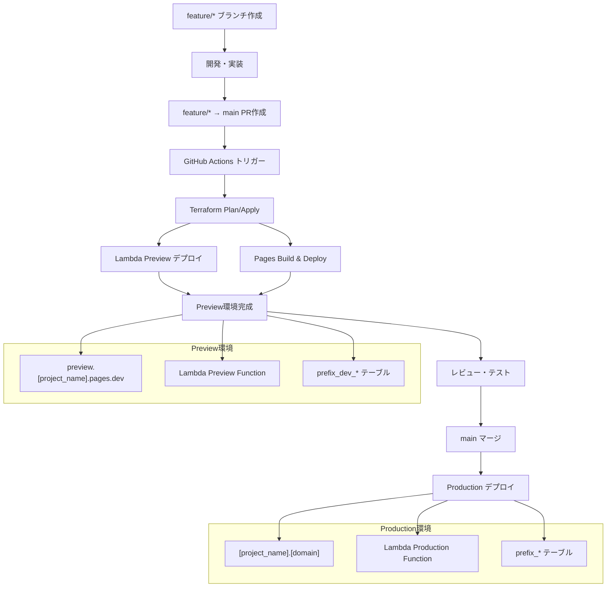
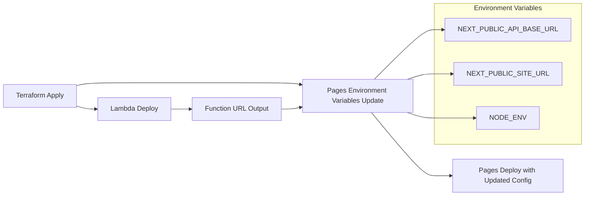

# CloudFlare Pages 環境分割戦略 技術設計

**作成日**: 2025年09月18日  
**更新日**: 2025年09月18日  
**設計分類**: 技術設計（実装方式）  
**関連要件**: REQ-005（フロントエンドデプロイ）

## 設計概要

CloudFlare Pages におけるプレビュー環境の実装として、**Terraform統合方式による1プロジェクト管理**を採用し、最小MVP構成でのデプロイフローを実現する。

## 採用方式：Terraform統合1プロジェクト方式

### アーキテクチャ構成

```
Single CloudFlare Pages Project (Terraform管理):
├── Production: main ブランチ → [project_name].[domain]
└── Preview: feature/* → main PR → preview.[project_name].pages.dev
```

### 最小MVP構成フロー

```
feature/* → main PR → Terraform Apply → Preview Deploy → main merge → Production Deploy
```

### 採用理由

- **Terraform統一管理**: Lambda と CloudFlare Pages を同一ワークフローで制御
- **最小MVP対応**: develop ブランチ不要、feature → main PR の直接フロー
- **完全同期**: Lambda と Pages のデプロイタイミング完全一致
- **設定一元管理**: 環境変数・バインディングの整合性保証

## Terraform実装設計

### 1. CloudFlare Pages プロジェクト定義

```hcl
# terraform/modules/cloudflare-pages/main.tf
resource "cloudflare_pages_project" "app" {
  account_id = var.cloudflare_account_id
  name       = var.project_name
  
  # Direct Upload 方式（GitHub連携は使用しない）
  production_branch = "main"
  
  deployment_configs {
    production {
      environment_variables = {
        NODE_ENV = "production"
        NEXT_PUBLIC_API_BASE_URL = var.lambda_production_url
        NEXT_PUBLIC_SITE_URL = "https://${var.production_domain}"
      }
      compatibility_date = "2025-01-01"
    }
    
    preview {
      environment_variables = {
        NODE_ENV = "development"  
        NEXT_PUBLIC_API_BASE_URL = var.lambda_preview_url
        NEXT_PUBLIC_SITE_URL = "https://preview.${var.project_name}.pages.dev"
      }
      compatibility_date = "2025-01-01"
    }
  }
}

# カスタムドメイン設定
resource "cloudflare_pages_domain" "production" {
  account_id   = var.cloudflare_account_id
  project_name = cloudflare_pages_project.app.name
  domain       = var.production_domain
}

# Preview環境は preview.[project_name].pages.dev を使用するため
# カスタムドメイン設定は不要
# resource "cloudflare_pages_domain" "preview" {
#   account_id   = var.cloudflare_account_id
#   project_name = cloudflare_pages_project.app.name
#   domain       = "preview.${var.production_domain}"
# }
```

### 2. ビルド・デプロイプロセス統合

```hcl
# terraform/modules/cloudflare-pages/deploy.tf
resource "null_resource" "pages_build" {
  # コミットSHAによる冪等性確保
  triggers = {
    commit_sha    = var.git_commit_sha
    branch        = var.git_branch
    lambda_change = var.lambda_deployment_hash
  }
  
  provisioner "local-exec" {
    command = <<EOT
      cd ${path.root}/../app/client
      
      echo "🏗️ Building frontend assets..."
      bun install --frozen-lockfile
      bun run build:static
      
      echo "✅ Build completed for branch: ${var.git_branch}"
    EOT
  }
}

resource "null_resource" "pages_deploy" {
  depends_on = [
    null_resource.pages_build,
    cloudflare_pages_project.app,
    cloudflare_pages_domain.production,
    cloudflare_pages_domain.preview
  ]
  
  triggers = {
    commit_sha = var.git_commit_sha
    branch     = var.git_branch
    build_hash = null_resource.pages_build.id
  }
  
  provisioner "local-exec" {
    command = <<EOT
      cd ${path.root}/../app/client
      
      if [ "${var.git_branch}" = "main" ]; then
        echo "🚀 Deploying to Production..."
        npx wrangler pages deploy out \
          --project-name=${cloudflare_pages_project.app.name} \
          --compatibility-date=2025-01-01 \
          --commit-hash=${var.git_commit_sha}
        echo "✅ Production deployment completed"
      else
        echo "🔍 Deploying to Preview (${var.git_branch})..."
        npx wrangler pages deploy out \
          --project-name=${cloudflare_pages_project.app.name} \
          --branch=${var.git_branch} \
          --compatibility-date=2025-01-01 \
          --commit-hash=${var.git_commit_sha}
        echo "✅ Preview deployment completed"
      fi
    EOT
    
    environment = {
      CLOUDFLARE_API_TOKEN  = var.cloudflare_api_token
      CLOUDFLARE_ACCOUNT_ID = var.cloudflare_account_id
    }
  }
}

# デプロイ結果の出力
output "deployment_url" {
  value = var.git_branch == "main" ? 
    "https://${var.production_domain}" : 
    "https://${var.git_branch}.${cloudflare_pages_project.app.name}.pages.dev"
}

output "pages_project_name" {
  value = cloudflare_pages_project.app.name
}
```

### 3. Lambda連携とTerraform統合

```hcl
# terraform/main.tf
module "lambda_production" {
  source = "./modules/lambda"
  
  function_name = "${var.project_name}-api-production"
  environment   = "production"
  # ... Lambda設定
}

module "lambda_preview" {
  source = "./modules/lambda"
  
  function_name = "${var.project_name}-api-preview"
  environment   = "preview"
  # ... Lambda設定
}

module "cloudflare_pages" {
  source = "./modules/cloudflare-pages"
  
  # Pages設定
  project_name             = var.project_name
  cloudflare_account_id    = var.cloudflare_account_id
  cloudflare_api_token     = var.cloudflare_api_token
  production_domain        = var.production_domain
  
  # Lambda連携
  lambda_production_url    = module.lambda_production.function_url
  lambda_preview_url       = module.lambda_preview.function_url
  lambda_deployment_hash   = "${module.lambda_production.source_code_hash}-${module.lambda_preview.source_code_hash}"
  
  # Git情報
  git_commit_sha = var.git_commit_sha
  git_branch     = var.git_branch
}
```

## GitHub Actions 統合実装

### 🔧 環境変数・シークレット管理戦略

#### 制約事項
- **GitHub Environment**: Private repositoryでは無料プランで利用不可
- **採用方式**: Repository-level Secrets + 命名規約による環境分離

#### Repository Secrets 設計

**命名規約**:
```
# 共通設定（PROD/PREVIEW共通）
CLOUDFLARE_API_TOKEN
CLOUDFLARE_ACCOUNT_ID
PROJECT_NAME
PRODUCTION_DOMAIN

# 統合OIDC認証（ブランチ制限付き）
AWS_ROLE_ARN
# 注記: mainブランチ・PRのみアクセス許可、feature/develop等ブランチ無効化
```

**動的参照パターン**:
```yaml
env:
  # 共通設定（直接参照）
  CLOUDFLARE_API_TOKEN: ${{ secrets.CLOUDFLARE_API_TOKEN }}
  CLOUDFLARE_ACCOUNT_ID: ${{ secrets.CLOUDFLARE_ACCOUNT_ID }}
  PROJECT_NAME: ${{ vars.PROJECT_NAME }}
  # 統合OIDC認証（ブランチ制限により安全）
  AWS_ROLE_ARN: ${{ secrets.AWS_ROLE_ARN }}
```

### メインワークフロー設計

```yaml
# .github/workflows/deploy.yml
name: Deploy Infrastructure and Applications

on:
  push:
    branches: [main]
  pull_request:
    types: [opened, synchronize, reopened]
    branches: [main]

env:
  TERRAFORM_VERSION: 1.6.0
  NODE_VERSION: 20

jobs:
  deploy:
    runs-on: ubuntu-latest
    permissions:
      id-token: write
      contents: read
      pull-requests: write  # PR コメント用
    
    env:
      # 環境動的判定
      ENV_SUFFIX: ${{ github.event_name == 'push' && 'PROD' || 'PREVIEW' }}
      IS_PRODUCTION: ${{ github.event_name == 'push' }}
      
    steps:
      - name: Checkout
        uses: actions/checkout@v4
      
      - name: Set Environment Variables
        run: |
          echo "CLOUDFLARE_API_TOKEN=${{ secrets.CLOUDFLARE_API_TOKEN }}" >> $GITHUB_ENV
          echo "CLOUDFLARE_ACCOUNT_ID=${{ secrets.CLOUDFLARE_ACCOUNT_ID }}" >> $GITHUB_ENV
          echo "PROJECT_NAME=${{ vars.PROJECT_NAME }}" >> $GITHUB_ENV
      
      - name: Configure AWS credentials
        uses: aws-actions/configure-aws-credentials@v4
        with:
          role-to-assume: ${{ secrets.AWS_ROLE_ARN }}
          aws-region: ap-northeast-1
          
      - name: Setup Terraform
        uses: hashicorp/setup-terraform@v3
        with:
          terraform_version: ${{ env.TERRAFORM_VERSION }}
          terraform_wrapper: false  # output取得のため
          
      - name: Setup Node.js
        uses: actions/setup-node@v4
        with:
          node-version: ${{ env.NODE_VERSION }}
          
      - name: Install Bun
        run: |
          curl -fsSL https://bun.sh/install | bash
          echo "$HOME/.bun/bin" >> $GITHUB_PATH
        
      - name: Install Wrangler
        run: npm install -g wrangler
      
      - name: Set Environment Variables
        run: |
          if [ "${{ github.event_name }}" = "push" ]; then
            echo "TF_VAR_git_branch=main" >> $GITHUB_ENV
            echo "TF_VAR_environment=production" >> $GITHUB_ENV
            echo "DEPLOY_TARGET=Production" >> $GITHUB_ENV
          else
            echo "TF_VAR_git_branch=pr-${{ github.event.number }}" >> $GITHUB_ENV
            echo "TF_VAR_environment=preview" >> $GITHUB_ENV
            echo "TF_VAR_pr_number=${{ github.event.number }}" >> $GITHUB_ENV
            echo "DEPLOY_TARGET=Preview" >> $GITHUB_ENV
          fi
          echo "TF_VAR_git_commit_sha=${{ github.sha }}" >> $GITHUB_ENV
          echo "TF_VAR_project_name=${{ vars.PROJECT_NAME }}" >> $GITHUB_ENV
          echo "TF_VAR_production_domain=${{ vars.PRODUCTION_DOMAIN }}" >> $GITHUB_ENV
          
      - name: Terraform Init
        working-directory: ./terraform
        run: |
          terraform init \
            -backend-config="bucket=${{ vars.TERRAFORM_STATE_BUCKET }}" \
            -backend-config="key=unified/terraform.tfstate" \
            -backend-config="region=ap-northeast-1"
            
      - name: Terraform Plan
        working-directory: ./terraform
        run: terraform plan -out=tfplan -detailed-exitcode
        env:
          TF_VAR_cloudflare_api_token: ${{ secrets.CLOUDFLARE_API_TOKEN }}
          TF_VAR_cloudflare_account_id: ${{ vars.CLOUDFLARE_ACCOUNT_ID }}
        continue-on-error: true
        id: plan
        
      - name: Terraform Apply
        working-directory: ./terraform
        run: terraform apply -auto-approve tfplan
        env:
          TF_VAR_cloudflare_api_token: ${{ secrets.CLOUDFLARE_API_TOKEN }}
          TF_VAR_cloudflare_account_id: ${{ vars.CLOUDFLARE_ACCOUNT_ID }}
        id: apply
        
      - name: Get Terraform Outputs
        working-directory: ./terraform
        run: |
          echo "FRONTEND_URL=$(terraform output -raw frontend_deployment_url)" >> $GITHUB_ENV
          echo "API_URL=$(terraform output -raw lambda_function_url)" >> $GITHUB_ENV
          echo "PAGES_PROJECT=$(terraform output -raw pages_project_name)" >> $GITHUB_ENV
          
      - name: Comment PR with Deployment URLs
        if: github.event_name == 'pull_request'
        uses: actions/github-script@v7
        with:
          script: |
            const deploymentInfo = `🚀 **${process.env.DEPLOY_TARGET} Environment Deployed**

**📱 Frontend**: ${process.env.FRONTEND_URL}
**🔗 API**: ${process.env.API_URL}
**🗄️ Database**: PostgreSQL with \`prefix_dev_*\` tables

**📊 Deployment Details**:
- **Commit**: \`${context.sha.substring(0, 7)}\`
- **Pages Project**: \`${process.env.PAGES_PROJECT}\`
- **Branch**: \`${process.env.TF_VAR_git_branch}\`

_Deployed via Terraform at ${new Date().toLocaleString('ja-JP', {timeZone: 'Asia/Tokyo'})}_`;

            github.rest.issues.createComment({
              issue_number: context.issue.number,
              owner: context.repo.owner,
              repo: context.repo.repo,
              body: deploymentInfo
            });
            
      - name: Summary
        run: |
          echo "## 🎉 Deployment Completed" >> $GITHUB_STEP_SUMMARY
          echo "- **Target**: ${{ env.DEPLOY_TARGET }}" >> $GITHUB_STEP_SUMMARY
          echo "- **Frontend**: ${{ env.FRONTEND_URL }}" >> $GITHUB_STEP_SUMMARY
          echo "- **API**: ${{ env.API_URL }}" >> $GITHUB_STEP_SUMMARY
```

### 🔄 OIDC移行計画（将来対応）

#### Phase 1: Repository Secrets（現在）
- 無料プランでの即座実装可能
- 長期的なSecrets管理とOIDCの段階移行

#### Phase 2: OIDC統合（オプション）
```yaml
# AWS OIDC認証への移行例
- name: Configure AWS credentials (OIDC)
  uses: aws-actions/configure-aws-credentials@v4
  with:
    role-to-assume: arn:aws:iam::ACCOUNT:role/github-actions-${{ env.ENV_SUFFIX }}
    role-session-name: github-actions-session
    aws-region: ap-northeast-1
```

**メリット**:
- 長期Secretsの削除
- より細かいIAM権限制御
- セキュリティ向上

### クリーンアップワークフロー

```yaml
# .github/workflows/cleanup.yml
name: Cleanup Preview Environment

on:
  pull_request:
    types: [closed]

jobs:
  cleanup:
    runs-on: ubuntu-latest
    
    env:
      ENV_SUFFIX: PREVIEW  # Preview環境のクリーンアップ専用
    
    steps:
      - name: Cleanup CloudFlare Pages Deployment
        run: |
          # Preview デプロイメントの削除
          npx wrangler pages deployment list \
            --project-name=${{ vars.PROJECT_NAME }} \
            --format=json | \
          jq -r ".[] | select(.source.type == \"github\" and .source.metadata.branch == \"pr-${{ github.event.number }}\") | .id" | \
          head -n -1 | \
          xargs -I {} npx wrangler pages deployment delete {} \
            --project-name=${{ vars.PROJECT_NAME }}
        env:
          CLOUDFLARE_API_TOKEN: ${{ secrets.CLOUDFLARE_API_TOKEN }}
          CLOUDFLARE_ACCOUNT_ID: ${{ vars.CLOUDFLARE_ACCOUNT_ID }}
```

## 環境変数・設定管理

### Terraform変数定義

```hcl
# terraform/variables.tf
variable "git_commit_sha" {
  description = "Git commit SHA for deployment tracking"
  type        = string
}

variable "git_branch" {
  description = "Git branch name"
  type        = string
}

variable "pr_number" {
  description = "Pull request number (for preview deployments)"
  type        = number
  default     = null
}

variable "project_name" {
  description = "Project name"
  type        = string
}

variable "production_domain" {
  description = "Production domain name"
  type        = string
}

variable "cloudflare_api_token" {
  description = "CloudFlare API token"
  type        = string
  sensitive   = true
}

variable "cloudflare_account_id" {
  description = "CloudFlare account ID"
  type        = string
}
```

### GitHub Environment設定

#### production環境
```yaml
Variables:
  AWS_ROLE_ARN: "arn:aws:iam::123456789012:role/GitHubActions-Unified"
  TERRAFORM_STATE_BUCKET: "your-terraform-state-bucket"
  PROJECT_NAME: "your-project"
  PRODUCTION_DOMAIN: "project-name.rimane.net"
  CLOUDFLARE_ACCOUNT_ID: "your-account-id"

Secrets:
  CLOUDFLARE_API_TOKEN: "your-api-token"
```

#### preview環境
```yaml
Variables:
  AWS_ROLE_ARN: "arn:aws:iam::123456789012:role/GitHubActions-Unified"
  TERRAFORM_STATE_BUCKET: "your-terraform-state-bucket"
  PROJECT_NAME: "your-project"
  PRODUCTION_DOMAIN: "project-name.rimane.net"
  CLOUDFLARE_ACCOUNT_ID: "your-account-id"

Secrets:
  CLOUDFLARE_API_TOKEN: "your-api-token"
```

## デプロイフロー詳細

### 最小MVP運用フロー



### 環境同期メカニズム



## セキュリティ設計

### API トークン権限設計

**最小権限設定:**
```
Account - Cloudflare Pages: Edit
Zone - Zone: Read (カスタムドメイン用)
```

**除外権限:**
```
Zone - DNS: Edit  # 手動DNS管理によるセキュリティ向上
```

### 環境分離保証

```hcl
# terraform/modules/cloudflare-pages/security.tf
locals {
  environment_isolation = {
    production = {
      api_endpoint = var.lambda_production_url
      site_url     = "https://${var.production_domain}"
      table_prefix = var.base_table_prefix
    }
    
    preview = {
      api_endpoint = var.lambda_preview_url
      site_url     = "https://preview.${var.project_name}.pages.dev"
      table_prefix = "${var.base_table_prefix}_dev"
    }
  }
  
  current_env = var.git_branch == "main" ? "production" : "preview"
}
```

## 運用・監視設計

### デプロイメント監視

```yaml
# 監視メトリクス（CloudWatch）
- name: Track Deployment Success Rate
  run: |
    aws cloudwatch put-metric-data \
      --namespace "CICD/Pages" \
      --metric-data MetricName=DeploymentSuccess,Value=1,Unit=Count \
      --region ap-northeast-1
```

### エラーハンドリング

```hcl
# terraform/modules/cloudflare-pages/error-handling.tf
resource "null_resource" "deployment_validation" {
  depends_on = [null_resource.pages_deploy]
  
  provisioner "local-exec" {
    command = <<EOT
      # デプロイメント検証
      MAX_RETRIES=3
      RETRY_COUNT=0
      
      while [ $RETRY_COUNT -lt $MAX_RETRIES ]; do
        if curl -f "${local.deployment_url}" > /dev/null 2>&1; then
          echo "✅ Deployment validation successful"
          exit 0
        fi
        
        RETRY_COUNT=$((RETRY_COUNT + 1))
        echo "⚠️ Validation attempt $RETRY_COUNT failed, retrying..."
        sleep 30
      done
      
      echo "❌ Deployment validation failed after $MAX_RETRIES attempts"
      exit 1
    EOT
  }
}
```

## パフォーマンス最適化

### ビルドキャッシュ戦略

```yaml
# GitHub Actions でのキャッシュ設定
- name: Cache Dependencies
  uses: actions/cache@v3
  with:
    path: |
      app/client/node_modules
      app/client/.next/cache
    key: ${{ runner.os }}-nextjs-${{ hashFiles('app/client/bun.lock') }}
    
- name: Cache Terraform
  uses: actions/cache@v3
  with:
    path: terraform/.terraform
    key: ${{ runner.os }}-terraform-${{ hashFiles('terraform/.terraform.lock.hcl') }}
```

### Terraform実行最適化

```hcl
# terraform/modules/cloudflare-pages/optimization.tf
resource "null_resource" "pages_build" {
  # 依存関係の最小化
  triggers = {
    # ビルドに影響する要素のみをトリガーに設定
    commit_sha      = var.git_commit_sha
    package_lock    = filemd5("${path.root}/../app/client/bun.lock")
    next_config     = filemd5("${path.root}/../app/client/next.config.ts")
    env_changes     = local.environment_hash
  }
}
```

## 受け入れ基準対応

### 要件充足確認

| 要件 | 実装方式 | 状態 |
|------|---------|------|
| プレビュー環境提供 | PR作成時のTerraform自動デプロイ | ✅ |
| Lambda連携 | Terraform output → Pages環境変数 | ✅ |
| 最小MVP構成 | feature → main PR フロー | ✅ |
| Terraform統一管理 | null_resource + wrangler統合 | ✅ |

### 非機能要件対応

| 項目 | 目標値 | 実装方式 |
|------|--------|---------|
| デプロイ時間 | < 8分 | Terraform + キャッシュ最適化 |
| 同期精度 | 100% | 単一ワークフローでの統合実行 |
| セキュリティ | 最小権限 | Pages Edit のみの API トークン |

## 段階的実装計画

1. **Phase 1**: Terraform での Pages プロジェクト作成
2. **Phase 2**: null_resource でのビルド・デプロイ統合  
3. **Phase 3**: GitHub Actions ワークフロー統合
4. **Phase 4**: 監視・エラーハンドリング強化

## 関連ドキュメント

- [CloudFlare Terraform Provider](https://registry.terraform.io/providers/cloudflare/cloudflare/latest/docs)
- [CloudFlare Pages Direct Upload](https://developers.cloudflare.com/pages/get-started/direct-upload/)
- [Wrangler CLI ドキュメント](https://developers.cloudflare.com/workers/wrangler/)
- [CloudFlare Pages API リファレンス](https://developers.cloudflare.com/api/operations/pages-project-create-project)

---

この技術設計により、Terraform統合による最小MVP構成でのCloudFlare Pages環境分割戦略を実現する。
