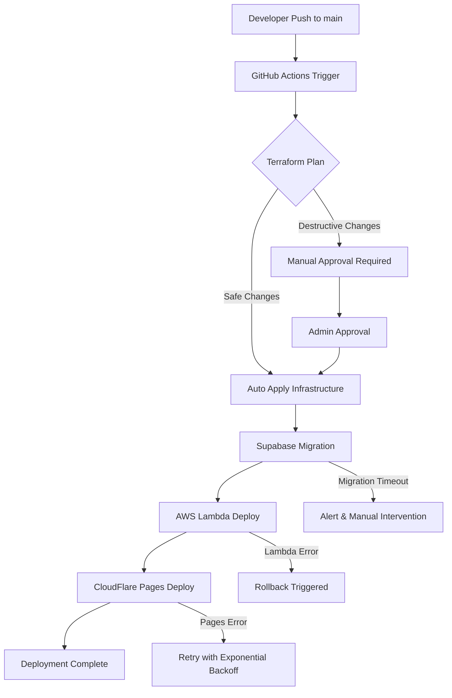
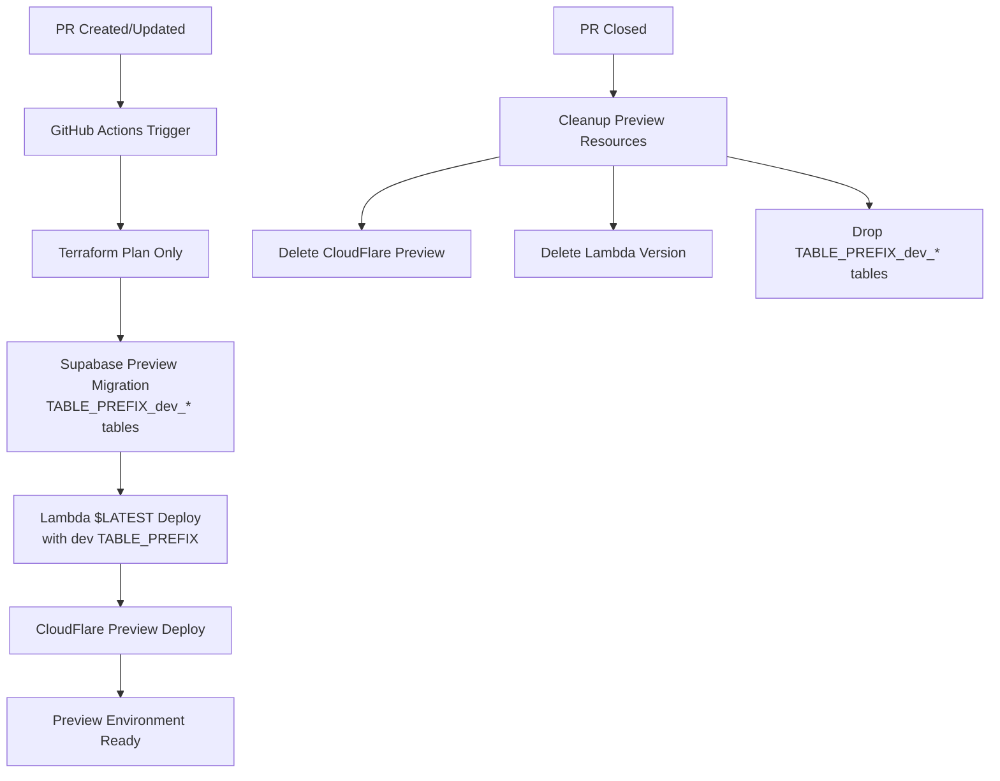
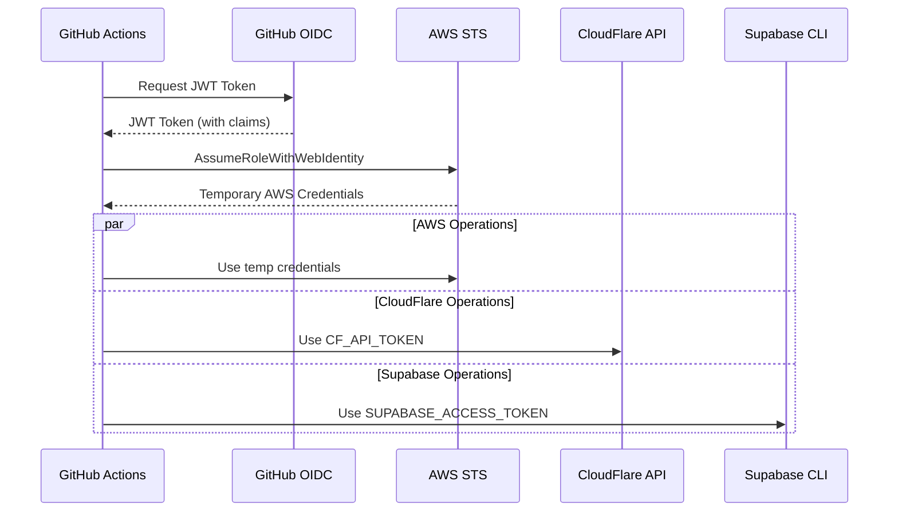
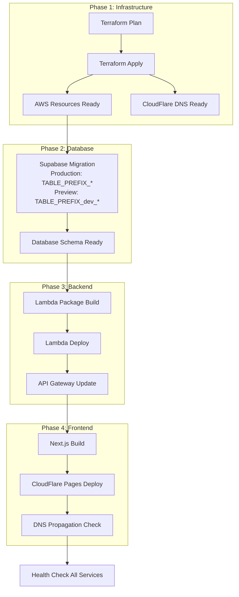
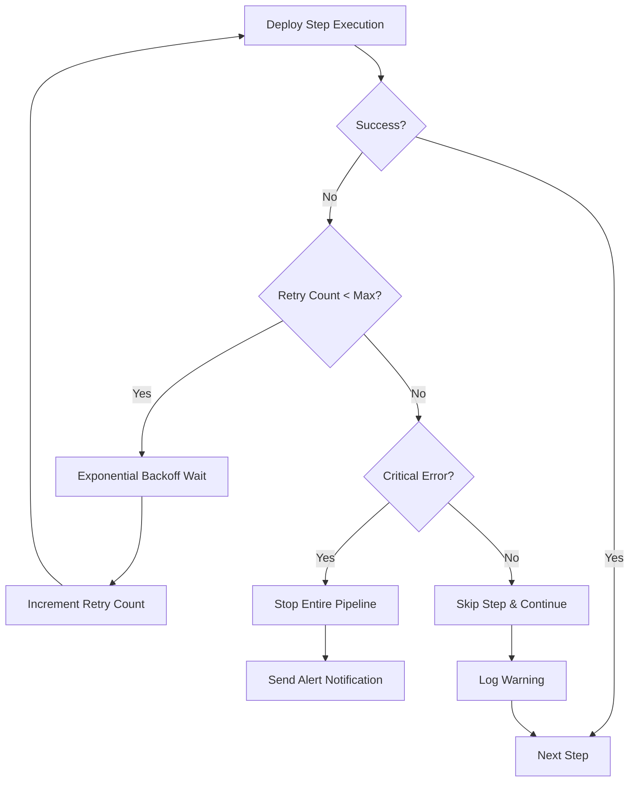
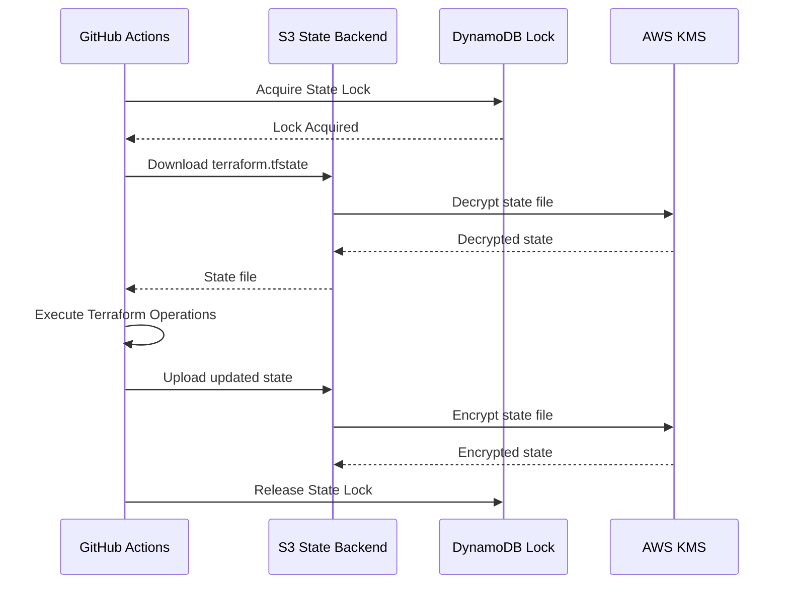
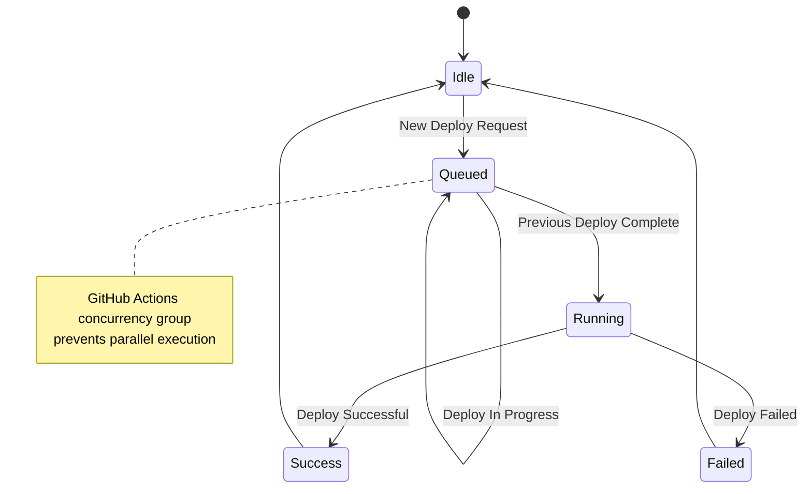
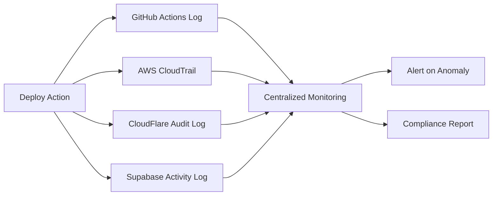
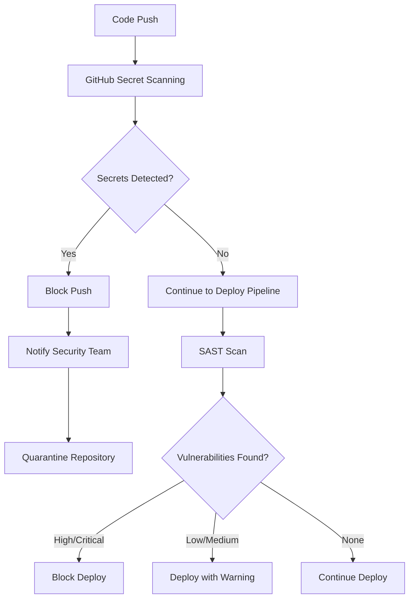

# データフロー図

作成日: 2025年09月12日
最終更新: 2025年09月12日

## 全体デプロイフロー

## プルリクエストプレビューフロー

## GitHub OIDC認証フロー

## デプロイメント依存関係フロー

## エラーハンドリングフロー

## Terraform State管理フロー

## 並行実行制御フロー

## 監査ログフロー

## セキュリティスキャンフロー

