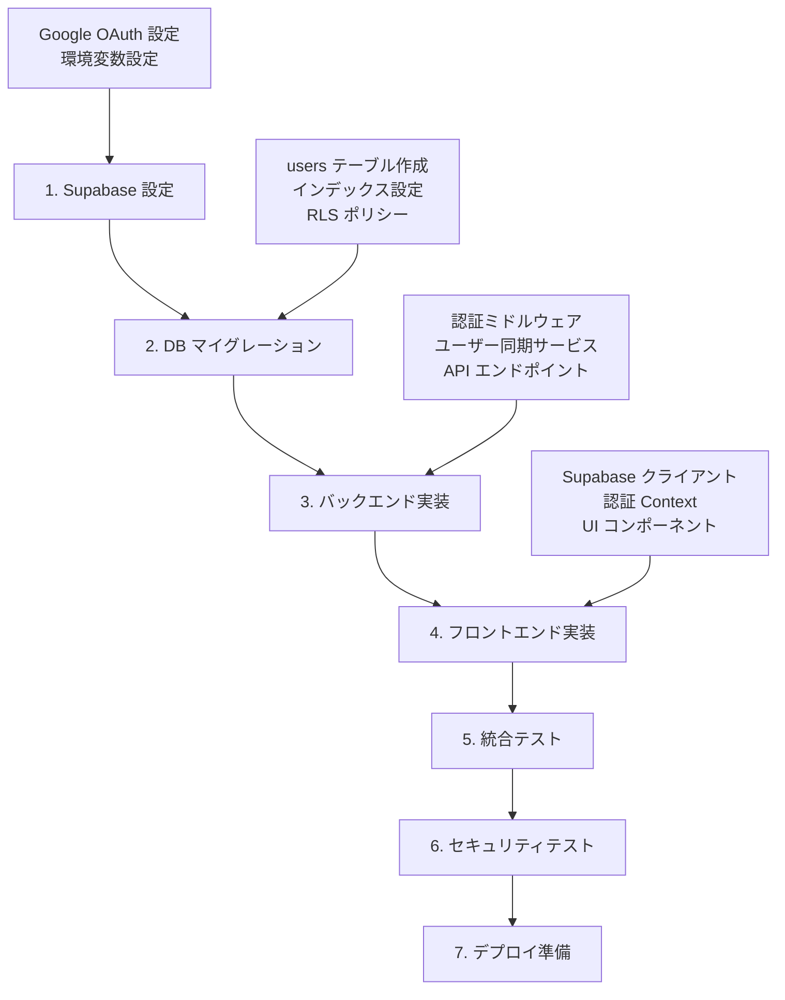

# Google認証システム 技術設計書

## 📋 概要

本設計書は、SupabaseのGoogle OAuth認証を基盤とした認証システムの包括的な技術設計を記載しています。Next.js（フロントエンド）とHono API（バックエンド）の完全分離構成により、安全で快適な認証体験を実現します。

## 🎯 設計の主要ポイント

### 1. 責任分散アーキテクチャ
- **フロントエンド**: OAuth フロー実行、UI 提供、トークン管理
- **バックエンド**: JWT 検証、API 保護、ユーザー同期（JIT Provisioning）

### 2. セキュリティファースト
- HTTPS 強制通信
- JWT 署名検証（HS256）
- CSRF/XSS 対策
- セッション固定攻撃防止

### 3. パフォーマンス最適化
- 認証フロー 5秒以内完了
- 認証状態確認 1秒以内
- 効率的なDB インデックス設計

### 4. DDD + クリーンアーキテクチャ準拠（専門家レビュー反映）
- **依存性逆転の原則**: IAuthProvider抽象化によるSupabase依存の排除
- **ドメインイベント**: UserLoggedInEvent等による状態変更の明示的表現
- **集約ルート**: UserAggregateによるセッション整合性管理
- **ドメイン固有エラー**: AuthDomainError階層による明確なエラー処理
- **ユースケース駆動設計**: AuthenticateUserUseCaseによる業務フロー実装

## 📁 設計文書構成

| ファイル | 内容 | 主要な読者 | 更新内容 |
|---------|------|----------|----------|
| [`architecture.md`](./architecture.md) | システム全体のアーキテクチャ設計 | 全開発者、アーキテクト | **✨ DDD層構造を詳細化、依存性逆転対応** |
| [`dataflow.md`](./dataflow.md) | データフロー図とシーケンス図 | 開発者、QA エンジニア | 変更なし |
| [`interfaces.ts`](./interfaces.ts) | TypeScript 型定義（フロント/バック共通） | フロントエンド・バックエンド開発者 | **🔥 大幅追加: 抽象IF・ドメインイベント・集約定義** |
| [`database-schema.sql`](./database-schema.sql) | データベース スキーマ設計 | バックエンド開発者、DBA | **✨ イベントストア・集約スナップショット追加** |
| [`api-endpoints.md`](./api-endpoints.md) | REST API エンドポイント仕様 | フロントエンド・バックエンド開発者 | **✨ DDD実装例に変更、ユースケース詳細化** |
| [`ddd-improvements.md`](./ddd-improvements.md) | DDD改善提案（専門家レビュー結果） | アーキテクト、上級開発者 | **🆕 新規作成: 改善案の詳細ガイド** |

## 🚀 実装フローチャート

## 🔧 実装チェックリスト

### Phase 1: 基盤設定
- [ ] Supabase プロジェクト作成・設定
- [ ] Google OAuth アプリケーション設定
- [ ] 環境変数設定（フロント・バック両方）
- [ ] データベースマイグレーション実行

### Phase 2: バックエンド実装
- [ ] JWT 検証ミドルウェア実装
- [ ] ユーザー同期サービス実装
- [ ] API エンドポイント実装
- [ ] エラーハンドリング実装
- [ ] ユニットテスト作成

### Phase 3: フロントエンド実装
- [ ] Supabase クライアント設定
- [ ] 認証 Redux 状態管理実装
- [ ] ログイン・ログアウト UI 実装
- [ ] 認証ガード機能実装
- [ ] API クライアント実装

### Phase 4: 統合・テスト
- [ ] E2E テスト実装
- [ ] セキュリティテスト実行
- [ ] パフォーマンステスト実行
- [ ] UAT（受け入れテスト）実行

## 📊 技術スタック

### フロントエンド
- **フレームワーク**: Next.js 15 (App Router)
- **認証**: @supabase/supabase-js, @supabase/ssr
- **状態管理**: Redux
- **スタイリング**: Tailwind CSS
- **型安全性**: TypeScript + Zod

### バックエンド
- **フレームワーク**: Hono 4
- **認証検証**: hono/jwt
- **アーキテクチャ**: DDD + クリーンアーキテクチャ
- **データベース**: PostgreSQL
- **ORM**: 要検討（Drizzle ORM 推奨）

### インフラ・サービス
- **認証基盤**: Supabase Auth
- **OAuth プロバイダー**: Google OAuth 2.0
- **コンテナ**: Docker Compose
- **CI/CD**: 要検討

## 🔐 セキュリティ要件

### 通信セキュリティ
- [x] HTTPS 強制
- [x] CORS 設定
- [x] CSRFトークン

### 認証・認可
- [x] JWT 署名検証
- [x] セッション管理
- [x] トークン暗号化保存

### データ保護
- [x] RLS (Row Level Security)
- [x] 機密データ暗号化
- [x] 監査ログ

## 📈 パフォーマンス目標

| 指標 | 目標値 | 測定方法 |
|-----|-------|----------|
| 認証フロー完了時間 | < 5秒 | E2E テスト |
| 認証状態確認時間 | < 1秒 | APIレスポンス測定 |
| 同時接続ユーザー数 | > 100 | 負荷テスト |
| API レスポンスタイム | < 500ms | APM ツール |

## 🎨 UI/UX 要件

### アクセシビリティ
- WCAG 2.1 AA 準拠
- スクリーンリーダー対応
- キーボードナビゲーション

### レスポンシブ対応
- モバイルファースト設計
- タブレット・デスクトップ対応
- タッチデバイス最適化

## 📝 開発ガイドライン

### コード品質
- TypeScript strict モード
- ESLint + Prettier
- 100% 型安全性
- テストカバレッジ > 80%

### Git フロー
- feature ブランチ戦略
- プルリクエスト必須
- コードレビュー必須
- 自動 CI/CD パイプライン

## 🚨 リスク管理

### 技術的リスク
| リスク | 影響度 | 対策 |
|--------|--------|------|
| Supabase サービス障害 | High | フォールバック機能、監視アラート |
| JWT トークン漏洩 | High | 短い有効期限、定期ローテーション |
| セッション固定攻撃 | Medium | Supabase 標準保護、セッション再生成 |
| OAuth認証失敗 | Medium | エラーハンドリング、リトライ機能 |

### 運用リスク
| リスク | 影響度 | 対策 |
|--------|--------|------|
| 大量ログイン時の負荷 | High | ロードバランシング、キャッシュ戦略 |
| データベース障害 | High | レプリケーション、定期バックアップ |
| 不正アクセス試行 | Medium | レート制限、ログ監視 |

## 🔍 監視・運用

### メトリクス
- 認証成功/失敗率
- API レスポンス時間
- エラー発生率
- ユーザーアクティビティ

### アラート
- 認証失敗率異常
- API エラー率上昇
- データベース接続エラー
- セキュリティインシデント

## 📚 参考資料

### 公式ドキュメント
- [Supabase Auth Documentation](https://supabase.com/docs/guides/auth)
- [Google OAuth 2.0 Guide](https://developers.google.com/identity/protocols/oauth2)
- [Next.js App Router](https://nextjs.org/docs/app)
- [Hono Documentation](https://hono.dev/)

### セキュリティガイド
- [OWASP Authentication Cheat Sheet](https://cheatsheetseries.owasp.org/cheatsheets/Authentication_Cheat_Sheet.html)
- [JWT Security Best Practices](https://auth0.com/blog/a-look-at-the-latest-draft-for-jwt-bcp/)

### 設計パターン
- [Clean Architecture](https://blog.cleancoder.com/uncle-bob/2012/08/13/the-clean-architecture.html)
- [Domain-Driven Design](https://martinfowler.com/bliki/DomainDrivenDesign.html)

## 📞 サポート・質問

実装中に問題が発生した場合や設計について質問がある場合は、以下を参照してください：

1. **技術的な問題**: 各設計書のコメントや実装例を確認
2. **アーキテクチャの疑問**: `architecture.md` の詳細説明を参照
3. **API仕様の確認**: `api-endpoints.md` のエンドポイント仕様を確認
4. **データ設計の質問**: `database-schema.sql` のコメントを参照

---

## 📅 実装スケジュール（推奨）

| Phase | 期間 | 主要タスク | 担当 |
|-------|------|------------|------|
| Phase 1 | Week 1 | 基盤設定、DB設計 | バックエンド |
| Phase 2 | Week 2-3 | バックエンド実装 | バックエンド |
| Phase 3 | Week 3-4 | フロントエンド実装 | フロントエンド |
| Phase 4 | Week 5 | 統合テスト、最適化 | 全員 |

**総実装期間**: 約 5 週間（チーム規模・経験により変動）

---

*最終更新日: 2024年8月11日*  
*設計バージョン: 1.0.0*