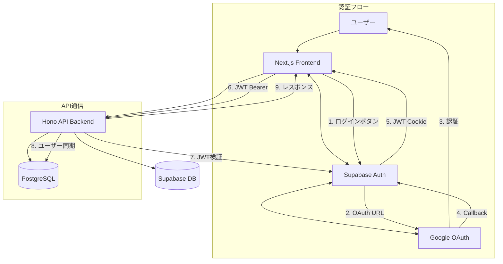
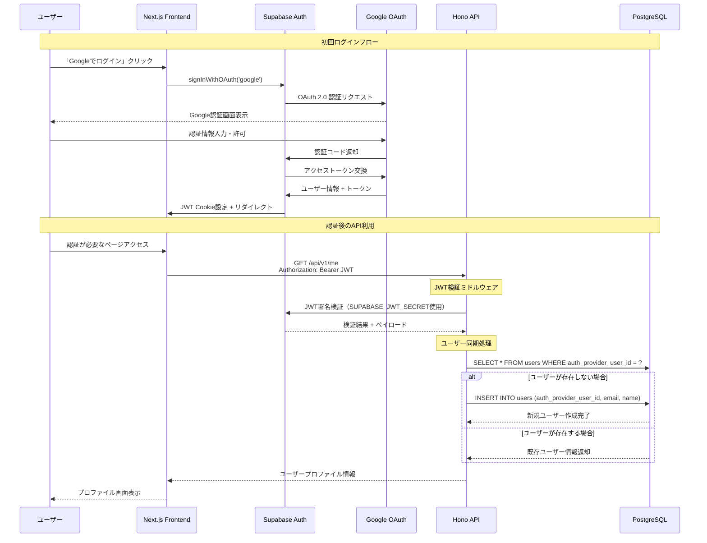
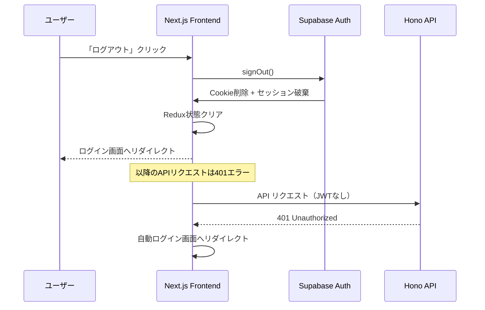
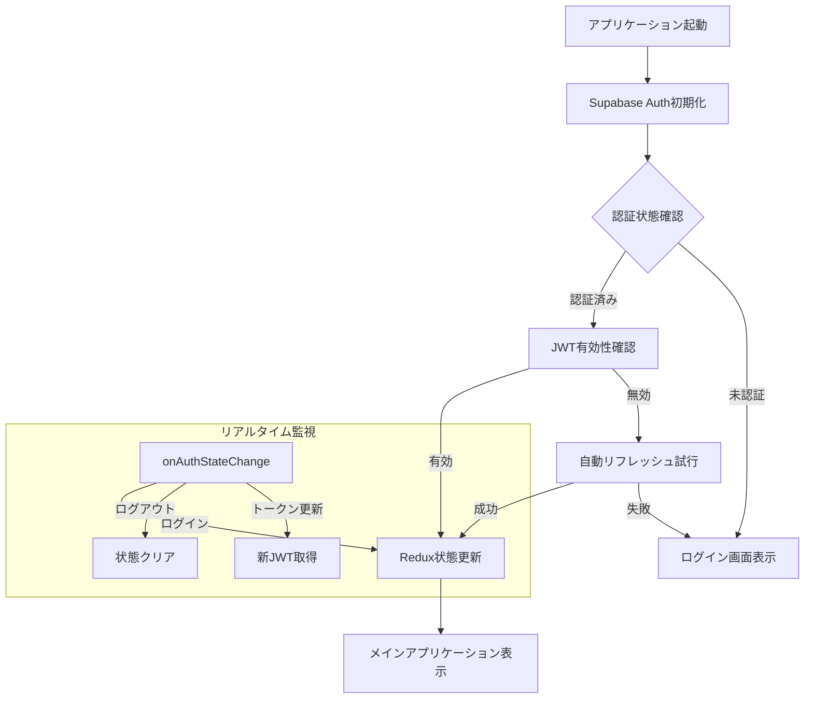
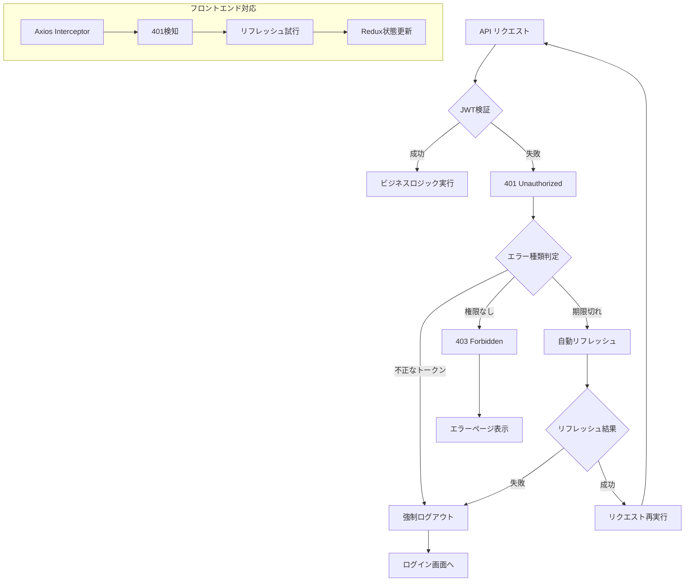
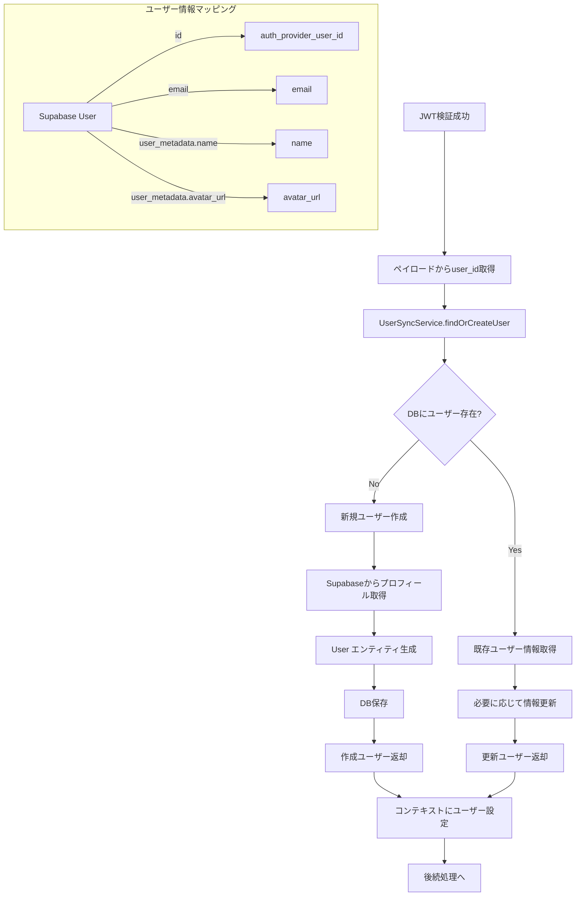
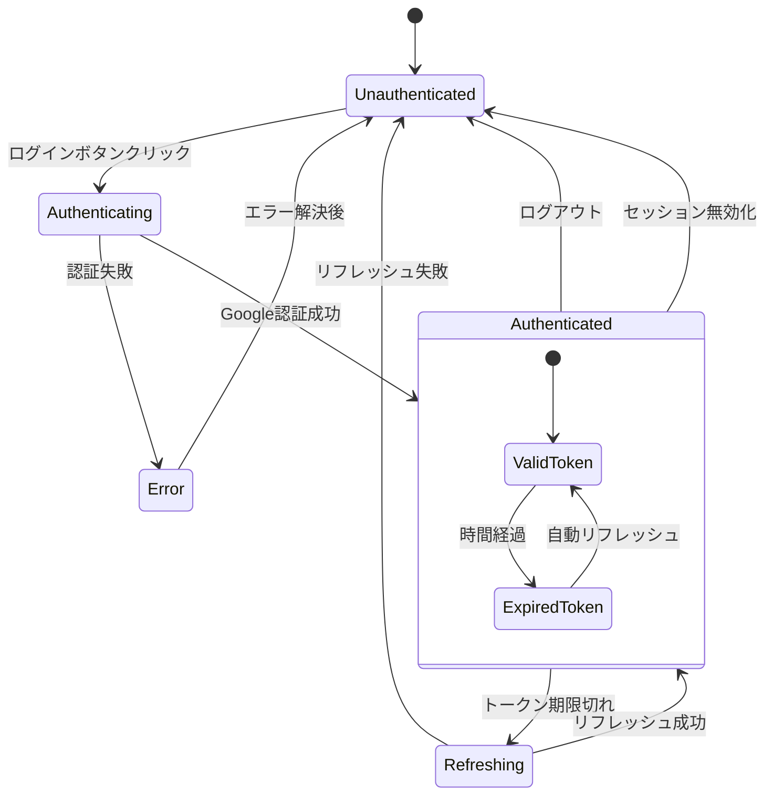
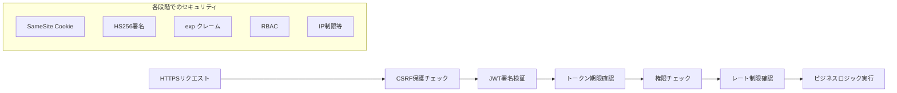

# Google認証システム データフロー図

## システム全体のデータフロー

```mermaid
flowchart TD
    U[ユーザー] --> F[Next.js Frontend]
    F <--> S[Supabase Auth]
    S <--> G[Google OAuth]
    F --> H[Hono API Backend]
    H --> DB[(PostgreSQL)]
    H --> SDB[(Supabase DB)]
    
    subgraph "認証フロー"
        F --> |1. ログインボタン| S
        S --> |2. OAuth URL| G
        G --> |3. 認証| U
        G --> |4. Callback| S
        S --> |5. JWT Cookie| F
    end
    
    subgraph "API通信"
        F --> |6. JWT Bearer| H
        H --> |7. JWT検証| S
        H --> |8. ユーザー同期| DB
        H --> |9. レスポンス| F
    end
```

## 認証フローシーケンス図

```mermaid
sequenceDiagram
    participant U as ユーザー
    participant F as Next.js Frontend
    participant S as Supabase Auth
    participant G as Google OAuth
    participant H as Hono API
    participant DB as PostgreSQL
    
    Note over U,DB: 初回ログインフロー
    
    U->>F: 「Googleでログイン」クリック
    F->>S: signInWithOAuth('google')
    S->>G: OAuth 2.0 認証リクエスト
    G-->>U: Google認証画面表示
    U->>G: 認証情報入力・許可
    G->>S: 認証コード返却
    S->>G: アクセストークン交換
    G->>S: ユーザー情報 + トークン
    S->>F: JWT Cookie設定 + リダイレクト
    
    Note over U,DB: 認証後のAPI利用
    
    U->>F: 認証が必要なページアクセス
    F->>H: GET /api/v1/me<br/>Authorization: Bearer JWT
    
    Note over H: JWT検証ミドルウェア
    H->>S: JWT署名検証（SUPABASE_JWT_SECRET使用）
    S-->>H: 検証結果 + ペイロード
    
    Note over H: ユーザー同期処理
    H->>DB: SELECT * FROM users WHERE auth_provider_user_id = ?
    alt ユーザーが存在しない場合
        H->>DB: INSERT INTO users (auth_provider_user_id, email, name)
        DB-->>H: 新規ユーザー作成完了
    else ユーザーが存在する場合
        DB-->>H: 既存ユーザー情報返却
    end
    
    H-->>F: ユーザープロファイル情報
    F-->>U: プロファイル画面表示
```

## ログアウトフロー

```mermaid
sequenceDiagram
    participant U as ユーザー
    participant F as Next.js Frontend
    participant S as Supabase Auth
    participant H as Hono API
    
    U->>F: 「ログアウト」クリック
    F->>S: signOut()
    S->>F: Cookie削除 + セッション破棄
    F->>F: Redux状態クリア
    F-->>U: ログイン画面へリダイレクト
    
    Note over F: 以降のAPIリクエストは401エラー
    F->>H: API リクエスト（JWTなし）
    H-->>F: 401 Unauthorized
    F->>F: 自動ログイン画面へリダイレクト
```

## 認証状態監視フロー

```mermaid
flowchart TD
    A[アプリケーション起動] --> B[Supabase Auth初期化]
    B --> C{認証状態確認}
    C -->|認証済み| D[JWT有効性確認]
    C -->|未認証| E[ログイン画面表示]
    D -->|有効| F[Redux状態更新]
    D -->|無効| G[自動リフレッシュ試行]
    G -->|成功| F
    G -->|失敗| E
    F --> H[メインアプリケーション表示]
    
    subgraph "リアルタイム監視"
        I[onAuthStateChange]
        I --> |ログイン| F
        I --> |ログアウト| J[状態クリア]
        I --> |トークン更新| K[新JWT取得]
    end
```

## エラーハンドリングフロー

```mermaid
flowchart TD
    A[API リクエスト] --> B{JWT検証}
    B -->|成功| C[ビジネスロジック実行]
    B -->|失敗| D[401 Unauthorized]
    
    D --> E{エラー種類判定}
    E -->|期限切れ| F[自動リフレッシュ]
    E -->|不正なトークン| G[強制ログアウト]
    E -->|権限なし| H[403 Forbidden]
    
    F --> I{リフレッシュ結果}
    I -->|成功| J[リクエスト再実行]
    I -->|失敗| G
    
    J --> A
    G --> K[ログイン画面へ]
    H --> L[エラーページ表示]
    
    subgraph "フロントエンド対応"
        M[Axios Interceptor]
        M --> N[401検知]
        N --> O[リフレッシュ試行]
        O --> P[Redux状態更新]
    end
```

## ユーザー同期（JIT Provisioning）詳細フロー

```mermaid
flowchart TD
    A[JWT検証成功] --> B[ペイロードからuser_id取得]
    B --> C[UserSyncService.findOrCreateUser]
    C --> D{DBにユーザー存在?}
    
    D -->|Yes| E[既存ユーザー情報取得]
    D -->|No| F[新規ユーザー作成]
    
    F --> G[Supabaseからプロフィール取得]
    G --> H[User エンティティ生成]
    H --> I[DB保存]
    I --> J[作成ユーザー返却]
    
    E --> K[必要に応じて情報更新]
    K --> L[更新ユーザー返却]
    J --> M[コンテキストにユーザー設定]
    L --> M
    
    M --> N[後続処理へ]
    
    subgraph "ユーザー情報マッピング"
        O[Supabase User]
        O --> |id| P[auth_provider_user_id]
        O --> |email| Q[email]
        O --> |user_metadata.name| R[name]
        O --> |user_metadata.avatar_url| S[avatar_url]
    end
```

## セッション管理フロー

```mermaid
stateDiagram-v2
    [*] --> Unauthenticated
    
    Unauthenticated --> Authenticating: ログインボタンクリック
    Authenticating --> Authenticated: Google認証成功
    Authenticating --> Error: 認証失敗
    Error --> Unauthenticated: エラー解決後
    
    Authenticated --> Refreshing: トークン期限切れ
    Refreshing --> Authenticated: リフレッシュ成功
    Refreshing --> Unauthenticated: リフレッシュ失敗
    
    Authenticated --> Unauthenticated: ログアウト
    Authenticated --> Unauthenticated: セッション無効化
    
    state Authenticated {
        [*] --> ValidToken
        ValidToken --> ExpiredToken: 時間経過
        ExpiredToken --> ValidToken: 自動リフレッシュ
    }
```

## セキュリティ考慮事項のデータフロー

```mermaid
flowchart LR
    A[HTTPSリクエスト] --> B[CSRF保護チェック]
    B --> C[JWT署名検証]
    C --> D[トークン期限確認]
    D --> E[権限チェック]
    E --> F[レート制限確認]
    F --> G[ビジネスロジック実行]
    
    subgraph "各段階でのセキュリティ"
        H[SameSite Cookie]
        I[HS256署名]
        J[exp クレーム]
        K[RBAC]
        L[IP制限等]
    end
```