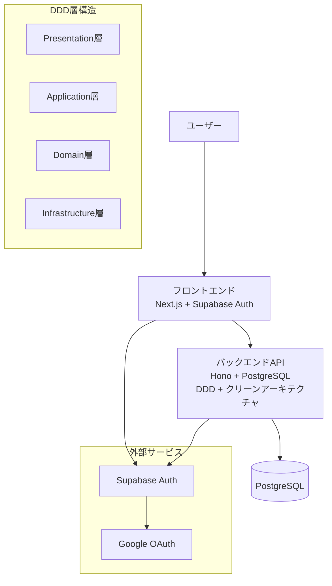

# MVP Google認証システム 技術設計書

作成日: 2025-08-12
更新日: 2025-08-12

## 概要

SupabaseとGoogle OAuthを使用したバックエンドAPI経由のGoogle認証機能の技術設計文書です。DDD（ドメイン駆動設計）+ クリーンアーキテクチャを適用し、プロバイダー非依存の拡張可能な認証システムを設計しています。

## 設計文書構成

| ファイル | 内容 | 対象読者 |
|---------|------|---------|
| **[architecture.md](./architecture.md)** | システム全体のアーキテクチャ設計 DDD層構造・依存関係・プロバイダー拡張戦略 | アーキテクト・開発リーダー |
| **[dataflow.md](./dataflow.md)** | データフロー図・シーケンス図 認証フロー・エラーハンドリング・DDD層間連携 | 開発者・テスター |
| **[interfaces.ts](./interfaces.ts)** | TypeScript型定義・インターフェース エンティティ・UseCase・Repository・API仕様 | フロントエンド・バックエンド開発者 |
| **[database-schema.sql](./database-schema.sql)** | PostgreSQLスキーマ設計 テーブル定義・インデックス・RLS・将来拡張対応 | データベース開発者・インフラエンジニア |
| **[api-endpoints.md](./api-endpoints.md)** | RESTful API仕様 エンドポイント・リクエスト/レスポンス・エラーハンドリング | API開発者・フロントエンド開発者 |

## システム全体像

### アーキテクチャ概要

### 主要技術スタック
- **フロントエンド**: Next.js 15 + TypeScript + Tailwind CSS + Redux
- **バックエンド**: Hono 4 + TypeScript + PostgreSQL
- **認証**: Supabase Auth + Google OAuth 2.0
- **アーキテクチャ**: DDD + クリーンアーキテクチャ
- **データベース**: PostgreSQL（環境変数による動的テーブル名対応）

## 設計の特徴

### 1. DDD + クリーンアーキテクチャ適用
- **Domain層**: ビジネスルール・不変条件の管理
- **Application層**: Use Caseによるビジネスフローの調整
- **Infrastructure層**: 外部システムとの連携
- **Presentation層**: HTTP要求・応答の変換

### 2. プロバイダー非依存設計
- 将来的なプロバイダー追加時の既存コード変更最小化
- 抽象化インターフェースによる統一的な認証処理
- ドメインエンティティからプロバイダー固有情報を分離

### 3. 拡張性・保守性の確保
- 環境変数による動的設定（テーブル名接頭辞等）
- 型安全性を保証したTypeScript完全対応
- 将来機能（監査ログ・セッション管理）を考慮した設計

## 実装範囲（MVP）

### ✅ 実装対象
- Google OAuth 2.0による認証
- JWT検証・ユーザー管理
- JIT（Just-In-Time）プロビジョニング
- ユーザープロフィール取得
- 基本的なエラーハンドリング

### ❌ MVP対象外（将来拡張）
- 複数認証プロバイダー対応（実装は拡張可能設計）
- 監査ログ機能
- セッション管理強化
- 権限管理（RBAC）
- イベントソーシング

## 開発ガイドライン

### 1. コーディング規約
- **SOLID原則**: 特に依存性逆転の原則を重視
- **型安全性**: TypeScript strict mode + Zod実行時検証
- **エラーハンドリング**: ドメインエラーからHTTPエラーへの適切な変換
- **テスト**: 各層における単体テスト・結合テスト

### 2. データベース操作
- **パフォーマンス**: 適切なインデックス設計による高速検索
- **セキュリティ**: Row Level Security（RLS）による行レベル制御
- **拡張性**: 環境変数による動的テーブル名対応

### 3. セキュリティ
- **HTTPS通信**: すべての通信でHTTPS必須
- **JWT検証**: Supabase署名検証による堅牢な認証
- **最小権限**: 必要最小限のスコープ・権限での動作

## パフォーマンス目標

| 項目 | 目標値 | 備考 |
|------|--------|------|
| 認証フロー全体 | 10秒以内 | Google認証含む |
| JWT検証 | 1秒以内 | バックエンドAPI処理時間 |
| JITプロビジョニング | 2秒以内 | 新規ユーザー作成時間 |
| ユーザー情報取得 | 500ms以内 | データベース検索時間 |

## 開発・学習効果

### 1. DDD学習ポイント
- **戦略設計**: 境界づけられたコンテキストの分離
- **戦術設計**: エンティティ・集約・リポジトリパターン
- **依存性管理**: 各層の責務明確化と依存方向の制御

### 2. 実装時間目標
- **総実装時間**: 4時間以内（DDD学習込み）
- **学習効果**: クリーンアーキテクチャの実践的理解

## 次のステップ

### 1. 実装作業
1. バックエンドAPI実装（DDD層構造）
2. フロントエンド認証フロー実装
3. データベーススキーマ適用
4. 統合テスト・動作確認

### 2. 将来拡張
1. 他認証プロバイダー対応（Apple・Microsoft等）
2. 監査ログ・セッション管理機能
3. 管理者向け機能・ダッシュボード
4. パフォーマンス最適化（キャッシュ等）

## 関連資料

- [要件定義書](../../spec/mvp-google-auth-requirements.md)
- [プロジェクト全体のCLAUDE.md](../../../CLAUDE.md)
- Supabase Auth Documentation
- Google OAuth 2.0 Documentation
- Domain-Driven Design Reference

---

**注意**: この設計文書は要件定義書 `docs/spec/mvp-google-auth-requirements.md` に基づいて作成されています。実装前に要件の最終確認を行ってください。