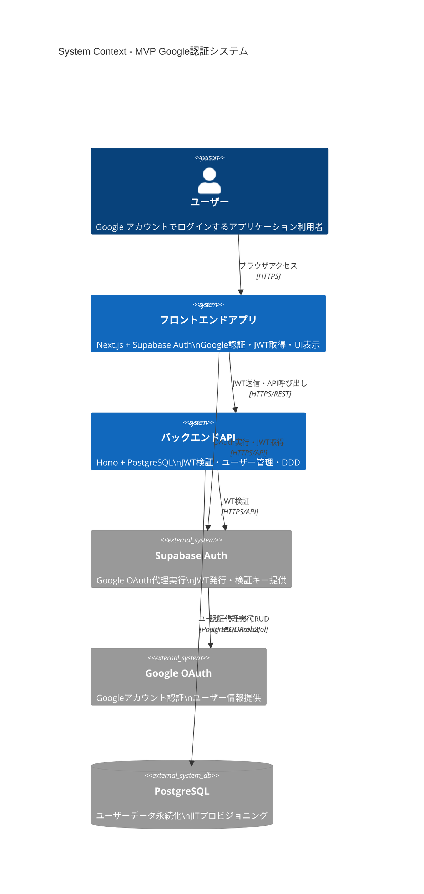
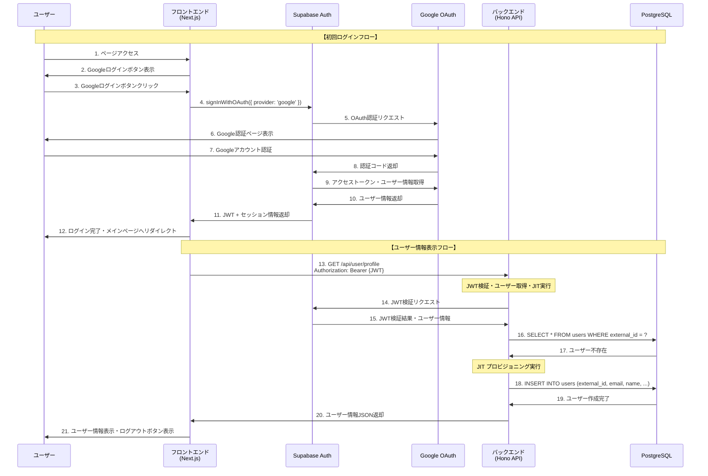
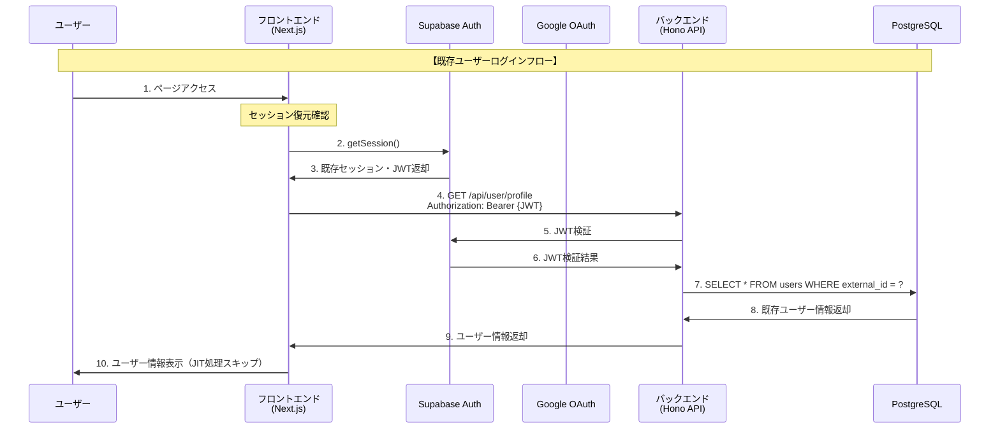
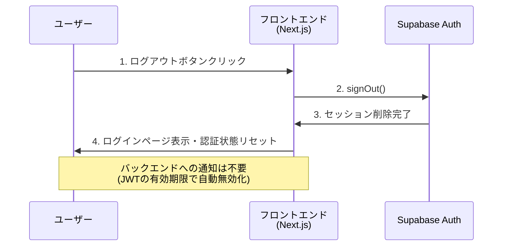
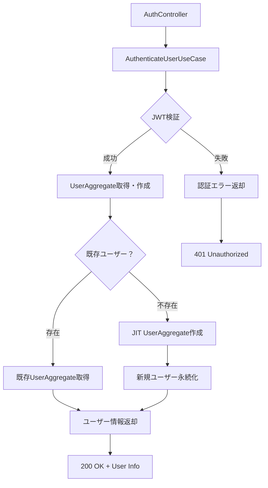
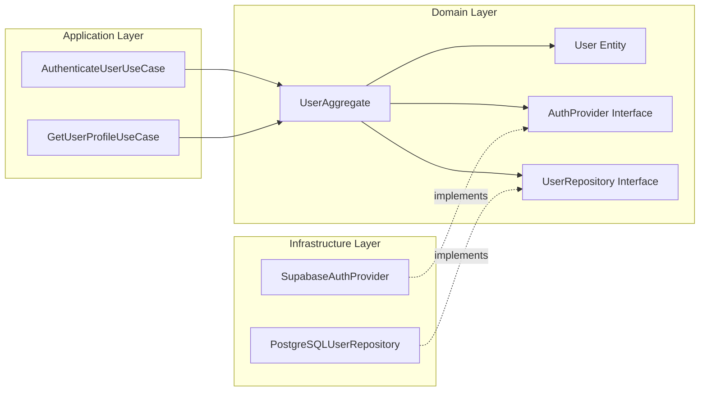
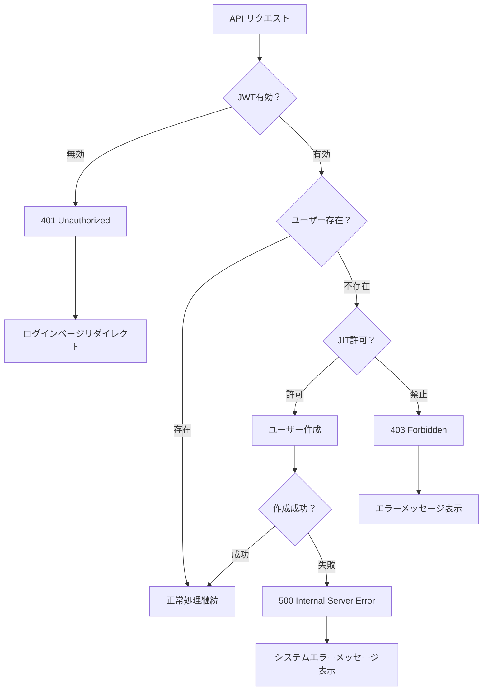
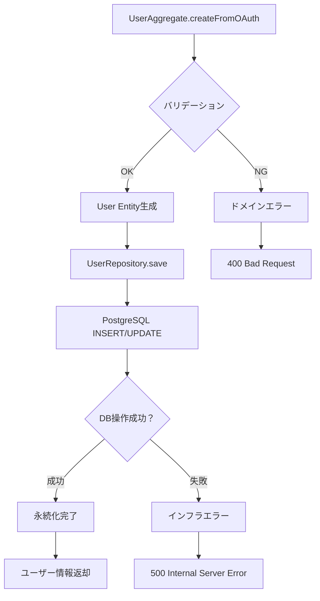
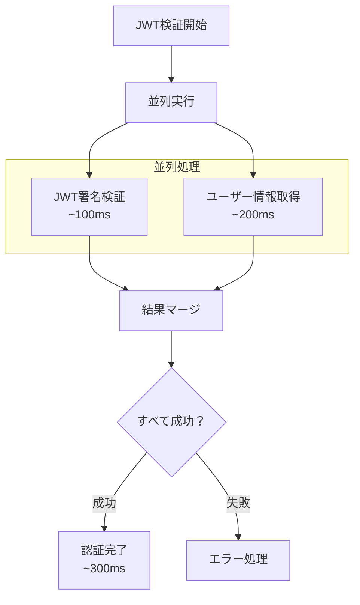
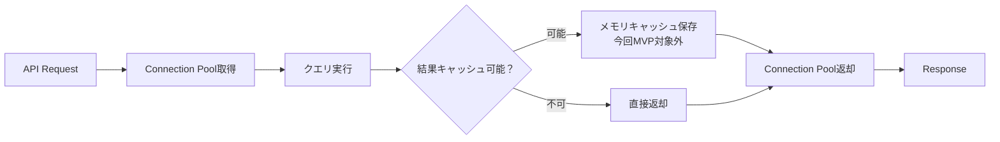

# データフロー図

作成日: 2025-08-12
更新日: 2025-08-12

## システム全体データフロー

### アーキテクチャ概要

## 認証フローシーケンス

### 初回ログインフロー（JITプロビジョニング）

### 2回目以降のログインフロー

### ログアウトフロー

## DDD層間のデータフロー

### アプリケーション層での認証処理

### Domain層での集約管理

## エラーフロー

### 認証エラーハンドリング

## データ永続化フロー

### ユーザー作成・更新パターン

## パフォーマンス考慮事項

### 並列処理フロー

### データベースアクセスパターン
