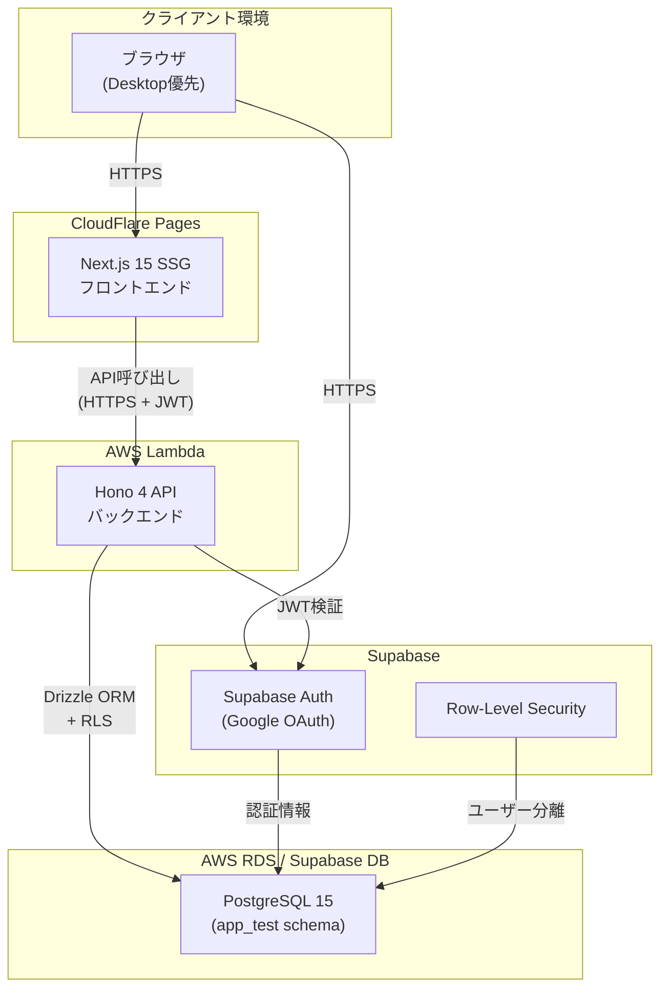
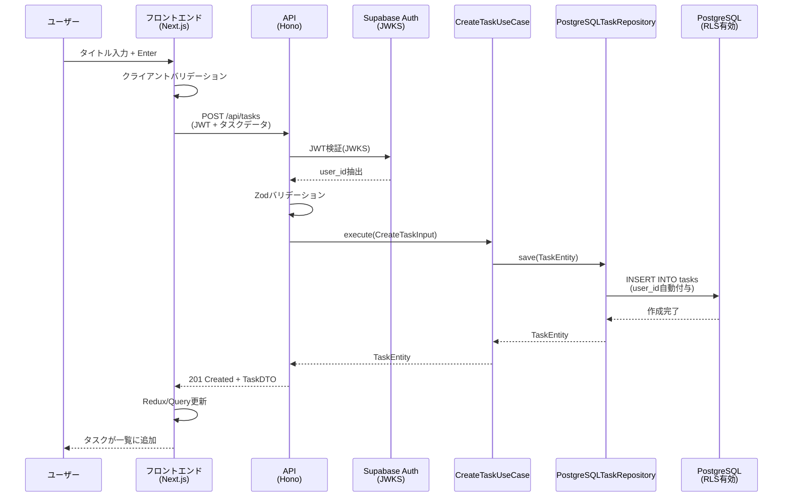
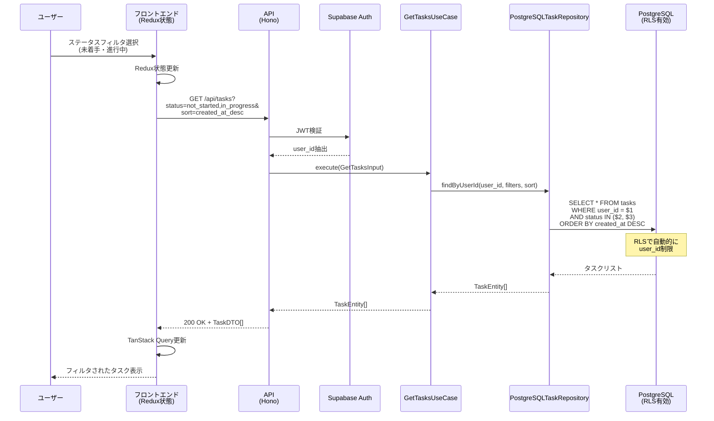
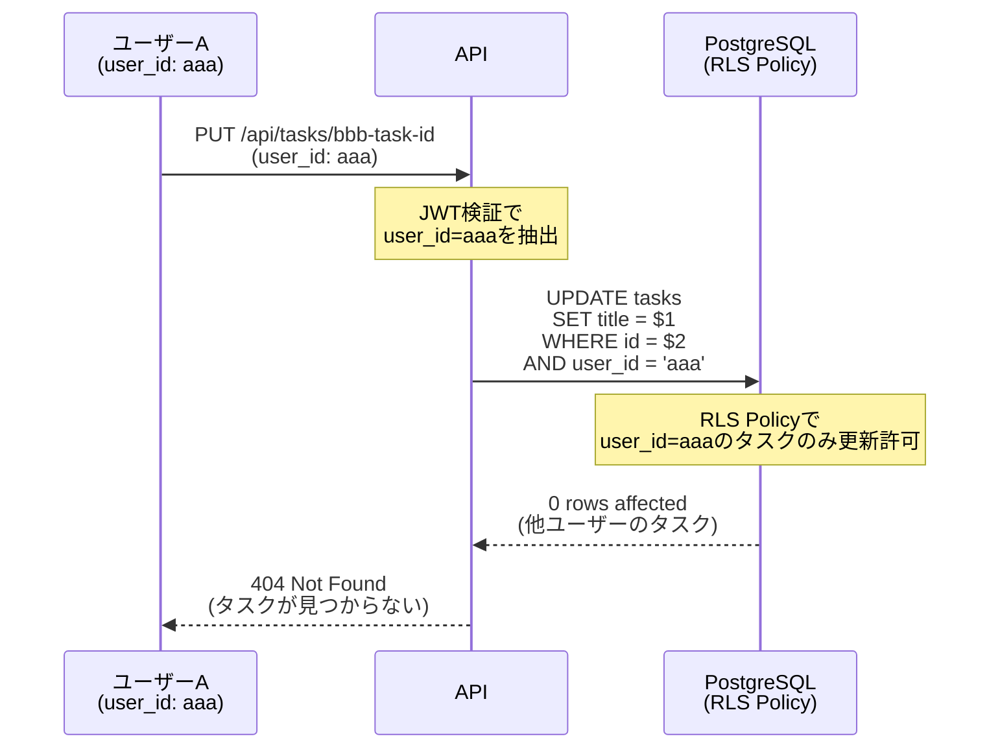
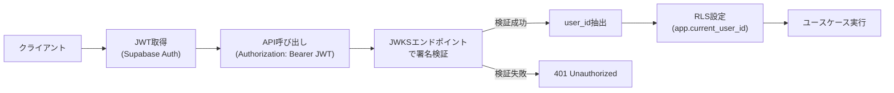

# TODOリストアプリ アーキテクチャ設計

## 📄 ドキュメント情報

- **作成日**: 2025-11-06
- **要件名**: todo-app
- **バージョン**: 1.0.0
- **関連文書**:
  - [要件定義書](../../spec/todo-app-requirements.md)
  - [ユーザーストーリー](../../spec/todo-app-user-stories.md)
  - [受け入れ基準](../../spec/todo-app-acceptance-criteria.md)
  - [技術スタック](../../tech-stack.md)

## システム概要

🔵 *要件定義書より*

個人のタスク(TODO)管理を行うシンプルなアプリケーション。
ログイン済みユーザーが自分のタスクを作成・更新・削除し、
優先度・ステータス管理、フィルタ・ソート機能を提供する。

将来的なバックログ管理機能への拡張を考慮した設計とする。

## アーキテクチャパターン

### 選択パターン

🔵 *CLAUDE.md、既存プロジェクト方針より*

- **バックエンド**: DDD + クリーンアーキテクチャ
- **フロントエンド**: Feature-based ディレクトリ + Redux + TanStack Query
- **全体構成**: SSG + API 完全分離アーキテクチャ

### 選択理由

🔵 *既存技術スタック、CLAUDE.md より*

1. **DDD + クリーンアーキテクチャ**:
   - ドメインロジックの明確な分離
   - 将来的な拡張(バックログ管理)への対応容易性
   - テスタビリティの向上(各層の独立したテスト)
   - 既存プロジェクト方針との整合性

2. **SSG + API 分離**:
   - CloudFlare Pages(SSG)とAWS Lambda(API)の最適化
   - フロントエンドとバックエンドの独立したデプロイ
   - スケーラビリティの確保

3. **Feature-based ディレクトリ**:
   - 機能ごとの凝集性向上
   - コードの発見性向上
   - 将来的な機能追加の容易性

## コンポーネント構成

### システム全体構成



🔵 *技術スタック、要件定義書より*

### フロントエンド

🔵 *技術スタック、CLAUDE.md より*

**技術構成**:
- **フレームワーク**: Next.js 15.4.6 (SSG)
- **UIライブラリ**: React 19.1.0
- **言語**: TypeScript 5
- **スタイリング**: Tailwind CSS 4
  - ベースカラー: `#710000`
  - アクセントカラー: `#ff6a00`
- **状態管理**:
  - Redux Toolkit 2.8.2(UIフィルタ・ソート状態)
  - TanStack React Query 5.84.2(サーバー状態)
- **API通信**: openapi-fetch 0.15.0 (型安全なAPI呼び出し)
- **Markdown表示**: react-markdown + remark-gfm

🔵 *ユーザーヒアリング 2025-11-06*

**デプロイ先**: CloudFlare Pages

**責務**:
1. タスクの表示・入力UI提供
2. フィルタ・ソート状態のローカル管理
3. Markdown表示
4. テーマカラーの適用
5. デスクトップ最適化(モバイル基本対応)

### バックエンド

🔵 *技術スタック、CLAUDE.md より*

**技術構成**:
- **フレームワーク**: Hono 4.9.0
- **言語**: TypeScript 5.9.2
- **ランタイム**:
  - 開発: Bun
  - 本番: Node.js 22.x (AWS Lambda)
- **ORM**: Drizzle ORM 0.44.4
- **バリデーション**: Zod 4.1.12
- **OpenAPI**: @hono/zod-openapi 1.1.3
- **認証**: Supabase Auth (JWKS検証)

🔵 *技術スタック、CLAUDE.md より*

**デプロイ先**: AWS Lambda

**責務**:
1. タスクCRUD操作のビジネスロジック
2. JWT認証・認可
3. Zodバリデーション
4. RLSによるユーザー分離
5. OpenAPI仕様の提供

### データベース

🔵 *技術スタック、CLAUDE.md より*

**技術構成**:
- **DBMS**: PostgreSQL 15 (Alpine)
- **スキーマ**: `app_test` (環境変数 BASE_SCHEMA)
- **接続ライブラリ**:
  - 開発: postgres 3.4.7
  - 本番: pg 8.12.0

🔵 *要件定義書 REQ-403 より*

**責務**:
1. タスクデータの永続化
2. Row-Level Security(RLS)によるユーザー分離
3. CHECK制約による整合性担保
4. インデックスによるパフォーマンス最適化

## レイヤ構成(DDD + クリーンアーキテクチャ)

### Domain層(ドメイン層)

🔵 *CLAUDE.md、要件定義書 REQ-407 より*

**責務**: ビジネスロジックの核心を表現

**主要コンポーネント**:
- `TaskEntity`: タスクの本質的な振る舞いをカプセル化
- `TaskAggregate`: 集約ルート(今回はTaskEntityと同等)
- `TaskPriority`: 優先度の値オブジェクト
- `TaskStatus`: ステータスの値オブジェクト
- `TaskTitle`: タイトルの値オブジェクト
- エラー: `TaskNotFoundError`, `InvalidTaskDataError`

**依存関係**: 外部に依存しない(Pure TypeScript)

### Application層(アプリケーション層)

🔵 *CLAUDE.md、要件定義書 REQ-407 より*

**責務**: ユースケースの実行・調整

**主要コンポーネント**:
- `CreateTaskUseCase`: タスク作成
- `GetTasksUseCase`: タスク一覧取得(フィルタ・ソート)
- `GetTaskByIdUseCase`: タスク詳細取得
- `UpdateTaskUseCase`: タスク更新
- `DeleteTaskUseCase`: タスク削除
- `ChangeTaskStatusUseCase`: ステータス変更

**依存関係**: Domain層のインターフェースに依存

### Infrastructure層(インフラ層)

🔵 *CLAUDE.md、要件定義書 REQ-407 より*

**責務**: 外部システムとの連携・永続化

**主要コンポーネント**:
- `PostgreSQLTaskRepository`: Drizzle ORMを用いたタスクリポジトリ
- `SupabaseJwtVerifier`: JWT検証(JWKS)
- `DatabaseConnection`: DB接続管理

**依存関係**: Domain層のインターフェースを実装

### Presentation層(プレゼンテーション層)

🔵 *CLAUDE.md、要件定義書 REQ-407 より*

**責務**: HTTP通信の制御

**主要コンポーネント**:
- `TaskController`: タスクAPIのコントローラ
- `taskRoutes`: ルーティング定義
- `taskRoutes.schema`: Zodスキーマ + OpenAPI定義
- `authMiddleware`: JWT認証ミドルウェア

**依存関係**: Application層のユースケースを呼び出し

## データフロー

### タスク作成フロー



🔵 *要件定義書、技術スタック、CLAUDE.md より*

### タスク一覧取得フロー(フィルタ・ソート)



🔵 *要件定義書 REQ-201, REQ-202, REQ-203 より*

### セキュリティフロー(RLS)



🔵 *要件定義書 REQ-403, NFR-102 より*

## セキュリティ設計

### Row-Level Security(RLS) Policy

🔵 *要件定義書 REQ-403, NFR-102 より*

```sql
-- tasksテーブルへのRLSポリシー
CREATE POLICY "Users can only access their own tasks"
ON app_test.tasks
FOR ALL
USING (user_id = current_setting('app.current_user_id')::uuid);
```

**仕組み**:
1. JWT検証でuser_idを抽出
2. `SET LOCAL app.current_user_id = '{user_id}'` で現在のユーザーを設定
3. すべてのクエリで自動的に`user_id`フィルタが適用される

### JWT認証フロー

🔵 *技術スタック、要件定義書 REQ-402, NFR-103 より*



🔵 *技術スタック、CLAUDE.md より*

**重要**: Supabase JWT Secret認証は非推奨、JWKS認証を使用

## スケーラビリティ・拡張性

### 将来的なバックログ管理への拡張

🔵 *要件定義書 NFR-301, NFR-302, NFR-303 より*

**現在の設計で考慮している点**:

1. **TaskEntityの拡張可能性**:
   - `parent_task_id` フィールド追加でタスク階層化可能
   - 集約ルートの導入準備(TaskAggregate)

2. **ステータスのカスタマイズ性**:
   - ステータス値をenumではなくVARCHARで保存
   - 将来的にユーザー定義ステータスへ拡張可能

3. **レイヤ構造の柔軟性**:
   - ドメイン層の独立性により、ビジネスロジックの拡張が容易
   - リポジトリパターンにより、データアクセス層の変更が容易

### パフォーマンス最適化

🔵 *要件定義書 NFR-001, NFR-002 より*

**インデックス戦略**:
- `idx_tasks_user_id`: ユーザーごとのタスク取得(最頻)
- `idx_tasks_created_at`: 作成日時ソート
- `idx_tasks_priority`: 優先度フィルタ
- `idx_tasks_title`: 将来的な全文検索

**クエリ最適化**:
- RLSによる自動フィルタ(user_id)
- Drizzle ORMのパラメータ化クエリ
- TanStack Queryのキャッシュ戦略

🟡 *一般的なパフォーマンス最適化手法*

## テスト戦略

### ユニット/統合テスト

🔵 *CLAUDE.md、要件定義書 REQ-409 より*

**フロントエンド**:
- Bun標準テスト
- @testing-library/react
- @testing-library/user-event
- テストケース名: 日本語
- 実行: `docker compose exec client bun test`

**バックエンド**:
- Bun標準テスト
- 依存注入によるモック
- テストケース名: 日本語
- 実行: `docker compose exec server bun test`

### E2Eテスト

🔵 *CLAUDE.md、技術スタック より*

**フレームワーク**: Playwright 1.55.0
- storageState APIで認証状態管理
- Locatorsの優先利用
- Trace Viewerによるデバッグ
- 実行: `docker compose exec e2e npx playwright test`

**主要シナリオ**:
1. ログイン → タスク追加 → 編集 → ステータス変更 → 削除
2. フィルタ・ソート機能の動作確認
3. エラーハンドリング

### セキュリティテスト

🔵 *CLAUDE.md、技術スタック より*

**ツール**: Semgrep 1.96.0
- OWASP Top 10脆弱性の検出
- 実行: `docker compose run --rm semgrep semgrep scan --config=auto`

## デプロイメント

### フロントエンド(CloudFlare Pages)

🔵 *技術スタック より*

**ビルド**:
```bash
docker compose exec client bun run build
```

**デプロイ**: Git連携自動デプロイ(main branch)

### バックエンド(AWS Lambda)

🔵 *技術スタック より*

**ビルド**:
```bash
docker compose exec server bun run build:lambda
```

**デプロイ**: Terraform + AWS Lambda

### データベース(AWS RDS / Supabase DB)

🔵 *技術スタック より*

**マイグレーション**:
```bash
docker compose exec server bun run db:push
```

## コスト最適化

🔵 *技術スタック より*

- **CloudFlare Pages**: 無料プラン活用(帯域・ビルド時間内)
- **AWS Lambda**: 無料枠活用(月100万リクエスト)
- **Supabase**: 無料プラン活用(認証・DB)
- **開発環境**: Docker Composeでローカル完結

## アーキテクチャ決定記録(ADR)

### ADR-001: DDD + クリーンアーキテクチャの採用

🔵 *CLAUDE.md、要件定義書 REQ-401 より*

**決定**: バックエンドにDDD + クリーンアーキテクチャを採用

**理由**:
1. 既存プロジェクト方針との整合性
2. ビジネスロジックの明確な分離
3. 将来的な拡張(バックログ管理)への対応容易性
4. テスタビリティの向上

**トレードオフ**:
- 初期実装コストの増加
- シンプルなCRUDには過剰な可能性

**緩和策**:
- TDD開発で品質担保
- 明確なディレクトリ構成で学習コスト低減

### ADR-002: Row-Level Security(RLS)の採用

🔵 *要件定義書 REQ-403 より*

**決定**: PostgreSQL RLSでユーザー分離

**理由**:
1. データベースレベルでのセキュリティ担保
2. アプリケーション層のバグによる漏洩防止
3. Supabase DBとの親和性

**トレードオフ**:
- 設定の複雑性
- デバッグの困難性

**緩和策**:
- 統合テストで RLS 動作確認
- ドキュメントでの明記

### ADR-003: スキーマ駆動開発の採用

🔵 *CLAUDE.md、要件定義書 REQ-405 より*

**決定**: Drizzle → Zod → OpenAPI → TypeScript型定義

**理由**:
1. フロントエンド・バックエンド型定義の一貫性
2. OpenAPI仕様の自動生成
3. スキーマ変更時の影響範囲の明確化

**トレードオフ**:
- 生成スクリプトのメンテナンス

**緩和策**:
- 自動生成ファイルの警告コメント
- スキーマ変更フローのドキュメント化

## 参考資料

🔵 *既存資料*

- [エリック・エヴァンスのドメイン駆動設計](https://www.amazon.co.jp/dp/4798121967)
- [ロバート・C・マーチンのクリーンアーキテクチャ](https://www.amazon.co.jp/dp/4048930656)
- [Hono公式ドキュメント](https://hono.dev/)
- [Drizzle ORM公式ドキュメント](https://orm.drizzle.team/)
- [Supabase Auth公式ドキュメント](https://supabase.com/docs/guides/auth)
