# TODOリストアプリ データフロー図

## 📄 ドキュメント情報

- **作成日**: 2025-11-06
- **要件名**: todo-app
- **バージョン**: 1.0.0
- **関連文書**:
  - [アーキテクチャ設計](./architecture.md)
  - [要件定義書](../../spec/todo-app-requirements.md)

## ユーザーインタラクションフロー

### 全体フロー

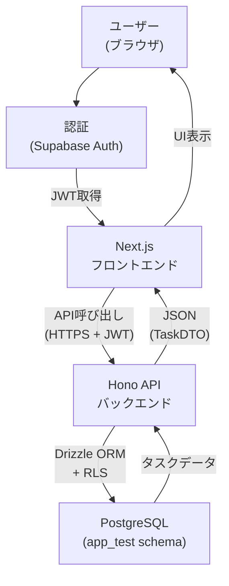

🔵 *技術スタック、アーキテクチャ設計より*

### タスク作成フロー

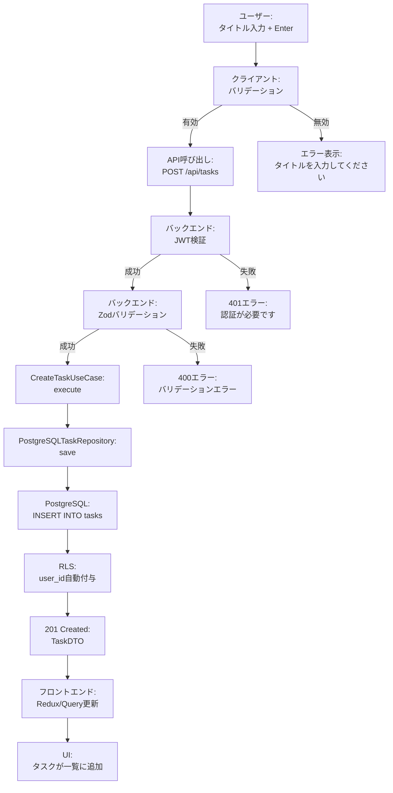

🔵 *要件定義書 REQ-001、アーキテクチャ設計より*

### タスク一覧取得フロー(フィルタ・ソート)

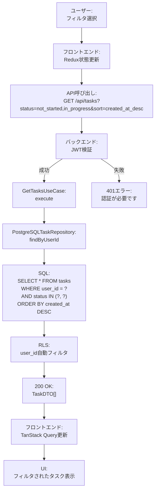

🔵 *要件定義書 REQ-201, REQ-202, REQ-203、アーキテクチャ設計より*

### タスク更新フロー

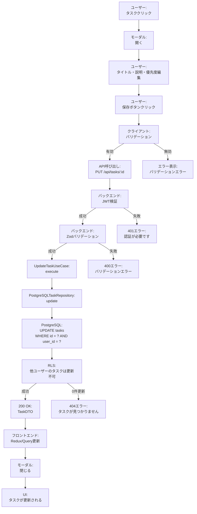

🔵 *要件定義書 REQ-002、アーキテクチャ設計より*

### タスク削除フロー

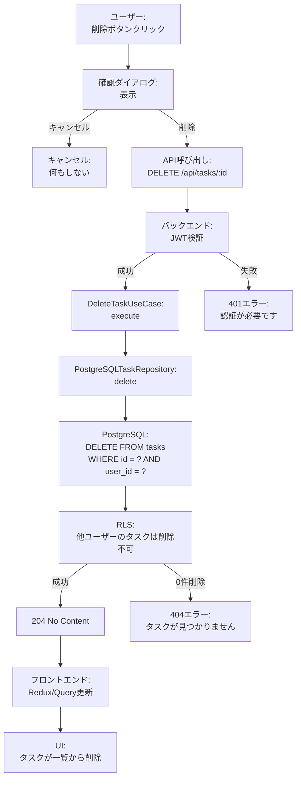

🔵 *要件定義書 REQ-003、アーキテクチャ設計より*

### ステータス変更フロー

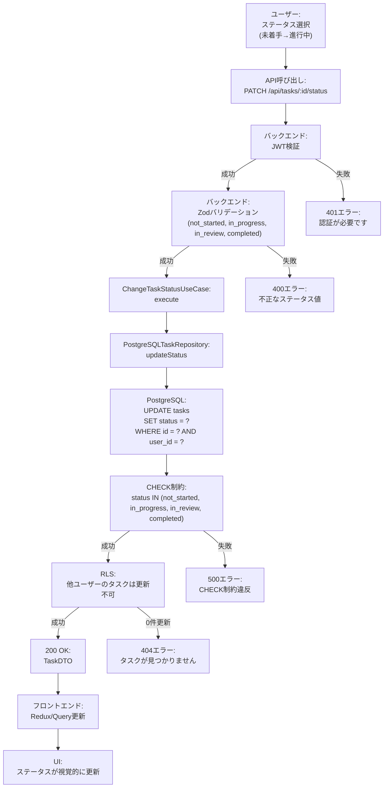

🔵 *要件定義書 REQ-004、アーキテクチャ設計より*

## データ処理フロー

### スキーマ駆動開発フロー

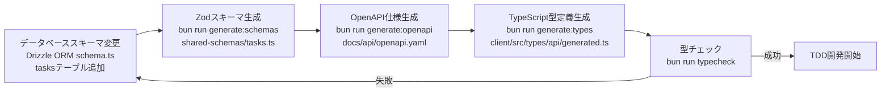

🔵 *CLAUDE.md、技術スタック、要件定義書 REQ-405 より*

### セキュリティフロー(JWT + RLS)

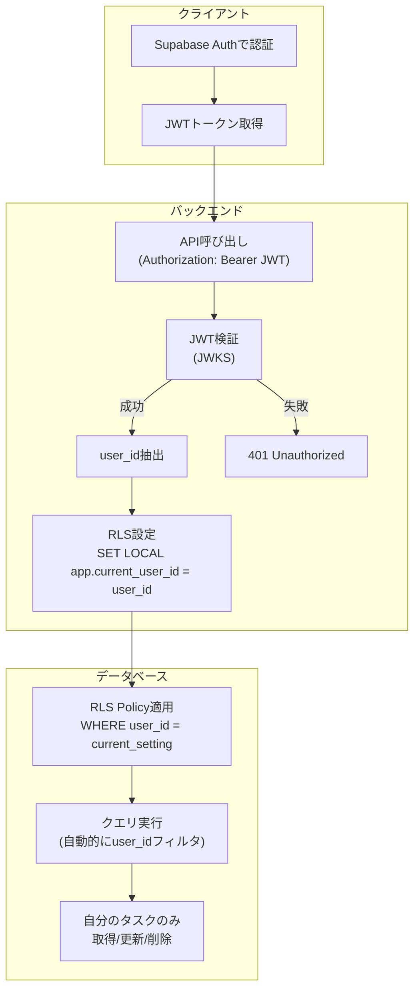

🔵 *アーキテクチャ設計、要件定義書 REQ-402, REQ-403 より*

### エラーハンドリングフロー

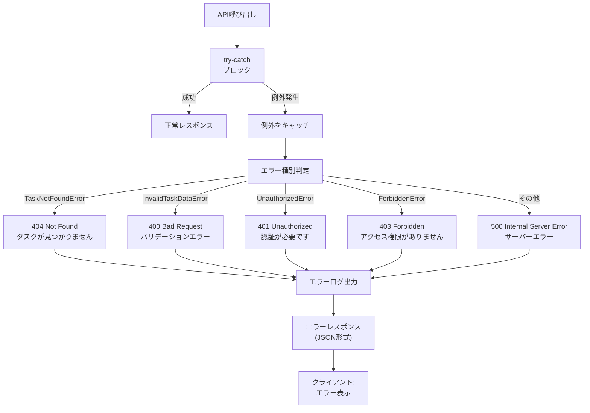

🔵 *要件定義書、CLAUDE.md より*

## 状態管理フロー

### フロントエンド状態管理

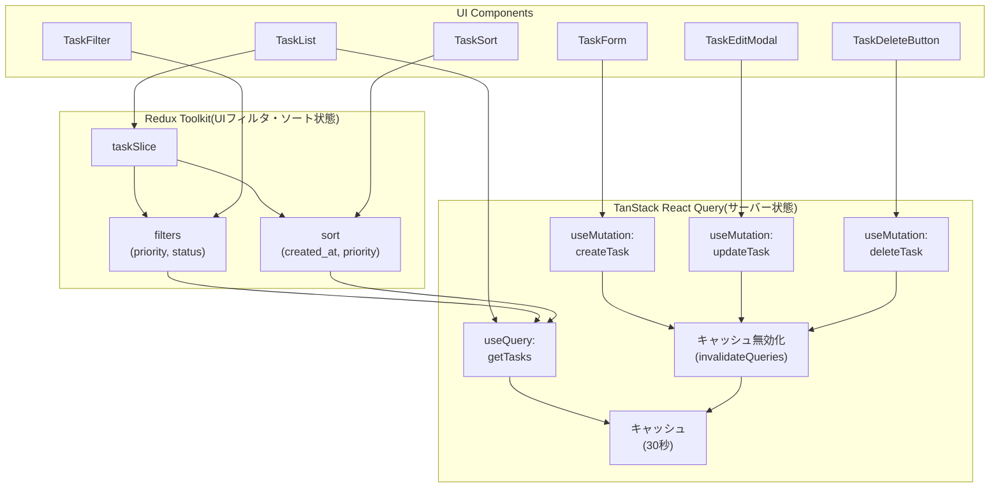

🔵 *技術スタック、CLAUDE.md より*

### サーバー状態キャッシュフロー

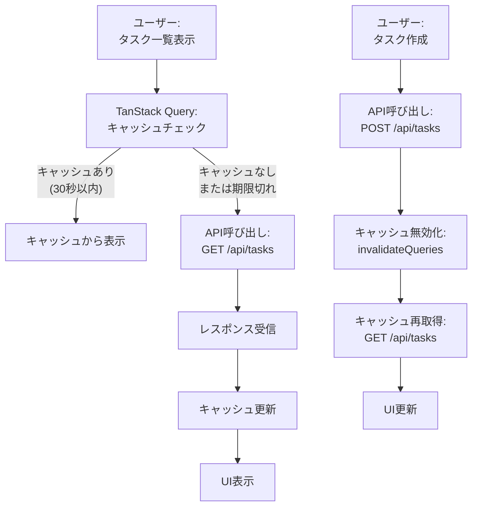

🟡 *一般的なキャッシュ戦略*

## パフォーマンス最適化フロー

### タスク一覧のレンダリング最適化

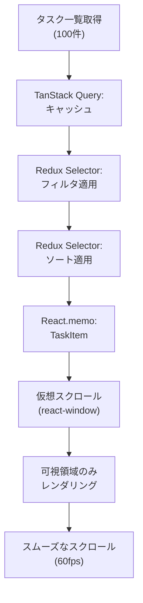

🟡 *一般的なパフォーマンス最適化手法*

## バックエンド処理フロー(レイヤ間)

### タスク作成処理のレイヤ間フロー

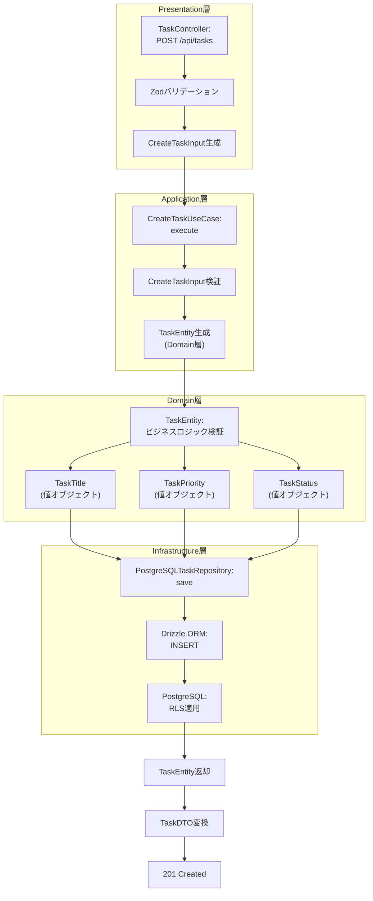

🔵 *アーキテクチャ設計、要件定義書 REQ-407 より*

## 参考資料

🔵 *既存資料*

- [アーキテクチャ設計](./architecture.md)
- [要件定義書](../../spec/todo-app-requirements.md)
- [技術スタック](../../tech-stack.md)
