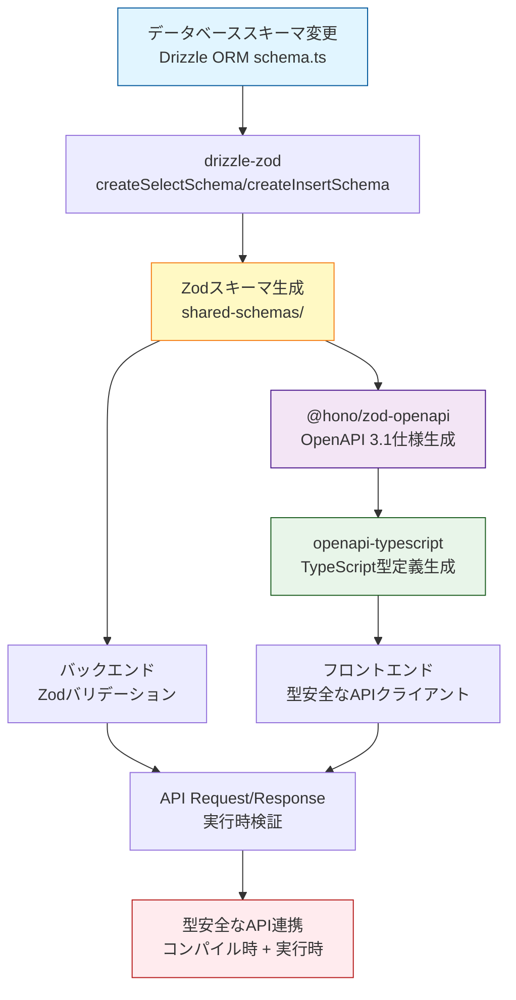
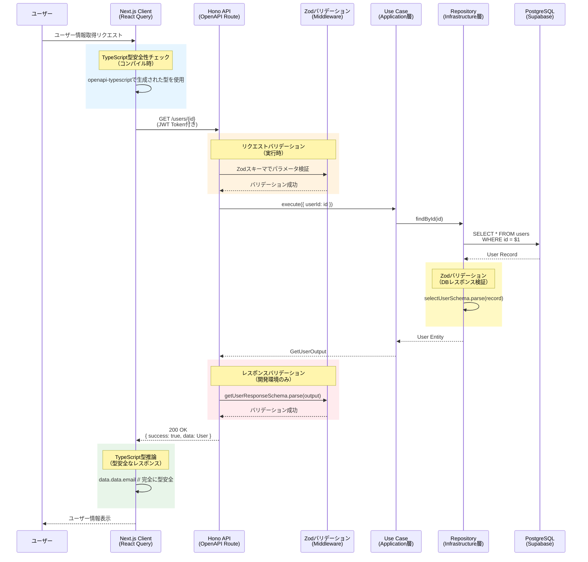
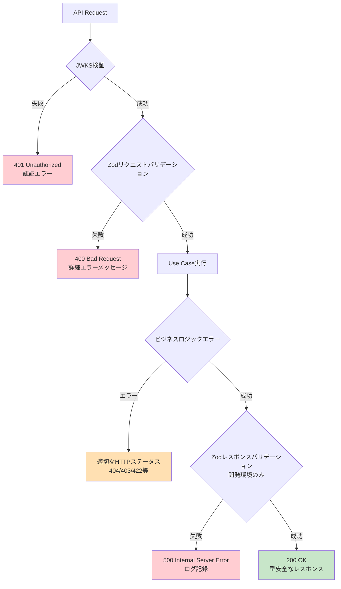
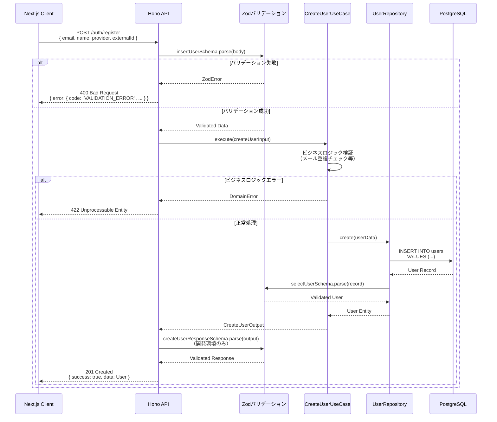
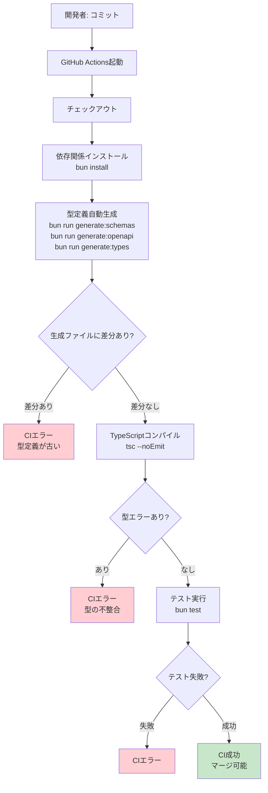
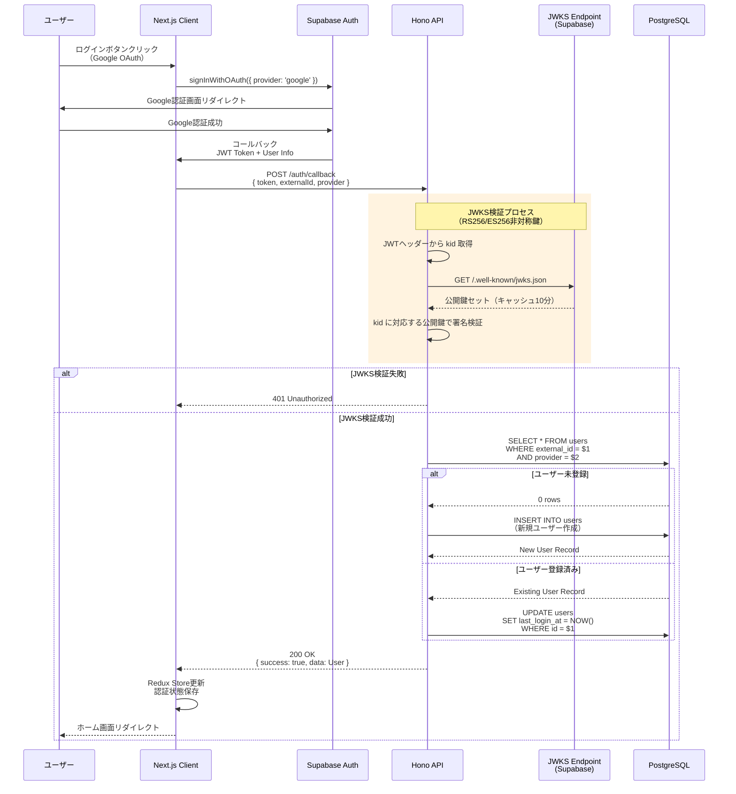
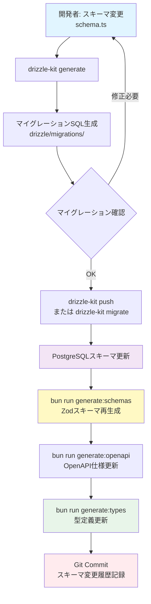

# データフロー図

**作成日**: 2025-10-12
**更新日**: 2025-10-12

## スキーマ駆動開発の全体フロー

## ユーザーインタラクションフロー（認証済みユーザー取得の例）

## 型定義自動生成フロー

```mermaid
flowchart LR
    A["開発者: スキーマ変更<br/>schema.ts"] --> B["bun run generate:schemas"]
    B --> C["Drizzle Zod実行<br/>createSelectSchema/createInsertSchema"]
    C --> D["Zodスキーマ生成<br/>shared-schemas/users.ts"]
    D --> E["bun run generate:openapi"]
    E --> F["@hono/zod-openapi実行<br/>Honoルート解析"]
    F --> G["OpenAPI 3.1仕様出力<br/>docs/api/openapi.yaml"]
    G --> H["bun run generate:types"]
    H --> I["openapi-typescript実行<br/>型定義生成"]
    I --> J["TypeScript型定義出力<br/>types/api/generated.ts"]
    J --> K["Git Commit<br/>差分レビュー"]

    style A fill:#e1f5ff
    style D fill:#fff9c4
    style G fill:#f3e5f5
    style J fill:#e8f5e9
    style K fill:#ffebee
```

## エラーハンドリングフロー

## データ処理フロー（新規ユーザー登録の例）

## スキーマ同期フロー（CI/CD統合）

## 認証フロー（Supabase Auth統合 - JWKS検証）

## OpenAPIドキュメント提供フロー（Swagger UI）

```mermaid
flowchart LR
    A["開発者"] --> B["http://localhost:3001/api/docs"]
    B --> C["Hono OpenAPI Route<br/>/api/docs"]
    C --> D["docs/api/openapi.yaml読み込み"]
    D --> E["Swagger UI HTML生成<br/>swagger-ui-dist"]
    E --> F["ブラウザ表示<br/>インタラクティブAPI仕様"]
    F --> G["Try it out機能<br/>APIテスト実行"]
    G --> H["実際のAPIエンドポイント<br/>リクエスト送信"]
    H --> I["レスポンス表示<br/>型安全性確認"]

    style B fill:#e1f5ff
    style D fill:#f3e5f5
    style F fill:#fff9c4
    style I fill:#e8f5e9
```

## データベーススキーママイグレーションフロー

## まとめ

これらのデータフローにより、以下が実現される：

1. **単一の信頼できる情報源**: Drizzle ORMスキーマから全型定義を自動生成
2. **二重の型安全性**: コンパイル時（TypeScript） + 実行時（Zod）
3. **自動ドキュメント生成**: OpenAPI仕様 → Swagger UI
4. **継続的な型整合性**: CI/CDパイプラインで差分検出
5. **効率的なエラーハンドリング**: 詳細なバリデーションエラーメッセージ

これにより、手動での型定義重複を排除し、型の不整合を防ぎ、開発効率とコード品質を向上させる。
