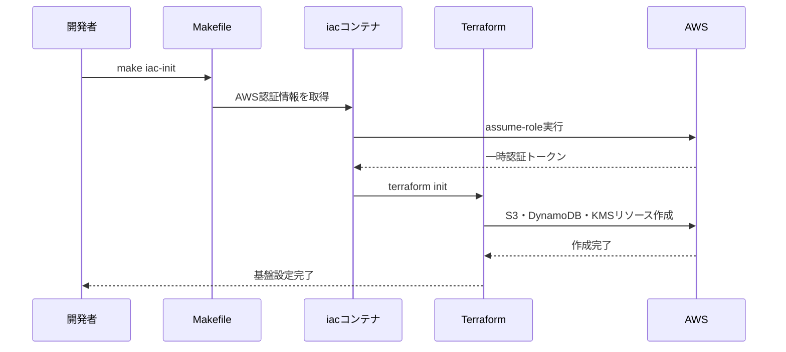
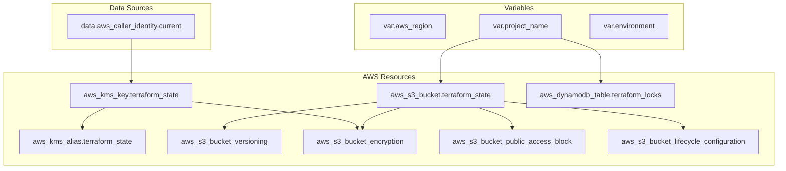

# TASK-501: Terraform基盤設定 コード解説書

作成日：2025年09月14日

## この機能が何を解決するのか

この機能は「Terraformでインフラをコードとして安全に管理する土台」を作ることを解決します。

具体的には：
- Terraformの状態ファイル（terraform.tfstate）をクラウドで安全に保存する
- 複数人が同時に作業しても競合しないように、ロック機能を追加する
- 状態ファイルを暗号化して、機密情報を守る
- AWS上でLambda APIサーバーを動かすための基本設定を準備する

これを「Terraform Backend設定」と呼び、継続的デプロイフローの土台ができます。

## 全体の処理の流れ

### 処理フローとファイル関係



## ファイルの役割と責任

### 今回解説するメインのファイル

#### terraform/state-management.tf
TASK-501で実装されたメインファイルです。AWSでTerraformの状態管理に必要な3つのリソースを作成します：
- `aws_s3_bucket.terraform_state` - 状態ファイルを保存するバケット
- `aws_dynamodb_table.terraform_locks` - 同時実行を防ぐロックテーブル
- `aws_kms_key.terraform_state` - データを暗号化するキー

#### terraform/versions.tf
Terraformとプロバイダー（AWS、Randomなど）のバージョンを固定するファイルです。チーム全員が同じバージョンで作業できるようにします。

#### terraform/variables.tf
設定値（AWSリージョン、環境名など）を外から注入できるようにするファイルです。ハードコードを避けて、柔軟な設定を実現します。

#### terraform/outputs.tf
作成したリソースの情報（バケット名、テーブル名など）を他の設定で使えるように出力するファイルです。

### 呼び出しまたは呼び出されているファイル

#### Makefile (23-40行目)
`make iac`コマンドでTerraformを実行するためのスクリプトです。AWS認証を自動化し、Dockerコンテナ内でTerraformを安全に実行します。

#### app/server/src/presentation/http/server/lambda.ts
Honoアプリケーションを AWS Lambda で動かすためのアダプターです。Terraformで作成されるLambda関数の実行コードになります。

## クラスと関数の呼び出し関係

### インフラリソースの依存関係



## 重要な処理の詳細解説

### 1. 状態ファイルの暗号化設定

```hcl
// terraform/state-management.tf
resource "aws_s3_bucket_server_side_encryption_configuration" "terraform_state" {
  bucket = aws_s3_bucket.terraform_state.id

  rule {
    apply_server_side_encryption_by_default {
      kms_master_key_id = aws_kms_key.terraform_state.arn
      sse_algorithm     = "aws:kms"
    }
    bucket_key_enabled = true
  }
}
```

この処理が必要である理由は、Terraformの状態ファイルにはAWSリソースの詳細情報（時には機密情報）が含まれるためです。KMSによる暗号化で、万が一ファイルが漏洩しても内容を保護できます。

よくある勘違い：「S3は最初から暗号化されている」と思いがちですが、デフォルトはAES256暗号化で、キーの管理権限がありません。KMSを使うことで、誰がいつアクセスしたかまで記録できます。

### 2. 同時実行防止のロック機能

```hcl
// terraform/state-management.tf
resource "aws_dynamodb_table" "terraform_locks" {
  name = "${var.project_name}-terraform-locks"
  billing_mode = "PAY_PER_REQUEST"
  hash_key     = "LockID"
}
```

Terraformは同時に複数人が実行すると状態ファイルが競合してしまいます。DynamoDBテーブルを使うことで、「今、誰かがTerraform実行中」という情報を共有し、待機してもらえます。

よくある勘違い：「ローカルで作業するから大丈夫」と思いがちですが、CI/CDパイプラインと手動実行が重なったり、複数のブランチで同時作業すると必ず問題が起きます。

### 3. バケットの削除防止設定

```hcl
// terraform/state-management.tf
resource "aws_s3_bucket" "terraform_state" {
  // バケット削除防止
  lifecycle {
    prevent_destroy = true
  }
}
```

これはTerraformで最も危険な操作の一つである「状態ファイルのバケット削除」を防ぐ仕組みです。うっかり `terraform destroy` を実行しても、このバケットだけは保護されます。

### 4. AWS認証の自動化（Makefile）

```bash
# Makefile
ROLE_INFO=$$(aws sts assume-role --role-arn ${AWS_ROLE_ARN} --role-session-name terraform-session --output json)
export AWS_ACCESS_KEY_ID=$$(echo $$ROLE_INFO | jq -r ".Credentials.AccessKeyId")
```

この処理は、最小権限の原則に従ってTerraform専用のIAMロールに切り替える仕組みです。普段使っているAWS認証情報とは別の、Terraform専用の権限で作業できます。

## 初学者がつまずきやすいポイント

### 1. backend.tf.disabled の意味
`backend.tf.disabled` というファイルがありますが、これは「まだ使えない設定」です。最初にS3バケットを作ってから、このファイルを `backend.tf` にリネームして使います。「卵が先か、鶏が先か」の問題を解決するための手法です。

### 2. 環境変数とTerraform変数の違い
- 環境変数（.env）：Docker コンテナに渡すシステム設定
- Terraform変数（variables.tf）：Terraformの設定に渡す値
この2つは別物で、Makefileが橋渡し役をしています。

### 3. リソース削除の怖さ
`terraform destroy` は「全部削除」コマンドです。本当に必要な時以外は絶対に実行してはいけません。特に状態ファイルのS3バケットが消えると、復旧はほぼ不可能になります。

### 4. 権限エラーの対処法
「AccessDenied」エラーが出た時は、以下を確認：
1. AWS認証情報が正しく設定されているか
2. 実行者にそのリソースを作る権限があるか
3. Terraformが使うIAMロールに適切な権限があるか

## この設計のいい点

### 1. セキュリティファースト
状態ファイルの暗号化、パブリックアクセスの完全ブロック、最小権限の原則など、セキュリティが徹底されています。本番環境での運用に必要な要素がすべて含まれています。

### 2. チーム開発対応
DynamoDBロックにより複数人が安全に作業できます。また、状態ファイルのバージョン管理により、問題があった時に過去の状態に戻すことができます。

### 3. 運用コストの最適化
DynamoDBは `PAY_PER_REQUEST` モード、S3のライフサイクル設定により、使った分だけの料金で無駄がありません。

### 4. 自動化と再現性
Makefileによる自動化により、誰でも同じ手順でインフラを構築できます。手動作業によるミスを排除し、環境の一貫性を保証します。