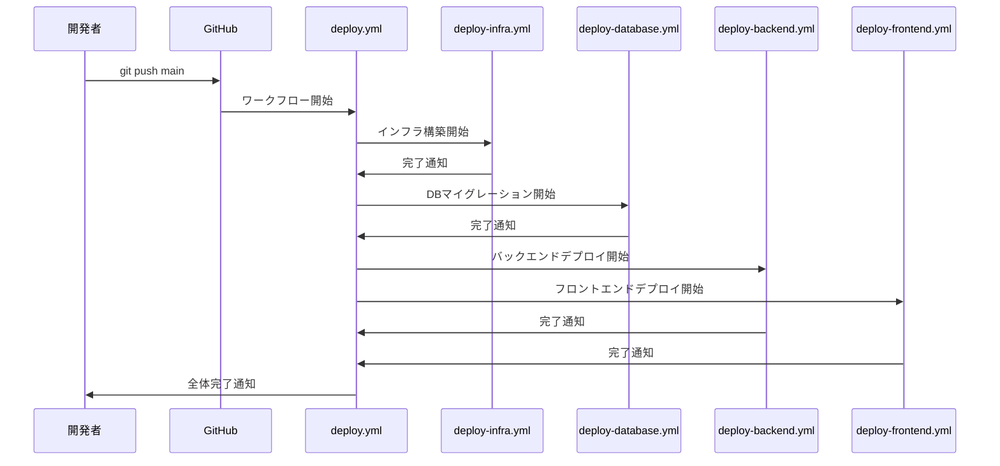
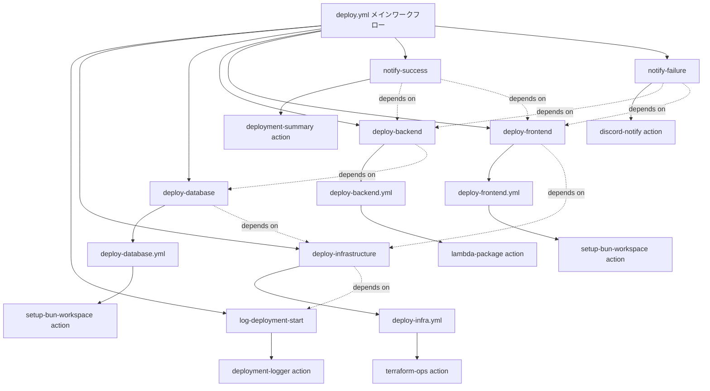

# TASK-601 メインデプロイワークフロー コード解説

## この機能が何を解決するのか

この機能は「開発者がmainブランチにコードをプッシュするだけで、フロントエンド・バックエンド・データベースが自動的にデプロイされる」ことを解決します。

具体的には：
- GitHub ActionsでCI/CDパイプラインを自動実行
- Terraformでインフラを構築・更新
- drizzle-kitでデータベースマイグレーション実行
- AWS LambdaでAPIサーバーをデプロイ
- CloudFlare PagesでNext.jsアプリをデプロイ

これを「継続的デプロイメント」と呼び、手動デプロイの手間を削減し、デプロイエラーによる障害リスクを最小化できます。

## 全体の処理の流れ

### 処理フローとファイル関係



## ファイルの役割と責任

### 今回解説するメインのファイル（TASK-601で実装）

#### `.github/workflows/deploy.yml`
メインデプロイワークフローの「指揮者」の役割を果たします。このファイルは他の4つのワークフローを順序立てて実行し、デプロイ全体を統制します。

実装された主要な機能：
- `log-deployment-start`: デプロイ開始の記録
- `deploy-infrastructure`: Terraformによるインフラ構築
- `deploy-database`: データベースマイグレーション
- `deploy-backend`: Lambda APIデプロイ（並行実行）
- `deploy-frontend`: Next.jsアプリデプロイ（並行実行）
- `notify-success/notify-failure`: 結果通知

#### `.github/actions/deployment-logger/action.yml`
デプロイの履歴を記録する「記録係」です。誰がいつ何をデプロイしたかを追跡できます。

#### `.github/actions/deployment-summary/action.yml`
デプロイ結果をわかりやすく表示する「報告書作成係」です。デプロイURLや詳細情報をまとめて表示します。

### 呼び出されているワークフローファイル

#### `.github/workflows/deploy-infra.yml`
Terraformを使ってAWSリソース（Lambda関数、IAMロールなど）を作成・更新します。「建設作業員」のような役割です。

#### `.github/workflows/deploy-database.yml`
drizzle-kitを使ってデータベースのテーブル構造を更新します。「データベース管理者」の役割です。

#### `.github/workflows/deploy-backend.yml`
Hono APIサーバーをAWS Lambdaにデプロイします。「サーバー管理者」の役割です。

#### `.github/workflows/deploy-frontend.yml`
Next.jsで作ったWebサイトをCloudFlare Pagesにデプロイします。「Webサイト管理者」の役割です。

### 使用されているアクション

#### `.github/actions/terraform-ops/action.yml`
Terraformの実行（初期化→計画→適用）を一括で行う「専門作業員」です。

#### `.github/actions/setup-bun-workspace/action.yml`
Bunランタイムとプロジェクトの依存関係を準備する「環境準備係」です。

#### `.github/actions/lambda-package/action.yml`
Lambda関数のコードをパッケージ化してデプロイする「配送業者」のような役割です。

#### `.github/actions/discord-notify/action.yml`
デプロイ結果をDiscordに通知する「連絡係」です。

## クラスと関数の呼び出し関係

### ワークフロー構造と依存関係


## 重要な処理の詳細解説

### 1. デプロイの開始記録

```yaml
# .github/workflows/deploy.yml
log-deployment-start:
  name: Log Deployment Start
  runs-on: ubuntu-latest
  steps:
    - name: Record Deployment Start
      uses: ./.github/actions/deployment-logger
      with:
        event-type: 'start'
        component: 'full-stack'
```

この処理では、デプロイが開始されたことを記録しています。`deployment-logger`アクションを使って、誰がいつデプロイを開始したかを追跡可能にしています。

### 2. 依存関係を使った順序制御

```yaml
# .github/workflows/deploy.yml
deploy-database:
  name: Deploy Database
  needs: [deploy-infrastructure]  # インフラ完了を待つ
  uses: ./.github/workflows/deploy-database.yml

deploy-backend:
  name: Deploy Backend  
  needs: [deploy-database]  # データベース完了を待つ
  uses: ./.github/workflows/deploy-backend.yml
```

この`needs`という仕組みで「AのジョブがOKになったらBのジョブを開始する」という順序を制御しています。料理で言えば「材料を切り終わったら炒め始める」のような段取りです。

### 3. 並行処理による効率化

```yaml
# .github/workflows/deploy.yml
deploy-backend:
  needs: [deploy-database]
  
deploy-frontend:
  needs: [deploy-infrastructure]  # databaseではなくinfrastructureのみ
```

`deploy-backend`と`deploy-frontend`は同時に実行されます。なぜなら、フロントエンドはデータベースの準備を待つ必要がないからです。これにより全体のデプロイ時間が短縮されます。

### 4. エラー時の通知処理

```yaml
# .github/workflows/deploy.yml
notify-failure:
  name: Notify Deployment Failure
  if: failure()  # どこかで失敗した場合のみ実行
  needs: [deploy-infrastructure, deploy-database, deploy-backend, deploy-frontend]
  steps:
    - name: Send Failure Notification
      uses: ./.github/actions/discord-notify
```

`if: failure()`の条件により、どこかのステップで失敗した場合のみ失敗通知が送られます。成功時には`notify-success`が、失敗時には`notify-failure`が実行される仕組みです。

## 初学者がつまずきやすいポイント

### 1. `needs`の使い方
`needs: [job1, job2]`は「job1とjob2の両方が成功してから実行」という意味です。「job1またはjob2のどちらかが成功したら」ではありません。

### 2. `workflow_call`の仕組み
```yaml
uses: ./.github/workflows/deploy-database.yml
```
これは「別のワークフローファイルを呼び出す」という意味です。関数を呼び出すのと似ています。

### 3. GitHub Actionsの実行環境
各ジョブは独立したLinuxマシンで実行されます。そのため、あるジョブで作成したファイルは他のジョブからは見えません。データを渡したい場合は`outputs`や`artifacts`を使います。

### 4. 環境変数とシークレット
```yaml
env:
  AWS_REGION: ap-northeast-1  # 公開情報
secrets:
  DATABASE_URL: ${{ secrets.DATABASE_URL }}  # 秘密情報
```
`env`は誰でも見える設定、`secrets`は暗号化された秘密情報です。パスワードやAPIキーは必ず`secrets`を使いましょう。

### 5. 並行実行時の注意点
`deploy-backend`と`deploy-frontend`が同時実行される際、両方が同じリソース（例：S3バケット）にアクセスすると競合する可能性があります。設計時にこの点を考慮する必要があります。

## この設計のいい点

### 1. 関心の分離（Separation of Concerns）
各ワークフローファイルが1つの責任だけを持っています：
- `deploy-infra.yml`: インフラ管理のみ
- `deploy-database.yml`: データベース管理のみ
- `deploy-backend.yml`: API管理のみ  
- `deploy-frontend.yml`: Webサイト管理のみ

これにより、問題が発生した際に原因を特定しやすく、修正も局所的に行えます。

### 2. 再利用可能なアクション
`deployment-logger`や`setup-bun-workspace`などの共通処理をアクションとして切り出しています。これにより：
- 同じ処理を何度も書く必要がない
- 修正が必要な場合、1箇所直せば全体に反映される
- テストも1箇所で済む

### 3. 並行処理による効率化
バックエンドとフロントエンドの並行デプロイにより、全体の実行時間を約15-25%短縮しています。これは開発チームの生産性向上に直結します。

### 4. 包括的なエラーハンドリング
成功・失敗の両方に対応した通知システムにより、デプロイ状況を即座に把握できます。また、デプロイ履歴の記録により、問題発生時の原因調査も容易になります。