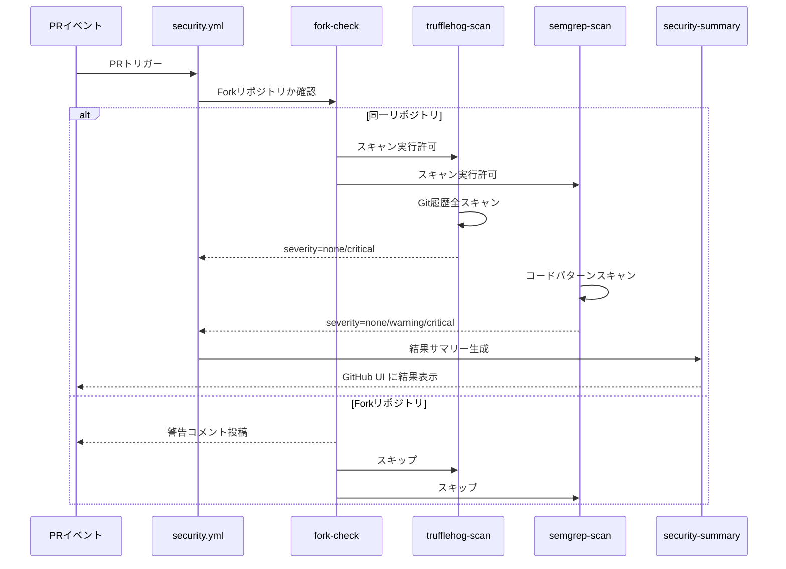
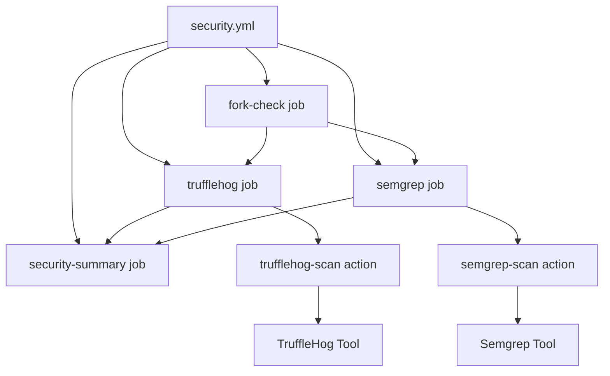

# TASK-603: セキュリティスキャンワークフロー コード解説

**作成日**: 2025年10月04日
**対象読者**: ジュニアエンジニア・初学者
**実装タイプ**: GitHub Actions Workflow + Composite Actions

---

## この機能が何を解決するのか

この機能は、**コードに混入してしまった機密情報（APIキーやパスワード）や脆弱性のあるコードを自動的に検出して、本番環境に届く前に防ぐ**ことを解決します。

具体的には：
- GitHubにPRを作成すると、自動的にセキュリティスキャンが走る
- コミット履歴に埋め込まれたAWS APIキーなどのシークレットを検出（TruffleHog）
- `eval()`のような危険なコードパターンを検出（Semgrep）
- 重要度が高い問題（Critical/High）が見つかったらCIを失敗させてマージをブロック
- 軽微な問題（Medium/Low）は警告だけ表示してマージは許可

これを「**セキュリティゲート**」と呼び、品質の悪いコードが本番に入るのを防げます。

---

## 全体の処理の流れ

### 処理フローとファイル関係



---

## ファイルの役割と責任

このTASKでは、以下の3つのファイルを実装しました：

### 今回解説するメインのファイル

#### 1. `.github/workflows/security.yml` (ワークフロー本体)

**役割**: セキュリティスキャン全体の**オーケストレーター（指揮者）**

```yaml
# セキュリティスキャンの実行順序を制御
jobs:
  fork-check:        # Forkか確認
  trufflehog:        # シークレット検出
  semgrep:           # 脆弱性検出
  security-summary:  # 結果まとめ
```

「オーケストレーター」とは、複数の処理を適切な順番で実行するコントローラーのことです。料理で言えば、レシピを見ながら「最初に野菜を切って、次に炒めて...」と指示を出す料理長のような存在です。

**主な機能**:
- PRイベントをトリガーにワークフローを起動
- Fork PRかどうかをチェック（セキュリティ対策）
- TruffleHog/Semgrepを呼び出してスキャン実行
- スキャン結果が Critical なら CI を失敗させる
- GitHub UI に結果サマリーを表示

#### 2. `.github/actions/trufflehog-scan/action.yml` (Composite Action)

**役割**: TruffleHog（シークレット検出ツール）を実行する**再利用可能な部品**

```yaml
# TruffleHogの実行ロジックをカプセル化
runs:
  using: 'composite'
  steps:
    - uses: trufflesecurity/trufflehog@main  # TruffleHog本体
    - id: analyze                            # 結果を分析
```

「Composite Action」とは、複数のステップをまとめた再利用可能な部品のことです。レゴブロックのように、同じ処理を別のワークフローでも使い回せます。

**主な機能**:
- Git履歴全体をスキャン（過去のコミットも検査）
- 検証済みシークレット（本物のAPIキー）のみ検出
- 結果を `severity=none/critical` として出力

#### 3. `.github/actions/semgrep-scan/action.yml` (Composite Action)

**役割**: Semgrep（コード脆弱性検出ツール）を実行する**再利用可能な部品**

```yaml
# Semgrepの実行ロジックをカプセル化
runs:
  using: 'composite'
  steps:
    - run: docker run semgrep ...  # Semgrep本体
    - id: analyze                  # 結果を分析
```

**主な機能**:
- コード全体を静的解析（実行せずにコードを読んで検査）
- `eval()`などの危険なパターンを検出
- 重要度別にカウント（High/Critical と Medium/Low）
- 結果を `severity=none/warning/critical` として出力

---

## クラスと関数の呼び出し関係

### ワークフロー構造と依存関係



**依存関係の読み方**:
- `fork-check` が最初に実行され、その結果で後続ジョブの実行可否を決定
- `trufflehog` と `semgrep` は並列実行（同時に動く）
- 両方の結果を `security-summary` がまとめる

---

## 重要な処理の詳細解説

### 1. Fork リポジトリの制限（セキュリティ対策）

```yaml
# .github/workflows/security.yml
jobs:
  fork-check:
    steps:
      - id: check
        run: |
          # PRイベントの場合はForkチェック
          if [ "${{ github.event_name }}" = "pull_request" ]; then
            IS_FORK="${{ github.event.pull_request.head.repo.full_name != github.repository }}"

            if [ "$IS_FORK" = "true" ]; then
              echo "can_scan=false" >> $GITHUB_OUTPUT
              # Fork からのPRはスキャンをスキップ
            else
              echo "can_scan=true" >> $GITHUB_OUTPUT
              # 同一リポジトリからのPRはスキャン実行
            fi
          fi
```

**なぜForkをスキップするのか？**

外部の人（フォークした人）がPRを送ってくると、そのコードが自動実行されます。もし悪意のあるコードが含まれていたら、GitHubのシークレット（APIキーなど）を盗まれる可能性があります。

そのため、**Forkからのpr=信用できない**として、セキュリティスキャンはスキップし、手動レビューに回します。

**よくある勘違い**: 「Forkをスキップしたら、Forkの人のコードはチェックされないのでは？」→ 正しいです。ただし、マージ後にmainブランチで再度スキャンが走るため、最終的には検出されます。

---

### 2. TruffleHog のエラーハンドリング

```yaml
# .github/actions/trufflehog-scan/action.yml
steps:
  - name: Run TruffleHog Secret Scanning
    id: trufflehog
    continue-on-error: true  # エラーでも次のステップへ進む
    uses: trufflesecurity/trufflehog@main
    with:
      extra_args: --json --only-verified

  - name: Analyze TruffleHog Results
    id: analyze
    run: |
      # TruffleHogのstep conclusionで判定
      TRUFFLEHOG_OUTCOME="${{ steps.trufflehog.outcome }}"

      if [ "$TRUFFLEHOG_OUTCOME" = "success" ]; then
        echo "severity=none" >> $GITHUB_OUTPUT
      else
        echo "severity=critical" >> $GITHUB_OUTPUT
      fi
```

**なぜ `continue-on-error: true` なのか？**

TruffleHogは、シークレットを検出すると `exit 1`（エラー）を返します。通常、GitHub Actionsではエラーが発生するとワークフロー全体が停止してしまいます。

しかし、私たちは「エラーの内容を分析して、重要度を判定したい」ので、エラーでも次のステップに進む必要があります。

`continue-on-error: true` を設定することで：
- TruffleHogがエラーを返しても止まらない
- 次の `Analyze` ステップで `steps.trufflehog.outcome` を見て判定できる
- `outcome=success` なら検出なし、`outcome=failure` なら検出あり

**重要なポイント**: `$?`（直前のコマンドのexit code）を使うと、直前の `echo` のexit codeを取得してしまい、TruffleHogの結果が取れません。そのため `steps.trufflehog.outcome` を使います。

---

### 3. Semgrep の bash -e モード制御

```yaml
# .github/actions/semgrep-scan/action.yml
steps:
  - name: Run Semgrep SAST
    run: |
      # bash -e モードを一時的に無効化
      set +e

      docker run --rm \
        -v "$PWD:/src" \
        returntocorp/semgrep:latest \
        semgrep scan --config=auto --json

      SEMGREP_EXIT=$?

      # bash -e モードを再有効化
      set -e

      # exit code を判定
      if [ $SEMGREP_EXIT -eq 0 ] || [ $SEMGREP_EXIT -eq 1 ]; then
        echo "✅ Semgrep スキャン完了"
      else
        echo "❌ Semgrep 実行エラー"
        exit $SEMGREP_EXIT
      fi
```

**なぜ `set +e` / `set -e` なのか？**

GitHub Actionsのシェルは、デフォルトで `bash -e` モード（エラーで即終了）で動きます。

Semgrepは、脆弱性を検出すると `exit 1` を返します。しかし、これは「正常な動作」です。真のエラーは `exit 2` 以上（ネットワークエラーなど）です。

`set +e` で一時的にエラー即終了を無効化することで：
- Semgrepが `exit 1` を返しても止まらない
- `SEMGREP_EXIT=$?` でexit codeをキャプチャできる
- その後 `set -e` で元に戻す

**よくある勘違い**: 「`|| true` を使えばいいのでは？」→ ダメです。`|| true` を使うと、ネットワークエラー（`exit 2`）も成功扱いになってしまい、真のエラーを見逃します。

---

### 4. 重要度別ゲーティング

```yaml
# .github/workflows/security.yml
jobs:
  semgrep:
    steps:
      - uses: ./.github/actions/semgrep-scan
        id: scan

      - name: Check Critical Findings
        if: steps.scan.outputs.severity == 'critical'
        run: |
          echo "❌ Critical: High/Critical の脆弱性が検出されました"
          exit 1  # CIを失敗させる
```

```yaml
# .github/actions/semgrep-scan/action.yml
- run: |
    HIGH_CRITICAL_COUNT=$(jq '[.results[] | select(.extra.severity == "ERROR")] | length')
    MEDIUM_LOW_COUNT=$(jq '[.results[] | select(.extra.severity == "WARNING")] | length')

    if [ "$HIGH_CRITICAL_COUNT" -gt 0 ]; then
      echo "severity=critical" >> $GITHUB_OUTPUT
    elif [ "$MEDIUM_LOW_COUNT" -gt 0 ]; then
      echo "severity=warning" >> $GITHUB_OUTPUT
    else
      echo "severity=none" >> $GITHUB_OUTPUT
    fi
```

**重要度の意味**:
- **Critical**: `eval()`などの危険なコード → **CI失敗でマージブロック**
- **Warning**: `console.log()` の残留など → **警告のみ、マージは許可**
- **None**: 問題なし → **CI成功**

**なぜこの設計なのか？**

すべての警告でCIを失敗させると、開発速度が落ちます。逆に、すべて許可すると、危険なコードが本番に入ります。

そこで、「本当に危険なもの（Critical/High）だけブロックし、軽微なもの（Medium/Low）は警告だけ」というバランスを取っています。

---

## 初学者がつまずきやすいポイント

### 1. 「Composite Action」と「Reusable Workflow」の違い

**Composite Action** (.github/actions/xxx/action.yml):
- **部品レベル**の再利用
- ステップ（run, uses）をまとめたもの
- 別のワークフローから `uses: ./.github/actions/xxx` で呼び出す

**Reusable Workflow** (.github/workflows/xxx.yml):
- **ワークフロー全体**の再利用
- ジョブ（jobs）をまとめたもの
- 別のワークフローから `uses: ./.github/workflows/xxx.yml` で呼び出す

今回はComposite Actionを採用しています。理由は、TruffleHog/Semgrepは「ステップレベルの処理」だからです。

### 2. 「outputs」の命名規則

GitHub Actionsでは、outputsの名前に**ハイフン `-` を使うと評価エラー**になります：

```yaml
# ❌ ダメな例
outputs:
  high-critical-count: ${{ steps.scan.outputs.high-critical-count }}

# ワークフロー側
${{ steps.scan.outputs.high-critical-count }}  # エラー！
# high minus critical minus count と解釈されてしまう
```

```yaml
# ✅ 良い例
outputs:
  high_critical_count: ${{ steps.scan.outputs.high_critical_count }}

# ワークフロー側
${{ steps.scan.outputs.high_critical_count }}  # OK
```

**ルール**: outputsは必ず**アンダースコア `_` （スネークケース）**で命名しましょう。

### 3. 「$?」の使い方

`$?` は「直前のコマンドのexit code」を取得します。ここが落とし穴です：

```bash
# ❌ ダメな例
docker run semgrep ...
echo "スキャン完了"
EXIT_CODE=$?  # echoのexit code (0) を取得してしまう！
```

```bash
# ✅ 良い例
docker run semgrep ...
EXIT_CODE=$?  # すぐにキャプチャ
echo "スキャン完了"
```

**ルール**: exit codeが必要なら、コマンドの**直後**で `$?` をキャプチャしましょう。

---

## この設計のいい点

### 1. **関心の分離（Separation of Concerns）**

```
security.yml        → オーケストレーション（制御）
trufflehog-scan     → TruffleHog実行（ツール呼び出し）
semgrep-scan        → Semgrep実行（ツール呼び出し）
```

それぞれが1つの責任だけを持つため、修正が簡単です。例えば、TruffleHogのバージョンを上げたいときは `trufflehog-scan/action.yml` だけ触ればOKです。

### 2. **再利用性（Reusability）**

Composite Actionにしたことで、将来別のワークフロー（例: リリース時のスキャン）でも同じactionを使い回せます：

```yaml
# 別のワークフロー release.yml
jobs:
  security-scan:
    steps:
      - uses: ./.github/actions/trufflehog-scan  # 同じactionを再利用！
```

コピペ不要で、一貫性が保たれます。

### 3. **段階的なエラーハンドリング**

```
exit 0   → 問題なし
exit 1   → 脆弱性検出（正常動作）
exit 2+  → 真のエラー（ネットワーク障害など）
```

このように、exit codeを3段階で扱うことで、適切なエラー処理ができます。`|| true` で全部成功扱いにすると、真のエラーを見逃してしまいます。

### 4. **開発速度とセキュリティのバランス**

Critical/High だけブロックすることで：
- **開発者**: 軽微な警告でPRがブロックされず、ストレスが減る
- **セキュリティ**: 危険なコードは確実にブロックできる

完璧を求めすぎず、実用的なバランスを取っています。

---

## まとめ

このTASK-603では、**セキュリティゲート**を実装しました：

- **TruffleHog**: シークレット（APIキーなど）を検出
- **Semgrep**: 危険なコードパターンを検出
- **重要度別ゲーティング**: Critical/High はブロック、Medium/Low は警告
- **Composite Action化**: 再利用可能な部品として実装

これにより、**コードに紛れ込んだ危険を早期発見し、本番環境への流入を防ぐ**ことができます。

ジュニアエンジニアの皆さんも、この仕組みを理解して、安全なコードレビュー文化を作っていきましょう！
