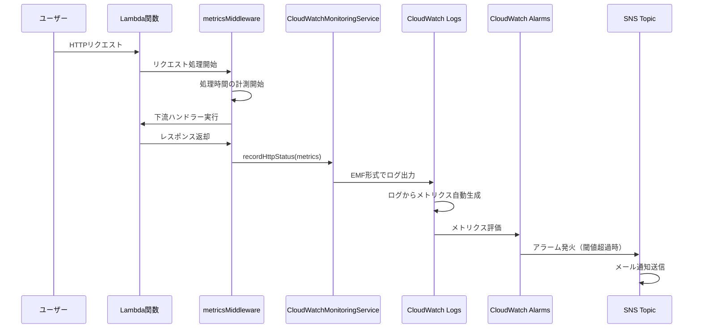
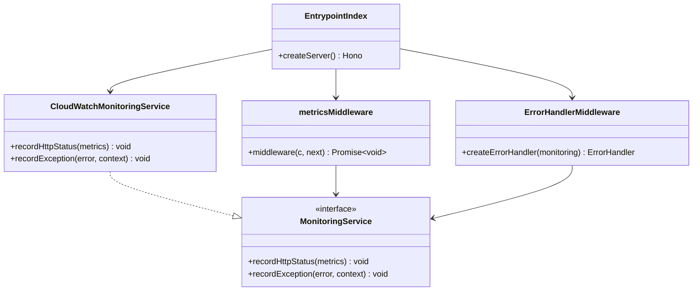

# TASK-702 コード解説: Production Lambda監視機能

**作成日**: 2025年10月11日
**対象TASK**: TASK-702
**要件名**: 継続的デプロイメント（Lambda監視）

---

## この機能が何を解決するのか

この機能は「**Production環境のLambda関数で発生したエラーや異常な動作を早期に検知して、運用チームにメール通知する**」ことを解決します。

具体的には：
- **5xxエラー（サーバー側のエラー）** が発生したら即座に通知
- **4xxエラー（クライアント側のエラー）** が異常に多い場合に通知（攻撃や不正アクセスの兆候）
- **レスポンスが遅い場合**（10秒以上）に通知

これを「**監視（Monitoring）**」と呼び、本番環境で問題が発生した際に迅速に対応できるようになります。

---

## 全体の処理の流れ

### 処理フローとファイル関係

この機能では、以下のような流れでHTTPリクエストのメトリクス（測定データ）を記録し、CloudWatchで監視します：



この流れの重要なポイントは、**「ログを出力するだけで、自動的にメトリクスが作られて、アラームが監視してくれる」** という点です。特別な設定は不要で、決められた形式（EMF）でログを出力すれば、CloudWatchが自動的にメトリクスを抽出してくれます。

---

## ファイルの役割と責任

### 今回解説するメインのファイル

#### 1. `MonitoringService.ts` (Shared層)
**ディレクトリパス**: `app/server/src/shared/monitoring/MonitoringService.ts`

このファイルは「**監視機能の設計図（インターフェース）**」を定義しています。

```typescript
export interface MonitoringService {
  recordHttpStatus(metrics: HttpStatusMetrics): void;
  recordException(error: Error, context?: Record<string, unknown>): void;
}
```

**なぜインターフェースが必要なのか？**

実は、監視ツールは世の中にたくさんあります：
- AWS CloudWatch
- Datadog
- New Relic
- Prometheus

将来、「CloudWatchからDatadogに変更したい」となったとき、**インターフェースを使っていれば、上位層（Presentation層やミドルウェア）のコードを一切変更せずに、Infrastructure層の実装だけを差し替えれば済みます**。

これを「**依存性逆転の原則（Dependency Inversion Principle）**」と呼びます。

#### 2. `CloudWatchMonitoringService.ts` (Infrastructure層)
**ディレクトリパス**: `app/server/src/infrastructure/monitoring/CloudWatchMonitoringService.ts`

このファイルは「**CloudWatch固有の監視ロジック**」を実装しています。

重要な部分を見てみましょう：

```typescript
recordHttpStatus(metrics: HttpStatusMetrics): void {
  const emfPayload: EMFPayload = {
    _aws: {
      Timestamp: Date.now(),
      CloudWatchMetrics: [
        {
          Namespace: process.env.METRICS_NAMESPACE || 'Application/Monitoring',
          Dimensions: [['Environment']],
          Metrics: [
            { Name: 'Latency', Unit: 'Milliseconds' },
            { Name: '5xxErrors', Unit: 'Count' },
            { Name: '4xxErrors', Unit: 'Count' },
          ],
        },
      ],
    },
    Environment: process.env.ENVIRONMENT || 'unknown',
    StatusCode: status,
    // ...
    '5xxErrors': status >= 500 ? 1 : 0,
    '4xxErrors': status >= 400 && status < 500 ? 1 : 0,
  };

  console.log(JSON.stringify(emfPayload));
}
```

**ここで何が起きているのか？**

1. `emfPayload`という特殊な形式のJSONを作成
2. `console.log()`で標準出力に出力

**「え？console.logするだけ？」** と驚くかもしれませんが、これがEMF（Embedded Metric Format）の仕組みです。Lambda関数の標準出力は自動的にCloudWatch Logsに送られ、CloudWatchがこの特殊な形式を認識して、自動的にメトリクスを生成してくれます。

**重要な教訓：メトリクススキーマ一貫性**

```typescript
'5xxErrors': status >= 500 ? 1 : 0,
'4xxErrors': status >= 400 && status < 500 ? 1 : 0,
```

成功時（200番台）でも、わざわざ `5xxErrors: 0` と `4xxErrors: 0` を出力しています。

**なぜ成功時も0を出力するのか？**

CloudWatchのアラームは「メトリクスが存在しない」ことと「メトリクスが0」を区別します。もしエラー時だけメトリクスを出力すると、成功が続いたときに「データが欠損している」と判断され、アラームの評価が不正確になってしまいます。

**常にメトリクスを宣言することで、CloudWatchが正確にエラー率を計算できるようになります。**

#### 3. `metricsMiddleware.ts` (Presentation層)
**ディレクトリパス**: `app/server/src/presentation/http/middleware/metricsMiddleware.ts`

このファイルは「**すべてのHTTPリクエストでメトリクスを記録するミドルウェア**」です。

```typescript
export const metricsMiddleware = (monitoring: MonitoringService) =>
  createMiddleware(async (c, next) => {
    const start = Date.now();

    try {
      await next();
    } finally {
      const requestId = c.req.header('x-request-id');

      monitoring.recordHttpStatus({
        status: c.res.status,
        path: c.req.path,
        method: c.req.method,
        latency: Date.now() - start,
        ...(requestId && { requestId }),
      });
    }
  });
```

**try/finally パターンの重要性**

ここで使われている `try/finally` ブロックは非常に重要です。

- **try ブロック**: 下流のミドルウェアやハンドラーを実行
- **finally ブロック**: **例外が発生しても必ず実行される**

つまり、**エラーが発生した場合でも、必ずメトリクスを記録する**ことが保証されます。これにより、「エラーが起きたのに記録されなかった」という事態を防げます。

#### 4. `ErrorHandlerMiddleware.ts` (Presentation層)
**ディレクトリパス**: `app/server/src/presentation/http/middleware/errors/ErrorHandlerMiddleware.ts`

このファイルは「**エラーが発生したときの統一的な処理**」を担当します。

```typescript
export const createErrorHandler = (
  monitoring: MonitoringService,
): ErrorHandler => {
  return (error, c) => {
    if (error instanceof AuthError) {
      monitoring.recordException(error, {
        code: error.code,
        status: error.status,
      });
      // ...
    }

    if (error instanceof Error) {
      monitoring.recordException(error, {
        type: 'INTERNAL_SERVER_ERROR',
      });
    }
    // ...
  };
};
```

エラーハンドラーも `MonitoringService` インターフェースに依存しているため、CloudWatch固有のコードは一切書かれていません。これも依存性逆転の原則の実践例です。

#### 5. `index.ts` (Entrypoint)
**ディレクトリパス**: `app/server/src/entrypoints/index.ts`

このファイルは「**アプリケーション全体を組み立てる場所**」です。

```typescript
const createServer = (): Hono => {
  const app = new Hono();

  // 依存性注入: CloudWatch監視サービスをインスタンス化
  const monitoring = new CloudWatchMonitoringService();

  app.use('/api/*', corsMiddleware);
  app.use('/api/*', metricsMiddleware(monitoring));
  app.onError(createErrorHandler(monitoring));

  // ...
  return app;
};
```

**依存性注入（Dependency Injection）とは？**

`metricsMiddleware(monitoring)` と `createErrorHandler(monitoring)` のように、**外部から依存するオブジェクトを渡す**パターンを「依存性注入」と呼びます。

これにより：
- **テスト時**: モックの `MonitoringService` を渡せる
- **本番時**: `CloudWatchMonitoringService` を渡せる
- **将来**: `DatadogMonitoringService` に差し替えられる

**ここがアプリケーション全体で唯一、CloudWatch固有の実装を知っている場所です。**

---

### 呼び出されているファイル（Terraform）

#### `main.tf` (Terraform監視モジュール)
**ディレクトリパス**: `terraform/modules/monitoring/main.tf`

このファイルは「**AWS上でCloudWatch AlarmsとSNS Topicを作成する設定**」です。

```hcl
resource "aws_sns_topic" "lambda_alerts" {
  count = length(var.alarm_emails) > 0 ? 1 : 0
  name = "${var.project_name}-${var.environment}-lambda-alerts"
}

resource "aws_cloudwatch_metric_alarm" "lambda_5xx_errors" {
  alarm_name          = "${var.project_name}-${var.environment}-lambda-5xx-errors"
  metric_name         = "5xxErrors"
  namespace           = var.metrics_namespace
  threshold           = 1
  alarm_actions       = try([one(aws_sns_topic.lambda_alerts[*].arn)], [])
}
```

**何をしているのか？**

1. **SNS Topic作成**: メール通知を送るための「トピック」を作成
2. **CloudWatch Alarm作成**: `5xxErrors` メトリクスが1以上になったらアラーム発火
3. **通知設定**: アラームが発火したらSNS Topicにメッセージ送信 → メール通知

つまり、**コード側でEMF形式でログを出力**し、**Terraform側でそのメトリクスを監視するアラームを設定**することで、監視システムが完成します。

---

## クラスと関数の呼び出し関係

### クラス構造と依存関係



**依存の方向がポイント**

- `metricsMiddleware` と `ErrorHandlerMiddleware` は **MonitoringServiceインターフェースに依存**
- `CloudWatchMonitoringService` は **MonitoringServiceインターフェースを実装**
- `EntrypointIndex` だけが **CloudWatchMonitoringServiceという具象クラスを知っている**

これが依存性逆転の原則（DIP）です。上位層（Presentation層）は抽象に依存し、下位層（Infrastructure層）の実装詳細を知りません。

---

## 重要な処理の詳細解説

### 1. EMF形式でのメトリクス出力

```typescript
// app/server/src/infrastructure/monitoring/CloudWatchMonitoringService.ts
const emfPayload: EMFPayload = {
  _aws: {
    Timestamp: Date.now(),
    CloudWatchMetrics: [
      {
        Namespace: process.env.METRICS_NAMESPACE || 'Application/Monitoring',
        Dimensions: [['Environment']],
        Metrics: [
          { Name: 'Latency', Unit: 'Milliseconds' },
          { Name: '5xxErrors', Unit: 'Count' },
          { Name: '4xxErrors', Unit: 'Count' },
        ],
      },
    ],
  },
  Environment: process.env.ENVIRONMENT || 'unknown',
  StatusCode: status,
  Path: path,
  Method: method,
  Latency: latency,
  '5xxErrors': status >= 500 ? 1 : 0,
  '4xxErrors': status >= 400 && status < 500 ? 1 : 0,
};

console.log(JSON.stringify(emfPayload));
```

**この処理が必要である理由**

CloudWatchには「カスタムメトリクス」という機能がありますが、通常はAPIを使って送信する必要があります。しかし、EMFを使えば：

1. **標準出力に特殊なJSON形式で出力するだけ**
2. **CloudWatchが自動的にメトリクスを抽出**
3. **追加のAPI呼び出しやSDK不要**

つまり、**シンプルで高パフォーマンス**なメトリクス記録が可能になります。

**よくある勘違い**

❌ 「`console.log()`は本番環境で使ってはいけない」
→ これは一般的なWebアプリケーションでの話。Lambda環境では、標準出力がCloudWatch Logsに自動転送されるため、むしろ推奨されるパターンです。

✅ **正しい理解**: Lambda環境では `console.log()` がログ出力の標準手段であり、EMFを使うことでメトリクスも同時に生成できる

### 2. try/finallyによるメトリクス記録の保証

```typescript
// app/server/src/presentation/http/middleware/metricsMiddleware.ts
try {
  await next();
} finally {
  monitoring.recordHttpStatus({
    status: c.res.status,
    path: c.req.path,
    method: c.req.method,
    latency: Date.now() - start,
  });
}
```

**この処理が必要である理由**

`finally` ブロックは、**例外が発生しても必ず実行される**という特性があります。

```
通常時:
try → ハンドラー成功 → finally → メトリクス記録 ✅

エラー時:
try → ハンドラー失敗（例外） → finally → メトリクス記録 ✅
```

もし `finally` を使わずに以下のように書いていたら：

```typescript
// ❌ 悪い例
try {
  await next();
  monitoring.recordHttpStatus(...); // エラー時に実行されない！
} catch (error) {
  // エラー処理
}
```

エラーが発生したときにメトリクスが記録されず、**「5xxエラーが発生したのに監視できていない」** という致命的な問題が起きます。

**よくある勘違い**

❌ 「catchブロックで個別に記録すればいい」
→ catchとtryの両方に同じコードを書くことになり、コードの重複が発生します。

✅ **正しい理解**: finallyブロックを使うことで、成功時もエラー時も1箇所のコードで対応できる

### 3. 依存性注入による柔軟な設計

```typescript
// app/server/src/entrypoints/index.ts
const monitoring = new CloudWatchMonitoringService();

app.use('/api/*', metricsMiddleware(monitoring));
app.onError(createErrorHandler(monitoring));
```

**この処理が必要である理由**

依存性注入により、**テストと本番で異なる実装を使い分けられます**。

```typescript
// テストコード例
const mockMonitoring: MonitoringService = {
  recordHttpStatus: mock(() => {}),
  recordException: mock(() => {}),
};

app.use('*', metricsMiddleware(mockMonitoring));
```

テスト時は実際にCloudWatchに送信せず、モックで代用できます。これにより：

- **高速なテスト実行**（外部API呼び出し不要）
- **費用削減**（CloudWatchの課金なし）
- **再現性の高いテスト**（外部サービスの状態に依存しない）

---

## 初学者がつまずきやすいポイント

### 1. インターフェースと実装の違い

**インターフェース（設計図）**:
```typescript
export interface MonitoringService {
  recordHttpStatus(metrics: HttpStatusMetrics): void;
}
```

**実装（具体的な動作）**:
```typescript
export class CloudWatchMonitoringService implements MonitoringService {
  recordHttpStatus(metrics: HttpStatusMetrics): void {
    // CloudWatch固有の処理
  }
}
```

**初学者の誤解**: 「インターフェースは何もしないから不要では？」

**正しい理解**: インターフェースは「契約」を定義します。`MonitoringService` インターフェースに依存すれば、将来的にCloudWatch以外の実装（Datadog、Prometheusなど）に簡単に差し替えられます。

### 2. EMFの特殊な形式

**初学者の誤解**: 「普通のログじゃダメなの？」

```typescript
// ❌ これでは自動的にメトリクスにならない
console.log(`Error: ${status}, Path: ${path}`);
```

**正しい理解**: CloudWatchが認識できる特殊なJSON形式（EMF）で出力することで、初めて自動的にメトリクスが生成されます。

```typescript
// ✅ EMF形式なら自動的にメトリクス化される
console.log(JSON.stringify({
  _aws: { CloudWatchMetrics: [...] },
  '5xxErrors': 1
}));
```

### 3. 環境変数の使い分け

**コード内で使われている環境変数**:
- `METRICS_NAMESPACE`: メトリクスの名前空間（Terraformで設定）
- `ENVIRONMENT`: 実行環境（production/preview）

**初学者の誤解**: 「`NODE_ENV` を使えばいいのでは？」

**正しい理解**: `NODE_ENV` はビルド時に静的に置換されるため、Lambda関数では実行時に環境を判定できません。そのため、`ENVIRONMENT` という実行時の環境変数を使います。

---

## この設計のいい点

### 1. **テストが容易**

インターフェースに依存しているため、テスト時にモックを注入するだけで、実際のCloudWatchを使わずにテストできます。

```typescript
// テストコード
const mockMonitoring: MonitoringService = {
  recordHttpStatus: mock(() => {}),
  recordException: mock(() => {}),
};
```

これにより、**外部サービスに依存しない、高速で信頼性の高いテスト**が可能です。

### 2. **監視基盤の差し替えが容易**

将来、CloudWatchからDatadogに変更したくなった場合：

1. `DatadogMonitoringService` を実装（MonitoringServiceインターフェースに準拠）
2. エントリーポイントで注入するクラスを変更

```typescript
// 変更箇所は1行だけ！
const monitoring = new DatadogMonitoringService();
```

他のコード（ミドルウェア、エラーハンドラー）は**一切変更不要**です。

### 3. **メトリクススキーマの一貫性**

常に `5xxErrors` と `4xxErrors` を宣言することで、CloudWatchのアラーム評価が正確になります。これは過去の教訓（P0/P1インシデント）から学んだベストプラクティスです。

### 4. **関心の分離**

- **Shared層**: 監視の抽象概念を定義
- **Infrastructure層**: CloudWatch固有のロジックを実装
- **Presentation層**: HTTPリクエストの処理に集中（監視の詳細は知らない）

各層が明確に責任を分担しているため、**保守性と拡張性が高い設計**になっています。

---

## まとめ

TASK-702では、DDD/Clean Architectureの原則に従った監視機能を実装しました。

**重要なポイント**:
1. **依存性逆転の原則**: インターフェースに依存することで、実装の差し替えが容易
2. **EMF（Embedded Metric Format）**: 特殊なJSON形式でログ出力すると自動的にメトリクスが生成される
3. **メトリクススキーマ一貫性**: エラー時だけでなく成功時もメトリクスを出力することで、正確な監視が可能
4. **try/finallyパターン**: エラー時も確実にメトリクスを記録

この設計により、**テストしやすく、保守しやすく、将来の変更にも強い**監視システムが完成しました。
