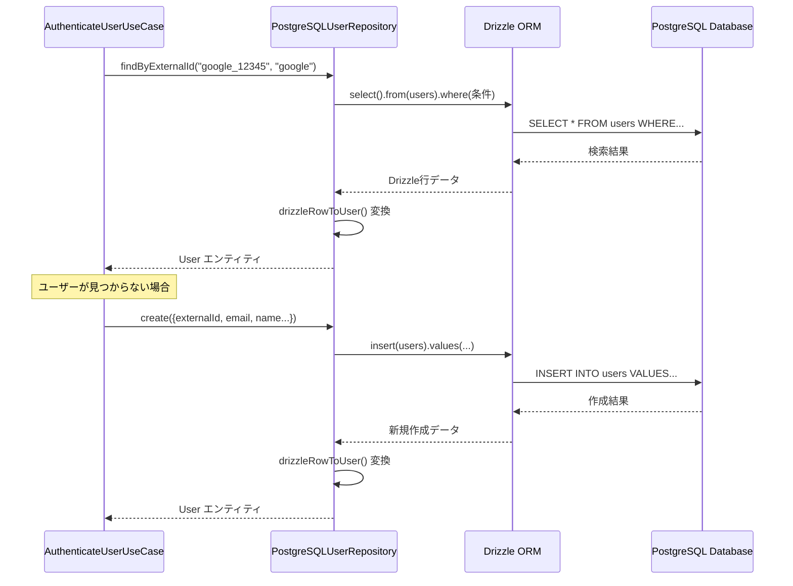
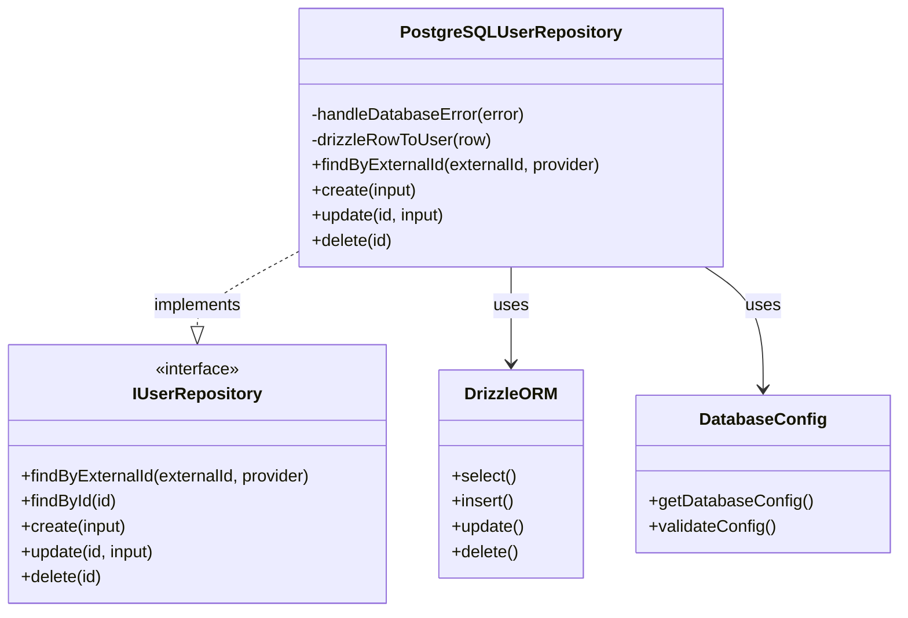

# TASK-103: PostgreSQLリポジトリ実装 コード解説

作成日: 2025-08-20

## この機能が何を解決するのか

この機能は「**PostgreSQLデータベースへのユーザー情報の保存・取得**」を解決します。

具体的には：
- Google OAuth認証で得られたユーザー情報をPostgreSQLに保存する
- 認証時にユーザー情報をデータベースから素早く検索する
- ユーザー情報の更新・削除を行う
- データベースエラーを適切にハンドリングする

これを「**リポジトリパターン**」と呼び、データベースとのやりとりを抽象化して、他の部分のコードから直接SQLを書かずに済むようにできます。

## 全体の処理の流れ

### 処理フローとファイル関係



## ファイルの役割と責任

### 今回解説するメインのファイル
**app/server/src/infrastructure/repositories/user/PostgreSQLUserRepository.ts**：ユーザー情報のデータベース操作を担当する実装クラス

- IUserRepositoryインターフェースを実装して、具体的なPostgreSQLへのアクセスを行う
- findByExternalId()、create()、update()、delete()などのCRUD操作を提供
- データベースエラーをドメインエラーに適切に変換する
- Drizzle ORMを使用してSQLを自動生成する

### 呼び出しているファイル
**app/server/src/infrastructure/database/drizzle-client.ts**：データベース接続の管理

- PostgreSQLへの接続設定を管理
- Drizzle ORMのインスタンスを作成・エクスポート
- サーバーレス環境に最適化された接続プール設定

**app/server/src/infrastructure/database/schema.ts**：データベーススキーマの定義

- Drizzle ORM形式でusersテーブルの構造を定義
- 型安全性を提供し、SQLの自動生成を可能にする
- インデックスや制約も含めて完全に定義

**app/server/src/infrastructure/config/env.ts**：環境変数の管理

- データベース接続に必要な設定を環境変数から読み込み
- Zodによる型安全な設定検証を実行

### 呼び出されているファイル
**app/server/src/domain/repositories/IUserRepository.ts**：リポジトリのインターフェース

- データベース操作の抽象化インターフェースを定義
- DDD（ドメイン駆動設計）のDomain層で定義され、Infrastructure層が実装する
- 依存性逆転の原則により、上位層が下位層の実装に依存しないようにする

## クラスと関数の呼び出し関係

### クラス構造と依存関係


**層の役割**：
- **IUserRepository**: Domain層のインターフェース
- **PostgreSQLUserRepository**: Infrastructure層の実装
- **DrizzleORM**: 外部ライブラリ
- **DatabaseConfig**: 環境設定管理

## 重要な処理の詳細解説

### 1. 外部IDによる高速検索

```typescript
// app/server/src/infrastructure/database/PostgreSQLUserRepository.ts
async findByExternalId(
  externalId: string,
  provider: AuthProvider,
): Promise<User | null> {
  try {
    const result = await db
      .select()
      .from(users)
      .where(
        and(eq(users.externalId, externalId), eq(users.provider, provider)),
      )
      .limit(1);
    
    // この処理では、GoogleのユーザーID（externalId）とプロバイダー名でユーザーを検索している
    // データベースには複合インデックスが設定されているため、高速に検索できる
    if (result.length === 0) {
      return null;
    }
    
    return this.drizzleRowToUser(result[0]);
  } catch (error) {
    this.handleDatabaseError(error);
  }
}
```

この処理が必要である理由は、JWT認証時にGoogleから取得したユーザー情報で既存ユーザーかどうかを素早く判定するためです。externalIdとproviderの組み合わせでユニーク制約が設定されており、重複チェックも兼ねています。

### 2. JITプロビジョニング用のユーザー作成

```typescript
// app/server/src/infrastructure/database/PostgreSQLUserRepository.ts
async create(input: CreateUserInput): Promise<User> {
  try {
    const result = await db
      .insert(users)
      .values({
        externalId: input.externalId,
        provider: input.provider,
        email: input.email,
        name: input.name,
        avatarUrl: input.avatarUrl || null,
      })
      .returning();
    
    // この処理では新規ユーザーをデータベースに作成し、作成されたユーザー情報を返す
    // .returning()により、作成後のデータ（IDやタイムスタンプなど）を取得できる
    return this.drizzleRowToUser(result[0]);
  } catch (error) {
    this.handleDatabaseError(error);
  }
}
```

JIT（Just-In-Time）プロビジョニングとは、初回ログイン時に自動的にユーザーアカウントを作成する仕組みです。事前にユーザー登録しなくても、Google認証に成功した時点でアプリ内のユーザーレコードが自動作成されます。

### 3. 型変換とエラーハンドリング

```typescript
// app/server/src/infrastructure/database/PostgreSQLUserRepository.ts
private drizzleRowToUser(row: DrizzleUser): User {
  return {
    id: row.id,
    externalId: row.externalId,
    provider: row.provider as AuthProvider,
    email: row.email,
    name: row.name,
    avatarUrl: row.avatarUrl,
    createdAt: row.createdAt,
    updatedAt: row.updatedAt,
    lastLoginAt: row.lastLoginAt,
  };
}

private handleDatabaseError(error: unknown): never {
  if (this.isPgDatabaseError(error)) {
    if (error.code === '23505') {
      // この部分では、PostgreSQLの一意制約違反（23505エラー）を検出している
      // ユーザーフレンドリーなメッセージに変換して再スローする
      if (error.constraint === 'unique_external_id_provider') {
        throw new Error('外部IDとプロバイダーの組み合わせが既に存在します');
      }
    }
  }
  // その他のエラー処理...
}
```

型変換が必要な理由は、Drizzle ORMが返すデータベースの行データと、アプリケーションで使用するドメインエンティティ（User）の型が微妙に異なるためです。データベースエラーの変換も、技術的なエラーコードをユーザーが理解できるメッセージに変換するために重要です。

## 初学者がつまずきやすいポイント

### 1. インターフェースと実装の分離
「なぜIUserRepositoryというインターフェースを作る必要があるの？」と思うかもしれませんが、これは**依存性逆転の原則**という設計原則に基づいています。

上位層（UseCase）は「ユーザーを保存したい」という抽象的な操作だけを知っていて、「PostgreSQLに保存する」という具体的な実装方法は知らない状態にします。これにより、将来データベースをMongoDBに変更したくなっても、インターフェースを実装した新しいクラスを作るだけで済みます。

### 2. Drizzle ORMの役割
Drizzle ORMは「TypeScriptで書いたコードを自動的にSQLに変換してくれるライブラリ」です。

```typescript
// この TypeScript コード
db.select().from(users).where(eq(users.email, 'test@example.com'))

// これに変換される SQL
SELECT * FROM users WHERE email = 'test@example.com'
```

直接SQLを書く代わりに、型安全なTypeScriptコードでデータベース操作ができるのがメリットです。

### 3. 非同期処理とエラーハンドリング
全てのデータベース操作は`async/await`で非同期処理になっています。これは、データベースへの通信は時間がかかる処理だからです。

```typescript
// ❌ 間違い: awaitを忘れると Promise オブジェクトが返される
const user = repository.findById('some-id'); // Promise<User | null>

// ✅ 正しい: awaitで実際の結果を取得
const user = await repository.findById('some-id'); // User | null
```

また、try-catchでエラーをキャッチして、適切なエラーメッセージに変換することも重要です。

## この設計のいい点

### 1. 責任の分離が明確
PostgreSQLUserRepositoryクラスは「データベースとのやりとり」だけを担当し、ビジネスロジックは一切含んでいません。これにより、コードの保守性と可読性が向上しています。

### 2. 型安全性の確保
Drizzle ORMとTypeScriptにより、コンパイル時にデータベーススキーマとコードの不整合を検出できます。例えば、存在しないカラム名を指定するとコンパイルエラーになります。

### 3. テスタビリティの向上
インターフェースを使用することで、テスト時にモックオブジェクトを簡単に作成できます。実際のデータベースを使わずに単体テストを実行できるため、テストの実行速度が向上します。

### 4. 拡張性の確保
新しいプロバイダー（Apple、GitHubなど）を追加する際も、このリポジトリの修正は最小限で済みます。テーブル設計が汎用的になっているため、容易に拡張できます。