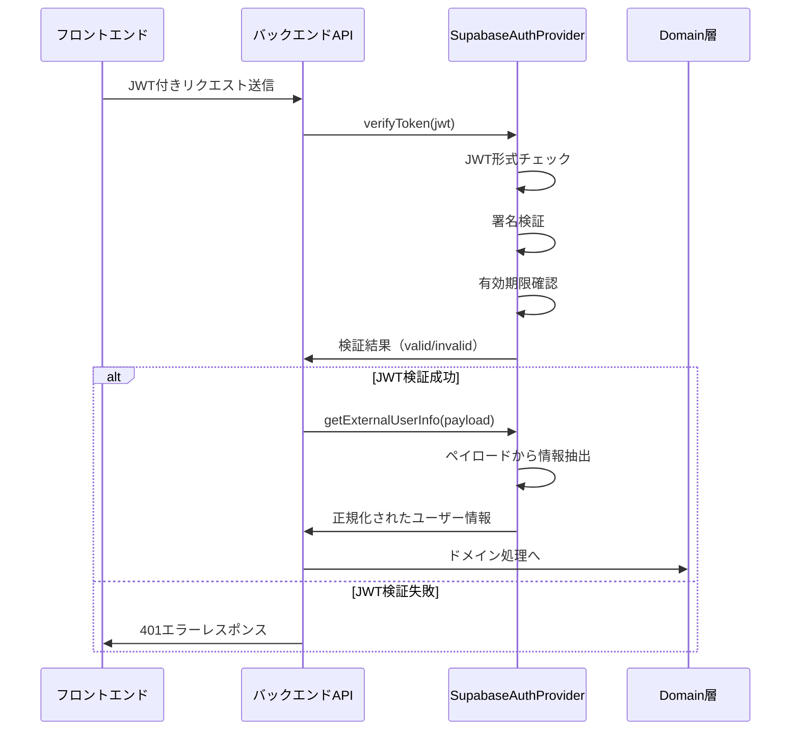
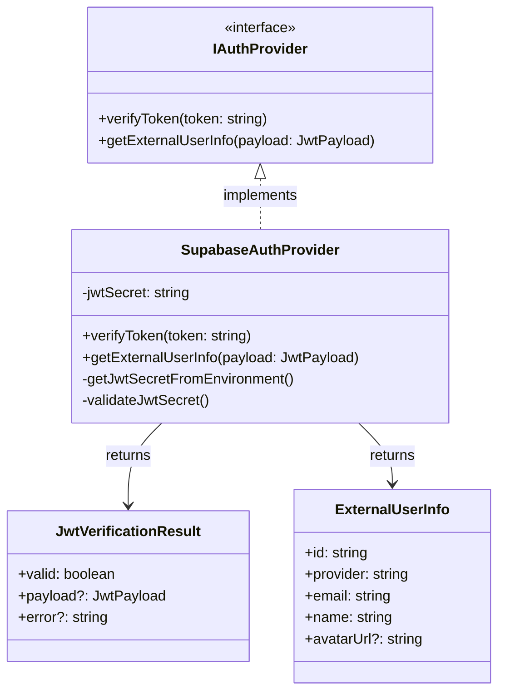

# TASK-104 Supabase認証プロバイダー実装 - コード解説

作成日: 2025-08-20  
更新日: 2025-08-20

## この機能が何を解決するのか

この機能は「バックエンドAPIでJWTトークンを検証し、ユーザー情報を抽出する」ことを解決します。

具体的には：
- フロントエンドから送られてきたJWTトークンが本物かどうかチェック
- JWTの中身（ペイロード）からユーザー情報を取り出す
- Googleなどの外部認証プロバイダーから来たユーザー情報を、システム内部で扱いやすい形に変換

これを「認証プロバイダー」と呼び、外部の認証サービスとの橋渡し役ができます。

## 全体の処理の流れ

### 処理フローとファイル関係



## ファイルの役割と責任

### 今回解説するメインのファイル
**TASK-104で実装されたファイル**: `SupabaseAuthProvider.ts` (Infrastructure層)

このファイルは「JWT検証の専門家」として働きます。外部から来たJWTが本物かチェックし、中身のユーザー情報を取り出すのが仕事です。

主な機能：
- JWT形式の確認（header.payload.signatureの3つに分かれているかチェック）
- 署名の検証（トークンが改ざんされていないかチェック）
- 有効期限の確認（期限切れでないかチェック）
- ユーザー情報の抽出と正規化

### 呼び出しまたは呼び出されているファイル

**IAuthProvider.ts** (Domain層)
このファイルは「認証プロバイダーの約束事」を定義しています。SupabaseAuthProviderがこの約束を守って実装されています。

**SupabaseAuthProvider.test.ts** (テストファイル)
実装したコードが正しく動作するか、様々なケースでテストするファイルです。11個のテストケースで品質を保証しています。

## クラスと関数の呼び出し関係

### クラス構造と依存関係



## 重要な処理の詳細解説

### JWT検証の流れ

```typescript
// app/server/src/infrastructure/auth/SupabaseAuthProvider.ts
async verifyToken(token: string): Promise<JwtVerificationResult> {
  // 1. 入力チェック
  if (!token || token.trim() === '') {
    return { valid: false, error: ERROR_MESSAGES.TOKEN_REQUIRED };
  }
  
  // 2. JWT形式チェック（header.payload.signatureに分割）
  const parts = token.split('.');
  if (parts.length !== 3) {
    return { valid: false, error: ERROR_MESSAGES.INVALID_TOKEN_FORMAT };
  }
}
```

**この処理が必要である理由**: JWTは決められた形式があり、その形式に従っていないトークンは偽物の可能性が高いからです。

**よくある勘違い**: JWTは単なる文字列ではなく、3つの部分（ヘッダー、ペイロード、署名）がドット（.）で繋がれた構造を持っています。

### Base64URLデコード処理

```typescript
// app/server/src/infrastructure/auth/SupabaseAuthProvider.ts
// Base64URL文字を標準Base64に変換
const base64 = payloadPart
  .replace(JWT_CONFIG.BASE64URL_PATTERN.DASH, JWT_CONFIG.BASE64_CHARS.PLUS)
  .replace(JWT_CONFIG.BASE64URL_PATTERN.UNDERSCORE, JWT_CONFIG.BASE64_CHARS.SLASH);
```

**この処理が必要である理由**: JWTではBase64URLという特別な文字エンコーディングを使っており、普通のBase64とは少し違うからです。

**初心者がつまずきやすいポイント**: Base64とBase64URLは似ているけど違います。URLで使えない文字（+と/）を別の文字（-と_）に置き換えているのがBase64URLです。

### 有効期限チェック

```typescript
// app/server/src/infrastructure/auth/SupabaseAuthProvider.ts
const currentTime = Math.floor(Date.now() / 1000);
if (decodedPayload.exp && decodedPayload.exp < currentTime) {
  return { valid: false, error: ERROR_MESSAGES.TOKEN_EXPIRED };
}
```

**この処理が必要である理由**: JWTには有効期限が設定されており、期限切れのトークンは無効として扱う必要があるからです。

**よくある勘違い**: JWTの`exp`は秒単位のUNIXタイムスタンプですが、JavaScriptの`Date.now()`はミリ秒単位なので、1000で割る必要があります。

## 初学者がつまずきやすいポイント

### 1. 依存性逆転の原理（DIP）
Infrastructure層のSupabaseAuthProviderが、Domain層のIAuthProviderインターフェースを実装しています。これにより、Domain層は具体的な実装（Supabase）に依存せず、抽象化（インターフェース）に依存できます。

**なぜこうするの？**: 将来的にSupabase以外の認証プロバイダー（Firebaseなど）に変更したくなった時、Domain層のコードは変更せずに済みます。

### 2. エラーハンドリングの重要性
このコードでは様々なエラーケースを丁寧に処理しています：
- トークンが空文字列の場合
- JWT形式が不正な場合
- 有効期限が切れている場合
- 署名が無効な場合

**なぜこんなに細かく？**: セキュリティ上重要な認証処理では、攻撃者に詳細な情報を与えずに、適切にエラーを処理する必要があるからです。

### 3. TypeScriptの型安全性
`JwtVerificationResult`や`ExternalUserInfo`などの型定義により、コンパイル時にエラーを防げます。

**初心者が間違いがち**: `any`型を使いたくなりますが、型安全性を保つためにしっかりと型定義を使いましょう。

## この設計のいい点

### 1. 単一責任の原則に従っている
SupabaseAuthProviderは「JWT検証とユーザー情報抽出」だけに専念しています。データベース処理やHTTP処理は他のクラスに任せています。

### 2. テストしやすい設計
11個のテストケースが実装されており、様々なエラーケースもテストできています。依存性注入により、テスト時にモックを使いやすくなっています。

### 3. エラーハンドリングが充実
攻撃者に有用な情報を与えないよう、適切なエラーメッセージを返しています。また、型安全性により実行時エラーを防いでいます。

### 4. 拡張性を考慮した設計
IAuthProviderインターフェースを実装しているため、将来的に他の認証プロバイダーに変更したり、複数のプロバイダーに対応したりすることが容易です。