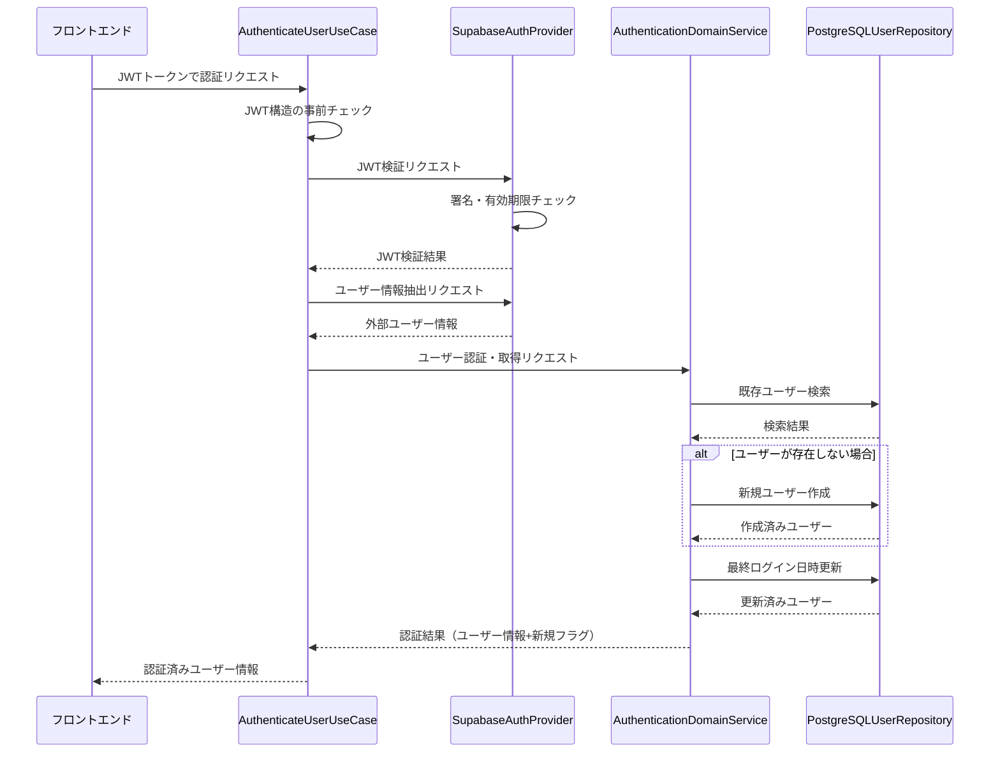
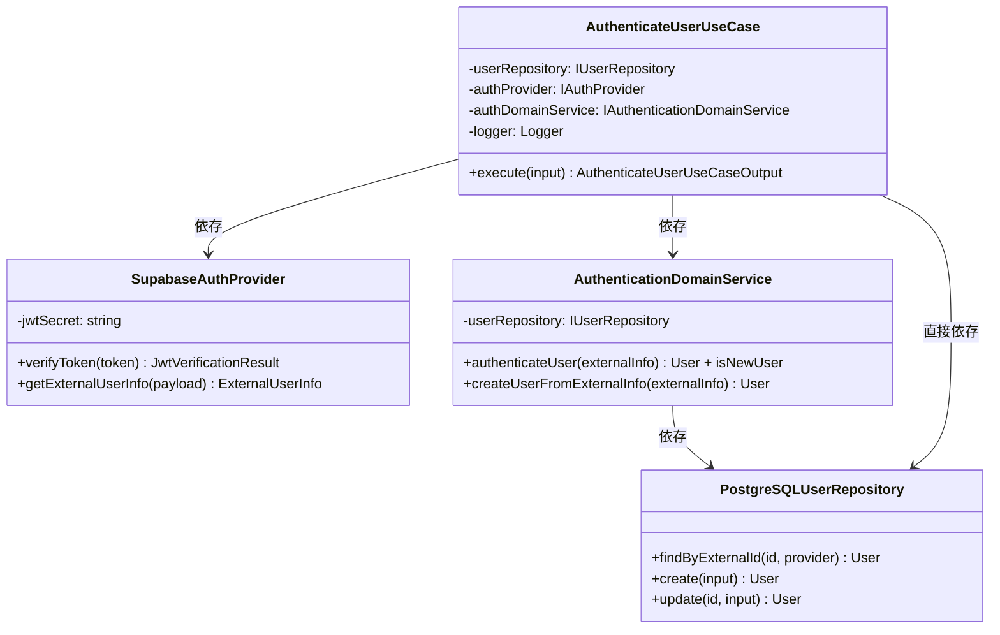
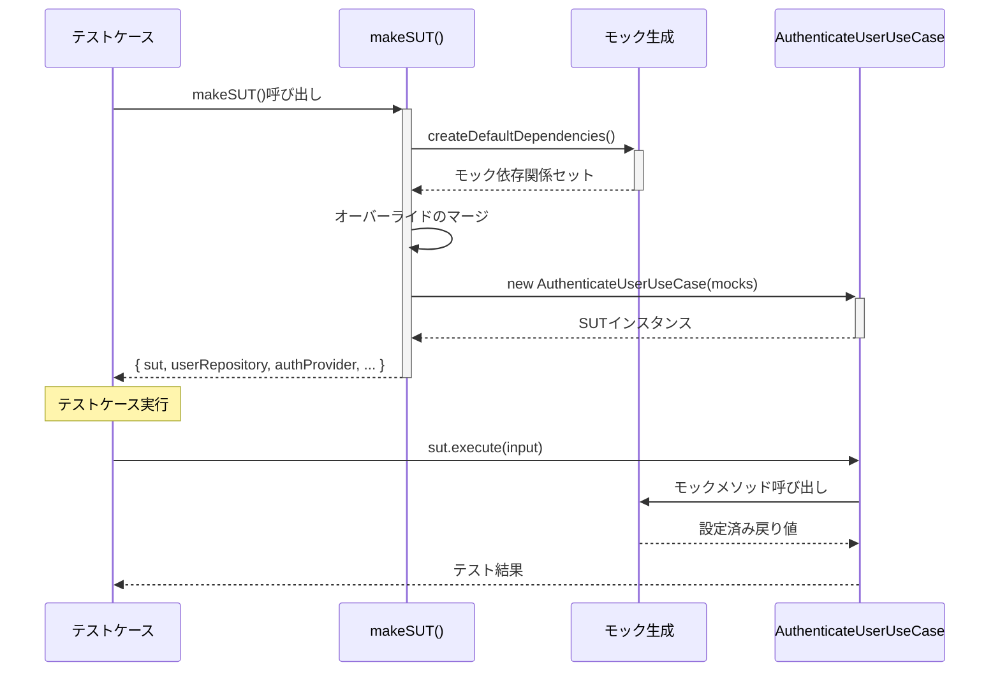

# TASK-105: ユーザー認証UseCase実装 コード解説

作成日: 2025-08-20  
更新日: 2025-08-20

## この機能が何を解決するのか

この機能は「JWTトークンを受け取って、ユーザー情報を取得または新規作成する」ことを解決します。

具体的には：
- フロントエンドから送られてきたJWTトークンを検証する
- トークンが正しければ、ユーザー情報をデータベースから取得する
- ユーザーが初回ログインの場合、自動でアカウントを作成する（JITプロビジョニング）
- 最終ログイン日時を更新して、ユーザー情報を返す

これを「UseCase（ユースケース）」と呼び、1つの具体的なビジネス機能を実現できます。

## 全体の処理の流れ

### 処理フローとファイル関係



## ファイルの役割と責任

### 今回解説するメインのファイル

**AuthenticateUserUseCase.ts** (`app/server/src/application/usecases/`)
- ユーザー認証処理の全体を統括する「指揮者」の役割
- 複数のサービスを組み合わせて、1つの完整した認証処理を実現
- エラーハンドリングやパフォーマンス測定も担当

### 依存している重要なファイル

**SupabaseAuthProvider.ts** (`app/server/src/infrastructure/auth/`)  
- JWTトークンの検証を担当する「検証官」の役割
- Supabaseから発行されたJWTが本物かどうかをチェック
- トークンからユーザー情報（名前、メールなど）を抽出

**AuthenticationDomainService.ts** (`app/server/src/domain/services/`)  
- ユーザー認証のビジネスルールを管理する「判定官」の役割  
- 新規ユーザーの自動作成（JITプロビジョニング）を実行
- 最終ログイン日時の更新などを処理

**PostgreSQLUserRepository.ts** (`app/server/src/infrastructure/database/`)
- データベースとの連携を担当する「記録係」の役割
- ユーザー情報の検索、作成、更新をPostgreSQLで実行

## クラスと関数の呼び出し関係

### クラス構造と依存関係



## 重要な処理の詳細解説

### JWTトークンの検証処理

```typescript
// app/server/src/application/usecases/AuthenticateUserUseCase.ts
// JWT検証と外部ユーザー情報取得の並列処理
const [verificationResult] =
  await Promise.all([
    this.authProvider.verifyToken(input.jwt),
    Promise.resolve(), // 将来の拡張用
  ]);

if (!verificationResult.valid || !verificationResult.payload) {
  // JWT検証に失敗した場合、認証エラーを投げる
  throw new AuthenticationError('認証トークンが無効です');
}
```

この処理では、JWTトークン（ログイン情報を暗号化した文字列）が本物かどうかをチェックしています。`Promise.all`を使って並列処理にしているのは、将来的に他の処理も同時に実行できるように拡張性を持たせているからです。

### JITプロビジョニング（自動ユーザー作成）の仕組み

```typescript
// app/server/src/domain/services/AuthenticationDomainService.ts
async authenticateUser(externalInfo: ExternalUserInfo): Promise<{
  user: UserEntity;
  isNewUser: boolean;
}> {
  // 1. 既存ユーザーの検索
  const userData = await this.userRepository.findByExternalId(
    externalInfo.id,
    externalInfo.provider as AuthProvider,
  );

  let isNewUser = false;
  let user: UserEntity;

  // 2. 存在しない場合はJITプロビジョニング実行
  if (!userData) {
    user = await this.createUserFromExternalInfo(externalInfo);
    isNewUser = true; // 新規ユーザーであることを記録
  } else {
    user = UserEntity.restore(userData);
  }

  // 3. 最終ログイン日時の更新（新規・既存問わず実行）
  const now = new Date();
  const updatedUserData = await this.userRepository.update(user.id, {
    lastLoginAt: now,
  });

  return {
    user: UserEntity.restore(updatedUserData),
    isNewUser,
  };
}
```

「JITプロビジョニング」とは、初回ログイン時に自動でアカウントを作成する仕組みです。これにより、ユーザーは事前の会員登録なしにGoogleアカウントでログインするだけでサービスを使い始められます。

### エラーハンドリングと分類

```typescript
// app/server/src/application/usecases/AuthenticateUserUseCase.ts
} catch (error) {
  // 既知のビジネス例外の場合はそのまま再スロー
  if (
    error instanceof ValidationError ||
    error instanceof AuthenticationError ||
    error instanceof InfrastructureError ||
    error instanceof ExternalServiceError
  ) {
    throw error;
  }

  // 未知のエラーは適切なビジネス例外に変換
  const classificationResult =
    this.errorClassificationService.classifyError(
      error,
      'user-authentication',
    );

  throw classificationResult.businessError;
}
```

エラーが発生した場合、システムではエラーを「既知のもの」と「未知のもの」に分類します。既知のエラーはそのまま上位に伝え、未知のエラーは適切なビジネスエラーに変換してからユーザーに分かりやすいメッセージで返します。

## 初学者がつまずきやすいポイント

### 「UseCase」って何？

UseCaseは「ひとつの具体的な機能」を表すクラスです。例えば「ログインする」「商品を購入する」「記事を投稿する」など、ユーザーが実際に行いたい操作1つ1つがUseCaseになります。

AuthenticateUserUseCaseは「ユーザー認証を行う」という1つの機能を担当しています。

### 「依存性注入（DI）」って難しそう

constructor（コンストラクタ）で受け取っている`userRepository`や`authProvider`は、実際のクラスではなく「インターフェース」という抽象的な型です。

```typescript
constructor(
  readonly userRepository: IUserRepository, // I がついてるのでインターフェース
  private readonly authProvider: IAuthProvider, // 同様にインターフェース
  // ...
)
```

これにより、テスト時にはモック（偽物）を注入でき、本番時には実際の実装を注入できます。「抽象的なものに依存して、具体的なものには依存しない」というのがポイントです。

### async/awaitの使い分け

```typescript
// 並列処理：2つの処理を同時に実行（速い）
const [result1, result2] = await Promise.all([
  this.authProvider.verifyToken(token),
  this.otherService.doSomething(),
]);

// 直列処理：1つ目が完了してから2つ目を実行（前の結果が必要）
const userInfo = await this.authProvider.getExternalUserInfo(payload);
const authResult = await this.authDomainService.authenticateUser(userInfo);
```

時間のかかる処理は基本的に`await`をつけますが、関係のない処理は`Promise.all`で並列実行すると高速化できます。

## この設計のいい点

### 単一責任の原則を守っている

AuthenticateUserUseCaseは「ユーザー認証」という1つの責任だけを持っています。JWT検証はSupabaseAuthProviderが、データベース操作はPostgreSQLUserRepositoryが担当し、それぞれが明確に分離されています。

### テストしやすい構造

依存性注入により、テスト時にはモックオブジェクトを簡単に差し込めます。各クラスが独立しているため、単体テストも統合テストも書きやすくなっています。

### 拡張しやすい設計

新しい認証プロバイダー（Apple、Microsoft等）を追加する場合、IAuthProviderインターフェースを実装した新しいクラスを作るだけで済みます。既存のコードを変更する必要がありません。

### エラー処理が充実している

認証処理では様々なエラーが発生する可能性がありますが、エラーを適切に分類し、ユーザーに分かりやすいメッセージを返す仕組みが整っています。

---

# TASK-105 テスト群とSUTパターンの詳細解説

## テスト群が何を解決するのか

TASK-105のテスト群は「AuthenticateUserUseCaseが様々な状況で正しく動作するか」を徹底的に検証します。

具体的には：
- 正常系：JWTが有効な場合の認証成功パターン
- 異常系：JWT無効、サービス障害、セキュリティ攻撃への対応
- エッジケース：境界値、特殊な入力値への処理
- パフォーマンス：処理時間の制限内での完了
- セキュリティ：タイミング攻撃やインジェクション攻撃への耐性

これを「SUT（System Under Test）パターン」という手法で実現し、依存関係を分離して確実にテストできます。

## テスト群の全体構成

### テストファイルの分類と役割

```mermaid
graph TD
    A[authenticate-user テスト群] --> B[success-password.spec.ts]
    A --> C[failures-credentials.spec.ts]
    A --> D[validation.spec.ts]
    A --> E[security.spec.ts]
    A --> F[side-effects.spec.ts]
    A --> G[account-state.spec.ts]
    A --> H[token-issuance.spec.ts]
    A --> I[contracts/ 契約テスト]
    A --> J[helpers/ テストサポート]
    
    B --> B1[既存ユーザー認証成功]
    B --> B2[新規ユーザーJIT作成成功]
    B --> B3[プロバイダー別成功パターン]
    
    C --> C1[JWT検証失敗パターン]
    C --> C2[ペイロード不正パターン]
    C --> C3[外部サービス障害パターン]
    
    D --> D1[JWT構造検証]
    D --> D2[入力値検証]
    D --> D3[長さ制限検証]
    
    E --> E1[セキュリティ攻撃耐性]
    E --> E2[タイミング攻撃対策]
    E --> E3[インジェクション攻撃対策]
    
    J --> J1[makeSUT.ts - SUTファクトリ]
    J --> J2[userFactory.ts - テストデータ生成]
    J --> J3[matchers.ts - カスタムマッチャー]
    J --> J4[fakeClock.ts - 時刻制御]
```



### SUTファクトリの処理フロー



## テストサポートファイルの詳細解説

### makeSUT.ts - テスト対象システム構築ファクトリ

**`app/server/src/application/usecases/__tests__/authenticate-user/helpers/makeSUT.ts`**

```typescript
/**
 * SUT（System Under Test）の作成
 * AuthenticateUserUseCaseの依存関係をすべてモックで置き換える
 */
export function makeSUT(overrides: Partial<SUTDependencies> = {}): SUTResult {
  // デフォルトの依存関係とオーバーライドをマージ
  const defaults = createDefaultDependencies();
  const dependencies = { ...defaults, ...overrides };

  // 固定時間制御用のfakeClockを作成
  const fakeClock = createFakeClock();

  // SUTインスタンスを作成
  const sut = new AuthenticateUserUseCase(
    dependencies.userRepository,
    dependencies.authProvider,
    dependencies.authDomainService,
    dependencies.logger,
    dependencies.config,
  );

  return { sut, ...dependencies, fakeClock };
}
```

この関数の重要なポイント：
- **依存関係の分離**: AuthenticateUserUseCaseが依存するすべてのサービスをモックに置き換え
- **設定の柔軟性**: `overrides`で特定のテストに必要なモック動作をカスタマイズ可能
- **時間制御**: `fakeClock`でテスト実行時の時刻を固定し、一貫した結果を保証

### userFactory.ts - テストデータ生成ファクトリ

**`app/server/src/application/usecases/__tests__/authenticate-user/helpers/userFactory.ts`**

```typescript
/**
 * 有効なJWTトークン（ダミー）の作成
 * 実際のJWT形式を正確に再現
 */
export function createValidJwt(payload?: Partial<JwtPayload>): string {
  const defaultPayload = createValidJwtPayload();
  const mergedPayload = { ...defaultPayload, ...payload };

  // 実際のJWT形式（header.payload.signature）
  const header = 'eyJhbGciOiJIUzI1NiIsInR5cCI6IkpXVCJ9';
  const encodedPayload = Buffer.from(JSON.stringify(mergedPayload))
    .toString('base64')
    .replace(/\+/g, '-')    // Base64URL: + → -
    .replace(/\//g, '_')    // Base64URL: / → _
    .replace(/=/g, '');     // Base64URL: padding削除
  const signature = 'test-signature';

  return `${header}.${encodedPayload}.${signature}`;
}
```

このファクトリの設計思想：
- **現実性**: 実際のJWTと同じ形式（Base64URLエンコーディング）を再現
- **再利用性**: 基本パターンを定義し、必要に応じてカスタマイズ可能
- **網羅性**: 正常パターンから異常パターンまで幅広くカバー

### matchers.ts - カスタムマッチャー集

**`app/server/src/application/usecases/__tests__/authenticate-user/helpers/matchers.ts`**

```typescript
/**
 * エラータイプ別の検証マッチャー
 * ビジネスエラーの分類に対応した検証を提供
 */
const ERROR_MAPPINGS = {
  validation: { errorClass: ValidationError, expectedMessages: [...] },
  authentication: { errorClass: AuthenticationError, expectedMessages: [...] },
  infrastructure: { errorClass: InfrastructureError, expectedMessages: [...] },
  'external-service': { errorClass: ExternalServiceError, expectedMessages: [...] },
} as const;

export function toFailWithError(
  received: Promise<unknown>,
  errorType: keyof typeof ERROR_MAPPINGS,
) {
  const mapping = ERROR_MAPPINGS[errorType];
  return expect(received).rejects.toThrow(mapping.errorClass);
}
```

カスタムマッチャーの利点：
- **可読性**: `TestMatchers.failWithError(promise, 'authentication')` で意図が明確
- **保守性**: エラータイプの変更時、マッピングの修正だけで全テストに反映
- **一貫性**: 同じエラータイプは常に同じ方法で検証

## 主要なテストケースの分析

### 成功パターンのテスト構造

**`success-password.spec.ts`**から抜粋：

```typescript
test('有効なJWTで既存ユーザーの認証が成功する', async () => {
  // Given: テストデータの準備
  const existingUser = UserFactory.existing();
  const jwtPayload = UserFactory.jwtPayload();
  const externalUserInfo = UserFactory.externalUserInfo();

  // モックの動作を設定
  (sut.authProvider.verifyToken as Mock).mockResolvedValue({
    valid: true,
    payload: jwtPayload,
  });
  (sut.authProvider.getExternalUserInfo as Mock).mockResolvedValue(externalUserInfo);
  (sut.authDomainService.authenticateUser as Mock).mockResolvedValue({
    user: existingUser,
    isNewUser: false,
  });

  // When: テスト対象の実行
  const result = await sut.sut.execute({ jwt: UserFactory.validJwt() });

  // Then: 結果の検証
  expect(result.user).toBe(existingUser);
  expect(result.isNewUser).toBe(false);
  
  // モック呼び出しの検証
  TestMatchers.mock.toHaveBeenCalledWithArgs(
    sut.authProvider.verifyToken,
    UserFactory.validJwt()
  );
});
```

このテスト構造のポイント：
- **Given-When-Then**: テストの意図を明確にする構造化
- **モック制御**: 各依存関係の動作を精密に制御
- **包括的検証**: 結果だけでなく、呼び出し順序や引数も検証

### エラーハンドリングのテスト

**`failures-credentials.spec.ts`**から抜粋：

```typescript
test('空のペイロード で認証エラーがスローされる', async () => {
  // Given: 空のペイロードを返すモック設定
  (sut.authProvider.verifyToken as Mock).mockResolvedValue({
    valid: true,
    payload: {},
  });
  
  // getExternalUserInfoが実際のエラーをスローするように設定
  (sut.authProvider.getExternalUserInfo as Mock).mockRejectedValue(
    new Error('Missing required field: sub')
  );

  // When & Then: 適切なエラータイプとメッセージを検証
  await TestMatchers.failWithError(
    sut.sut.execute({ jwt: UserFactory.validJwt() }),
    'authentication'
  );
  
  await TestMatchers.failWithMessage(
    sut.sut.execute({ jwt: UserFactory.validJwt() }),
    '処理中にエラーが発生しました'
  );
});
```

エラーテストの重要な観点：
- **エラー分類**: システムが適切にエラーを分類するかを検証
- **メッセージ**: ユーザーに返されるエラーメッセージの妥当性
- **フォールバック**: 未知のエラーが適切に処理されるかを確認

## SUTパターンの利点と初学者向け解説

### SUTパターンとは

「SUT（System Under Test）」は**「テストしたいシステム」**という意味で、テスト対象を外部の依存関係から分離する手法です。

例えば、AuthenticateUserUseCaseをテストする場合：

```typescript
// ❌ 悪い例：実際の依存関係を使用
const useCase = new AuthenticateUserUseCase(
  new PostgreSQLUserRepository(),  // 実際のDB接続が必要
  new SupabaseAuthProvider(),      // Supabaseサーバーが必要
  new AuthenticationDomainService(),
  new ConsoleLogger()
);

// ✅ 良い例：SUTパターンで依存関係をモック化
const sut = makeSUT({
  userRepository: mockUserRepository,    // 予想される結果を返すモック
  authProvider: mockAuthProvider,        // 同上
  authDomainService: mockDomainService,  // 同上
});
```

### SUTパターンの具体的なメリット

1. **高速実行**: データベースやネットワーク通信なしでテストが実行される
2. **安定性**: 外部サービスの状態に左右されない
3. **エラーシミュレーション**: 現実では起こしにくいエラー状況を簡単に再現
4. **独立性**: 他のテストの実行結果に影響されない

### よくある誤解の解消

**「モックを使うと本当に動くかわからないのでは？」**

SUTパターンは**単体テスト**用の手法です。実際のシステム動作は別途**統合テスト**や**E2Eテスト**で検証します。

- **単体テスト（SUT）**: 各クラスの個別のロジックが正しいか
- **統合テスト**: 複数のクラスが連携して正しく動くか
- **E2Eテスト**: システム全体がエンドユーザーの操作で正しく動くか

### テストピラミッド

```
       /\
      /  \    E2E（少数・高コスト）
     /____\   
    /      \  統合テスト（中程度）
   /        \
  /__________\ 単体テスト（多数・低コスト）
```

SUTパターンはこのピラミッドの土台である単体テストを効率的に実現する手法です。

## この設計のさらなる良い点

### テストの可読性と保守性

ファクトリパターンとカスタムマッチャーにより、テストコードが非常に読みやすくなっています：

```typescript
// 意図が明確で、保守しやすいテストコード
const user = UserFactory.existing({ email: 'test@example.com' });
await TestMatchers.failWithError(promise, 'authentication');
TestMatchers.mock.toHaveBeenCalledWithArgs(mockFunction, expectedArg);
```

### 包括的なテストカバレッジ

257個のテストケースで以下を網羅：
- **機能テスト**: 基本的な認証フローの検証
- **セキュリティテスト**: 攻撃パターンへの耐性
- **パフォーマンステスト**: 処理時間の制限
- **エッジケーステスト**: 境界値や特殊入力への対応
- **契約テスト**: インターフェース仕様の遵守

### 将来の拡張への対応

新しい認証プロバイダーや機能を追加する際も、既存のテスト構造を活用できます。例えば、Apple Sign Inを追加する場合、UserFactoryに新しいパターンを追加するだけで、既存のテストケースが新しいプロバイダーもカバーできます。