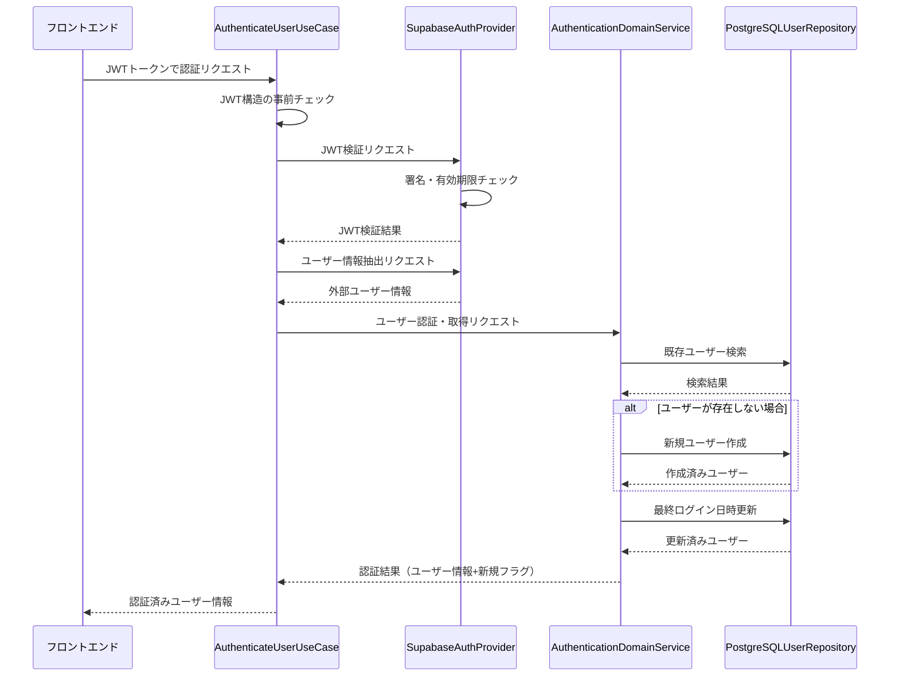
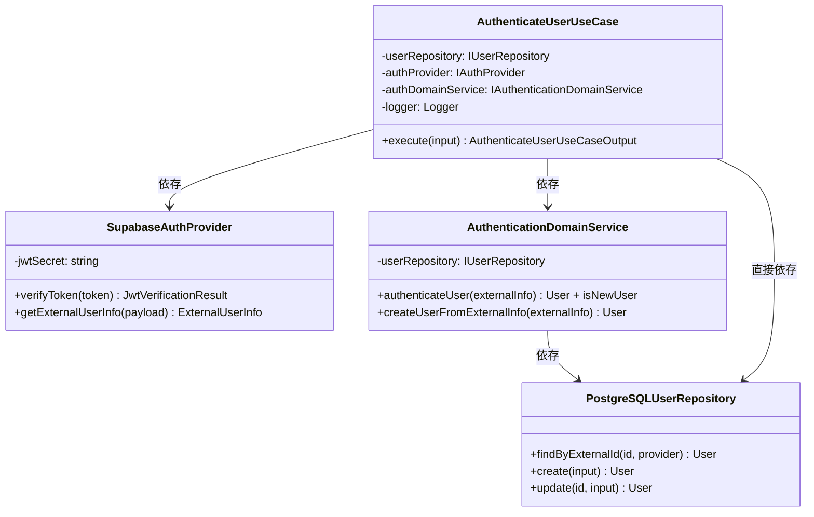

# TASK-105: ユーザー認証UseCase実装 コード解説

作成日: 2025-08-20  
更新日: 2025-08-20

## この機能が何を解決するのか

この機能は「JWTトークンを受け取って、ユーザー情報を取得または新規作成する」ことを解決します。

具体的には：
- フロントエンドから送られてきたJWTトークンを検証する
- トークンが正しければ、ユーザー情報をデータベースから取得する
- ユーザーが初回ログインの場合、自動でアカウントを作成する（JITプロビジョニング）
- 最終ログイン日時を更新して、ユーザー情報を返す

これを「UseCase（ユースケース）」と呼び、1つの具体的なビジネス機能を実現できます。

## 全体の処理の流れ

### 処理フローとファイル関係



## ファイルの役割と責任

### 今回解説するメインのファイル

**AuthenticateUserUseCase.ts** (`app/server/src/application/usecases/`)
- ユーザー認証処理の全体を統括する「指揮者」の役割
- 複数のサービスを組み合わせて、1つの完整した認証処理を実現
- エラーハンドリングやパフォーマンス測定も担当

### 依存している重要なファイル

**SupabaseAuthProvider.ts** (`app/server/src/infrastructure/auth/`)  
- JWTトークンの検証を担当する「検証官」の役割
- Supabaseから発行されたJWTが本物かどうかをチェック
- トークンからユーザー情報（名前、メールなど）を抽出

**AuthenticationDomainService.ts** (`app/server/src/domain/services/`)  
- ユーザー認証のビジネスルールを管理する「判定官」の役割  
- 新規ユーザーの自動作成（JITプロビジョニング）を実行
- 最終ログイン日時の更新などを処理

**PostgreSQLUserRepository.ts** (`app/server/src/infrastructure/database/`)
- データベースとの連携を担当する「記録係」の役割
- ユーザー情報の検索、作成、更新をPostgreSQLで実行

## クラスと関数の呼び出し関係

### クラス構造と依存関係



## 重要な処理の詳細解説

### JWTトークンの検証処理

```typescript
// app/server/src/application/usecases/AuthenticateUserUseCase.ts
// JWT検証と外部ユーザー情報取得の並列処理
const [verificationResult] =
  await Promise.all([
    this.authProvider.verifyToken(input.jwt),
    Promise.resolve(), // 将来の拡張用
  ]);

if (!verificationResult.valid || !verificationResult.payload) {
  // JWT検証に失敗した場合、認証エラーを投げる
  throw new AuthenticationError('認証トークンが無効です');
}
```

この処理では、JWTトークン（ログイン情報を暗号化した文字列）が本物かどうかをチェックしています。`Promise.all`を使って並列処理にしているのは、将来的に他の処理も同時に実行できるように拡張性を持たせているからです。

### JITプロビジョニング（自動ユーザー作成）の仕組み

```typescript
// app/server/src/domain/services/AuthenticationDomainService.ts
async authenticateUser(externalInfo: ExternalUserInfo): Promise<{
  user: UserEntity;
  isNewUser: boolean;
}> {
  // 1. 既存ユーザーの検索
  const userData = await this.userRepository.findByExternalId(
    externalInfo.id,
    externalInfo.provider as AuthProvider,
  );

  let isNewUser = false;
  let user: UserEntity;

  // 2. 存在しない場合はJITプロビジョニング実行
  if (!userData) {
    user = await this.createUserFromExternalInfo(externalInfo);
    isNewUser = true; // 新規ユーザーであることを記録
  } else {
    user = UserEntity.restore(userData);
  }

  // 3. 最終ログイン日時の更新（新規・既存問わず実行）
  const now = new Date();
  const updatedUserData = await this.userRepository.update(user.id, {
    lastLoginAt: now,
  });

  return {
    user: UserEntity.restore(updatedUserData),
    isNewUser,
  };
}
```

「JITプロビジョニング」とは、初回ログイン時に自動でアカウントを作成する仕組みです。これにより、ユーザーは事前の会員登録なしにGoogleアカウントでログインするだけでサービスを使い始められます。

### エラーハンドリングと分類

```typescript
// app/server/src/application/usecases/AuthenticateUserUseCase.ts
} catch (error) {
  // 既知のビジネス例外の場合はそのまま再スロー
  if (
    error instanceof ValidationError ||
    error instanceof AuthenticationError ||
    error instanceof InfrastructureError ||
    error instanceof ExternalServiceError
  ) {
    throw error;
  }

  // 未知のエラーは適切なビジネス例外に変換
  const classificationResult =
    this.errorClassificationService.classifyError(
      error,
      'user-authentication',
    );

  throw classificationResult.businessError;
}
```

エラーが発生した場合、システムではエラーを「既知のもの」と「未知のもの」に分類します。既知のエラーはそのまま上位に伝え、未知のエラーは適切なビジネスエラーに変換してからユーザーに分かりやすいメッセージで返します。

## 初学者がつまずきやすいポイント

### 「UseCase」って何？

UseCaseは「ひとつの具体的な機能」を表すクラスです。例えば「ログインする」「商品を購入する」「記事を投稿する」など、ユーザーが実際に行いたい操作1つ1つがUseCaseになります。

AuthenticateUserUseCaseは「ユーザー認証を行う」という1つの機能を担当しています。

### 「依存性注入（DI）」って難しそう

constructor（コンストラクタ）で受け取っている`userRepository`や`authProvider`は、実際のクラスではなく「インターフェース」という抽象的な型です。

```typescript
constructor(
  readonly userRepository: IUserRepository, // I がついてるのでインターフェース
  private readonly authProvider: IAuthProvider, // 同様にインターフェース
  // ...
)
```

これにより、テスト時にはモック（偽物）を注入でき、本番時には実際の実装を注入できます。「抽象的なものに依存して、具体的なものには依存しない」というのがポイントです。

### async/awaitの使い分け

```typescript
// 並列処理：2つの処理を同時に実行（速い）
const [result1, result2] = await Promise.all([
  this.authProvider.verifyToken(token),
  this.otherService.doSomething(),
]);

// 直列処理：1つ目が完了してから2つ目を実行（前の結果が必要）
const userInfo = await this.authProvider.getExternalUserInfo(payload);
const authResult = await this.authDomainService.authenticateUser(userInfo);
```

時間のかかる処理は基本的に`await`をつけますが、関係のない処理は`Promise.all`で並列実行すると高速化できます。

## この設計のいい点

### 単一責任の原則を守っている

AuthenticateUserUseCaseは「ユーザー認証」という1つの責任だけを持っています。JWT検証はSupabaseAuthProviderが、データベース操作はPostgreSQLUserRepositoryが担当し、それぞれが明確に分離されています。

### テストしやすい構造

依存性注入により、テスト時にはモックオブジェクトを簡単に差し込めます。各クラスが独立しているため、単体テストも統合テストも書きやすくなっています。

### 拡張しやすい設計

新しい認証プロバイダー（Apple、Microsoft等）を追加する場合、IAuthProviderインターフェースを実装した新しいクラスを作るだけで済みます。既存のコードを変更する必要がありません。

### エラー処理が充実している

認証処理では様々なエラーが発生する可能性がありますが、エラーを適切に分類し、ユーザーに分かりやすいメッセージを返す仕組みが整っています。