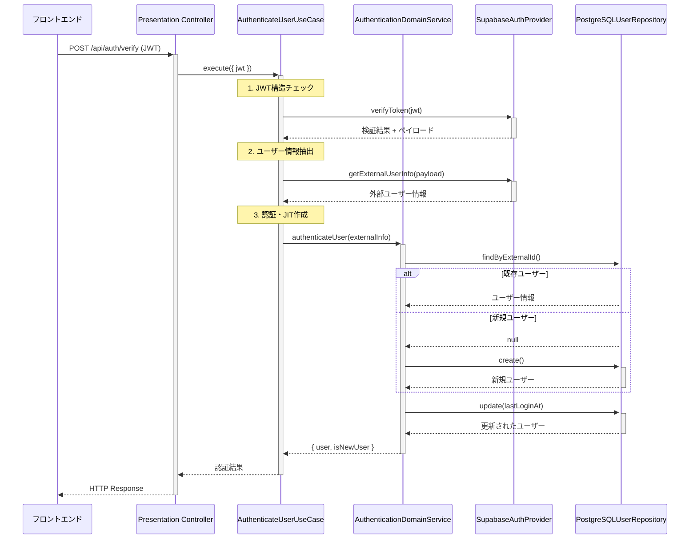
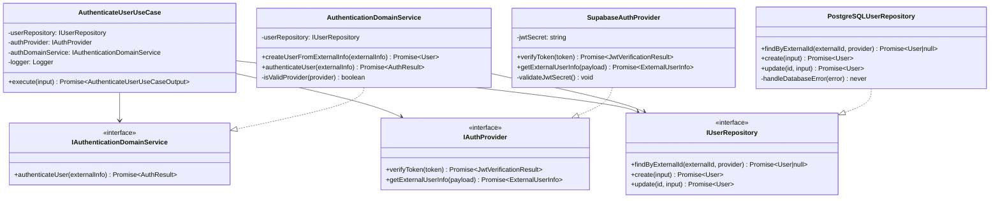

# TASK-105 ユーザー認証UseCase実装 - コード解説

作成日: 2025-08-19
対象読者: オンボーディングしたばかりの初学者エンジニア

## 1. この機能が何を解決するのか

Google認証のJWT（JSON Web Token）を受け取って、「このユーザーは本物だ」と確認し、システム内でユーザー情報を管理する機能です。

例えるなら、映画館で「Googleアカウントの身分証明書（JWT）」を見せてもらい、初回の場合は「会員カードを作成」し、2回目以降なら「会員カードを確認」して入場させる受付係のような役割です。

## 2. システム全体での位置づけ

この機能は **Application層（UseCase）** に位置し、以下の層から構成される認証システムの中心部分です：

- **フロントエンド**: Google認証でJWTを取得
- **Presentation層**: HTTPリクエストを受けてこのUseCaseを呼び出し
- **Application層**: **← 今回のTASK-105（この解説の対象）**
- **Domain層**: ビジネスルールとユーザー情報の管理
- **Infrastructure層**: データベースへの実際の保存・JWT検証

## 3. 認証フローの全体像



## 4. 各ファイルの役割と責務

### 4.1 AuthenticateUserUseCase.ts (メインファイル)

**役割**: 認証処理全体のオーケストレーター（指揮者）

**主な責務**:
- JWTの事前検証（形式チェック）
- 各層のサービスを適切な順序で呼び出し
- エラーハンドリングとログ出力
- パフォーマンス測定（1秒以内のチェック）

**なぜこのファイルが必要か**: 複数の層にまたがる複雑な処理を整理し、ビジネスフローを分かりやすくするため。

### 4.2 IAuthenticateUserUseCase.ts (インターフェース)

**役割**: UseCaseの契約書

**入力と出力**:
```typescript
// 入力: JWTトークン文字列
input: { jwt: "eyJhbGciOiJIUzI1NiI..." }

// 出力: ユーザー情報と新規フラグ
output: {
  user: { id, email, name, ... },
  isNewUser: true // 初回認証の場合
}
```

**なぜインターフェースが必要か**: テストやモックを作りやすくし、実装の詳細を隠すため。

### 4.3 AuthenticationDomainService.ts (ドメインサービス)

**役割**: 認証に関するビジネスルールの管理者

**主な処理**:
1. プロバイダー（Google等）が有効かチェック
2. 既存ユーザーの検索
3. 新規ユーザーの場合はJIT（Just-In-Time）作成
4. ログイン日時の更新

**なぜドメインサービスが必要か**: 「ユーザー作成の判断」「ログイン記録の更新」など、単一のエンティティでは表現できない複雑なビジネスルールを管理するため。

### 4.4 SupabaseAuthProvider.ts (認証プロバイダー)

**役割**: JWT検証の専門家

**主な処理**:
1. JWT形式チェック（header.payload.signature）
2. Base64URLデコード
3. 有効期限チェック
4. Googleから送られてきたユーザー情報の抽出

**初学者が陥りがちな誤解**: JWTは「ただの文字列」ではなく、「暗号化された情報パッケージ」です。正しく解析しないとセキュリティ問題が発生します。

### 4.5 PostgreSQLUserRepository.ts (データリポジトリ)

**役割**: データベースへの読み書き担当

**主な処理**:
- ユーザーの検索（外部ID、ユーザーID、メールアドレス）
- 新規ユーザー作成
- ユーザー情報更新
- エラーハンドリング（一意制約違反等）

**初学者が陥りがちなミス**: データベースエラーをそのまま外に出すのではなく、分かりやすいエラーメッセージに変換する必要があります。

## 5. クラス・メソッドの呼び出し関係



## 6. 処理の流れを追ってみよう

### 6.1 既存ユーザーの認証（2回目以降のログイン）

1. **JWT受け取り**: `execute({ jwt: "eyJ..." })`
2. **構造チェック**: JWT が `header.payload.signature` 形式か確認
3. **JWT検証**: SupabaseAuthProvider がトークンの正当性を確認
4. **ユーザー情報抽出**: JWT から Google の user_metadata を取得
5. **既存ユーザー検索**: PostgreSQL で `external_id` + `provider` で検索 → **見つかる**
6. **ログイン記録更新**: `lastLoginAt` を現在時刻に更新
7. **結果返却**: `{ user: {...}, isNewUser: false }`

### 6.2 新規ユーザーの認証（初回ログイン・JIT作成）

1. **JWT受け取り**: `execute({ jwt: "eyJ..." })`
2. **構造チェック**: JWT が `header.payload.signature` 形式か確認
3. **JWT検証**: SupabaseAuthProvider がトークンの正当性を確認
4. **ユーザー情報抽出**: JWT から Google の user_metadata を取得
5. **既存ユーザー検索**: PostgreSQL で `external_id` + `provider` で検索 → **見つからない（null）**
6. **JIT作成**: 新規ユーザーをデータベースに作成
7. **ログイン記録更新**: `lastLoginAt` を現在時刻に更新
8. **結果返却**: `{ user: {...}, isNewUser: true }`

## 7. 重要な設計パターンとその理由

### 7.1 依存性注入（Dependency Injection）

```typescript
constructor(
  readonly userRepository: IUserRepository,        // ← インターフェースに依存
  private readonly authProvider: IAuthProvider,    // ← インターフェースに依存
  private readonly authDomainService: IAuthenticationDomainService, // ← インターフェースに依存
  private readonly logger: Logger,
) {
  // ...
}
```

**なぜこうするのか**: 具体的な実装（PostgreSQL、Supabase等）に依存せず、インターフェースに依存することで、将来的にデータベースや認証プロバイダーを変更しやすくなります。

**初学者への説明**: レストランのシェフが「特定のブランドの調味料」ではなく「調味料という概念」を使って料理するようなイメージです。

### 7.2 エラー分類とハンドリング

```typescript
try {
  // 処理実行
} catch (error) {
  // 既知のビジネス例外はそのまま再スロー
  if (
    error instanceof ValidationError ||
    error instanceof AuthenticationError ||
    // ...
  ) {
    throw error;
  }
  
  // 未知のエラーは分類してビジネス例外に変換
  const classificationResult = this.errorClassificationService.classifyError(error);
  throw classificationResult.businessError;
}
```

**なぜこうするのか**: データベース接続エラー等の技術的なエラーを、ユーザーに分かりやすいエラーメッセージに変換するためです。

### 7.3 パフォーマンス監視

```typescript
const startTime = Date.now();
// ... 処理実行 ...
const executionTime = Date.now() - startTime;

if (executionTime > timeLimit) {
  this.logger.warn('Performance requirement not met', {
    executionTime,
    timeLimit,
    isNewUser: authResult.isNewUser,
  });
}
```

**なぜこうするのか**: 要件で「認証は1秒以内、JIT作成は2秒以内」と決められているため、これを守れているかチェックします。

## 8. テストケースから学ぶ重要なポイント

### 8.1 正常ケース

- 有効なJWTで既存ユーザー認証 → `isNewUser: false`
- 有効なJWTで新規ユーザー作成 → `isNewUser: true`
- 両方とも `lastLoginAt` が適切に更新される

### 8.2 異常ケース

- 無効なJWT → `AuthenticationError`
- データベース障害 → `InfrastructureError`
- JWT形式不正 → `ValidationError`

**初学者が陥りがちなミス**: 異常ケースを考えずに正常ケースだけでコードを書いてしまうこと。実際のシステムでは異常ケースの方が重要です。

## 9. この実装から学べるベストプラクティス

### 9.1 SOLID原則の適用

- **単一責任**: 各クラスが1つの責務のみを持つ
- **開放閉鎖**: 新しい認証プロバイダー追加時も既存コード変更不要
- **リスコフ置換**: インターフェース実装で代替可能
- **インターフェース分離**: 必要な機能のみを公開
- **依存性逆転**: 具体実装ではなくインターフェースに依存

### 9.2 ログ出力の重要性

```typescript
this.logger.info('User authentication successful', {
  userId: authResult.user.id,
  externalId: authResult.user.externalId,
  isNewUser: authResult.isNewUser,
  executionTime,
  provider: authResult.user.provider,
});
```

**なぜ重要か**: 本番環境で問題が発生した際の調査に必要不可欠です。ただし、JWTなどの機密情報は `[REDACTED]` で隠しています。

### 9.3 設定値の外部化

```typescript
const DEFAULT_CONFIG: AuthenticationConfig = {
  JWT_MAX_LENGTH: 2048,
  EXISTING_USER_TIME_LIMIT_MS: 1000,
  NEW_USER_TIME_LIMIT_MS: 2000,
};
```

**なぜこうするのか**: 本番環境と開発環境で設定を変えたり、要件変更に柔軟に対応できるようにするためです。

## 10. 他の人に説明するときのポイント

### 10.1 全体像から詳細へ

1. まず「Google認証の受付係」という全体像を説明
2. 次に各ファイルの役割を説明
3. 最後に具体的な処理の流れを説明

### 10.2 専門用語の説明

- **JWT**: 「暗号化されたユーザー情報パッケージ」
- **JIT作成**: 「初回ログイン時の自動会員登録」
- **依存性注入**: 「部品を外から渡す設計パターン」
- **ドメインサービス**: 「ビジネスルールの管理者」

### 10.3 設計の「なぜ」を説明

- なぜこの層構成にしたのか
- なぜインターフェースを使うのか
- なぜエラーハンドリングが重要なのか
- なぜテストが必要なのか

## 11. まとめ

TASK-105のAuthenticateUserUseCaseは、Google認証システムの心臓部分です。複数の層を協調させてJWT検証からユーザー管理までを一貫して処理し、セキュリティ・パフォーマンス・保守性のすべてを考慮した実装になっています。

このコードを読み解くことで、DDD（ドメイン駆動設計）とクリーンアーキテクチャの実践的な適用方法、エラーハンドリング、ログ出力、テスタビリティなど、プロダクション品質のコードに必要な要素を学ぶことができます。

初学者の方は、まず全体の流れを理解してから、各ファイルの詳細に入っていくことをお勧めします。そして、「なぜこうなっているのか」という設計思想を考えながら読むことで、より深い理解が得られるでしょう。