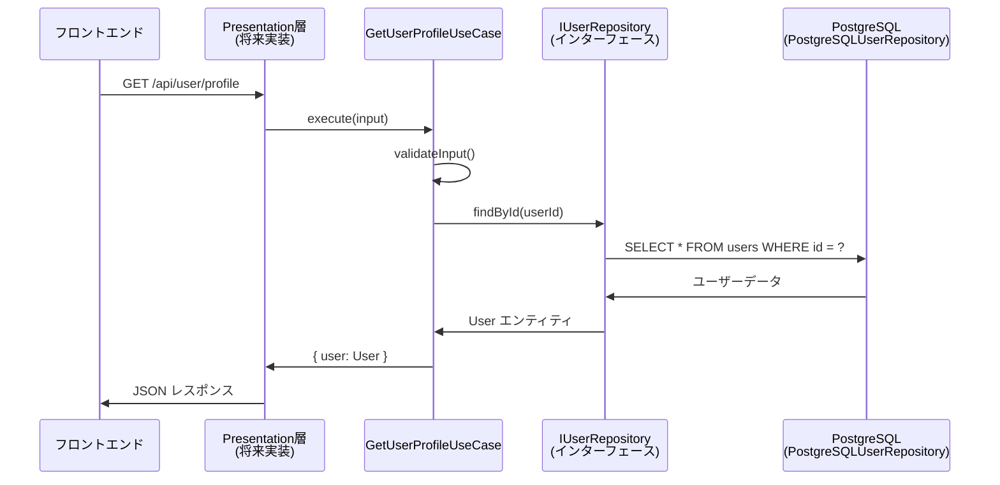
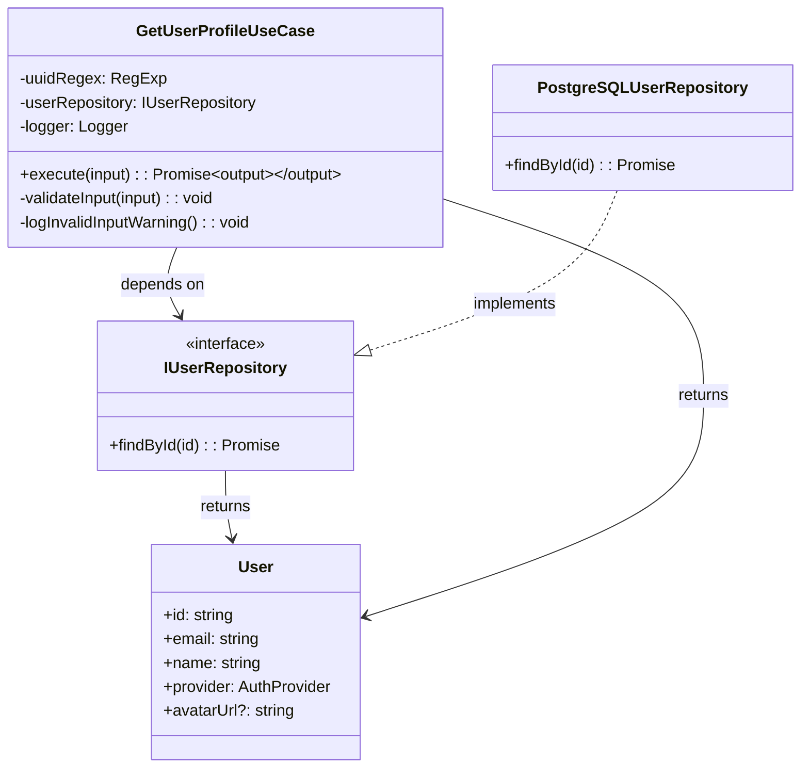

# TASK-106: ユーザープロフィール取得UseCase実装 - コード解説

## この機能が何を解決するのか

この機能は「認証済みユーザーが自分のプロフィール情報を安全に取得する」ことを解決します。

具体的には：
- 認証済みユーザーがAPIエンドポイント（`GET /api/user/profile`）から自分のプロフィール情報を取得する
- ユーザーIDによる安全なユーザー検索処理を実行する
- システムエラーや存在しないユーザーに対する適切なエラーハンドリングを提供する

これを「UseCase（ユースケース）」と呼び、ビジネスロジックをアプリケーション層に実装することでドメインとプレゼンテーション層の関心事を分離できます。

## 全体の処理の流れ

### 処理フローとファイル関係



## ファイルの役割と責任

### 今回解説するメインのファイル
**`GetUserProfileUseCase.ts`** (`app/server/src/application/usecases/`)
- **役割**: ユーザープロフィール取得のビジネスロジックを担当するアプリケーション層のクラス
- **実装された機能**:
  - `validateInput()`: 入力パラメータ（ユーザーID）の厳密な検証処理
  - `execute()`: メインの処理フロー実行（検証→DB検索→エラーハンドリング→結果返却）
  - エラー分類と適切な例外スローイング
  - 構造化ログ出力による運用サポート

### 依存している（呼び出している）ファイル

**`IUserRepository.ts`** (`app/server/src/domain/repositories/`)
- **役割**: ユーザーデータの永続化処理を抽象化したインターフェース
- **呼び出される関数**: `findById(id: string): Promise<User | null>`
  - UserIdでデータベースからユーザー情報を検索する抽象的な定義

**`PostgreSQLUserRepository.ts`** (`app/server/src/infrastructure/database/`)
- **役割**: IUserRepositoryインターフェースの具体的な実装（PostgreSQL使用）
- **実装されている処理**: 実際のSQLクエリ実行とUser エンティティへの変換処理

## クラスと関数の呼び出し関係

### クラス構造と依存関係


## 重要な処理の詳細解説

### 1. 入力検証処理 (`validateInput`)

```typescript
// app/server/src/application/usecases/GetUserProfileUseCase.ts
private validateInput(input: GetUserProfileUseCaseInput): void {
    if (!input || !input.userId) {
        // この段階で必須パラメータが不足していた場合の早期エラー検出
        throw new ValidationError('ユーザーIDが必要です');
    }

    if (!this.uuidRegex.test(userId)) {
        // UUID形式かどうかの厳密なチェック（セキュリティ対策）
        throw new ValidationError('ユーザーIDはUUID形式である必要があります');
    }
}
```

この処理が必要である理由は、不正な入力値によるSQLインジェクションやシステムエラーを防ぐためです。特にUUID形式のチェックは、データベースのプライマリキーとして使用される形式を保証しています。

### 2. メイン処理実行 (`execute`)

```typescript
// app/server/src/application/usecases/GetUserProfileUseCase.ts
async execute(input: GetUserProfileUseCaseInput): Promise<GetUserProfileUseCaseOutput> {
    this.validateInput(input);
    const { userId } = input;

    // ログ出力による処理開始の記録（運用時のデバッグ用）
    this.logger.info('User profile retrieval started', { userId });

    try {
        const user = await this.userRepository.findById(userId);

        if (!user) {
            // ユーザーが見つからない場合の適切なエラーハンドリング
            throw UserNotFoundError.forUserId(userId);
        }

        this.logger.info('User profile retrieved successfully', { userId });
        return { user };
    } catch (error) {
        // エラー分類による適切な例外変換処理
        // ...
    }
}
```

この処理では、まず入力検証を行い、その後リポジトリを通じてデータベースからユーザー情報を検索します。見つからない場合は専用のドメインエラーをスローし、システムエラーの場合は適切にインフラエラーに変換します。

### 3. エラー分類処理

```typescript
// app/server/src/application/usecases/GetUserProfileUseCase.ts
const errorClassifications = [
    {
        pattern: 'Query execution timeout',
        message: 'データベース接続エラー',
    },
    {
        pattern: ['データベース接続', 'connection'],
        message: 'ユーザー情報の取得に失敗しました',
    }
];
```

この仕組みにより、低レベルの技術的エラー（PostgreSQLのタイムアウトエラーなど）をユーザーにとって理解しやすいメッセージに変換できます。

## 初学者がつまずきやすいポイント

### 1. 「なぜインターフェース（IUserRepository）を使うのか？」
GetUserProfileUseCaseは具体的なPostgreSQLUserRepositoryではなく、抽象的なIUserRepositoryインターフェースに依存しています。これにより：
- テスト時にモック（偽物）のリポジトリを簡単に差し替えられる
- 将来PostgreSQL以外のデータベースに変更する際も、UseCaseのコードは変更不要
- これを「依存性逆転の原則」と呼びます

### 2. 「エラーハンドリングが複雑すぎる」
複数段階のエラー分類を行っている理由：
- ドメインエラー（UserNotFoundError）：ビジネスロジック上の例外
- バリデーションエラー：入力値の問題  
- インフラエラー：データベース接続問題など技術的な問題

それぞれ異なる対処法が必要なため、適切に分類しています。

### 3. 「ログ出力の意味」
構造化ログ（JSON形式での情報記録）により、本番運用時に：
- どのユーザーがいつプロフィール取得を試みたかを追跡可能
- エラー発生時の原因特定が容易
- パフォーマンス分析が可能

## この設計のいい点

### 1. **単一責任の原則の遵守**
GetUserProfileUseCaseは「ユーザープロフィール取得」という1つの責任のみを持っています。データベースアクセスはRepository、ログ出力はLogger、入力検証は専用メソッドと、各要素が明確な役割分担を持っています。

### 2. **堅牢なエラーハンドリング**
4段階の検証（null/undefined→型チェック→空文字チェック→UUID形式チェック）により、どんな不正入力でも適切にブロックされます。また、システムエラーの分類により運用者にとって有用な情報を提供します。

### 3. **テストしやすい設計**
依存関係がすべてコンストラクタインジェクションで注入されるため、テスト時に簡単にモックオブジェクトに差し替えられます。実際にsuccess.spec.tsでは11個のテストケースで様々なシナリオが検証されています。

### 4. **将来拡張性の確保**
IUserRepositoryインターフェースを使用することで、PostgreSQL以外のデータベース（MongoDB、DynamoDBなど）への移行時も、このUseCaseコードは一切変更する必要がありません。これが「開放閉鎖の原則」の実践例です。