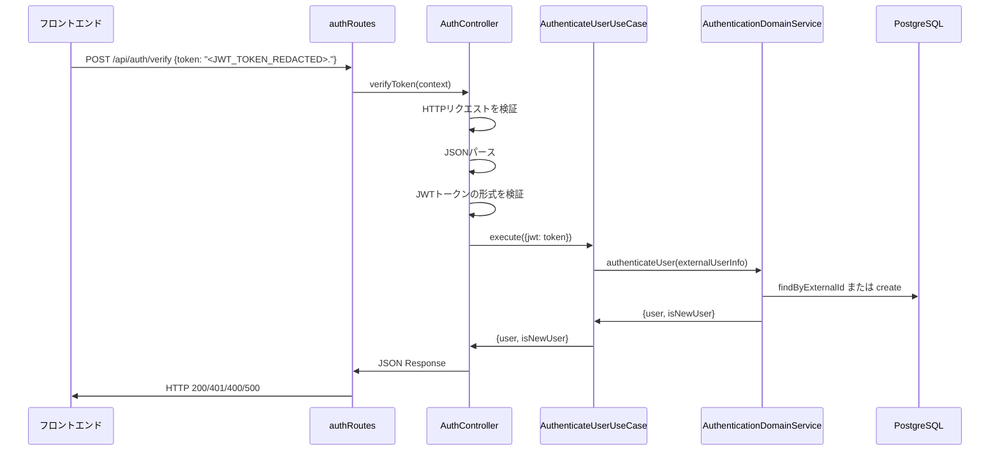
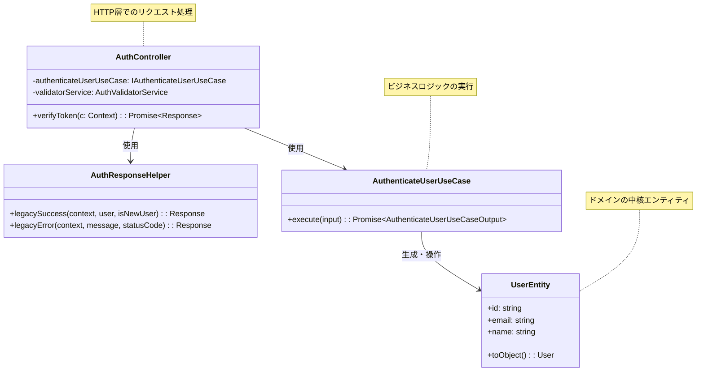

# TASK-201 認証コントローラー実装 コード解説

## この機能が何を解決するのか

この機能は「JWTトークンを使ったユーザー認証をHTTP APIとして提供する」ことを解決します。

具体的には：
- フロントエンドから送信されたJWTトークンをHTTP経由で受け取る
- そのトークンを検証して、ユーザーが本当に認証済みかどうかを確認する
- 認証が成功した場合は、ユーザー情報をJSON形式でレスポンスする
- 認証が失敗した場合は、適切なエラーメッセージを返却する

これを「HTTP認証エンドポイント」と呼び、WebアプリケーションでGoogle認証の結果を確認することができます。

## 全体の処理の流れ

### 処理フローとファイル関係



## ファイルの役割と責任

### 今回解説するメインのファイル

**TASK-201で実装されたファイルの概要**

このタスクでは主に以下の2つのファイルが実装されました：

1. **AuthController.ts** - HTTPリクエストを受け取り、レスポンスを返すコントローラー
2. **authRoutes.ts** - エンドポイントを定義し、Honoフレームワークにルートを登録する

### app/server/src/presentation/http/controllers/AuthController.ts
このファイルは「HTTP認証コントローラー」の役割を担います。主な責任は：

- **HTTPリクエストの検証** - 送信されたデータが正しい形式かチェック
- **JSON解析** - リクエストボディをJavaScriptのオブジェクトに変換
- **Application層への橋渡し** - ビジネスロジックを担うUseCaseに処理を委譲
- **レスポンス生成** - 処理結果をHTTPレスポンスとして整形

### app/server/src/presentation/http/routes/authRoutes.ts
このファイルは「ルート定義」の役割を担います。主な責任は：

- **エンドポイントの定義** - `POST /api/auth/verify` というURLパスを設定
- **依存関係の解決** - DIコンテナからUseCaseを取得
- **例外ハンドリング** - 予期しないエラーが発生した場合の安全な処理

### 呼び出される関連ファイル

**app/server/src/application/usecases/AuthenticateUserUseCase.ts**
認証の具体的なビジネスロジックを実行するファイルです。JWTの検証や、ユーザーがデータベースに存在するかのチェックなどを行います。

**app/server/src/presentation/http/responses/ResponseService.ts**
HTTPレスポンスの形式を統一するためのファイルです。成功時やエラー時の一貫したJSON形式を保証します。

## クラスと関数の呼び出し関係

### クラス構造と依存関係



## 重要な処理の詳細解説

### 1. HTTPリクエストの検証処理

```typescript
// app/server/src/presentation/http/controllers/AuthController.ts
const httpValidationResult = this.validatorService.validateHttpRequest(c);
if (!httpValidationResult.isValid) {
  return AuthResponseHelper.legacyError(
    c,
    httpValidationResult.error ?? 'HTTP validation failed',
    httpValidationResult.statusCode ?? 400,
  );
}
```

この処理では、HTTPリクエストが正しい形式で送信されているかを確認しています。例えば、Content-Typeが`application/json`になっているか、リクエストメソッドが正しいかなどをチェックします。不正な場合は400エラー（Bad Request）を返却します。

### 2. JSONパースとエラーハンドリング

```typescript
// app/server/src/presentation/http/controllers/AuthController.ts
let requestBody: unknown;
try {
  requestBody = await c.req.json();
} catch {
  // JSONパース失敗時は400エラーを返却
  return AuthResponseHelper.legacyError(c, 'Invalid JSON format', 400);
}
```

ここではフロントエンドから送信されたJSONデータを解析しています。JSONの形式が間違っていたり、データが破損していた場合、JavaScriptの`JSON.parse()`でエラーが発生します。そのエラーをキャッチして、ユーザーにわかりやすい「JSON形式が不正です」というメッセージを返しています。

### 3. UseCaseへの処理委譲

```typescript
// app/server/src/presentation/http/controllers/AuthController.ts
const authResult = await this.authenticateUserUseCase.execute({
  jwt: (requestBody as { token: string }).token,
});
```

この部分で実際の認証処理をApplication層のUseCaseに委譲しています。AuthControllerは「HTTPの世界」と「ビジネスロジックの世界」をつなぐ架け橋の役割だけを担い、認証の具体的な処理は別のクラスに任せています。これにより責任が明確に分かれており、コードの保守がしやすくなっています。

### 4. エラー種別による適切なレスポンス生成

```typescript
// app/server/src/presentation/http/controllers/AuthController.ts
if (error instanceof AuthenticationError) {
  // 認証エラーは401ステータスで返却
  return AuthResponseHelper.legacyError(c, error.message, 401);
}

if (error instanceof ValidationError) {
  // バリデーションエラーは400ステータスで返却
  return AuthResponseHelper.legacyError(c, error.message, 400);
}
```

エラーの種類によって、適切なHTTPステータスコードを返すように設計されています。例えば認証に失敗した場合は401（Unauthorized）、データの形式が間違っている場合は400（Bad Request）を返します。これにより、フロントエンド側でエラーの原因を特定しやすくなります。

## 初学者がつまずきやすいポイント

### 1. 「なぜController層が必要なのか？」
最初は「UseCaseを直接呼び出せばいいのでは？」と思うかもしれません。しかし、Controllerはいわば「通訳者」の役割を果たしています。HTTPの世界（リクエスト・レスポンス）とビジネスロジックの世界（認証・ユーザー作成）は全く違う言語を使っているため、その橋渡しが必要なのです。

### 2. 「DIコンテナって何？」
DIコンテナとは「Dependency Injection Container（依存性注入コンテナ）」の略です。簡単に言うと「必要なクラスのインスタンスを自動で作ってくれる仕組み」です。例えば、AuthControllerがAuthenticateUserUseCaseを使いたい時、毎回`new AuthenticateUserUseCase(...)`と書くのではなく、コンテナから取得することで設定を一箇所にまとめることができます。

### 3. 「async/awaitの使い分け」
JavaScriptのasync/awaitは「非同期処理を同期的に書ける」機能ですが、データベースアクセスやAPI通信など時間のかかる処理でのみ使います。単純な計算や文字列操作では不要です。

### 4. 「型安全性の重要性」
TypeScriptを使っている理由の一つが型安全性です。`(requestBody as { token: string }).token`という書き方は、「このオブジェクトは必ずtokenプロパティを持っている」と型システムに教えています。これにより、存在しないプロパティへのアクセスを防げます。

## この設計のいい点

### 1. 責任の明確な分離
AuthControllerはHTTPの処理のみ、AuthenticateUserUseCaseはビジネスロジックのみを担当しています。一つのクラスが複数の責任を持たないため、コードの理解や修正が容易です。

### 2. エラーハンドリングの統一
すべてのエラーが適切なHTTPステータスコードと共に、統一された形式で返却されます。フロントエンド側での処理が予測しやすくなります。

### 3. テスタビリティの高さ
依存性注入により、テスト時にモックオブジェクトを簡単に差し替えることができます。データベースを使わずに単体テストを実行できるため、テストが高速で安定します。

### 4. 将来の拡張性
新しい認証プロバイダー（AppleやMicrosoft）を追加する際も、このController層は変更する必要がありません。ビジネスロジック層で対応するだけで済みます。
