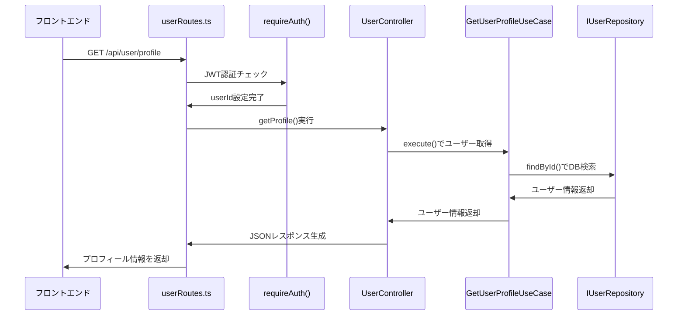
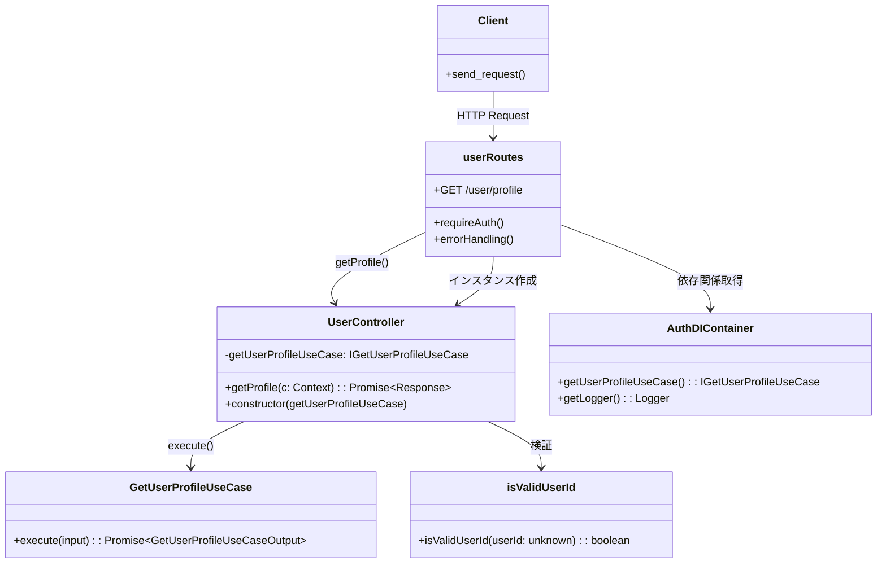

# TASK-202 ユーザーコントローラー実装 - コード解説

作成日: 2025-08-27
更新日: 2025-08-27

## この機能が何を解決するのか

この機能は「認証済みユーザーのプロフィール情報をAPIから取得する」ことを解決します。

具体的には：
- フロントエンドからJWTトークン付きでAPIリクエストを送信
- バックエンドでJWT認証を検証し、ユーザーIDを取得  
- データベースからユーザー情報を取得
- JSON形式でプロフィール情報をレスポンス

これを「認証済みユーザー情報取得API」と呼び、ログイン後のプロフィール画面表示などができます。

## 全体の処理の流れ

### 処理フローとファイル関係



## ファイルの役割と責任

### 今回解説するメインのファイル
**`app/server/src/presentation/http/controllers/UserController.ts`**

TASK-202で実装されたHTTPコントローラーです。このファイルは：
- 認証済みユーザーのプロフィール取得エンドポイントを提供
- HTTPリクエスト・レスポンスの変換処理を担当
- エラーハンドリングでドメインエラーをHTTPエラーに変換

実装されたクラス：
- `UserController` クラス：認証済みユーザー情報のHTTP APIを提供
- `isValidUserId()` 関数：型安全なユーザーID検証を実行

### 呼び出されているファイル
**`app/server/src/application/usecases/GetUserProfileUseCase.ts`**

ユーザープロフィール取得のビジネスロジックを実装しています：
- ユーザーIDを受け取ってユーザー情報を取得する処理
- ドメインエラー（UserNotFoundError等）をApplication層で管理
- Repository層への依存関係を抽象化して管理

**`app/server/src/presentation/http/routes/userRoutes.ts`**

HTTP ルートの定義を行っています：
- `GET /user/profile` エンドポイントの定義
- 認証ミドルウェア（requireAuth）の適用
- DIコンテナからの依存関係取得とController作成

**`app/server/src/infrastructure/di/AuthDIContainer.ts`**

依存関係注入（DI）コンテナです：
- `getUserProfileUseCase()` メソッドでUseCase取得
- シングルトン管理によるメモリリーク防止
- テスト時の依存関係モック化に対応

## クラスと関数の呼び出し関係

### クラス構造と依存関係


## 重要な処理の詳細解説

### 1. 型安全な認証情報取得

```typescript
// app/server/src/presentation/http/controllers/UserController.ts
const rawUserId = c.get('userId');

if (!isValidUserId(rawUserId)) {
    // AuthMiddleware通過後にuserIDが無効な場合
    throw new ValidationError('認証状態が無効です');
}
```

この処理では、認証ミドルウェアで設定された `userId` が本当に有効な文字列かを確認しています。
`c.get('userId')` の戻り値は `unknown` 型なので、型ガード関数 `isValidUserId()` でstring型であることを保証しています。

認証ミドルウェアが正常に動作していれば通常は問題ありませんが、何らかの異常で無効な値が設定された場合のフェイルセーフ処理です。

### 2. UseCaseへの処理委譲

```typescript
// app/server/src/presentation/http/controllers/UserController.ts
const input: GetUserProfileUseCaseInput = { userId };
const result = await this.getUserProfileUseCase.execute(input);
```

Presentation層（HTTP Controller）はHTTPの処理のみを担当し、ビジネスロジックはApplication層（UseCase）に委譲しています。
これがクリーンアーキテクチャの「関心の分離」の考え方で、各層が自分の責務に集中できます。

### 3. 統一されたレスポンス形式

```typescript
// app/server/src/presentation/http/controllers/UserController.ts
const responseData: GetUserProfileResponse = {
    success: true,
    data: {
        id: result.user.id,
        externalId: result.user.externalId,
        // ... 他のフィールド
        lastLoginAt: result.user.lastLoginAt?.toISOString() || null,
    },
};
```

API仕様で定められた統一レスポンス形式に従って、必ずJSON形式で`success`フィールドと`data`フィールドを持つ形に変換しています。
日付フィールド（`lastLoginAt`）は ISO 8601 形式の文字列に変換して、フロントエンドでの扱いを統一しています。

### 4. エラー種別に応じた適切なHTTPレスポンス

```typescript
// app/server/src/presentation/http/controllers/UserController.ts
if (error instanceof UserNotFoundError) {
    // 認証済みであるがユーザーがDBに存在しない
    return c.json<ErrorResponse>({
        success: false,
        error: {
            code: 'USER_NOT_FOUND',
            message: 'ユーザーが見つかりません',
        },
    }, 404);
}
```

ドメインエラー（`UserNotFoundError`等）を適切なHTTPステータスコード（404, 400, 500）に変換しています。
これによって、フロントエンド側では統一されたエラーハンドリングが可能になります。

## 初学者がつまずきやすいポイント

### 1. 「なぜコントローラーが薄いのか？」
初学者は「コントローラーにビジネスロジックを書けばいいのでは？」と思うかもしれません。
しかし、クリーンアーキテクチャでは**Presentation層は薄く保つ**のが鉄則です。
HTTPの処理のみを担当し、ビジネスロジックはUseCase層に委譲することで、テストしやすく保守しやすいコードになります。

### 2. 「DIコンテナって何？」
`AuthDIContainer.getUserProfileUseCase()` という部分で、依存関係注入（DI：Dependency Injection）コンテナから依存するオブジェクトを取得しています。
これは「どのクラスを使うか」をコード内部でnewする代わりに、外部のコンテナから取得する仕組みです。
テスト時にモックオブジェクトに差し替えやすくなるメリットがあります。

### 3. 「型ガードとは何か？」
TypeScriptでは、`unknown` 型の変数を特定の型として使うために「型ガード」という仕組みを使います。
`isValidUserId()` 関数は、引数が `string` 型で空でないことを確認し、TypeScriptの型システムに「この変数は安全に string として扱える」ことを伝えます。

### 4. 「async/awaitの使い方」
`await this.getUserProfileUseCase.execute()` のように、非同期処理（Promise）の完了を待つために `await` を使います。
データベースアクセスなどのI/O処理は時間がかかるので、結果が返ってくるまで処理を待機します。

## この設計のいい点

### 1. **責務の明確な分離**
UserControllerは「HTTPリクエスト・レスポンスの変換」のみに集中し、ビジネスロジックはGetUserProfileUseCaseが担当しています。
これにより、HTTPの詳細を知らなくてもビジネスロジックをテストでき、逆にビジネスロジックを変更してもHTTP処理には影響しません。

### 2. **型安全な実装**
TypeScriptの型システムを最大限活用し、実行時エラーを防いでいます。
`isValidUserId()` による型ガードや、`GetUserProfileResponse` 型による厳密なレスポンス型定義で、バグを事前に防止します。

### 3. **統一されたエラーハンドリング**
すべてのエラーケースに対応し、フロントエンド側で一貫したエラー処理ができるように設計されています。
ドメインエラーを適切なHTTPステータスコードに変換することで、RESTful APIの原則に従っています。

### 4. **テスタビリティの高さ**
DIコンテナによる依存関係注入により、単体テスト時にUseCase部分をモックに差し替えて、Controller単体の動作を確認できます。
また、各層が独立しているため、部分的なテストが書きやすくなっています。