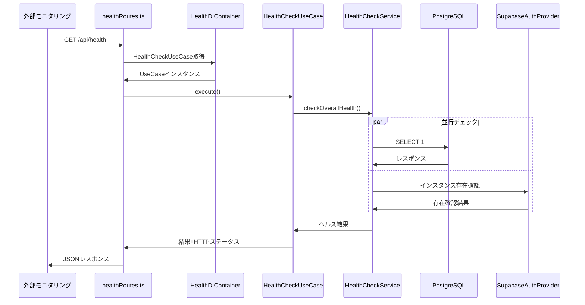
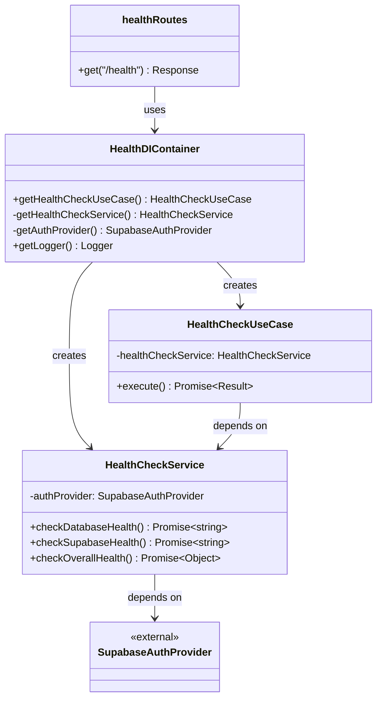

# TASK-203 ヘルスチェックエンドポイント実装の解説

作成日: 2025-08-28
更新日: 2025-08-28

## この機能が何を解決するのか

この機能は「システム監視エンドポイント」を作成し、システムが正常に動作しているかどうかを外部から確認できるようにします。

具体的には：
- データベース（PostgreSQL）への接続が正常かチェック
- Supabaseサービスとの連携が正常かチェック  
- システム全体の健全性を判断してHTTPレスポンスで結果を返す

これを「ヘルスチェック」と呼び、本番環境でのシステム監視や自動復旧などに活用できます。

## 全体の処理の流れ

### 処理フローとファイル関係



## ファイルの役割と責任

### 今回解説するメインのファイル

**app/server/src/infrastructure/config/HealthCheckService.ts** - Infrastructure層
- 実際の外部システム（データベース、Supabase）への接続確認を行う
- `checkDatabaseHealth()`: PostgreSQLに`SELECT 1`クエリを送って接続テスト
- `checkSupabaseHealth()`: AuthProviderインスタンスの存在確認
- `checkOverallHealth()`: 両方を並行実行して統合結果を返す

**app/server/src/application/usecases/HealthCheckUseCase.ts** - Application層
- Infrastructure層のサービスを呼び出してビジネスロジックを処理
- ヘルス結果に基づいてHTTPステータス（200 or 503）を決定
- エラーハンドリングとfallback処理を担当

### 呼び出している/呼び出されているファイル

**app/server/src/presentation/http/routes/healthRoutes.ts** - Presentation層
- HTTPリクエストを受け取ってUseCaseに処理を委譲
- UseCaseの結果をAPI仕様に沿ったJSONレスポンスに変換
- エラーハンドリングとログ出力を実装

**app/server/src/infrastructure/di/HealthDIContainer.ts** - DI（依存性注入）コンテナ
- 各クラスのインスタンス生成と依存関係の管理
- シングルトンパターンで同じインスタンスを使い回し
- テスト用のモック機能も提供

## クラスと関数の呼び出し関係

### クラス構造と依存関係



## 重要な処理の詳細解説

### 1. 並行ヘルスチェックの仕組み

```typescript
// app/server/src/infrastructure/config/HealthCheckService.ts
async checkOverallHealth() {
    const [databaseStatus, supabaseStatus] = await Promise.all([
      this.checkDatabaseHealth(),
      this.checkSupabaseHealth(),
    ]);
    // この関数では「Promise.all」を使って並行処理している
    // データベースとSupabaseのチェックを同時に実行することで高速化
}
```

この処理が必要である理由は、ヘルスチェックは短時間で完了する必要があり、順次実行だと時間がかかりすぎるためです。
よくある勘違いは「awaitを2回書けば並行処理になる」と思うことですが、実際は順次実行になってしまいます。正しくは`Promise.all`を使う必要があります。

### 2. HTTPステータスコード決定ロジック

```typescript
// app/server/src/application/usecases/HealthCheckUseCase.ts
async execute() {
    const result = await this.healthCheckService.checkOverallHealth();
    
    // システム健全性に基づいてHTTPステータスを決定
    const httpStatus = result.status === 'healthy' ? 200 : 503;
}
```

ここでは「Application層」の責任として、Infrastructure層の結果を受けてHTTPという技術的な概念（ステータスコード）に変換しています。
この設計のいい点は、将来的にHTTP以外のプロトコル（例：gRPC）に変更する際も、この層だけ変更すれば済むことです。

### 3. 依存性注入（DI）パターンの実装

```typescript
// app/server/src/infrastructure/di/HealthDIContainer.ts
static getHealthCheckUseCase(): HealthCheckUseCase {
    if (!HealthDIContainer.healthCheckUseCaseInstance) {
        const healthCheckService = HealthDIContainer.getHealthCheckService();
        // HealthCheckServiceのインスタンスを注入してUseCaseを生成
        HealthDIContainer.healthCheckUseCaseInstance = new HealthCheckUseCase(
            healthCheckService,
        );
    }
}
```

この処理では「依存性の逆転」を実現しており、上位層（UseCase）が下位層（Service）の具象クラスに直接依存しない設計になっています。
これにより、テスト時にモックオブジェクトを注入することが可能になります。

### 4. エラーハンドリングの多層防御

```typescript
// app/server/src/presentation/http/routes/healthRoutes.ts
try {
    const { result, httpStatus } = await healthCheckUseCase.execute();
    // 正常系の処理
} catch (error) {
    // この関数の中では「最終防御線」としてのエラーハンドリング
    // UseCaseレベルでもエラーハンドリングはあるが、予期せぬ例外に備える
    return c.json({
        success: false,
        error: {
            code: 'INTERNAL_SERVER_ERROR',
            message: '一時的にサービスが利用できません',
        },
    }, 500);
}
```

多層でエラーハンドリングを行うことで、どの層で例外が発生してもユーザーには適切なレスポンスを返せます。

## 初学者がつまずきやすいポイント

### 1. 「なぜ4つのファイルに分かれているの？」

一見すると同じファイルに書いた方が簡単に見えますが、実際は以下のメリットがあります：

- **テストしやすさ**: 各層を独立してテストできる
- **保守しやすさ**: 変更の影響範囲が限定される  
- **再利用性**: 他の機能でも同じServiceを使える

### 2. 「DIコンテナって何？」

DIコンテナは「部品工場」のようなものです。必要な部品（クラス）を組み立てて完成品（UseCase）を作ってくれます。
手動でnewしまくるよりも、依存関係を一元管理できて安全です。

### 3. 「Promise.allとawaitの違い」

```typescript
// ❌ これは順次実行（遅い）
const db = await checkDatabase();
const supabase = await checkSupabase();

// ✅ これが並行実行（速い）
const [db, supabase] = await Promise.all([
    checkDatabase(),
    checkSupabase()
]);
```

### 4. 「healthyとunhealthyの判定基準」

この実装では「すべての依存関係が正常な場合のみhealthy」としています。
これは「フェイルファスト」という考え方で、一つでも問題があれば全体を停止することで、データ不整合を防ぎます。

## この設計のいい点

### 1. 関心の分離が適切
各層が明確な責任を持ち、他層の実装詳細に依存していません。Infrastructure層はデータアクセス、Application層はビジネスルール、Presentation層はHTTP処理に専念しています。

### 2. テスタビリティが高い
依存性注入により、各層を独立してテストできます。特にInfrastructure層をモックに差し替えることで、外部サービスに依存しないテストが可能です。

### 3. 拡張性が考慮されている
新しい依存関係（Redis、外部API等）のヘルスチェックを追加する際、既存コードを変更せずにServiceクラスに追加するだけで済みます。

### 4. パフォーマンスが最適化されている
`Promise.all`による並行処理で、複数の依存関係チェックを効率的に実行しています。また、DIコンテナのシングルトンパターンでインスタンス生成コストを削減しています。

`★ Insight ─────────────────────────────────────`  
このヘルスチェック実装は、DDD + クリーンアーキテクチャの教科書的な例になっています。特に「依存関係の方向」が重要で、上位層が下位層に依存し、抽象が具象に依存しない設計を実現しています。実際のシステム監視では、このエンドポイントを定期的に呼び出してアプリケーションの生死判定を行います。  
`───────────────────────────────────────────`
