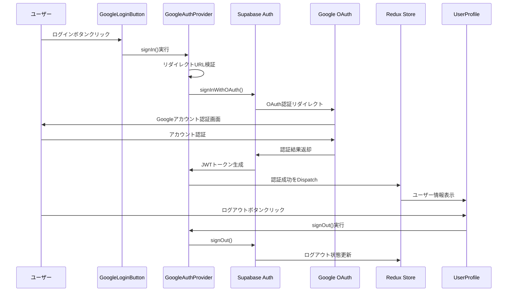
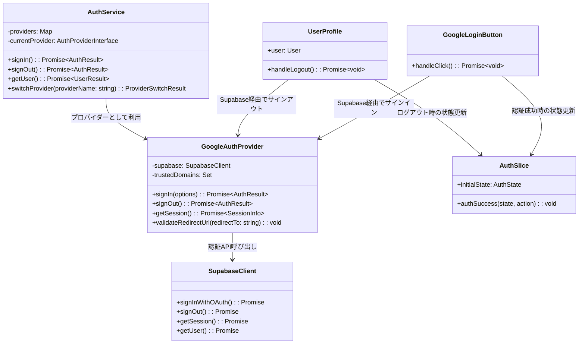

# TASK-301: 認証フロー実装（フロントエンド）コード解説

## この機能が何を解決するのか

この機能は「Googleアカウントでワンクリックログイン」することを解決します。

具体的には：
- GoogleのOAuth 2.0認証を使ってユーザーがアプリにログインする
- SupabaseというBaaSを仲介してセキュアなJWT（JSON Web Token）を取得する
- 取得したJWTをバックエンドAPIに送信してユーザー情報を管理する
- ログアウト機能でセッションを安全に終了する

これを「OAuth認証フロー」と呼び、面倒なユーザー登録なしにアプリをすぐに使い始めることができます。

## 全体の処理の流れ

### 処理フローとファイル関係



## ファイルの役割と責任

### 今回解説するメインのファイル

#### app/client/src/features/google-auth/components/GoogleLoginButton.tsx
- **役割**: Googleログインを開始するボタンコンポーネント
- **実装された関数**: 
  - `handleClick()`: Supabaseのサインイン機能を呼び出してGoogle認証を開始する
  - リダイレクト先URLを環境変数から取得し、OAuth認証フローを実行する

#### app/client/src/features/google-auth/components/UserProfile.tsx
- **役割**: 認証済みユーザーの情報表示とログアウト機能
- **実装された関数**:
  - `handleLogout()`: Supabaseのログアウト機能を呼び出してセッションを終了する
  - アバター画像、ユーザー名、メールアドレスの表示機能

#### app/client/src/features/google-auth/store/authSlice.ts
- **役割**: Redux Toolkitを使った認証状態の管理
- **実装された関数**:
  - `authSuccess`: 認証成功時にユーザー情報を状態に保存するリデューサー
  - 認証状態（isAuthenticated）とローディング状態を管理する

### 呼び出しているファイル

#### app/client/src/features/auth/services/authService.ts
- **役割**: 複数の認証プロバイダーを統一管理するサービスクラス
- **呼び出している関数**:
  - `signIn()`: 指定されたプロバイダー（Google等）でログインを実行する
  - `signOut()`: 現在のプロバイダーでログアウトを実行する
  - `getUser()`: 認証済みユーザー情報を取得する

#### app/client/src/features/auth/services/providers/googleAuthProvider.ts
- **役割**: Google OAuth専用の認証処理を実装するプロバイダークラス
- **呼び出している関数**:
  - `signIn()`: オープンリダイレクト対策付きのGoogle OAuth認証開始
  - `signOut()`: Google認証セッションの安全な終了
  - `getSession()`: 現在の認証セッション情報取得
  - `validateRedirectUrl()`: セキュリティ検証機能

#### app/client/src/lib/supabase.ts
- **役割**: Supabaseクライアントの共通インスタンス作成
- **呼び出している関数**:
  - `createSupabaseClient()`: 環境変数を検証してSupabaseクライアントを作成する

## クラスと関数の呼び出し関係

### クラス構造と依存関係



## 重要な処理の詳細解説

### Google認証開始処理

```typescript
// app/client/src/features/google-auth/components/GoogleLoginButton.tsx
const handleClick = async (): Promise<void> => {
  try {
    await supabase.auth.signInWithOAuth({
      provider: 'google',
      options: {
        // フォールバック先として現在のオリジンを使用
        redirectTo:
          process.env.NEXT_PUBLIC_SITE_URL || window.location.origin,
      },
    });

    console.log('認証成功！');
  } catch (error) {
    console.error('認証失敗！', error);
  }
};
```

この処理が必要である理由は、GoogleのOAuth 2.0認証を安全に実行するためです。`redirectTo`オプションで認証後のリダイレクト先を指定し、環境変数が設定されていない場合は現在のサイトをフォールバック先として使用します。

よくある勘違いとして、「Googleに直接ログイン情報を送る」と思われがちですが、実際はSupabaseというサービスがGoogleとアプリの間に入って安全に認証を仲介しています。

### セキュリティ検証処理

```typescript
// app/client/src/features/auth/services/providers/googleAuthProvider.ts
validateRedirectUrl(redirectTo: string): void {
  let parsedUrl: URL;
  try {
    // URLオブジェクトで厳密な解析を実行
    parsedUrl = new URL(redirectTo);
  } catch (error) {
    // 詳細なエラーはログに記録、ユーザーには安全なメッセージを返却
    console.error('Invalid URL format detected:', redirectTo, error);
    throw new Error('不正な URL 形式です');
  }

  // http/https以外のプロトコルを拒否
  if (parsedUrl.protocol !== 'http:' && parsedUrl.protocol !== 'https:') {
    console.error(
      'Invalid protocol detected:',
      parsedUrl.protocol,
      'for URL:',
      redirectTo,
    );
    throw new Error('許可されていないプロトコルです');
  }
```

これは「オープンリダイレクト攻撃」を防ぐための重要なセキュリティ機能です。悪意のあるユーザーが不正なサイトにリダイレクトしようとする攻撃を防ぎます。正しいプロトコル（httpまたはhttps）と信頼できるドメインのみを許可しています。

よくある勘違いとして、「面倒な検証処理」と思われがちですが、この処理がないとユーザーが知らない間に悪意のあるサイトに飛ばされる危険があります。

### 状態管理の更新処理

```typescript
// app/client/src/features/google-auth/store/authSlice.ts
authSuccess: (state, action: PayloadAction<AuthSuccessPayload>) => {
  state.isAuthenticated = true;
  state.user = action.payload.user;
  state.isLoading = false;
  state.error = null;
},
```

この処理はRedux Toolkitの「Immer」という仕組みを使って、一見すると状態を直接変更しているように見えますが、実際は新しい状態オブジェクトを安全に作成しています。認証が成功したときに必要な全ての状態変更を一度に行います。

## 初学者がつまずきやすいポイント

### OAuth認証の流れについて

「OAuth認証」は新しく開発を学ぶ人には難しく感じるかもしれませんが、実際は「お馴染みのサービス（Google等）のアカウントを使って他のアプリにログインできる仕組み」です。

銀行の例で例えると：
- あなたが新しいお店（アプリ）で支払いをしたい時
- 直接お店にお金を渡すのではなく
- 信頼できる銀行（Google）にお店が「この人は本当にお金を持っていますか？」と確認する
- 銀行が「はい、確かに持っています」と証明書（JWT）をお店に渡す

このような流れです。

### SupabaseとGoogleの関係について

「Supabase」は認証の「仲介役」です。アプリが直接Googleとやりとりするのではなく、Supabaseが間に入って安全に認証処理を行います。

レストランの例で例えると：
- あなた（ユーザー）がレストラン（アプリ）に入店したい
- レストランは信頼できる受付サービス（Supabase）に依頼
- 受付サービスがあなたの身分証（Googleアカウント）を確認
- 確認できたら入店許可証（JWT）をレストランに渡す

### Redux状態管理について

「Redux」はアプリ全体の「記憶装置」のようなものです。ログインしたユーザー情報や現在の状態をアプリのどこからでも参照・更新できます。

学校の掲示板の例で例えると：
- 掲示板（Redux Store）にお知らせ（状態）が貼られている
- 教室（コンポーネント）のどこからでも掲示板を見に行ける
- 先生（アクション）がお知らせを追加・更新できる
- 生徒（コンポーネント）は常に最新のお知らせを確認できる

## この設計のいい点

### Strategy Patternによる拡張性

この認証システムでは「Strategy Pattern（戦略パターン）」という設計パターンを使用しています。これにより、GoogleだけでなくApple、Microsoft、GitHubなど他の認証プロバイダーを簡単に追加できます。新しいプロバイダーを追加する時、既存のコードを変更する必要がありません。

### セキュリティ対策の徹底

オープンリダイレクト攻撃対策、プロトコル検証、信頼ドメイン確認など、多層的なセキュリティ対策が実装されています。ユーザーの安全を第一に考えた設計になっています。

### 環境変数によるフォールバック処理

本番環境と開発環境で異なる設定を使い分けながら、設定が不十分な場合でも適切なフォールバック（代替処理）が動作するように設計されています。開発時の利便性も考慮した実用的な実装です。

### テスト容易性の確保

依存性注入（DI）パターンを使用して、テスト時にモックオブジェクトを簡単に差し替えられる設計になっています。これにより、実際のGoogleサーバーに接続しなくてもテストを実行できます。