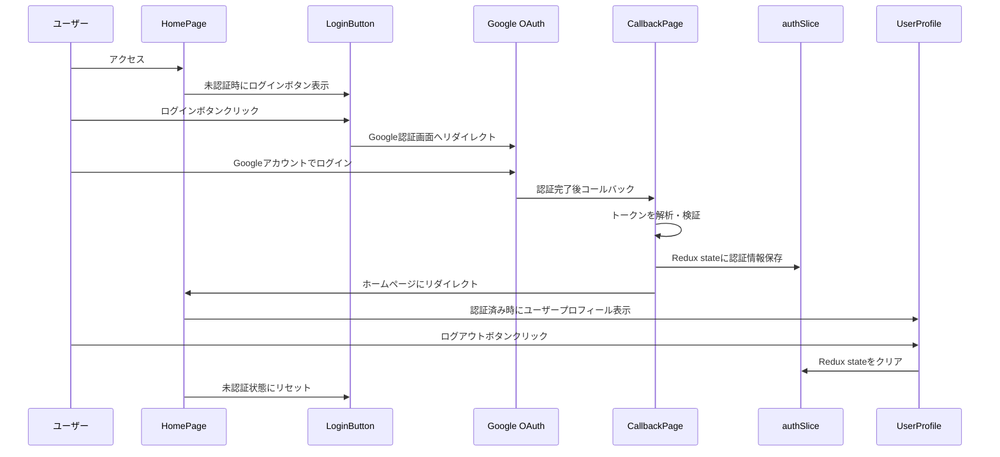
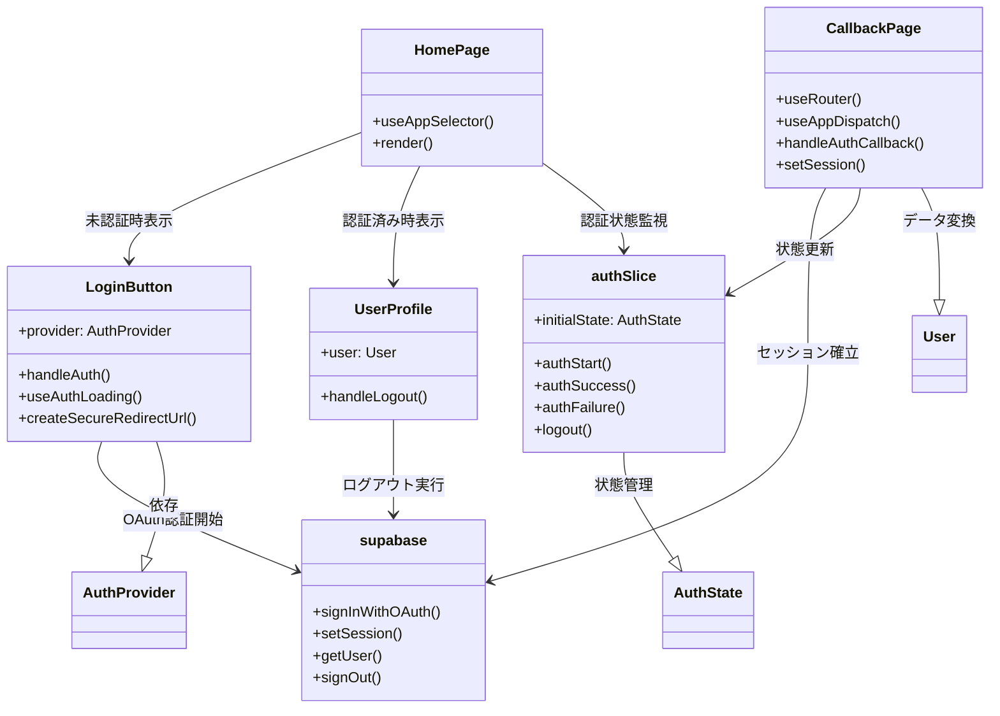

# TASK-301 認証フロー実装の解説

作成日: 2025-09-01
対象: 初学者エンジニア向け

## この機能が何を解決するのか

この機能は「ユーザーがGoogleアカウントを使って簡単にログイン・ログアウトできる仕組み」を実現します。

具体的には：
- ユーザーがGoogleログインボタンをクリック
- Googleの認証画面に遷移し、Googleアカウントでログイン
- 認証が成功すると、アプリ内でユーザー情報（名前・メール・アバター画像）を表示
- ログアウトボタンでセッション終了

これを「OAuth認証」と呼び、外部サービス（Google）を利用してユーザーの身元を確認し、アプリへの安全なアクセスができます。

## 全体の処理の流れ

### 処理フローとファイル関係



## ファイルの役割と責任

### 今回解説するメインのファイル

#### 1. LoginButton.tsx（ログインボタンコンポーネント）
Google認証を開始するボタンを表示し、クリック時にGoogleのOAuth認証フローを開始します。

主な機能：
- プロバイダー（Google）を指定してログインボタンを表示
- ローディング状態の管理（連続クリック防止）
- セキュアなリダイレクトURL生成
- エラーハンドリング

#### 2. page.tsx（ホームページ）
アプリのメイン画面で、ユーザーの認証状態に応じてUIを切り替えます。

主な機能：
- Redux storeから認証状態を監視
- 未認証時：LoginButtonを表示
- 認証済み時：UserProfileを表示

#### 3. callback/page.tsx（認証コールバックページ）
Google認証完了後に処理される専用ページです。

主な機能：
- URLフラグメントからアクセストークンを取得
- Supabaseセッションの確立
- ユーザー情報の取得とRedux stateへの保存
- エラー処理と適切なリダイレクト

#### 4. authSlice.ts（認証状態管理）
Redux Toolkitを使ってアプリ全体の認証状態を管理します。

主な機能：
- 認証状態（isAuthenticated, user, isLoading, error）の管理
- 認証開始・成功・失敗・ログアウト時の状態更新

#### 5. UserProfile.tsx（ユーザープロフィール表示）
認証済みユーザーの情報を表示し、ログアウト機能を提供します。

主な機能：
- ユーザーのアバター画像、名前、メールアドレス表示
- ログアウト処理

## クラスと関数の呼び出し関係

### コンポーネント構造と依存関係



## 重要な処理の詳細解説

### 1. OAuth認証の開始処理

```typescript
// app/client/src/features/auth/components/LoginButton.tsx
const handleAuth = useCallback(async (): Promise<void> => {
    // この部分では「Googleの認証画面にユーザーを送る」処理をしており、
    // ダブルクリック防止とセキュリティ対策を含んでいる
    if (!startLoading()) {
        return; // 連続クリック時は処理を中断
    }

    // Host Header Attack対策で安全なリダイレクトURLを生成
    const secureRedirectUrl = createSecureRedirectUrl();

    const { data, error } = await supabase.auth.signInWithOAuth({
        provider: providerConfig.supabaseProvider,
        options: {
            redirectTo: secureRedirectUrl,
        },
    });
}, [/* 依存関係 */]);
```

このコード部分では以下の重要な処理が行われています：
- **ダブルクリック防止**: `startLoading()`が`false`を返すと処理を中断
- **セキュリティ対策**: 悪意のあるリダイレクトを防ぐため安全なURLを生成
- **非同期処理**: `async/await`を使ってGoogle認証の完了を待機

### 2. 認証完了後のコールバック処理

```typescript
// app/client/src/app/auth/callback/page.tsx
const handleAuthCallback = async () => {
    // URLフラグメント（#以降の部分）からGoogleが返すトークンを取得する処理
    const hashParams = new URLSearchParams(window.location.hash.substring(1));
    const accessToken = hashParams.get('access_token');
    
    if (!accessToken) {
        throw new Error('認証トークンが見つかりません');
    }

    // 取得したトークンでSupabaseのセッションを確立
    const { error: sessionError } = await supabase.auth.setSession({
        access_token: accessToken,
        refresh_token: refreshToken || '',
    });
};
```

この処理が必要である理由：
- **OAuth 2.0の仕様**: Google認証後、アクセストークンがURL の`#`以降に含まれて返される
- **セッション管理**: トークンをSupabaseに渡すことで、アプリ内での認証状態を維持
- **セキュリティ**: トークンの検証と適切なエラーハンドリング

### 3. Redux状態管理

```typescript
// app/client/src/features/google-auth/store/authSlice.ts
export const authSlice = createSlice({
    name: 'auth',
    initialState,
    reducers: {
        // この関数の中では「認証が成功した」という状態変更をしており、
        // アプリ全体で認証済みユーザー情報にアクセス可能になっている
        authSuccess: (state, action: PayloadAction<AuthSuccessPayload>) => {
            state.isAuthenticated = true;
            state.user = action.payload.user;
            state.isLoading = false;
            state.error = null;
        },
    },
});
```

Redux Toolkitを使う理由：
- **一元管理**: アプリ全体の認証状態を1箇所で管理
- **型安全性**: TypeScriptによる型チェックで実行時エラーを防止
- **予測可能性**: 状態変更が明確なアクションによってのみ実行される

## 初学者がつまずきやすいポイント

### 1. 「OAuth」と「JWT」の違い
- **OAuth**: 「誰がログインを許可するか」の仕組み（Googleが許可）
- **JWT**: 「ログインした証明書」のような形式（トークンの形式）

家の例で考えると：
- OAuth = 大家さんが「この人に鍵を渡していいですよ」と言うこと
- JWT = 実際にもらう鍵（デジタル証明書）

### 2. 「コールバック」の仕組み
認証の流れは以下のような「たらい回し」になります：
1. あなたのアプリ → 「Googleさん、この人を認証して！」
2. Google → ユーザーに「ログインしますか？」
3. ユーザー → Googleに「はい」
4. Google → あなたのアプリに「認証完了！トークンはこれ」

この「4番」の処理が「コールバック」です。

### 3. 「Redux」と「useState」の使い分け
- **useState**: コンポーネント内だけで使う状態（ローカル状態）
- **Redux**: アプリ全体で共有したい状態（グローバル状態）

認証情報は「どのページでも使いたい情報」なので、Reduxで管理します。

## この設計のいい点

### 1. プロバイダー非依存の設計
LoginButtonコンポーネントは`provider="google"`を指定するだけで、将来的にAppleやGitHubなど他の認証プロバイダーにも対応できます。新しいプロバイダーを追加する際も、既存のコードを変更する必要がありません。

### 2. エラーハンドリングの充実
各処理段階で適切なエラー処理が実装されています：
- ユーザーが認証をキャンセル → エラー表示なしで自然にホームに戻る
- ネットワークエラー → 分かりやすい日本語メッセージを表示
- 予期しないエラー → デバッグ情報をコンソールに出力

### 3. セキュリティ対策の実装
- **Host Header Attack対策**: 悪意のあるリダイレクトを防ぐセキュアURL生成
- **ダブルクリック防止**: ローディング状態管理による重複処理の防止
- **トークン検証**: 適切なトークン形式と有効性の確認

### 4. ユーザビリティの配慮
- **ローディング状態**: 処理中であることを視覚的に表示
- **アクセシビリティ**: ARIA属性による支援技術対応
- **レスポンシブ対応**: モバイルデバイスでも操作しやすいUI設計