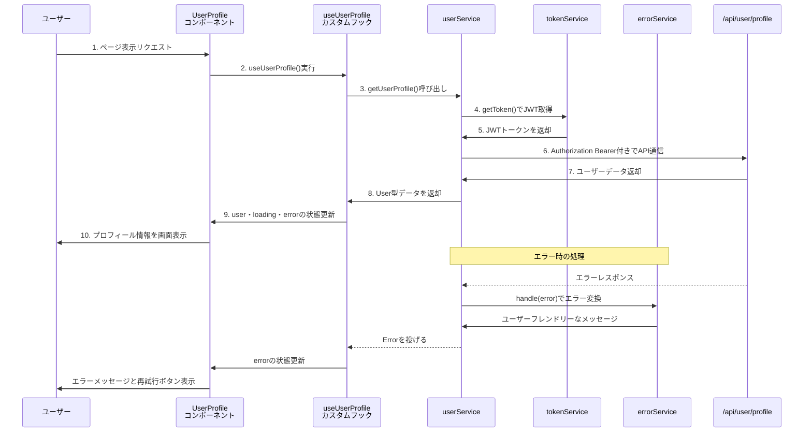
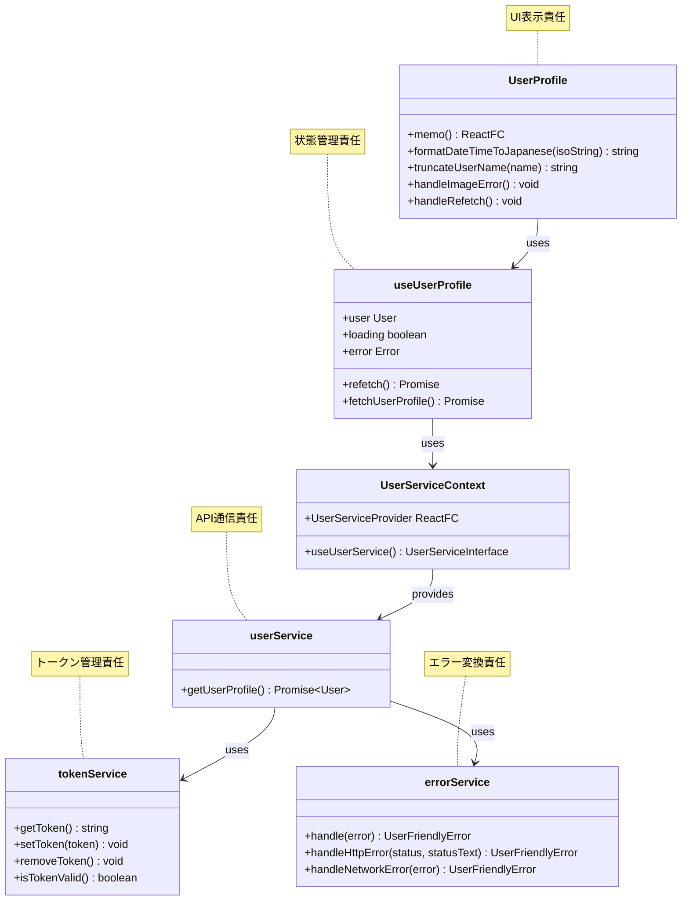

# TASK-302 ユーザープロフィール表示実装 - コード解説

作成日: 2025-09-03 JST  
対象TASK: TASK-302

## この機能が何を解決するのか

この機能は「**Googleログイン後のユーザーが、自分のプロフィール情報を画面で確認できる**」ことを解決します。

具体的には：
- 認証が成功した後に、ユーザーの名前・メールアドレス・アバター画像・最終ログイン日時を表示
- バックエンドAPI（`/api/user/profile`）からユーザー情報を取得
- ローディング状態・エラー状態も適切に表示してユーザーに分かりやすくする

これを「**ユーザープロフィール表示機能**」と呼び、認証されたユーザーが自分の情報を確認することができます。

## 全体の処理の流れ

### 処理フローとファイル関係



## ファイルの役割と責任

### 今回解説するメインのファイル

**`app/client/src/features/user/components/UserProfile.tsx`**
- TASK-302で実装された**UIコンポーネント**の中心部分
- ユーザー情報を画面に表示する責任を持つ
- ローディング中・エラー時・正常時の3つの表示状態を管理
- 実装された関数：
  - `formatDateTimeToJapanese()` - 日時をJST日本語形式に変換
  - `truncateUserName()` - 長いユーザー名を50文字で省略＋XSS対策
  - `UserProfile` - メインのReactコンポーネント

**`app/client/src/features/user/hooks/useUserProfile.ts`**
- **状態管理とAPIデータ取得を担当**するカスタムフック
- コンポーネントからAPI呼び出しの複雑さを隠す役割
- 実装された機能：
  - `fetchUserProfile()` - 内部的にAPIを呼び出してstate更新
  - `refetch()` - 手動でのプロフィール再取得
  - `user・loading・error`の状態管理

### 呼び出されているファイル群

**`app/client/src/features/user/services/userService.ts`**
- **API通信の実装**を担当するサービス層
- バックエンドの`/api/user/profile`との通信を抽象化
- 実装された関数：
  - `getUserProfile()` - JWT付きでAPIリクエストを実行し、User型データを返却

**`app/client/src/features/user/services/tokenService.ts`**
- **JWT認証トークンの管理**を担当
- localStorageへの安全なアクセスを抽象化
- 実装された機能：
  - `getToken()` - localStorageからJWTを取得
  - `setToken()・removeToken()` - トークンの保存・削除
  - `isTokenValid()` - JWT形式の基本チェック

**`app/client/src/features/user/services/errorService.ts`**
- **エラーハンドリングの統一**を担当
- 技術的なエラーをユーザー向けメッセージに変換
- 実装された機能：
  - `handle()` - あらゆるエラーをUserFriendlyErrorに変換
  - HTTPステータスコード別の適切なメッセージ生成

**`app/client/src/features/user/contexts/UserServiceContext.tsx`**
- **依存性注入（DI）**を実現するReact Context
- テスト時にモックサービスを注入可能にする仕組み
- 実装された機能：
  - `UserServiceProvider` - サービスインスタンスを提供
  - `useUserService()` - Context経由でサービス取得

## クラスと関数の呼び出し関係

### コンポーネント構造と依存関係



## 重要な処理の詳細解説

### 1. コンポーネントのマウント時の自動取得

```typescript
// app/client/src/features/user/hooks/useUserProfile.ts
useEffect(() => {
  fetchUserProfile();
}, [fetchUserProfile]);
```

この処理は`useUserProfile`フックが初回実行された時（つまり`UserProfile`コンポーネントが画面に表示された時）に、**自動的にプロフィール情報を取得**しています。

ユーザーが何もボタンを押さなくても、画面を開いただけでプロフィールが表示されるのはこの仕組みのおかげです。

### 2. JWT認証付きのAPI通信

```typescript
// app/client/src/features/user/services/userService.ts
const response = await fetch('/api/user/profile', {
  method: 'GET',
  headers: {
    'Content-Type': 'application/json',
    Authorization: `Bearer ${token}`, // ここでJWTトークンを送信
  },
});
```

この部分では**JWTトークンをAuthorizationヘッダーに設定**して、バックエンドAPIにユーザーが認証済みであることを証明しています。

バックエンドはこのトークンを確認して「このユーザーは本物だ」と判断し、プロフィール情報を返してくれます。トークンがないと「401 Unauthorized」エラーになります。

### 3. エラーの分類と適切なメッセージ変換

```typescript
// app/client/src/features/user/services/errorService.ts
if (!response.ok) {
  const httpError = {
    status: response.status,
    statusText: response.statusText,
  };
  throw httpError;
}
// この後、errorService.handle()で適切なメッセージに変換される
```

この設計が重要である理由は、**技術的なエラー（HTTP 401など）をユーザーが理解できるメッセージ（「認証が必要です。再度ログインしてください」）に変換**しているからです。

よくある勘違いは「エラーメッセージはそのまま表示すればいい」と思うことですが、「JWT validation failed」のような技術用語をユーザーに見せても混乱するだけです。正しい理解は「エラーは必ずユーザーフレンドリーな形に変換してから表示する」ことです。

### 4. 依存性注入による柔軟な設計

```typescript
// app/client/src/features/user/hooks/useUserProfile.ts  
const injectedUserService = useUserService();
const userData = await injectedUserService.getUserProfile();
```

この処理では**直接userServiceを使わず、Context経由で注入されたサービス**を使っています。

これにより、テスト時にはモック（偽物）のサービスを差し替えることができ、本番環境では本物のAPIと通信するサービスを使うことができます。「依存性注入」と呼ばれるこの仕組みで、コードのテスタビリティと保守性が大幅に向上します。

## 初学者がつまずきやすいポイント

### 1. 「なぜuseCallbackが使われているの？」

```typescript
const refetch = useCallback(async (): Promise<void> => {
  await fetchUserProfile();
}, [fetchUserProfile]);
```

これは**無限レンダリングを防ぐため**の仕組みです。

useCallbackを使わないと、コンポーネントが再レンダリングされるたびに新しい関数が作られ、それが`useEffect`の依存配列を変化させて無限ループが発生してしまいます。「関数は毎回新しく作られる」という概念を理解するのがポイントです。

### 2. 「fetchとかawaitって何？」

```typescript
const response = await fetch('/api/user/profile', { ... });
const userData: User = await response.json();
```

これは**非同期処理**というものです。

API通信は「時間がかかる処理」なので、JavaScriptが「結果を待つ」ための仕組みが必要です。`await`は「この処理が終わるまで次の行に進まないで」という意味で、`Promise`という型は「将来結果が返ってくる約束」を表しています。

カフェで注文してから料理ができるまで待つのと同じで、APIからの応答も少し時間がかかるのです。

### 3. 「なぜこんなにファイルが分かれているの？」

一つのファイルにまとめた方が簡単に思えますが、それぞれが**異なる責任**を持っているからです：

- `UserProfile.tsx` = 「画面に表示する」責任
- `useUserProfile.ts` = 「データと状態を管理する」責任  
- `userService.ts` = 「APIと通信する」責任
- `tokenService.ts` = 「認証情報を管理する」責任

レストランに例えると、注文を受ける人（UI）、料理を作る人（ビジネスロジック）、食材を調達する人（API通信）が別々にいるのと同じです。それぞれの専門分野に集中することで、品質と保守性が向上します。

### 4. 「TypeScriptの型って本当に必要？」

```typescript
interface UseUserProfileReturn {
  user: User | null;
  loading: boolean;
  error: Error | null;
  refetch: () => Promise<void>;
}
```

これは**間違いを早期発見するため**の仕組みです。

型を指定すると、コードを書いている時点で「このデータは何型か」「この関数は何を返すか」が明確になり、バグの可能性を大幅に減らせます。「コンパイル時に間違いを見つける」ことで、実際にアプリを動かしてからエラーが出る確率を下げられます。

## この設計のいい点

### 1. 単一責任の原則が徹底されている

各ファイルが1つの明確な責任だけを持っているため、**どこを修正すればいいかがすぐわかる**設計になっています。
- 画面表示の問題 → `UserProfile.tsx`を見る
- API通信の問題 → `userService.ts`を見る
- エラーメッセージの問題 → `errorService.ts`を見る

### 2. 依存性注入によるテスタビリティ

`UserServiceContext`により**テスト時に簡単にモックに差し替え**できるため、APIサーバーを立ち上げなくてもコンポーネントのテストが可能です。これにより開発効率とコード品質が向上しています。

### 3. エラーハンドリングの統一化

`errorService`で**すべてのエラーが統一的に処理**され、ユーザーには常に分かりやすいメッセージが表示されます。技術的詳細を隠しながら、適切なアクション（再試行・ログインなど）を促すことができています。

### 4. 型安全性による保守性の向上

TypeScriptの型定義により**コンパイル時にバグを発見**でき、また開発者がAPIの返り値やコンポーネントのPropsを**正確に把握**できるため、保守作業が効率的になっています。

`★ Insight ─────────────────────────────────────`  
この実装は単純な「プロフィール表示」に見えて、実は現代フロントエンド開発の重要な設計パターンが詰まっています。特に「責任の分離」「依存性注入」「型安全性」の3つの組み合わせは、スケールするアプリケーション開発において必須の技術です。また、エラーハンドリングを専用サービスに切り出すことで、ユーザー体験の一貫性を保ちながら、開発者の認知負荷を下げる効果も得られています。
`─────────────────────────────────────────────────`
