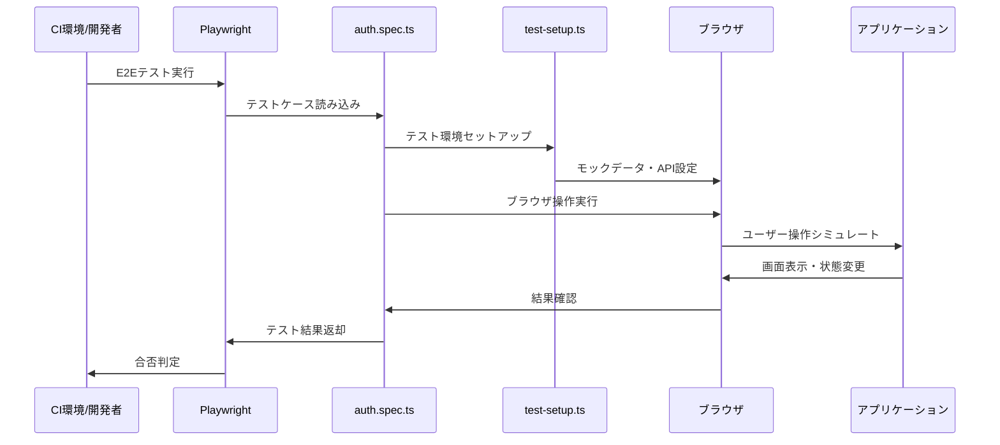
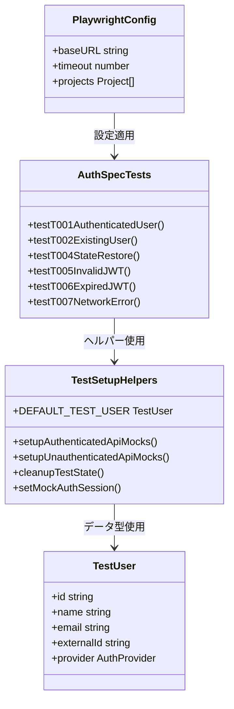

# TASK-401 E2Eテストスイート実装 - コード解説

作成日: 2025-01-10
対象読者: 新人エンジニア

## この機能が何を解決するのか

この機能は「ユーザーが実際にアプリケーションを使った時と同じ環境で、認証フローが正しく動作することを自動的にテストする」ことを解決します。

具体的には：
- ユーザーがログインボタンを押してから、Google認証を経由してダッシュボード画面まで到達する一連の流れ
- ページをリロードした時に認証状態が保持される動作
- JWTトークンが期限切れになった時の適切なエラー処理
- ネットワークエラーが発生した時のフォールバック処理

これを「E2E（End-to-End）テスト」と呼び、実際のブラウザを使ってアプリケーション全体の動作を検証することができます。

## 全体の処理の流れ

### テスト実行フローとファイル関係



## ファイルの役割と責任

### 今回解説するメインのファイル
TASK-401で実装されたE2Eテストの中核ファイル群：

#### `app/client/e2e/auth.spec.ts`
Google OAuth認証フローの7つのテストケース（T001～T007）を実装。各テストが異なるユーザーシナリオ（新規ユーザー、既存ユーザー、エラーケースなど）をカバーしています。

#### `app/client/e2e/helpers/test-setup.ts` 
テスト用のヘルパー関数を提供。APIモックの設定、認証データの準備、テスト後のクリーンアップなどを担当しています。

### 呼び出されているファイル

#### `app/client/playwright.config.ts`
Playwrightテストランナーの設定ファイル。ブラウザ種類、タイムアウト時間、レポート形式などを定義し、Docker環境での実行に最適化されています。

#### `@/packages/shared-schemas/src/auth`
フロントエンドとバックエンドで共有されるAuthProvider型定義。テストでもこの型定義を使用することで、型安全性を確保しています。

## クラスと関数の呼び出し関係

### テストの実行構造と依存関係


## 重要な処理の詳細解説

### テスト環境のモック設定

```typescript
// app/client/e2e/helpers/test-setup.ts
export async function setupAuthenticatedApiMocks(
  page: Page, 
  user: TestUser = DEFAULT_TEST_USER
): Promise<void> {
  // ユーザー情報取得APIのモック
  await page.route('**/api/v1/users/me', async (route) => {
    // 実際のAPIの代わりに、テスト用の固定データを返す
    await route.fulfill({
      status: 200,
      contentType: 'application/json',
      body: JSON.stringify({
        success: true,
        data: user, // テスト用のユーザーデータ
      }),
    });
  });
}
```

この処理が必要である理由は、E2Eテストでは実際のGoogle OAuth認証やバックエンドAPIへの通信を避けて、テスト専用の予測可能なレスポンスを使用したいからです。`page.route()`を使って特定のURLパターンに対するHTTPリクエストを「横取り」し、テスト用のレスポンスを返しています。

よくある勘違いとして「実際のAPIを呼び出さないと本当のテストにならない」と考える人がいますが、E2Eテストの目的は「ユーザー操作フローの検証」であり、「APIサーバーの動作確認」ではありません。APIの動作確認は別途統合テストで行います。

### 認証状態の復元テスト

```typescript
// app/client/e2e/auth.spec.ts
test('T004: ページリロード時の認証状態復元テスト', async ({ page }) => {
  // Given: 認証済みユーザーのセッション情報を設定
  await page.addInitScript((userData) => {
    // LocalStorageに認証データを保存（実際のアプリの動作を模倣）
    const authData = {
      access_token: mockJwt,
      refresh_token: 'mock_refresh_token_for_reload_test',
      user: userData,
      expires_at: Date.now() + 3600 * 1000, // 1時間後まで有効
    };
    localStorage.setItem('sb-localhost-auth-token', JSON.stringify(authData));
  }, authenticatedUser);

  // When: ページをリロード
  await page.reload({ waitUntil: 'domcontentloaded' });

  // Then: 認証状態が維持されていることを確認
  const reloadedUserName = page.locator('h2').filter({ hasText: authenticatedUser.name });
  await expect(reloadedUserName).toBeVisible({ timeout: 5000 });
});
```

このテストでは「SPAアプリケーションでページをリロードした時に、認証状態がLocalStorageから正しく復元される」という実際のユーザー体験をシミュレートしています。`addInitScript()`はページの読み込み前に実行されるJavaScriptコードを注入する機能で、実際のアプリケーションがユーザーの認証情報をLocalStorageに保存している状況を再現できます。

## 初学者がつまずきやすいポイント

### PlaywrightのPage APIについて
Playwrightの`page`オブジェクトは、実際のブラウザページを操作するためのAPIを提供します。

- `page.goto()`: ページに移動（ブラウザのアドレスバーに URL を入力するのと同じ）
- `page.getByRole()`: 要素をセマンティックな役割で取得（ボタン、見出しなど）
- `page.locator()`: CSS セレクターやテキストで要素を特定
- `await expect().toBeVisible()`: 要素が画面に表示されているかを確認

### モック（Mock）とは何か
「モック」とは「偽物」という意味で、テストにおいて実際の外部サービスやAPIの代わりに使用する「ダミーの応答」のことです。例えば実際のGoogle OAuth APIを呼び出す代わりに、「認証成功」というあらかじめ決められた応答を返すように設定します。

### タイムアウトの考え方
```typescript
await expect(loginButton).toBeVisible({ timeout: 10000 });
```

`timeout: 10000` は「10秒間待つ」という意味です。ネットワーク環境や処理の重いCI環境では画面の表示に時間がかかるため、適切な待機時間を設定することが重要です。短すぎると不安定なテストになり、長すぎると開発効率が低下します。

## この設計のいい点

### 1. テストケースの網羅性
T001からT007まで、様々なユーザーシナリオをカバーしています：
- 正常系：認証成功、既存ユーザーログイン
- 異常系：JWT期限切れ、無効トークン、ネットワークエラー
- 境界値：ページリロード時の状態復元

### 2. 保守しやすいヘルパー関数の分離
共通処理を `test-setup.ts` に分離することで：
- テストコードの重複を排除
- テストデータの一元管理（`DEFAULT_TEST_USER`）
- 環境セットアップのロジックを再利用可能

### 3. 実際のユーザー体験に近いテスト設計
モックを使いながらも、実際のブラウザでの操作フローに沿ったテストを実装：
- LocalStorageへの認証データ保存・復元
- Redux状態管理との連携
- 実際の画面表示要素での検証

### 4. CI/CD環境での実行を考慮した設定
`playwright.config.ts`で環境に応じた設定を分岐：
- Docker環境とGitHub Actions環境での異なるbaseURL
- 安定性を重視した直列実行設定（workers: 1）
- 失敗時のスクリーンショット・動画自動記録

このE2Eテストスイートにより、リリース前に主要な認証フローの動作を自動的に検証でき、ユーザーに影響するバグを事前に発見することができます。