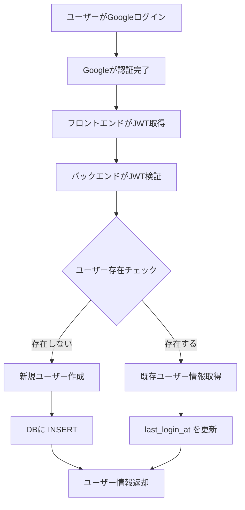
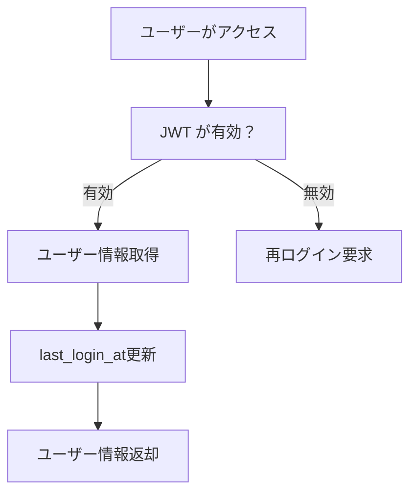

# MVP Google認証 DB設計解説書

作成日: 2025-08-12  
更新日: 2025-08-12

## はじめに

この文書は、MVPのGoogle認証機能で使用するデータベース設計について、DB設計の初学者でも理解できるように詳しく解説します。

実装時の参考として、また他の人に説明する際の資料として活用してください。

## 全体像

### 何を管理するのか？

このシステムでは、以下の情報を管理します：

- **ユーザーアカウント情報**: 誰がシステムを使っているか
- **認証プロバイダー情報**: どのサービス（Google、Apple等）でログインしたか
- **プロファイル情報**: ユーザーの名前、メール、アバター画像等
- **利用履歴**: いつ登録して、最後にいつログインしたか

### システムの特徴

- **プロバイダー非依存**: 将来GoogleだけでなくAppleやMicrosoft等も対応可能
- **JITプロビジョニング**: 初回ログイン時に自動でアカウント作成
- **DDD対応**: ドメイン駆動設計に適したテーブル構造

## テーブル詳細解説

### users テーブル（メインテーブル）

#### 役割
ユーザーの基本情報を管理する**中核テーブル**です。DDD（ドメイン駆動設計）のUser Entityに対応します。

#### テーブル構造
```sql
CREATE TABLE ${DB_TABLE_PREFIX}users (
    id UUID PRIMARY KEY DEFAULT uuid_generate_v4(),
    external_id VARCHAR(255) NOT NULL,
    provider auth_provider_type NOT NULL,
    email VARCHAR(320) NOT NULL,
    name VARCHAR(255) NOT NULL,
    avatar_url TEXT,
    created_at TIMESTAMP WITH TIME ZONE DEFAULT CURRENT_TIMESTAMP,
    updated_at TIMESTAMP WITH TIME ZONE DEFAULT CURRENT_TIMESTAMP,
    last_login_at TIMESTAMP WITH TIME ZONE,
    
    CONSTRAINT unique_external_id_provider UNIQUE (external_id, provider)
);
```

#### 各カラムの意味

| カラム名 | データ型 | 意味 | 具体例 |
|----------|----------|------|--------|
| `id` | UUID | システム内でのユーザー固有ID | `550e8400-e29b-41d4-a716-446655440000` |
| `external_id` | VARCHAR(255) | 外部サービスでのユーザーID | Googleの場合: `103547991597142817347` |
| `provider` | auth_provider_type | どのサービスでログインしたか | `google`, `apple`, `microsoft` など |
| `email` | VARCHAR(320) | メールアドレス | `user@example.com` |
| `name` | VARCHAR(255) | 表示名 | `山田太郎` |
| `avatar_url` | TEXT | プロフィール画像URL | `https://lh3.googleusercontent.com/a/...` |
| `created_at` | TIMESTAMP | アカウント作成日時 | `2025-08-12 10:30:00+09` |
| `updated_at` | TIMESTAMP | 最終更新日時 | `2025-08-12 13:45:00+09` |
| `last_login_at` | TIMESTAMP | 最後のログイン日時 | `2025-08-12 13:45:00+09` |

#### なぜこの設計にしたのか？

**1. UUIDを主キーに選んだ理由**
```sql
id UUID PRIMARY KEY DEFAULT uuid_generate_v4()
```
- **グローバルに一意**: 将来複数のシステムでユーザー情報を統合する時も競合しない
- **予測困難**: 連番（1, 2, 3...）と違って、ユーザー数などが推測されにくい
- **分散対応**: 複数のサーバーでも安全に生成できる

**2. external_idとproviderの組み合わせ**
```sql
external_id VARCHAR(255) NOT NULL,
provider auth_provider_type NOT NULL,
CONSTRAINT unique_external_id_provider UNIQUE (external_id, provider)
```
- **同一人物の複数プロバイダー対応**: 同じ人がGoogleとAppleの両方でログインしても区別できる
- **重複防止**: 同じプロバイダー内では同じexternal_idは1つだけ

**3. メールアドレスの最大長を320文字にした理由**
```sql
email VARCHAR(320) NOT NULL
```
- **RFC 5321準拠**: メールアドレスの技術仕様に従った最大長
- **ローカル部64文字 + @ + ドメイン部255文字 = 320文字**

### auth_provider_type（カスタム型）

#### 役割
認証プロバイダーの種別を管理する**列挙型**です。

```sql
CREATE TYPE auth_provider_type AS ENUM (
    'google',
    'apple', 
    'microsoft',
    'github',
    'facebook',
    'line'
);
```

#### なぜENUM型を使うのか？

**メリット:**
- **データ整合性**: 定義されていない値（例：`yahoo`）は保存できない
- **パフォーマンス**: 文字列より高速で省メモリ
- **自動補完**: アプリケーション側で候補を提示しやすい

**将来対応予定のプロバイダー:**
- `apple`: iOS/macOSユーザー向け
- `microsoft`: 企業ユーザー向け
- `github`: 開発者向け
- `facebook`: 一般ユーザー向け
- `line`: 日本市場向け

## インデックス設計

### なぜインデックスが必要？

インデックスは「データベースの索引」です。辞書で「あ」行を探すときに、最初のページから順番に探すのではなく、索引を使って素早く見つけるのと同じです。

### 設計したインデックス

#### 1. 高速認証用インデックス
```sql
CREATE INDEX idx_users_external_id_provider 
ON ${DB_TABLE_PREFIX}users (external_id, provider);
```

**用途**: ログイン時の「このGoogleアカウントのユーザーはいるかな？」検索
**処理例**: 
```sql
-- この検索が高速になる
SELECT * FROM ${DB_TABLE_PREFIX}users 
WHERE external_id = '103547991597142817347' 
  AND provider = 'google';
```

#### 2. メール検索用インデックス
```sql
CREATE INDEX idx_users_email ON ${DB_TABLE_PREFIX}users (email);
```

**用途**: 
- メールアドレス重複チェック
- 管理画面でのユーザー検索
- サポート時のユーザー特定

#### 3. ログイン履歴用インデックス
```sql
CREATE INDEX idx_users_last_login_at 
ON ${DB_TABLE_PREFIX}users (last_login_at DESC NULLS LAST);
```

**用途**:
- 「最近ログインしたユーザー一覧」の表示
- 非アクティブユーザーの特定
- 管理画面でのソート

## データの流れ

### 1. 初回ログイン（JITプロビジョニング）



**実際のSQL処理:**

1. **存在チェック**
```sql
SELECT * FROM ${DB_TABLE_PREFIX}users 
WHERE external_id = '103547991597142817347' 
  AND provider = 'google';
```

2. **新規作成（存在しない場合）**
```sql
INSERT INTO ${DB_TABLE_PREFIX}users (
    external_id, provider, email, name, avatar_url, last_login_at
) VALUES (
    '103547991597142817347',
    'google',
    'user@example.com',
    '山田太郎',
    'https://lh3.googleusercontent.com/...',
    CURRENT_TIMESTAMP
);
```

3. **ログイン記録更新（存在する場合）**
```sql
UPDATE ${DB_TABLE_PREFIX}users 
SET last_login_at = CURRENT_TIMESTAMP 
WHERE external_id = '103547991597142817347' 
  AND provider = 'google';
```

### 2. 通常ログイン（2回目以降）



**実際の処理:**
```sql
-- ユーザー情報取得と最終ログイン更新を同時実行
UPDATE ${DB_TABLE_PREFIX}users 
SET last_login_at = CURRENT_TIMESTAMP 
WHERE external_id = '103547991597142817347' 
  AND provider = 'google'
RETURNING *;
```

## 業務的観点での解説

### なぜJITプロビジョニング？

**従来方式（事前登録）の問題:**
- ユーザーが「会員登録→メール認証→プロフィール入力」の手間
- 途中で離脱するユーザーが多い

**JIT（Just-In-Time）方式の利点:**
- Googleログイン1回でアカウント作成完了
- 離脱率の大幅削減
- 必要最小限の情報だけ保存

### プライバシー配慮

**保存する情報を最小限に:**
- Googleから取得できる情報は多数ありますが、必要最小限のみ保存
- 機密性の高い情報（生年月日、住所等）は保存しない
- アバター画像は URLのみ保存（実際の画像は Google が管理）

### GDPR等の規制対応

**削除権への対応準備:**
```sql
-- 将来のユーザー削除機能用
DELETE FROM ${DB_TABLE_PREFIX}users 
WHERE id = 'ユーザーID';
```

**データポータビリティ権への対応準備:**
```sql
-- ユーザーのデータをJSON形式でエクスポート
SELECT json_build_object(
    'email', email,
    'name', name,
    'created_at', created_at,
    'last_login_at', last_login_at
) FROM ${DB_TABLE_PREFIX}users 
WHERE id = 'ユーザーID';
```

## プログラム的観点での解説

### DDD（ドメイン駆動設計）対応

#### 1. Aggregateの境界
```typescript
// User Aggregate - 1つのトランザクションで管理される単位
class UserAggregate {
  private user: User;
  
  // ユーザー作成時のビジネスルール
  static createFromOAuth(externalInfo: ExternalUserInfo): UserAggregate {
    // バリデーション: メール形式チェック
    if (!isValidEmail(externalInfo.email)) {
      throw new InvalidEmailError();
    }
    
    // ビジネスルール: 名前の長さ制限
    if (externalInfo.name.length > 255) {
      throw new NameTooLongError();
    }
    
    const user = new User({
      id: generateUUID(),
      externalId: externalInfo.id,
      provider: externalInfo.provider,
      email: externalInfo.email,
      name: externalInfo.name,
      avatarUrl: externalInfo.avatarUrl,
      createdAt: new Date(),
      updatedAt: new Date()
    });
    
    return new UserAggregate(user);
  }
}
```

#### 2. Repository パターン
```typescript
// Domain層のインターフェース
interface IUserRepository {
  findByExternalId(externalId: string, provider: AuthProvider): Promise<User | null>;
  save(user: User): Promise<User>;
}

// Infrastructure層の実装
class PostgreSQLUserRepository implements IUserRepository {
  async findByExternalId(externalId: string, provider: AuthProvider): Promise<User | null> {
    const query = `
      SELECT * FROM ${DB_TABLE_PREFIX}users 
      WHERE external_id = $1 AND provider = $2
    `;
    const result = await this.db.query(query, [externalId, provider]);
    
    return result.rows.length > 0 ? this.mapToEntity(result.rows[0]) : null;
  }
}
```

### トランザクション管理

**ACID特性の確保:**
```sql
BEGIN;
  -- ユーザー作成
  INSERT INTO ${DB_TABLE_PREFIX}users (...) VALUES (...);
  
  -- 将来の拡張: 作成ログの記録
  -- INSERT INTO user_creation_logs (...) VALUES (...);
  
COMMIT;
```

### 同時実行制御

**楽観的ロック（将来対応）:**
```sql
-- updated_atを使ったバージョン管理
UPDATE ${DB_TABLE_PREFIX}users 
SET name = $1, updated_at = CURRENT_TIMESTAMP 
WHERE id = $2 AND updated_at = $3;
```

## セキュリティ考慮事項

### Row Level Security（RLS）

**設定の意味:**
```sql
ALTER TABLE ${DB_TABLE_PREFIX}users ENABLE ROW LEVEL SECURITY;
```

**将来の実装例:**
```sql
-- ユーザーが自分の情報のみ見れるポリシー
CREATE POLICY users_self_access ON ${DB_TABLE_PREFIX}users
    FOR ALL
    USING (auth.jwt() ->> 'sub' = external_id::text);
```

### SQLインジェクション対策

**悪い例（脆弱）:**
```javascript
const query = `SELECT * FROM users WHERE email = '${userInput}'`;
```

**良い例（安全）:**
```javascript
const query = `SELECT * FROM users WHERE email = $1`;
const result = await db.query(query, [userInput]);
```

### データ暗号化

**保存時:**
- PostgreSQL の Transparent Data Encryption
- 機密性の高いカラムは個別暗号化（将来対応）

**転送時:**
- すべての通信でHTTPS使用
- データベース接続もSSL必須

## パフォーマンス最適化

### クエリ最適化

**EXPLAIN ANALYZE での性能確認:**
```sql
EXPLAIN ANALYZE 
SELECT * FROM ${DB_TABLE_PREFIX}users 
WHERE external_id = '103547991597142817347' 
  AND provider = 'google';
```

**期待結果:**
```
Index Scan using idx_users_external_id_provider on ${DB_TABLE_PREFIX}users
  (cost=0.28..8.29 rows=1 width=122) (actual time=0.012..0.013 rows=1 loops=1)
```

### コネクションプール

**設定例:**
```javascript
const pool = new Pool({
  host: 'localhost',
  database: 'postgres',
  user: 'postgres',
  password: process.env.DB_PASSWORD,
  max: 20,        // 最大接続数
  idleTimeoutMillis: 30000,
  connectionTimeoutMillis: 2000,
});
```

## 運用・保守

### 定期メンテナンス

**VACUUM ANALYZE の実行:**
```sql
-- 統計情報更新とゴミデータ削除
VACUUM ANALYZE ${DB_TABLE_PREFIX}users;
```

**インデックス統計の確認:**
```sql
SELECT 
    schemaname, tablename, indexname,
    idx_scan, idx_tup_read, idx_tup_fetch
FROM pg_stat_user_indexes 
WHERE tablename = '${DB_TABLE_PREFIX}users';
```

### バックアップ戦略

**日次バックアップ:**
```bash
pg_dump -h localhost -U postgres -d postgres \
  --table=${DB_TABLE_PREFIX}users \
  --file=users_backup_$(date +%Y%m%d).sql
```

### モニタリング

**重要な監視項目:**
- ユーザー作成数の推移
- ログイン頻度の統計
- レスポンス時間の監視
- エラー発生率

**統計クエリ例:**
```sql
-- 日次新規ユーザー数
SELECT 
    DATE(created_at) as date,
    COUNT(*) as new_users
FROM ${DB_TABLE_PREFIX}users 
WHERE created_at >= CURRENT_DATE - INTERVAL '30 days'
GROUP BY DATE(created_at)
ORDER BY date;
```

## 将来拡張への準備

### 追加予定テーブル

現在のMVPでは実装しませんが、将来以下のテーブルを追加予定：

#### 1. 認証ログテーブル
```sql
CREATE TABLE ${DB_TABLE_PREFIX}auth_logs (
    id UUID PRIMARY KEY DEFAULT uuid_generate_v4(),
    user_id UUID REFERENCES ${DB_TABLE_PREFIX}users(id),
    action VARCHAR(50) NOT NULL, -- 'login', 'logout'
    ip_address INET,
    user_agent TEXT,
    created_at TIMESTAMP WITH TIME ZONE DEFAULT CURRENT_TIMESTAMP
);
```
**用途**: セキュリティ監査、不正アクセス検出

#### 2. セッション管理テーブル
```sql
CREATE TABLE ${DB_TABLE_PREFIX}user_sessions (
    id UUID PRIMARY KEY DEFAULT uuid_generate_v4(),
    user_id UUID REFERENCES ${DB_TABLE_PREFIX}users(id),
    session_token VARCHAR(255) NOT NULL UNIQUE,
    expires_at TIMESTAMP WITH TIME ZONE NOT NULL,
    created_at TIMESTAMP WITH TIME ZONE DEFAULT CURRENT_TIMESTAMP
);
```
**用途**: 高度なセッション制御、同時ログイン数制限

### プロバイダー拡張対応

**現在の設計の利点:**
- `auth_provider_type` ENUMで新しいプロバイダーを簡単追加
- `external_id` + `provider` の組み合わせで一意性確保
- アプリケーション層での抽象化により実装変更最小化

**新プロバイダー追加手順:**
1. ENUMに新しい値追加
2. アプリケーション側でプロバイダー実装追加
3. データベースは変更不要

## まとめ

### 設計のポイント

1. **拡張性**: 将来の機能追加に柔軟に対応できる設計
2. **パフォーマンス**: 適切なインデックス設計により高速な認証処理
3. **セキュリティ**: 最小限の情報保存とアクセス制御
4. **保守性**: DDD原則に従った明確な責務分離

### 開発時の注意点

1. **環境変数の設定**: `DB_TABLE_PREFIX` による環境分離必須
2. **トランザクション**: 複数テーブル操作時は必ずトランザクション使用
3. **バリデーション**: データベース制約とアプリケーション検証の両方実装
4. **テスト**: 異常系（重複、制約違反等）のテストも必須

このDB設計により、スケーラブルで保守しやすいGoogle認証システムが実現できます。実装時に不明な点があれば、この文書を参照して適切な設計判断を行ってください。
