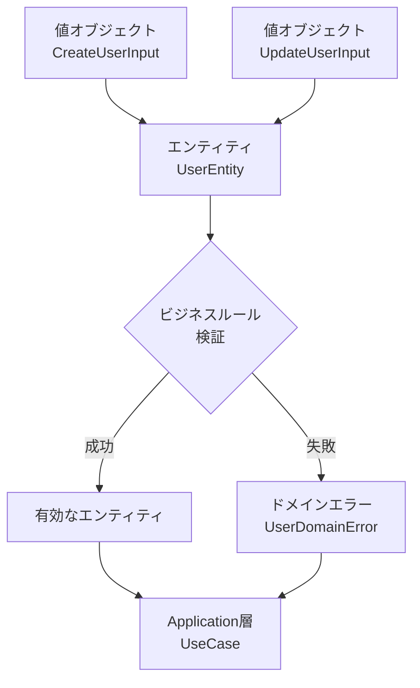
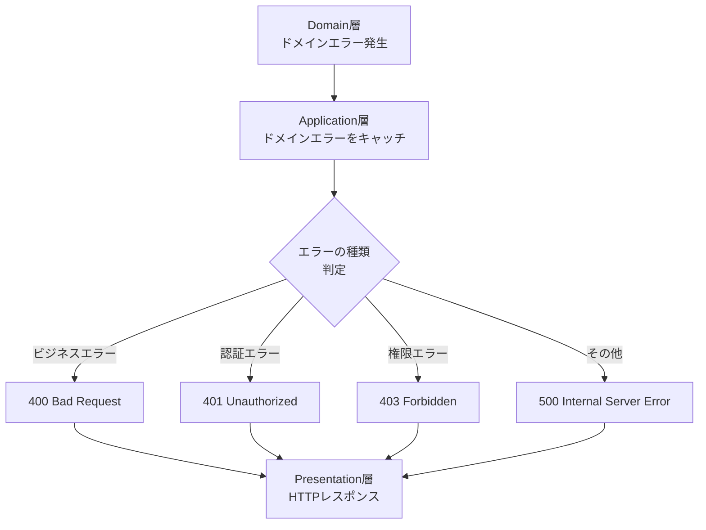
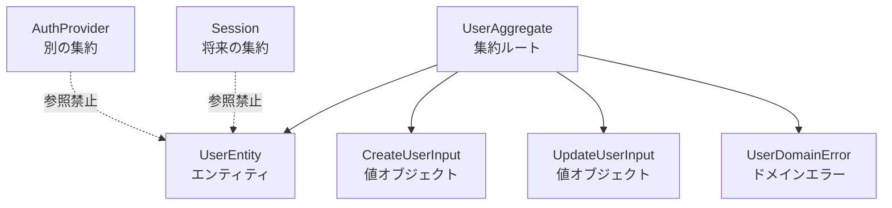

# mvp-google-auth の FAQ

作成日: 2025-08-15  
更新日: 2025-08-15

## Q. ドメイン層 → アプリケーション層 → プレゼンテーション層というようにデータが流れることは理解できたのですが、ドメイン層の内部ではどのように流れていますか？たとえば、Error や 値オブジェクトは、エンティティに流れてからユースケースで使われるのでしょうか？

A. **ドメイン層内部では「値オブジェクト → エンティティ → エラー」の順番でデータが流れます**。ただし、実際の流れはもう少し複雑です。

### ドメイン層内部のデータフロー



### 具体的な流れ

1. **値オブジェクトの作成**：`CreateUserInput`、`UpdateUserInput`がまず作られます
2. **エンティティでの処理**：`UserEntity.create()`や`UserEntity.update()`で値オブジェクトを受け取ります
3. **ビジネスルール検証**：エンティティ内部でバリデーションを実行します
4. **結果の決定**：成功なら有効なエンティティ、失敗ならドメインエラーが発生します

### 実装例での確認

現在のコード（`app/server/src/domain/user/UserEntity.ts:83-103`）を見ると：

```typescript
public static create(input: CreateUserInput): UserEntity {
  // 1. 値オブジェクトの検証
  validateCreateUserInput(input);

  // 2. ビジネスルール検証
  if (!isValidAuthProvider(input.provider)) {
    throw InvalidProviderError.forProvider(input.provider);  // エラー発生
  }

  // 3. 成功時：新しいエンティティを返す
  return new UserEntity({
    id: crypto.randomUUID(),
    externalId: input.externalId,
    // ...その他のプロパティ
  });
}
```

### よくある勘違い

❌ **間違った理解**：「ユースケースがエラーを作って、エンティティに渡す」
✅ **正しい理解**：「エンティティがビジネスルールを検証して、エラーを発生させる」

エラーはドメイン層で発生し、Application層（UseCase）がそれをキャッチして適切に処理します。

---

## Q. 値オブジェクトとエンティティの責任分担がよくわかりません。どちらでバリデーションすべきですか？

A. **値オブジェクトは「形式チェック」、エンティティは「ビジネスルールチェック」を担当します**。

### 責任分担の原則

| 検証タイプ | 担当 | 例 |
|------------|------|-----|
| **形式チェック** | 値オブジェクト | メールアドレスの正規表現、文字数制限 |
| **ビジネスルール** | エンティティ | プロバイダーの妥当性、重複チェック |
| **横断的制約** | UseCase | 外部システムとの整合性チェック |

### 実装例

**値オブジェクト**（`CreateUserInput`）での形式チェック：
```typescript
export function validateCreateUserInput(input: CreateUserInput): void {
  // 形式的な検証のみ
  if (!input.email || !isValidEmail(input.email)) {
    throw new Error('有効なメールアドレスを入力してください');
  }
  
  if (!input.name || input.name.trim().length === 0) {
    throw new Error('名前を入力してください');
  }
}
```

**エンティティ**（`UserEntity`）でのビジネスルール検証：
```typescript
public static create(input: CreateUserInput): UserEntity {
  // まず形式チェック（値オブジェクトに委譲）
  validateCreateUserInput(input);

  // 次にビジネスルール検証（エンティティの責任）
  if (!isValidAuthProvider(input.provider)) {
    throw InvalidProviderError.forProvider(input.provider);
  }
  
  // エンティティ作成
  return new UserEntity({...});
}
```

### なぜこの分担なのか？

- **再利用性**：形式チェックは他の場所でも使える
- **単一責任**：それぞれが明確な責任を持つ
- **テストしやすさ**：形式とビジネスルールを独立してテストできる

---

## Q. ドメインエラーは他の層から直接使っても良いのですか？

A. **Application層からは使えますが、Presentation層やInfrastructure層からは直接使うべきではありません**。

### エラーの流れ方



### 正しい使い方

**✅ Application層での適切な使用**：
```typescript
// AuthenticateUserUseCase.ts
export class AuthenticateUserUseCase {
  async execute(input: AuthenticateUserUseCaseInput) {
    try {
      // ドメインエラーが発生する可能性がある処理
      const user = UserEntity.create(createInput);
      return { user, isNewUser: true };
      
    } catch (error) {
      // ドメインエラーをApplication層でキャッチ
      if (error instanceof UserDomainError) {
        throw new ApplicationError(`ユーザー作成に失敗: ${error.message}`);
      }
      
      if (error instanceof InvalidProviderError) {
        throw new AuthenticationError('認証プロバイダーが無効です');
      }
      
      throw error; // 想定外のエラーは再throw
    }
  }
}
```

**❌ Presentation層での直接使用（避けるべき）**：
```typescript
// AuthController.ts - これはダメ
export class AuthController {
  async verifyToken(request: Request) {
    try {
      // ここでドメインエラーを直接使うのはNG
      if (someCondition) {
        throw new UserDomainError('直接使用はダメ'); // ❌
      }
    } catch (error) {
      // ドメインエラーの詳細をHTTPに直接変換するのもNG
      if (error instanceof UserDomainError) {
        return { status: 400, message: error.message }; // ❌
      }
    }
  }
}
```

### 理由

1. **層の責任分離**：Presentation層はHTTPの責任、Domain層はビジネスルールの責任
2. **セキュリティ**：ドメインエラーの詳細をそのままユーザーに見せるのは危険
3. **保守性**：ドメインエラーの形式が変わってもPresentationに影響しない

---

## Q. エンティティの中で他のエンティティを参照しても良いのですか？

A. **同一集約内なら可能ですが、異なる集約のエンティティは直接参照してはいけません**。

### 集約の境界

現在のmvp-google-authでは、`User`が単一の集約ルートです：



### 正しい参照関係

**✅ 同一集約内での参照**：
```typescript
export class UserEntity {
  // 同じ集約内の値オブジェクトは参照OK
  public update(input: UpdateUserInput): void {
    validateUpdateUserInput(input); // ✅
    
    if (input.name !== undefined) {
      this._name = input.name;
    }
    this._updatedAt = new Date();
  }
}
```

**❌ 異なる集約への直接参照**：
```typescript
export class UserEntity {
  // これはダメ：他の集約のエンティティを直接参照
  public linkWithSession(session: SessionEntity): void { // ❌
    this.sessionId = session.id;
  }
  
  // これもダメ：他の集約のリポジトリを直接使用
  public async validateDuplicateEmail(): Promise<void> { // ❌
    const existing = await userRepository.findByEmail(this.email);
    if (existing) throw new Error('重複');
  }
}
```

### 異なる集約間の協調

異なる集約間でのやり取りはApplication層（UseCase）で行います：

```typescript
// Application層での適切な協調
export class AuthenticateUserUseCase {
  async execute(input: AuthenticateUserUseCaseInput) {
    // 1. User集約での処理
    const user = await this.userRepository.findByExternalId(
      externalInfo.id, 
      externalInfo.provider
    );
    
    // 2. Session集約での処理（将来実装）
    if (user) {
      await this.sessionRepository.create({
        userId: user.id,
        // セッション作成ロジック
      });
    }
    
    return { user };
  }
}
```

### なぜこの制約があるのか？

1. **パフォーマンス**：集約を超えた複雑な参照はデータベースのパフォーマンスを悪化させる
2. **整合性**：集約境界を超えた強整合性は維持が困難
3. **保守性**：集約間の依存が複雑になると変更が困難になる

---

## Q. ファクトリメソッド（create）と通常のコンストラクタはどう使い分けるのですか？

A. **ファクトリメソッドは「ビジネスルール適用済みの新規作成」、コンストラクタは「既存データからの復元」に使い分けます**。

### 使い分けの原則

| メソッド | 用途 | バリデーション | 使用場面 |
|----------|------|----------------|----------|
| **ファクトリメソッド**<br/>`create()` | 新規作成 | 完全実行 | JITプロビジョニング |
| **復元メソッド**<br/>`restore()` | データ復元 | 最小限 | DB読み込み時 |
| **コンストラクタ**<br/>`constructor()` | 内部使用 | なし | ファクトリ内部のみ |

### 実装パターン

**現在のコード例**（`UserEntity.ts`）：

```typescript
export class UserEntity {
  // コンストラクタは private：直接使用を禁止
  private constructor(props: {...}) {
    this.id = props.id;
    this.externalId = props.externalId;
    // バリデーションは行わない（呼び出し元で実施済み前提）
  }

  // ファクトリメソッド：新規作成時
  public static create(input: CreateUserInput): UserEntity {
    // 完全なバリデーション実行
    validateCreateUserInput(input);
    
    if (!isValidAuthProvider(input.provider)) {
      throw InvalidProviderError.forProvider(input.provider);
    }

    // 新しいIDを生成
    const userId = crypto.randomUUID();

    return new UserEntity({
      id: userId,  // 新規ID
      externalId: input.externalId,
      // その他プロパティ
    });
  }

  // 復元メソッド：DB読み込み時
  public static restore(props: {...}): UserEntity {
    // 最小限のチェックのみ（DBデータは信頼できる前提）
    return new UserEntity(props);
  }
}
```

### 呼び出し場面

**ファクトリメソッドの使用**（UseCase内）：
```typescript
// JITプロビジョニング時
export class AuthenticateUserUseCase {
  async execute(input: AuthenticateUserUseCaseInput) {
    // 新規ユーザー作成：ファクトリメソッド使用
    const user = UserEntity.create({
      externalId: externalInfo.id,
      provider: externalInfo.provider,
      email: externalInfo.email,
      name: externalInfo.name,
    }); // 完全なバリデーション実行
    
    await this.userRepository.save(user);
  }
}
```

**復元メソッドの使用**（Repository内）：
```typescript
// DB読み込み時
export class PostgreSQLUserRepository {
  async findByExternalId(externalId: string): Promise<UserEntity | null> {
    const row = await this.db.query(...);
    if (!row) return null;
    
    // DB読み込み：復元メソッド使用
    return UserEntity.restore({
      id: row.id,
      externalId: row.external_id,
      // DBから取得したデータ（バリデーション済み前提）
    });
  }
}
```

### よくある間違い

❌ **コンストラクタを public にする**：
```typescript
// これはダメ：バリデーションなしで作成できてしまう
export class UserEntity {
  public constructor(props: any) { // ❌
    this.email = props.email; // バリデーションなし
  }
}

// 不正なデータでエンティティが作れてしまう
const user = new UserEntity({ email: 'invalid-email' }); // ❌
```

✅ **ファクトリメソッドで制御**：
```typescript
// これが正解：必ずバリデーションを通る
export class UserEntity {
  private constructor(props: any) { // ✅ private
    this.email = props.email;
  }
  
  public static create(input: CreateUserInput): UserEntity { // ✅
    validateCreateUserInput(input); // 必ずバリデーション
    return new UserEntity(input);
  }
}
```

この設計により、「有効でないエンティティは絶対に作成されない」ことが保証されます。

---

## Q. ドメインサービスとエンティティのメソッド、どちらに処理を書くべきか迷います

A. **単一エンティティの責任なら「エンティティのメソッド」、複数エンティティの協調や外部知識が必要なら「ドメインサービス」に書きます**。

### 判断基準

| 処理の特徴 | 配置場所 | 理由 |
|------------|----------|------|
| **単一エンティティの状態変更** | エンティティ | そのエンティティの責任 |
| **複数エンティティの協調** | ドメインサービス | 中立的な立場で調整 |
| **外部知識・ポリシーの適用** | ドメインサービス | エンティティが知るべきでない知識 |

### エンティティに配置すべき処理

**現在のコード例**：
```typescript
export class UserEntity {
  // ✅ 自分自身の状態変更：エンティティの責任
  public recordLogin(): void {
    this._lastLoginAt = new Date();
    this._updatedAt = new Date();
  }
  
  // ✅ 自分自身の状態判定：エンティティの責任
  public isNewUser(): boolean {
    const oneMinuteAgo = new Date(Date.now() - 60 * 1000);
    return this.createdAt > oneMinuteAgo;
  }
  
  // ✅ 自分自身のバリデーション：エンティティの責任
  public update(input: UpdateUserInput): void {
    validateUpdateUserInput(input);
    
    if (input.name !== undefined) {
      this._name = input.name;
    }
    this._updatedAt = new Date();
  }
}
```

### ドメインサービスに配置すべき処理

**将来実装する可能性のある例**：

```typescript
// 複数エンティティの協調が必要な処理
export class UserDomainService {
  /**
   * ✅ 重複ユーザーチェック：複数の検索軸が必要
   * - メールアドレスでの重複
   * - 外部IDでの重複  
   * - 名前の類似チェック
   */
  async checkDuplicateUser(
    email: string, 
    externalId: string, 
    provider: AuthProvider,
    userRepository: IUserRepository
  ): Promise<UserEntity | null> {
    // 複数の検索条件で重複チェック
    const byEmail = await userRepository.findByEmail(email);
    const byExternalId = await userRepository.findByExternalId(externalId, provider);
    
    // 複雑な重複判定ロジック
    if (byEmail && byExternalId && byEmail.id !== byExternalId.id) {
      throw new ConflictingUserError('異なるアカウントで同じメールアドレスが使用されています');
    }
    
    return byEmail || byExternalId;
  }
  
  /**
   * ✅ アカウント統合：複数エンティティの協調
   */
  async mergeUserAccounts(
    primaryUser: UserEntity, 
    secondaryUser: UserEntity
  ): Promise<UserEntity> {
    // 2つのユーザーアカウントをマージ
    // 複雑なビジネスルールを適用
  }
  
  /**
   * ✅ ユーザーランク判定：外部知識の適用
   */
  determineUserRank(user: UserEntity, config: UserRankConfig): UserRank {
    // 外部設定に基づくランク判定
    // エンティティが設定の詳細を知る必要はない
  }
}
```

### よくある間違った配置

❌ **エンティティに外部知識を持ち込む**：
```typescript
export class UserEntity {
  // これはダメ：エンティティが外部設定を知っている
  public getRank(): UserRank { // ❌
    if (this.createdAt > PREMIUM_THRESHOLD) {
      return UserRank.PREMIUM;
    }
    return UserRank.BASIC;
  }
  
  // これもダメ：エンティティがリポジトリを知っている
  public async checkEmailDuplicate(repo: IUserRepository): Promise<void> { // ❌
    const existing = await repo.findByEmail(this.email);
    if (existing) throw new Error('重複');
  }
}
```

✅ **適切なドメインサービス使用**：
```typescript
export class UserEntity {
  // ✅ 自分自身の基本的な状態のみ
  public toObject() {
    return {
      id: this.id,
      email: this._email,
      // ...
    };
  }
}

export class UserDomainService {
  // ✅ 外部知識はサービスで管理
  determineUserRank(user: UserEntity, config: UserRankConfig): UserRank {
    // 複雑な判定ロジック
  }
  
  // ✅ 外部依存が必要な処理はサービスで
  async validateEmailUniqueness(
    email: string, 
    userRepository: IUserRepository
  ): Promise<void> {
    // 重複チェック処理
  }
}
```

### mvp-google-authでの現状

現在のMVPでは複雑なドメインサービスは不要で、`UserEntity`のメソッドだけで十分です。しかし、将来以下の機能を追加する際はドメインサービスが必要になります：

- アカウント統合機能
- 複雑な重複チェック
- ユーザーランク・権限管理
- 複数プロバイダー間の調整

この判断基準を覚えておくと、機能拡張時にどこに処理を配置すべきかが明確になります。

---

## Q. TASK102で追加されたUserAggregateとUserEntityの違いがよくわかりません。なぜ両方が必要なのですか？

A. **UserEntityは「ユーザーという概念そのもの」、UserAggregateは「ユーザーの永続化やビジネスルールの管理を含めた操作単位」です**。

### エンティティとアグリゲートの役割分担

| 要素 | 責任 | TASK102での実装例 |
|------|------|-------------------|
| **UserEntity** | ユーザーの状態・振る舞い | `recordLogin()`、`isNewUser()`、`update()` |
| **UserAggregate** | 永続化・トランザクション境界 | `createNew()`、`recordLogin()`でのDB更新 |

### 具体的な違い

**UserEntity**（ドメインの純粋な表現）：
```typescript
export class UserEntity {
  // ✅ ユーザー自身の状態変更
  public recordLogin(): void {
    this._lastLoginAt = new Date();
    this._updatedAt = new Date();
    // ※DBへの保存はしない（メモリ内での状態変更のみ）
  }
  
  // ✅ ユーザー自身の判定ロジック
  public isNewUser(): boolean {
    const oneMinuteAgo = new Date(Date.now() - 60 * 1000);
    return this.createdAt > oneMinuteAgo;
  }
}
```

**UserAggregate**（永続化を含む操作単位）：
```typescript
export class UserAggregate {
  // ✅ 永続化を含むビジネス操作
  public async recordLogin(): Promise<UserEntity> {
    const now = new Date();
    
    // 1. エンティティの状態変更
    this.userEntity.recordLogin();
    
    // 2. データベースに永続化
    const updatedUser = await this.userRepository.update(this.userEntity.id, {
      lastLoginAt: now,
    });
    
    // 3. 更新されたエンティティを返却
    return UserEntity.restore(updatedUser);
  }
}
```

### なぜ分離するのか？

1. **純粋性の保持**：UserEntityはDBやHTTPを知らない純粋なドメイン概念
2. **テストしやすさ**：UserEntityは外部依存なしでテストできる
3. **再利用性**：UserEntityは異なる永続化方法（Redis、ファイル等）でも使える

### よくある間違い

❌ **エンティティで直接DB操作**：
```typescript
export class UserEntity {
  // これはダメ：エンティティがリポジトリを知っている
  public async saveLogin(repository: IUserRepository): Promise<void> { // ❌
    this._lastLoginAt = new Date();
    await repository.update(this.id, { lastLoginAt: this._lastLoginAt });
  }
}
```

✅ **アグリゲートでDB操作を管理**：
```typescript
export class UserAggregate {
  // これが正解：アグリゲートが永続化を管理
  public async recordLogin(): Promise<UserEntity> { // ✅
    this.userEntity.recordLogin(); // エンティティの状態変更
    const updated = await this.userRepository.update(...); // DB更新
    return UserEntity.restore(updated);
  }
}
```

---

## Q. AuthenticationDomainServiceの責任範囲がよくわかりません。なぜUserAggregateではなくDomainServiceでJITプロビジョニングを実装したのですか？

A. **JITプロビジョニングは「複数の判定軸」と「外部知識」が必要な処理なので、DomainServiceの責任だからです**。

### JITプロビジョニングの複雑性

**実装箇所**（`AuthenticationDomainService.ts:45-82`）：
```typescript
async createUserFromExternalInfo(externalInfo: ExternalUserInfo): Promise<UserEntity> {
  // 1. プロバイダー検証（外部知識）
  if (!this.isValidProvider(externalInfo.provider)) {
    throw InvalidProviderError.forProvider(externalInfo.provider);
  }
  
  // 2. 重複チェック（複数検索軸）
  const existingUser = await this.userRepository.findByExternalId(
    externalInfo.id,
    externalInfo.provider as AuthProvider,
  );
  
  // 3. 冪等性の保証（既存ユーザーがいたら返す）
  if (existingUser) {
    return UserEntity.restore(existingUser);
  }
  
  // 4. 新規作成・永続化
  const createInput: CreateUserInput = { /* ... */ };
  const newUser = UserEntity.create(createInput);
  const createdUser = await this.userRepository.create(createInput);
  
  return UserEntity.restore(createdUser);
}
```

### なぜDomainServiceなのか？

| 複雑性の要因 | UserAggregateでは困難な理由 | DomainServiceが適切な理由 |
|-------------|---------------------------|-------------------------|
| **外部知識** | プロバイダー検証ルールをエンティティが知るべきでない | 認証プロバイダーに関する外部知識を集約 |
| **複数検索** | アグリゲートが複数の検索軸を持つと複雑化 | 中立的な立場で複数検索を調整 |
| **冪等性** | 既存チェック+作成の組み合わせが複雑 | 処理全体の整合性を管理 |

### 間違った実装例

❌ **UserAggregateでJIT実装（複雑になる）**：
```typescript
export class UserAggregate {
  // これはダメ：アグリゲートが外部知識を持つ
  public static async createFromExternalInfo(
    externalInfo: ExternalUserInfo,
    userRepository: IUserRepository
  ): Promise<UserAggregate> { // ❌
    
    // プロバイダー検証をアグリゲートで実装（外部知識の混入）
    const VALID_PROVIDERS = ['google', 'apple']; // ❌ 外部知識
    if (!VALID_PROVIDERS.includes(externalInfo.provider)) {
      throw new Error('不正なプロバイダー');
    }
    
    // 複数検索をアグリゲートで実装（複雑化）
    const byExternal = await userRepository.findByExternalId(...);
    const byEmail = await userRepository.findByEmail(externalInfo.email); // ❌ 複雑
    
    // 冲突処理をアグリゲートで実装（責任過多）
    if (byExternal && byEmail && byExternal.id !== byEmail.id) { // ❌ 複雑
      throw new Error('アカウント冲突');
    }
    
    // アグリゲートが責任過多になる
  }
}
```

✅ **DomainServiceでJIT実装（適切）**：
```typescript
export class AuthenticationDomainService {
  // ✅ 認証に関する外部知識を集約
  private readonly VALID_PROVIDERS = new Set<AuthProvider>([
    'google', 'apple', 'microsoft', 'github', 'facebook', 'line',
  ]);
  
  // ✅ 複数エンティティにまたがる複雑な処理を管理
  async createUserFromExternalInfo(externalInfo: ExternalUserInfo): Promise<UserEntity> {
    // 外部知識の適用
    if (!this.isValidProvider(externalInfo.provider)) {
      throw InvalidProviderError.forProvider(externalInfo.provider);
    }
    
    // 複数検索・冲突解決の調整
    const existingUser = await this.userRepository.findByExternalId(...);
    
    // 処理の冪等性保証
    if (existingUser) {
      return UserEntity.restore(existingUser);
    }
    
    // 純粋なエンティティ作成はUserEntityに委譲
    const newUser = UserEntity.create(createInput);
    const createdUser = await this.userRepository.create(createInput);
    
    return UserEntity.restore(createdUser);
  }
}
```

### DomainServiceとAggregateの協調

UseCase内で適切に使い分けます：

```typescript
export class AuthenticateUserUseCase {
  async execute(input: AuthenticateUserUseCaseInput) {
    // 1. DomainServiceで複雑な認証処理
    const { user, isNewUser } = await this.authenticationDomainService
      .authenticateUser(externalInfo);
    
    // 2. Aggregateで永続化を伴う状態変更
    const userAggregate = UserAggregate.fromEntity(user, this.userRepository);
    const updatedUser = await userAggregate.recordLogin();
    
    return { user: updatedUser, isNewUser };
  }
}
```

この設計により、「複雑なビジネスロジック」はDomainService、「永続化を伴う状態管理」はAggregateと、適切に責任分担されています。

---

## Q. CreateUserInputやUpdateUserInputなどの値オブジェクトは、なぜinterfaceで定義してclassにしないのですか？

A. **値オブジェクトの特性によってinterfaceとclassを使い分けています。データ転送が主目的ならinterface、振る舞いが重要ならclassを選択します**。

### TASK102での値オブジェクト設計

**interface型の値オブジェクト**（`CreateUserInput.ts`）：
```typescript
// ✅ データ転送が主目的：interface
export interface CreateUserInput {
  readonly externalId: string;
  readonly provider: AuthProvider;
  readonly email: string;
  readonly name: string;
  readonly avatarUrl?: string;
}

// ✅ 検証ロジックは分離された関数
export function validateCreateUserInput(input: CreateUserInput): void {
  const errors: string[] = [];
  
  if (!input.externalId?.trim()) {
    errors.push('外部IDは必須です');
  }
  
  if (input.email && !isValidEmail(input.email)) {
    errors.push('メールアドレスの形式が正しくありません');
  }
  
  if (errors.length > 0) {
    throw new Error(`入力値検証エラー: ${errors.join(', ')}`);
  }
}
```

### なぜinterfaceを選択したのか？

| 特徴 | interface | class | TASK102での選択 |
|------|-----------|-------|----------------|
| **主な用途** | データ構造定義 | 振る舞い+データ | データ転送 → interface |
| **型チェック** | コンパイル時のみ | 実行時も可能 | コンパイル時で十分 |
| **メモリ使用量** | 0（型情報のみ） | インスタンス作成 | 軽量性重視 → interface |
| **JSON連携** | 自然 | シリアライズ必要 | APIとの連携 → interface |

### classベースの値オブジェクト（より複雑な場合）

**将来実装するかもしれない例**：
```typescript
// より複雑な値オブジェクトの場合はclass
export class EmailAddress {
  private readonly _value: string;
  
  private constructor(value: string) {
    this._value = value;
  }
  
  public static create(email: string): EmailAddress {
    if (!this.isValidFormat(email)) {
      throw new Error('無効なメールアドレス形式');
    }
    
    if (this.isDisposableEmail(email)) {
      throw new Error('使い捨てメールアドレスは使用できません');
    }
    
    return new EmailAddress(email);
  }
  
  // ✅ 値オブジェクトとしての振る舞い
  public getDomain(): string {
    return this._value.split('@')[1];
  }
  
  public isCorporateEmail(): boolean {
    const corporateDomains = ['company.com', 'enterprise.jp'];
    return corporateDomains.includes(this.getDomain());
  }
  
  public equals(other: EmailAddress): boolean {
    return this._value === other._value;
  }
  
  public toString(): string {
    return this._value;
  }
  
  private static isValidFormat(email: string): boolean {
    // 複雑な検証ロジック
  }
  
  private static isDisposableEmail(email: string): boolean {
    // 使い捨てメール判定ロジック
  }
}
```

### 現在のinterfaceアプローチの利点

**簡潔で実用的**：
```typescript
// ✅ シンプルで理解しやすい
const createInput: CreateUserInput = {
  externalId: 'google_123456789',
  provider: 'google',
  email: 'user@example.com',
  name: '山田太郎',
};

// ✅ 検証は関数で実行
validateCreateUserInput(createInput);

// ✅ エンティティ作成に渡す
const user = UserEntity.create(createInput);
```

**JSON APIとの親和性**：
```typescript
// ✅ APIからのデータをそのまま型付け
app.post('/api/users', (req, res) => {
  const input: CreateUserInput = req.body; // 自然な変換
  validateCreateUserInput(input);
  
  const user = UserEntity.create(input);
  // ...
});
```

### いつclassに移行すべきか？

以下の特徴が必要になったら、classベースの値オブジェクトを検討：

1. **複雑な検証ロジック**：単純な形式チェックを超える場合
2. **値特有の振る舞い**：計算や変換処理が必要な場合
3. **不変性の強制**：値の変更を完全に防ぎたい場合
4. **等価性の比較**：カスタムの等価性判定が必要な場合

### 現在の設計の判断

MVP段階では以下の理由でinterfaceが適切：

- **シンプル性**：学習コストが低い
- **軽量性**：メモリ使用量が少ない
- **実用性**：APIとの連携が簡単
- **段階的拡張**：必要に応じてclassに移行可能

将来的に要件が複雑化したら、段階的にclassベースの値オブジェクトに移行できる設計になっています。

---

## Q. AuthProviderの定数定義で `as const` を使っているのはなぜですか？普通のobjectとどう違うのですか？

A. **`as const`により「型レベルでの厳密な制約」と「実行時の安全性」を両立し、新しいプロバイダー追加時の型安全性を確保しているからです**。

### `as const`ありなしの違い

**TASK102の実装**（`AuthProvider.ts:7-28`）：
```typescript
// ✅ as const 使用
export const AuthProviders = {
  GOOGLE: 'google',
  APPLE: 'apple',
  MICROSOFT: 'microsoft',
  GITHUB: 'github',
  FACEBOOK: 'facebook',
  LINE: 'line',
} as const;

export type AuthProvider = (typeof AuthProviders)[keyof typeof AuthProviders];
```

**as constなしの場合**：
```typescript
// ❌ as const なし
export const AuthProviders = {
  GOOGLE: 'google',
  APPLE: 'apple',
  // ...
}; // as const なし

export type AuthProvider = (typeof AuthProviders)[keyof typeof AuthProviders];
```

### 型レベルでの違い

| コード | `as const` あり | `as const` なし |
|--------|----------------|----------------|
| **推論される型** | `{ readonly GOOGLE: "google"; readonly APPLE: "apple"; ... }` | `{ GOOGLE: string; APPLE: string; ... }` |
| **AuthProvider型** | `"google" \| "apple" \| "microsoft" \| ...` | `string` |
| **型安全性** | 厳密な文字列リテラル型 | 任意の文字列 |

### 実際の影響

**✅ as constありの場合（厳密な型チェック）**：
```typescript
function processAuth(provider: AuthProvider) {
  // ✅ コンパイル時にチェックされる
}

processAuth('google');     // ✅ OK
processAuth('invalid');    // ❌ コンパイルエラー
processAuth(AuthProviders.GOOGLE); // ✅ OK

// ✅ switch文で漏れをチェック
function handleProvider(provider: AuthProvider) {
  switch (provider) {
    case 'google':
    case 'apple':
      return 'OK';
    // default がないと TypeScript がエラー（網羅性チェック）
  }
}
```

**❌ as constなしの場合（緩い型チェック）**：
```typescript
function processAuth(provider: AuthProvider) {
  // AuthProvider = string なので何でも通る
}

processAuth('google');     // ✅ OK
processAuth('invalid');    // ✅ OK（本来はエラーにしたい）
processAuth('typo');       // ✅ OK（タイポも通ってしまう）

// ❌ switch文でも網羅性チェックができない
function handleProvider(provider: AuthProvider) {
  switch (provider) {
    case 'google':
      return 'OK';
    // default なしでもエラーにならない（string型のため）
  }
}
```

### 実行時の安全性も確保

**検証関数での型ガード**（`AuthProvider.ts:38-42`）：
```typescript
export function isValidAuthProvider(
  provider: string,
): provider is AuthProvider {
  return Object.values(AuthProviders).includes(provider as AuthProvider);
}

// 使用例：実行時の型ガード
function authenticateUser(providerString: string) {
  if (isValidAuthProvider(providerString)) {
    // この時点で providerString は AuthProvider 型として扱える
    processAuth(providerString); // ✅ 型安全
  } else {
    throw new Error(`不正なプロバイダー: ${providerString}`);
  }
}
```

### 新規プロバイダー追加時の利点

**プロバイダー追加時**：
```typescript
export const AuthProviders = {
  GOOGLE: 'google',
  APPLE: 'apple',
  MICROSOFT: 'microsoft',
  GITHUB: 'github',
  FACEBOOK: 'facebook',
  LINE: 'line',
  DISCORD: 'discord', // ✅ 新規追加
} as const;
```

**自動的に型チェックが更新**：
```typescript
function handleProvider(provider: AuthProvider) {
  switch (provider) {
    case 'google':
    case 'apple':
    case 'microsoft':
    case 'github':
    case 'facebook':
    case 'line':
      return 'handled';
    // ❌ 'discord' がないためコンパイルエラー
    // → 自動的に追加漏れを検出
  }
}
```

### 代替案との比較

**enum使用**：
```typescript
// 代替案1: enum
export enum AuthProvider {
  GOOGLE = 'google',
  APPLE = 'apple',
  // ...
}

// 利点: 型安全性、名前空間分離
// 欠点: より重い、JavaScript出力が複雑
```

**単純なunion型**：
```typescript
// 代替案2: 直接union型定義
export type AuthProvider = 'google' | 'apple' | 'microsoft' | 'github' | 'facebook' | 'line';

// 利点: 最軽量
// 欠点: 定数オブジェクトがない、実行時チェックが困難
```

### TASK102での選択理由

現在の `as const` アプローチが選ばれた理由：

1. **型安全性**：厳密な文字列リテラル型
2. **実行時安全性**：`Object.values()`で検証可能
3. **軽量性**：enumより軽い
4. **拡張性**：新規プロバイダー追加が簡単
5. **可読性**：定数名でアクセス可能

この設計により、コンパイル時と実行時の両方で安全性を確保しながら、軽量で拡張しやすい認証プロバイダー管理が実現されています。