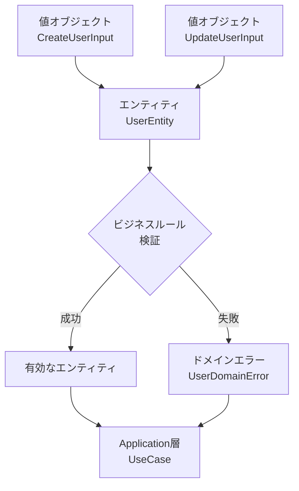
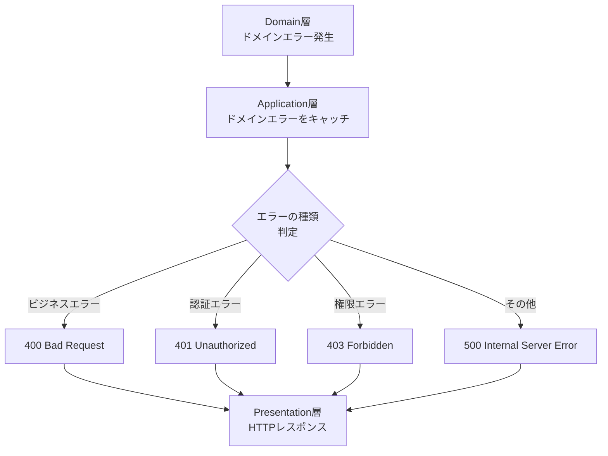
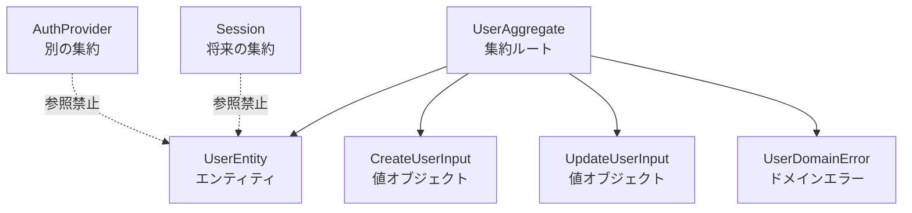

# mvp-google-auth の FAQ

作成日: 2025-08-15  
更新日: 2025-08-15

## Q. ドメイン層 → アプリケーション層 → プレゼンテーション層というようにデータが流れることは理解できたのですが、ドメイン層の内部ではどのように流れていますか？たとえば、Error や 値オブジェクトは、エンティティに流れてからユースケースで使われるのでしょうか？

A. **ドメイン層内部では「値オブジェクト → エンティティ → エラー」の順番でデータが流れます**。ただし、実際の流れはもう少し複雑です。

### ドメイン層内部のデータフロー



### 具体的な流れ

1. **値オブジェクトの作成**：`CreateUserInput`、`UpdateUserInput`がまず作られます
2. **エンティティでの処理**：`UserEntity.create()`や`UserEntity.update()`で値オブジェクトを受け取ります
3. **ビジネスルール検証**：エンティティ内部でバリデーションを実行します
4. **結果の決定**：成功なら有効なエンティティ、失敗ならドメインエラーが発生します

### 実装例での確認

現在のコード（`app/server/src/domain/user/UserEntity.ts:83-103`）を見ると：

```typescript
public static create(input: CreateUserInput): UserEntity {
  // 1. 値オブジェクトの検証
  validateCreateUserInput(input);

  // 2. ビジネスルール検証
  if (!isValidAuthProvider(input.provider)) {
    throw InvalidProviderError.forProvider(input.provider);  // エラー発生
  }

  // 3. 成功時：新しいエンティティを返す
  return new UserEntity({
    id: crypto.randomUUID(),
    externalId: input.externalId,
    // ...その他のプロパティ
  });
}
```

### よくある勘違い

❌ **間違った理解**：「ユースケースがエラーを作って、エンティティに渡す」
✅ **正しい理解**：「エンティティがビジネスルールを検証して、エラーを発生させる」

エラーはドメイン層で発生し、Application層（UseCase）がそれをキャッチして適切に処理します。

---

## Q. 値オブジェクトとエンティティの責任分担がよくわかりません。どちらでバリデーションすべきですか？

A. **値オブジェクトは「形式チェック」、エンティティは「ビジネスルールチェック」を担当します**。

### 責任分担の原則

| 検証タイプ | 担当 | 例 |
|------------|------|-----|
| **形式チェック** | 値オブジェクト | メールアドレスの正規表現、文字数制限 |
| **ビジネスルール** | エンティティ | プロバイダーの妥当性、重複チェック |
| **横断的制約** | UseCase | 外部システムとの整合性チェック |

### 実装例

**値オブジェクト**（`CreateUserInput`）での形式チェック：
```typescript
export function validateCreateUserInput(input: CreateUserInput): void {
  // 形式的な検証のみ
  if (!input.email || !isValidEmail(input.email)) {
    throw new Error('有効なメールアドレスを入力してください');
  }
  
  if (!input.name || input.name.trim().length === 0) {
    throw new Error('名前を入力してください');
  }
}
```

**エンティティ**（`UserEntity`）でのビジネスルール検証：
```typescript
public static create(input: CreateUserInput): UserEntity {
  // まず形式チェック（値オブジェクトに委譲）
  validateCreateUserInput(input);

  // 次にビジネスルール検証（エンティティの責任）
  if (!isValidAuthProvider(input.provider)) {
    throw InvalidProviderError.forProvider(input.provider);
  }
  
  // エンティティ作成
  return new UserEntity({...});
}
```

### なぜこの分担なのか？

- **再利用性**：形式チェックは他の場所でも使える
- **単一責任**：それぞれが明確な責任を持つ
- **テストしやすさ**：形式とビジネスルールを独立してテストできる

---

## Q. ドメインエラーは他の層から直接使っても良いのですか？

A. **Application層からは使えますが、Presentation層やInfrastructure層からは直接使うべきではありません**。

### エラーの流れ方



### 正しい使い方

**✅ Application層での適切な使用**：
```typescript
// AuthenticateUserUseCase.ts
export class AuthenticateUserUseCase {
  async execute(input: AuthenticateUserUseCaseInput) {
    try {
      // ドメインエラーが発生する可能性がある処理
      const user = UserEntity.create(createInput);
      return { user, isNewUser: true };
      
    } catch (error) {
      // ドメインエラーをApplication層でキャッチ
      if (error instanceof UserDomainError) {
        throw new ApplicationError(`ユーザー作成に失敗: ${error.message}`);
      }
      
      if (error instanceof InvalidProviderError) {
        throw new AuthenticationError('認証プロバイダーが無効です');
      }
      
      throw error; // 想定外のエラーは再throw
    }
  }
}
```

**❌ Presentation層での直接使用（避けるべき）**：
```typescript
// AuthController.ts - これはダメ
export class AuthController {
  async verifyToken(request: Request) {
    try {
      // ここでドメインエラーを直接使うのはNG
      if (someCondition) {
        throw new UserDomainError('直接使用はダメ'); // ❌
      }
    } catch (error) {
      // ドメインエラーの詳細をHTTPに直接変換するのもNG
      if (error instanceof UserDomainError) {
        return { status: 400, message: error.message }; // ❌
      }
    }
  }
}
```

### 理由

1. **層の責任分離**：Presentation層はHTTPの責任、Domain層はビジネスルールの責任
2. **セキュリティ**：ドメインエラーの詳細をそのままユーザーに見せるのは危険
3. **保守性**：ドメインエラーの形式が変わってもPresentationに影響しない

---

## Q. エンティティの中で他のエンティティを参照しても良いのですか？

A. **同一集約内なら可能ですが、異なる集約のエンティティは直接参照してはいけません**。

### 集約の境界

現在のmvp-google-authでは、`User`が単一の集約ルートです：



### 正しい参照関係

**✅ 同一集約内での参照**：
```typescript
export class UserEntity {
  // 同じ集約内の値オブジェクトは参照OK
  public update(input: UpdateUserInput): void {
    validateUpdateUserInput(input); // ✅
    
    if (input.name !== undefined) {
      this._name = input.name;
    }
    this._updatedAt = new Date();
  }
}
```

**❌ 異なる集約への直接参照**：
```typescript
export class UserEntity {
  // これはダメ：他の集約のエンティティを直接参照
  public linkWithSession(session: SessionEntity): void { // ❌
    this.sessionId = session.id;
  }
  
  // これもダメ：他の集約のリポジトリを直接使用
  public async validateDuplicateEmail(): Promise<void> { // ❌
    const existing = await userRepository.findByEmail(this.email);
    if (existing) throw new Error('重複');
  }
}
```

### 異なる集約間の協調

異なる集約間でのやり取りはApplication層（UseCase）で行います：

```typescript
// Application層での適切な協調
export class AuthenticateUserUseCase {
  async execute(input: AuthenticateUserUseCaseInput) {
    // 1. User集約での処理
    const user = await this.userRepository.findByExternalId(
      externalInfo.id, 
      externalInfo.provider
    );
    
    // 2. Session集約での処理（将来実装）
    if (user) {
      await this.sessionRepository.create({
        userId: user.id,
        // セッション作成ロジック
      });
    }
    
    return { user };
  }
}
```

### なぜこの制約があるのか？

1. **パフォーマンス**：集約を超えた複雑な参照はデータベースのパフォーマンスを悪化させる
2. **整合性**：集約境界を超えた強整合性は維持が困難
3. **保守性**：集約間の依存が複雑になると変更が困難になる

---

## Q. ファクトリメソッド（create）と通常のコンストラクタはどう使い分けるのですか？

A. **ファクトリメソッドは「ビジネスルール適用済みの新規作成」、コンストラクタは「既存データからの復元」に使い分けます**。

### 使い分けの原則

| メソッド | 用途 | バリデーション | 使用場面 |
|----------|------|----------------|----------|
| **ファクトリメソッド**<br/>`create()` | 新規作成 | 完全実行 | JITプロビジョニング |
| **復元メソッド**<br/>`restore()` | データ復元 | 最小限 | DB読み込み時 |
| **コンストラクタ**<br/>`constructor()` | 内部使用 | なし | ファクトリ内部のみ |

### 実装パターン

**現在のコード例**（`UserEntity.ts`）：

```typescript
export class UserEntity {
  // コンストラクタは private：直接使用を禁止
  private constructor(props: {...}) {
    this.id = props.id;
    this.externalId = props.externalId;
    // バリデーションは行わない（呼び出し元で実施済み前提）
  }

  // ファクトリメソッド：新規作成時
  public static create(input: CreateUserInput): UserEntity {
    // 完全なバリデーション実行
    validateCreateUserInput(input);
    
    if (!isValidAuthProvider(input.provider)) {
      throw InvalidProviderError.forProvider(input.provider);
    }

    // 新しいIDを生成
    const userId = crypto.randomUUID();

    return new UserEntity({
      id: userId,  // 新規ID
      externalId: input.externalId,
      // その他プロパティ
    });
  }

  // 復元メソッド：DB読み込み時
  public static restore(props: {...}): UserEntity {
    // 最小限のチェックのみ（DBデータは信頼できる前提）
    return new UserEntity(props);
  }
}
```

### 呼び出し場面

**ファクトリメソッドの使用**（UseCase内）：
```typescript
// JITプロビジョニング時
export class AuthenticateUserUseCase {
  async execute(input: AuthenticateUserUseCaseInput) {
    // 新規ユーザー作成：ファクトリメソッド使用
    const user = UserEntity.create({
      externalId: externalInfo.id,
      provider: externalInfo.provider,
      email: externalInfo.email,
      name: externalInfo.name,
    }); // 完全なバリデーション実行
    
    await this.userRepository.save(user);
  }
}
```

**復元メソッドの使用**（Repository内）：
```typescript
// DB読み込み時
export class PostgreSQLUserRepository {
  async findByExternalId(externalId: string): Promise<UserEntity | null> {
    const row = await this.db.query(...);
    if (!row) return null;
    
    // DB読み込み：復元メソッド使用
    return UserEntity.restore({
      id: row.id,
      externalId: row.external_id,
      // DBから取得したデータ（バリデーション済み前提）
    });
  }
}
```

### よくある間違い

❌ **コンストラクタを public にする**：
```typescript
// これはダメ：バリデーションなしで作成できてしまう
export class UserEntity {
  public constructor(props: any) { // ❌
    this.email = props.email; // バリデーションなし
  }
}

// 不正なデータでエンティティが作れてしまう
const user = new UserEntity({ email: 'invalid-email' }); // ❌
```

✅ **ファクトリメソッドで制御**：
```typescript
// これが正解：必ずバリデーションを通る
export class UserEntity {
  private constructor(props: any) { // ✅ private
    this.email = props.email;
  }
  
  public static create(input: CreateUserInput): UserEntity { // ✅
    validateCreateUserInput(input); // 必ずバリデーション
    return new UserEntity(input);
  }
}
```

この設計により、「有効でないエンティティは絶対に作成されない」ことが保証されます。

---

## Q. ドメインサービスとエンティティのメソッド、どちらに処理を書くべきか迷います

A. **単一エンティティの責任なら「エンティティのメソッド」、複数エンティティの協調や外部知識が必要なら「ドメインサービス」に書きます**。

### 判断基準

| 処理の特徴 | 配置場所 | 理由 |
|------------|----------|------|
| **単一エンティティの状態変更** | エンティティ | そのエンティティの責任 |
| **複数エンティティの協調** | ドメインサービス | 中立的な立場で調整 |
| **外部知識・ポリシーの適用** | ドメインサービス | エンティティが知るべきでない知識 |

### エンティティに配置すべき処理

**現在のコード例**：
```typescript
export class UserEntity {
  // ✅ 自分自身の状態変更：エンティティの責任
  public recordLogin(): void {
    this._lastLoginAt = new Date();
    this._updatedAt = new Date();
  }
  
  // ✅ 自分自身の状態判定：エンティティの責任
  public isNewUser(): boolean {
    const oneMinuteAgo = new Date(Date.now() - 60 * 1000);
    return this.createdAt > oneMinuteAgo;
  }
  
  // ✅ 自分自身のバリデーション：エンティティの責任
  public update(input: UpdateUserInput): void {
    validateUpdateUserInput(input);
    
    if (input.name !== undefined) {
      this._name = input.name;
    }
    this._updatedAt = new Date();
  }
}
```

### ドメインサービスに配置すべき処理

**将来実装する可能性のある例**：

```typescript
// 複数エンティティの協調が必要な処理
export class UserDomainService {
  /**
   * ✅ 重複ユーザーチェック：複数の検索軸が必要
   * - メールアドレスでの重複
   * - 外部IDでの重複  
   * - 名前の類似チェック
   */
  async checkDuplicateUser(
    email: string, 
    externalId: string, 
    provider: AuthProvider,
    userRepository: IUserRepository
  ): Promise<UserEntity | null> {
    // 複数の検索条件で重複チェック
    const byEmail = await userRepository.findByEmail(email);
    const byExternalId = await userRepository.findByExternalId(externalId, provider);
    
    // 複雑な重複判定ロジック
    if (byEmail && byExternalId && byEmail.id !== byExternalId.id) {
      throw new ConflictingUserError('異なるアカウントで同じメールアドレスが使用されています');
    }
    
    return byEmail || byExternalId;
  }
  
  /**
   * ✅ アカウント統合：複数エンティティの協調
   */
  async mergeUserAccounts(
    primaryUser: UserEntity, 
    secondaryUser: UserEntity
  ): Promise<UserEntity> {
    // 2つのユーザーアカウントをマージ
    // 複雑なビジネスルールを適用
  }
  
  /**
   * ✅ ユーザーランク判定：外部知識の適用
   */
  determineUserRank(user: UserEntity, config: UserRankConfig): UserRank {
    // 外部設定に基づくランク判定
    // エンティティが設定の詳細を知る必要はない
  }
}
```

### よくある間違った配置

❌ **エンティティに外部知識を持ち込む**：
```typescript
export class UserEntity {
  // これはダメ：エンティティが外部設定を知っている
  public getRank(): UserRank { // ❌
    if (this.createdAt > PREMIUM_THRESHOLD) {
      return UserRank.PREMIUM;
    }
    return UserRank.BASIC;
  }
  
  // これもダメ：エンティティがリポジトリを知っている
  public async checkEmailDuplicate(repo: IUserRepository): Promise<void> { // ❌
    const existing = await repo.findByEmail(this.email);
    if (existing) throw new Error('重複');
  }
}
```

✅ **適切なドメインサービス使用**：
```typescript
export class UserEntity {
  // ✅ 自分自身の基本的な状態のみ
  public toObject() {
    return {
      id: this.id,
      email: this._email,
      // ...
    };
  }
}

export class UserDomainService {
  // ✅ 外部知識はサービスで管理
  determineUserRank(user: UserEntity, config: UserRankConfig): UserRank {
    // 複雑な判定ロジック
  }
  
  // ✅ 外部依存が必要な処理はサービスで
  async validateEmailUniqueness(
    email: string, 
    userRepository: IUserRepository
  ): Promise<void> {
    // 重複チェック処理
  }
}
```

### mvp-google-authでの現状

現在のMVPでは複雑なドメインサービスは不要で、`UserEntity`のメソッドだけで十分です。しかし、将来以下の機能を追加する際はドメインサービスが必要になります：

- アカウント統合機能
- 複雑な重複チェック
- ユーザーランク・権限管理
- 複数プロバイダー間の調整

この判断基準を覚えておくと、機能拡張時にどこに処理を配置すべきかが明確になります。