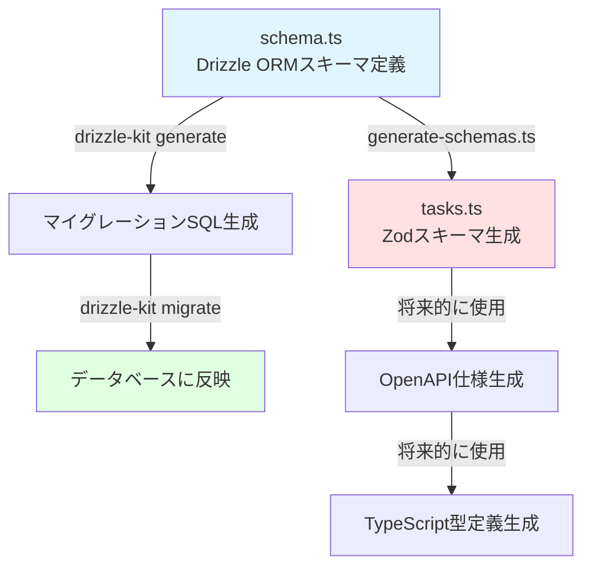
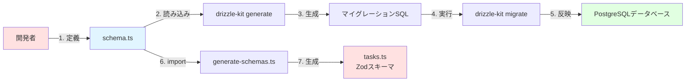

# TASK-1301 実装コード解説

## この機能が何を解決するのか

この機能は「TODOリストアプリのデータベース基盤の構築」を解決します。

具体的には：
- タスク情報を保存するためのデータベーステーブル（`tasks`テーブル）の作成
- データの型安全性を保証するためのZodスキーマの自動生成
- 将来のAPI開発に必要なスキーマ駆動開発フローの確立

これを「スキーマ駆動開発」と呼び、データベースの定義を起点に、バックエンドとフロントエンドで使用する型定義を自動的に生成することで、型の不整合やバグを防ぐことができます。

## 全体の処理の流れ

### スキーマ駆動開発フロー



今回のTASK-1301では、上記フローのうち「schema.ts の定義」→「マイグレーション生成・実行」→「Zodスキーマ生成」までを実施しました。

## ファイルの役割と責任

### 今回解説するメインのファイル

#### app/server/src/infrastructure/database/schema.ts

このファイルは、データベースのテーブル構造を**TypeScriptコード**で定義するファイルです。

「え？データベースってSQLで定義するんじゃないの？」と思うかもしれませんが、Drizzle ORMという仕組みを使うと、TypeScriptで書いた定義を自動的にSQLに変換してくれます。こうすることで：

- TypeScriptの型チェック機能が使える
- コードを書いている時点でミスに気づける
- データベースとコードの型が自動的に一致する

という大きなメリットがあります。

主な実装内容：

**1. `tasks`テーブルの定義（line 178-263）**

```typescript
export const tasks = schema.table(
  'tasks',
  {
    id: uuid('id').primaryKey().defaultRandom(),
    userId: uuid('user_id')
      .notNull()
      .references(() => users.id, { onDelete: 'cascade' }),
    title: varchar('title', { length: 100 }).notNull(),
    // ... その他のフィールド
  },
  // インデックスとCHECK制約の定義
)
```

この定義が、実際のデータベースの`tasks`テーブルになります。

**2. インデックスの定義（line 210-239）**

インデックスとは、データベースの検索を高速化するための仕組みです。例えば、辞書の「索引」のようなものです。

```typescript
{
  // ユーザーごとのタスク検索用（最もよく使われる）
  userIdIdx: index('idx_tasks_user_id').on(table.userId),

  // 作成日時順のソート用
  createdAtIdx: index('idx_tasks_created_at').on(table.createdAt.desc()),

  // 複合インデックス: user_id + created_at
  // 「特定ユーザーのタスクを作成日時順に取得」というクエリを高速化
  userCreatedIdx: index('idx_tasks_user_created').on(
    table.userId,
    table.createdAt.desc(),
  ),
}
```

**3. CHECK制約の定義（line 241-261）**

CHECK制約は「データベースに保存される値のルール」を定義するものです。例えば、

```typescript
validPriority: check(
  'valid_priority',
  sql`${table.priority} IN ('high', 'medium', 'low')`,
),
```

これにより、優先度には `'high'`, `'medium'`, `'low'` の3つしか入らないことが**データベースレベル**で保証されます。アプリケーションのバグで違う値を入れようとしても、データベースが拒否してくれるので安全です。

#### app/server/scripts/generate-schemas.ts

このファイルは、Drizzle ORMで定義したテーブルから、Zodスキーマを**自動生成**するスクリプトです。

Zodスキーマとは、データの形式をチェックするための定義です。例えば、APIでデータを受け取った時に「本当にタイトルが入っているか？」「優先度は正しい値か？」などを検証できます。

**1. テーブル設定の管理（line 59-78）**

```typescript
const tableConfigs: TableConfig[] = [
  {
    tableName: 'users',
    tableObject: users,
    outputFile: 'users.ts',
    enums: [/* ... */],
  },
  {
    tableName: 'tasks',
    tableObject: tasks,
    outputFile: 'tasks.ts',
    enums: [],
  },
];
```

この配列に新しいテーブルの設定を追加するだけで、自動的にZodスキーマが生成されます。今回、`tasks`の設定を追加しました。

**2. スキーマファイルの生成ロジック（line 135-178）**

このロジックは、テーブル設定を元に、以下のようなコードを**自動生成**します：

- import文
- selectスキーマ（データベースから読み取る時の型）
- insertスキーマ（データベースに書き込む時の型）
- 型定義のエクスポート

生成されるコードは次のセクションで見ていきます。

#### app/server/src/schemas/tasks.ts（自動生成）

このファイルは**自動生成**されたファイルで、手動で編集してはいけません。

```typescript
export const selectTaskSchema = createSelectSchema(tasks);
export const insertTaskSchema = createInsertSchema(tasks);

export type SelectTask = z.infer<typeof selectTaskSchema>;
export type InsertTask = z.infer<typeof insertTaskSchema>;
```

**なぜ2種類のスキーマがあるのか？**

- `selectTaskSchema`: データベース**から読み取った**データの形式
  - 例: `id`, `createdAt`, `updatedAt` などの自動生成される値が含まれる
- `insertTaskSchema`: データベース**に書き込む**データの形式
  - 例: `id` は自動生成されるので不要、`createdAt` も自動設定されるので不要

このように、読み取りと書き込みで必要な項目が違うため、2つのスキーマが用意されています。

### マイグレーションファイル

#### app/server/src/infrastructure/database/migrations/app_hoxbl/0000_keen_madrox.sql

このファイルは、Drizzle ORMが`schema.ts`の定義から**自動生成した**SQLファイルです。

```sql
CREATE TABLE "app_hoxbl"."tasks" (
  "id" uuid PRIMARY KEY DEFAULT gen_random_uuid() NOT NULL,
  "user_id" uuid NOT NULL,
  "title" varchar(100) NOT NULL,
  -- ...
  CONSTRAINT "valid_priority" CHECK (...),
  CONSTRAINT "valid_status" CHECK (...)
);
```

このSQLが実際にデータベースに実行され、`tasks`テーブルが作成されます。

**マイグレーションとは？**

データベースの構造を変更する履歴を管理する仕組みです。例えば：

1. 最初に`users`テーブルを作成（マイグレーション0001）
2. 次に`tasks`テーブルを作成（マイグレーション0002）← 今回はこれ
3. 将来`tasks`にフィールドを追加（マイグレーション0003）

このように、変更履歴をファイルで管理することで、「今データベースがどの状態にあるか」を追跡できます。

## 処理の詳細な流れ

### 1. schema.tsでのテーブル定義

まず、開発者が`schema.ts`にテーブル構造を定義します。

```typescript
// app/server/src/infrastructure/database/schema.ts
export const tasks = schema.table(
  'tasks',
  {
    id: uuid('id').primaryKey().defaultRandom(),
    userId: uuid('user_id')
      .notNull()
      .references(() => users.id, { onDelete: 'cascade' }),
    // この.references()が外部キー制約を作成します
    // onDelete: 'cascade' は「ユーザーが削除されたらタスクも削除」という意味
  }
)
```

### 2. マイグレーションファイルの生成

次に、以下のコマンドを実行します：

```bash
docker compose exec server bunx drizzle-kit generate
```

このコマンドが実行すると、Drizzle Kitは：

1. `schema.ts`を読み込む
2. 現在のデータベースの状態と比較する
3. 差分を検出する
4. 差分を解消するSQLを生成する（マイグレーションファイル）

今回は、新しく`tasks`テーブルを追加したので、`CREATE TABLE`文が生成されました。

### 3. マイグレーションの実行

生成されたマイグレーションファイルを、実際にデータベースに適用します：

```bash
docker compose exec server bun run db:migrate
```

このコマンドが：

1. マイグレーションファイル（.sql）を読み込む
2. データベースに接続する
3. SQLを実行する
4. マイグレーション履歴をデータベースに記録する

これで、`tasks`テーブルがデータベースに作成されます。

### 4. Zodスキーマの生成

最後に、以下のコマンドでZodスキーマを生成します：

```bash
docker compose exec server bun run generate:schemas
```

このコマンドが`generate-schemas.ts`を実行し：

1. `tableConfigs`配列を読み込む
2. 各テーブル設定に対してスキーマファイルを生成
3. `app/server/src/schemas/tasks.ts`に出力

これで、`tasks`テーブルに対応するZodスキーマが自動生成されます。

## クラスと関数の呼び出し関係



## 重要な処理の詳細解説

### 外部キー制約と CASCADE削除

```typescript
// app/server/src/infrastructure/database/schema.ts
userId: uuid('user_id')
  .notNull()
  .references(() => users.id, { onDelete: 'cascade' }),
```

この部分は、`tasks.userId`が`users.id`を参照していることを示しています。

**外部キー制約とは？**

「タスクは必ず誰かのユーザーに属する」というルールをデータベースで保証する仕組みです。

- 存在しないユーザーIDのタスクは作成できない
- ユーザーが削除されたら、そのユーザーのタスクも自動的に削除される（`CASCADE`）

例えば：
- ユーザーAさん（ID: `123`）が退会した
- `onDelete: 'cascade'`により、Aさんのタスク（`userId = 123`のタスク）が自動的に削除される

こうすることで、「誰のものかわからないタスク」がデータベースに残らなくなります。

### CHECK制約による値の制限

```typescript
// app/server/src/infrastructure/database/schema.ts
validPriority: check(
  'valid_priority',
  sql`${table.priority} IN ('high', 'medium', 'low')`,
),

validStatus: check(
  'valid_status',
  sql`${table.status} IN ('not_started', 'in_progress', 'in_review', 'completed')`,
),

nonEmptyTitle: check(
  'non_empty_title',
  sql`length(trim(${table.title})) > 0`,
),
```

CHECK制約は、「データベースに保存できる値のルール」を定義します。

**なぜアプリケーションでチェックするだけじゃダメなのか？**

アプリケーションのバリデーションは重要ですが、以下のケースで不正なデータが入る可能性があります：

1. バグでバリデーションが抜けた
2. 直接データベースを操作した（開発者が手動でSQLを実行）
3. 別のアプリケーション（管理画面など）から操作した

CHECK制約を設定すると、**どんな経路でも**不正なデータを防げます。これを「多層防御」と呼びます。

例えば、`priority`に`'super_high'`という値を入れようとすると：

```
ERROR: new row for relation "tasks" violates check constraint "valid_priority"
DETAIL: Failing row contains (..., super_high, ...).
```

このようにデータベースがエラーを返してくれます。

### インデックスによる検索の高速化

```typescript
// app/server/src/infrastructure/database/schema.ts
{
  userIdIdx: index('idx_tasks_user_id').on(table.userId),

  userCreatedIdx: index('idx_tasks_user_created').on(
    table.userId,
    table.createdAt.desc(),
  ),
}
```

インデックスは「データベースの索引」のようなものです。

**なぜインデックスが必要か？**

インデックスがないと、データベースは「全件検索」をします。例えば：

- タスクが10,000件ある
- 「ユーザーID = 123 のタスク」を探したい
- インデックスなし → 10,000件すべてをチェック
- インデックスあり → ユーザーID = 123 のタスクだけを瞬時に取得

**複合インデックスとは？**

`userCreatedIdx`は、`userId`と`createdAt`の**組み合わせ**でインデックスを作成しています。

これにより、以下のようなクエリが高速化されます：

```sql
-- 「ユーザー123のタスクを作成日時の新しい順に取得」
SELECT * FROM tasks
WHERE user_id = '123'
ORDER BY created_at DESC;
```

このクエリは、TODOリストの「自分のタスク一覧」を表示する時に**最も頻繁に実行される**ため、複合インデックスで最適化しています。

### generate-schemas.tsの自動生成ロジック

```typescript
// app/server/scripts/generate-schemas.ts
function generateSchemaFile(config: TableConfig): string {
  const { tableName, enums = [] } = config;

  // users → User（単数形 + 先頭大文字）
  const singularName = tableName.endsWith('s')
    ? tableName.slice(0, -1)
    : tableName;
  const capitalizedName = capitalize(singularName);

  // ファイル内容のテンプレートを生成
  return `
    export const select${capitalizedName}Schema = createSelectSchema(${tableName});
    export const insert${capitalizedName}Schema = createInsertSchema(${tableName});
    // ...
  `;
}
```

この関数が、各テーブルに対して：

1. テーブル名を単数形に変換（`tasks` → `task`）
2. 先頭を大文字に（`task` → `Task`）
3. テンプレートに埋め込んで生成（`selectTaskSchema`, `insertTaskSchema`）

という処理を自動的に行います。

**なぜ自動生成するのか？**

- 手動で書くと、テーブルが増えるたびに同じようなコードを書く必要がある
- コピペミスで型名が間違う可能性がある
- テーブル構造が変わった時に、修正漏れが発生する

自動生成することで、これらの問題をすべて解決できます。

## 初学者がつまずきやすいポイント

### 1. 「Drizzle ORM」と「Drizzle Kit」の違い

- **Drizzle ORM**: TypeScriptでデータベースを操作するためのライブラリ
  - 例: データを取得する、保存する、更新する
- **Drizzle Kit**: スキーマ定義からマイグレーションファイルを生成するツール
  - 例: `schema.ts` → SQLファイル生成

料理に例えると：
- Drizzle ORM = 料理をする道具（包丁、フライパン）
- Drizzle Kit = レシピを書き起こすツール

### 2. 「スキーマ」という言葉の2つの意味

プロジェクト内で「スキーマ」という言葉が2つの意味で使われています：

1. **PostgreSQLスキーマ**: データベース内の名前空間
   - 例: `app_test`, `app_hoxbl`（テーブルをグループ化する箱のようなもの）
2. **テーブルスキーマ**: テーブルの構造定義
   - 例: `tasks`テーブルにどんなカラムがあるか

文脈で判断する必要があります。

### 3. 「マイグレーション」の重要性

「なぜSQLを直接書いて実行しないのか？」という疑問を持つかもしれません。

マイグレーションファイルで管理することで：

1. **履歴が残る**: いつ、誰が、何を変更したかがわかる
2. **ロールバックできる**: 問題があったら元に戻せる
3. **チームで同期できる**: 他の開発者も同じ構造にできる
4. **本番環境に安全に適用できる**: テストした変更を確実に反映

これを怠ると、「ローカルと本番でテーブル構造が違う」という深刻な問題が発生します。

### 4. 自動生成ファイルを編集してはいけない理由

`app/server/src/schemas/tasks.ts`のような自動生成ファイルを手動で編集すると：

1. 次回の自動生成で**上書きされて消える**
2. スキーマと実装が**不整合**になる
3. チーム内で**混乱**が生じる

必ず元となる`schema.ts`を編集して、再生成するようにしましょう。

### 5. 環境変数 `BASE_SCHEMA` の役割

```typescript
// app/server/src/infrastructure/database/schema.ts
const schemaName = getBaseSchema(); // 環境変数から取得
const schema = pgSchema(schemaName);
```

この仕組みにより、環境ごとに異なるスキーマを使い分けられます：

- **開発環境**: `app_test`
- **本番環境**: `app_hoxbl`
- **プレビュー環境**: `app_hoxbl_preview`

こうすることで、「開発中の変更が本番データに影響する」という事故を防げます。

## この設計のいい点

### 1. 型安全性の自動確保

Drizzle ORMで定義すると：

- データベーススキーマ
- TypeScript型定義
- Zodバリデーションスキーマ

これらが**すべて自動的に同期**されます。手動で3箇所を修正する必要がなく、ミスが減ります。

### 2. 多層防御のセキュリティ

CHECK制約により、以下の3層でデータを保護しています：

1. **フロントエンド**: UIでの入力制限
2. **バックエンド**: Zodスキーマでのバリデーション
3. **データベース**: CHECK制約での最終防御

どこかの層でバグがあっても、他の層が守ってくれます。

### 3. パフォーマンスを考慮したインデックス設計

最もよく使われるクエリパターン（「ユーザーごと」「作成日時順」）に対して、最適な複合インデックスを設定しています。

これにより、タスクが増えても高速に動作します。

### 4. 保守性の高いコード生成スクリプト

`generate-schemas.ts`は、新しいテーブルを追加する時に：

```typescript
const tableConfigs: TableConfig[] = [
  // 既存のテーブル
  { tableName: 'users', ... },
  { tableName: 'tasks', ... },

  // 新しいテーブルを追加する時は、ここに1行追加するだけ！
  { tableName: 'comments', tableObject: comments, outputFile: 'comments.ts' },
];
```

このように、設定を1つ追加するだけで自動的にスキーマが生成される設計になっています。
