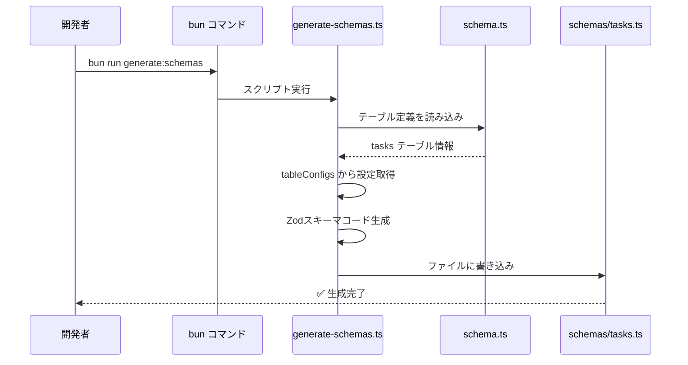
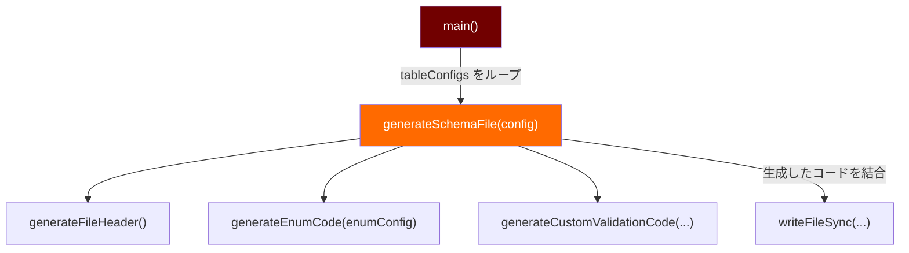
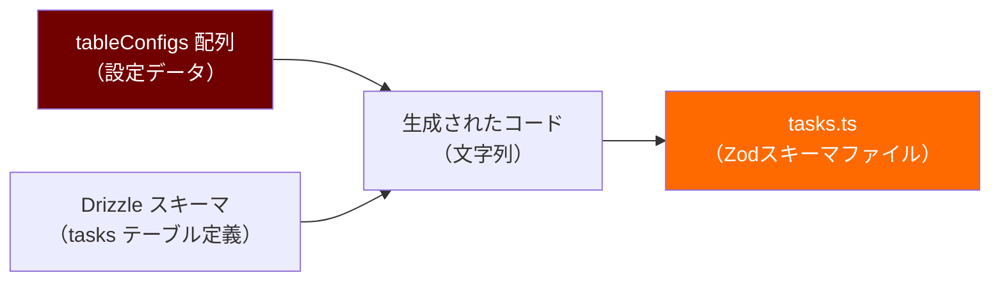

# TASK-1302: Zodスキーマ自動生成 - コード解説

## この機能が何を解決するのか

この機能は「データベースのテーブル定義から、APIのバリデーションに使うZodスキーマを自動生成する」ことを解決します。

具体的には：
- データベース定義（Drizzle ORM）を1回書くだけで、API層のバリデーション用スキーマが自動で作られる
- データベースのテーブルを追加・変更したら、設定ファイルに数行追加するだけで対応完了
- 手動でスキーマを書く手間がなくなり、データベースとAPIの定義がずれることを防げる

これを「**スキーマ駆動開発**」と呼び、以下のような流れで型安全な開発ができます：

```
データベーススキーマ変更
  ↓
Zodスキーマ自動生成（← 今回実装した機能）
  ↓
OpenAPI仕様生成
  ↓
TypeScript型定義生成
  ↓
フロントエンド・バックエンド共通の型で開発
```

## 全体の処理の流れ

### 処理フローとファイル関係



この図のポイント：
- 開発者はコマンド1つ実行するだけ
- スクリプトが自動的にデータベース定義を読み込んで、Zodスキーマファイルを作成する
- 生成されたファイルは手動で編集してはいけない（次回の生成で上書きされる）

## ファイルの役割と責任

### 今回解説するメインのファイル

#### `app/server/scripts/generate-schemas.ts`
このファイルがZodスキーマ自動生成の心臓部です。役割は以下の通り：

**主な責任**：
1. データベーステーブル定義（Drizzle ORM）を読み込む
2. テーブルごとの設定（enum、カスタムバリデーション）を管理
3. Zodスキーマのコードを文字列として組み立てる
4. 生成したコードをファイルに書き込む

**重要な設定配列 `tableConfigs`**：

```typescript
// app/server/scripts/generate-schemas.ts
const tableConfigs: TableConfig[] = [
  {
    tableName: 'tasks',         // テーブル名
    tableObject: tasks,          // Drizzleのテーブル定義オブジェクト
    outputFile: 'tasks.ts',      // 出力先ファイル名
    enums: [                     // enum設定（優先度とステータス）
      {
        name: 'taskPriority',
        exportName: 'taskPrioritySchema',
        values: ['high', 'medium', 'low'] as const,
        description: 'タスクの優先度',
      },
      // ...
    ],
    customValidations: {         // カスタムバリデーション設定
      title: {
        min: 1,
        max: 100,
        errorMessages: {
          min: 'タイトルを入力してください',
          max: 'タイトルは100文字以内で入力してください',
        },
      },
      // ...
    },
  },
];
```

新しいテーブルを追加したいときは、この配列に設定を1つ追加するだけです。

**実装されている関数**：

1. **`generateFileHeader()`**
   - 生成ファイルの冒頭に付ける警告コメントを作成
   - 「このファイルは自動生成です。手動で編集しないでください」という注意書き

2. **`generateEnumCode(enumConfig)`**
   - enum（列挙型）のZodスキーマコードを生成
   - 例: `z.enum(['high', 'medium', 'low'])` というコードを文字列として作る

3. **`generateCustomValidationCode(tableName, capitalizedName, customValidations)`**
   - カスタムバリデーション（最小文字数、最大文字数など）のZodスキーマコードを生成
   - 例: `z.string().min(1, { message: 'タイトルを入力してください' })` というコードを作る

4. **`generateSchemaFile(config)`**
   - テーブル設定を受け取って、完全なZodスキーマファイルの内容を生成
   - 上記の関数を組み合わせて、import文からexport文まで全部作る

5. **`main()`**
   - メイン処理
   - `tableConfigs` の全テーブルをループして、それぞれのスキーマファイルを生成

### 呼び出されているファイル

#### `app/server/src/infrastructure/database/schema.ts`
データベースのテーブル定義が書かれているファイルです。

**tasksテーブルの定義**：
```typescript
// app/server/src/infrastructure/database/schema.ts
export const tasks = schema.table(
  'tasks',
  {
    id: uuid('id').primaryKey().defaultRandom(),
    userId: uuid('user_id').notNull().references(() => users.id, { onDelete: 'cascade' }),
    title: varchar('title', { length: 100 }).notNull(),
    description: text('description'),
    priority: varchar('priority', { length: 10 }).notNull().default('medium'),
    status: varchar('status', { length: 20 }).notNull().default('not_started'),
    createdAt: timestamp('created_at', { withTimezone: true }).defaultNow().notNull(),
    updatedAt: timestamp('updated_at', { withTimezone: true }).defaultNow().notNull(),
  },
  (table) => {
    return {
      // インデックス定義
      userIdIdx: index('idx_tasks_user_id').on(table.userId),
      // ...

      // CHECK制約（データベース層での値の制限）
      validPriority: check('valid_priority', sql`${table.priority} IN ('high', 'medium', 'low')`),
      validStatus: check('valid_status', sql`${table.status} IN ('not_started', 'in_progress', 'in_review', 'completed')`),
      nonEmptyTitle: check('non_empty_title', sql`length(trim(${table.title})) > 0`),
      titleLength: check('title_length', sql`length(${table.title}) <= 100`),
    };
  },
);
```

このファイルの重要なポイント：
- `priority` と `status` はDrizzleのenum型ではなく、VARCHAR型 + CHECK制約で実装
- これは将来的な拡張性（ユーザー定義のステータスなど）を考慮した設計
- しかし、API層では型安全性を保つため、Zod enumとして扱いたい

#### `app/server/src/schemas/tasks.ts`（生成されるファイル）
`generate-schemas.ts` によって自動生成されるファイルです。

**生成される内容**：
```typescript
// app/server/src/schemas/tasks.ts
/**
 * このファイルは自動生成されました
 * ⚠️ 警告: このファイルを手動で編集しないでください ⚠️
 */

import { createInsertSchema, createSelectSchema } from 'drizzle-zod';
import { z } from 'zod';
import { tasks } from '@/infrastructure/database/schema';

// DB読み取り用スキーマ（SELECT結果のバリデーション）
export const selectTaskSchema = createSelectSchema(tasks);

// DB書き込み用スキーマ（INSERT/UPDATEデータのバリデーション）
export const insertTaskSchema = createInsertSchema(tasks);

// 型定義のエクスポート
export type SelectTask = z.infer<typeof selectTaskSchema>;
export type InsertTask = z.infer<typeof insertTaskSchema>;

// 優先度のenum（API層での型安全性のため）
export const taskPrioritySchema = z.enum(['high', 'medium', 'low']);
export type TaskPriority = z.infer<typeof taskPrioritySchema>;

// ステータスのenum（API層での型安全性のため）
export const taskStatusSchema = z.enum(['not_started', 'in_progress', 'in_review', 'completed']);
export type TaskStatus = z.infer<typeof taskStatusSchema>;

// API リクエスト用のカスタムバリデーション
export const createTaskSchema = z.object({
    title: z.string()
      .min(1, { message: 'タイトルを入力してください' })
      .max(100, { message: 'タイトルは100文字以内で入力してください' }),
});
export type CreateTask = z.infer<typeof createTaskSchema>;
```

このファイルの役割：
- API層でリクエスト/レスポンスのバリデーションに使用
- データベース定義との整合性が自動的に保たれる
- TypeScript型も自動的にエクスポートされる

## クラスと関数の呼び出し関係

### コード生成の流れ



この図が示すこと：
- `main()` 関数がすべての起点
- テーブルごとに `generateSchemaFile()` を呼んで、スキーマコードを生成
- 生成されたコードは文字列として結合され、ファイルに書き込まれる

### データの流れ



## 重要な処理の詳細解説

### 1. Drizzle enumではないenumの扱い

```typescript
// app/server/scripts/generate-schemas.ts (269-276行目)
const actualEnumImports = enums
  .filter((e) => {
    // authProviderType は実際に schema.ts に存在する
    // taskPriority, taskStatus は存在しないのでスキップ
    return e.name !== 'taskPriority' && e.name !== 'taskStatus';
  })
  .map((e) => e.name);
const enumImports = actualEnumImports.length > 0 ? `, ${actualEnumImports.join(', ')}` : '';
```

**この処理が必要な理由**：
- `tasks` テーブルの `priority` と `status` はVARCHAR型（Drizzle enumではない）
- でもAPI層では型安全性を保つため、Zod enumとして扱いたい
- もし `taskPriority` や `taskStatus` をimportしようとすると、エラーになる（schema.tsに存在しないから）
- だから、実際にDrizzle enumとして存在するものだけをimportするようにフィルタリング

**よくある勘違い**：
「enumの設定を書いたら、自動的にDrizzleスキーマにもenumが作られる」
→ 違います。Drizzleスキーマは手動で定義する必要があります。このスクリプトは既存のスキーマを読み込んで、Zodスキーマを生成するだけです。

### 2. カスタムバリデーションコードの生成

```typescript
// app/server/scripts/generate-schemas.ts (193-241行目)
function generateCustomValidationCode(
  tableName: string,
  capitalizedName: string,
  customValidations?: Record<string, CustomValidationConfig>,
): string {
  if (!customValidations || Object.keys(customValidations).length === 0) {
    return '';  // カスタムバリデーションがなければ何も生成しない
  }

  const schemaLines: string[] = [];

  for (const [field, config] of Object.entries(customValidations)) {
    const validations: string[] = [];

    // minバリデーション
    if (config.min !== undefined) {
      const errorMsg = config.errorMessages?.min
        ? `, { message: '${config.errorMessages.min}' }`
        : '';
      validations.push(`.min(${config.min}${errorMsg})`);
    }

    // maxバリデーション
    if (config.max !== undefined) {
      const errorMsg = config.errorMessages?.max
        ? `, { message: '${config.errorMessages.max}' }`
        : '';
      validations.push(`.max(${config.max}${errorMsg})`);
    }

    if (validations.length > 0) {
      // 例: "title: z.string().min(1, { message: 'タイトルを入力してください' }).max(100, { message: '...' }),"
      schemaLines.push(`    ${field}: z.string()${validations.join('')},`);
    }
  }

  // スキーマ全体を組み立て
  return `
export const create${capitalizedName}Schema = z.object({
${schemaLines.join('\n')}
});

export type Create${capitalizedName} = z.infer<typeof create${capitalizedName}Schema>;`;
}
```

**この処理のポイント**：
- カスタムバリデーション設定（min、max、エラーメッセージ）を受け取る
- それをZodのメソッドチェーン形式のコード文字列に変換
- 例: `.min(1, { message: 'タイトルを入力してください' })` という文字列を作る

**実際の使用例**：
```typescript
// 設定（tableConfigs内）
customValidations: {
  title: {
    min: 1,
    max: 100,
    errorMessages: {
      min: 'タイトルを入力してください',
      max: 'タイトルは100文字以内で入力してください',
    },
  },
}

// 生成されるコード
export const createTaskSchema = z.object({
    title: z.string().min(1, { message: 'タイトルを入力してください' }).max(100, { message: 'タイトルは100文字以内で入力してください' }),
});
```

### 3. ファイル生成のメイン処理

```typescript
// app/server/scripts/generate-schemas.ts (312-352行目)
async function main(): Promise<void> {
  try {
    console.log('🔄 Drizzle Zodスキーマの生成を開始します...');

    const outputDir = join(process.cwd(), './src/schemas');
    let successCount = 0;

    // 全テーブルを処理
    for (const config of tableConfigs) {
      // スキーマコードを生成（文字列として）
      const content = generateSchemaFile(config);
      const outputPath = join(outputDir, config.outputFile);

      // ファイルに書き込み
      writeFileSync(outputPath, content, 'utf-8');

      console.log(`✅ ${config.tableName}: ${outputPath}`);
      successCount++;
    }

    console.log(`🎉 ${successCount}個のスキーマファイルが正常に生成されました`);
  } catch (error) {
    console.error('❌ スキーマ生成中にエラーが発生しました:');
    console.error(error);
    process.exit(1);  // エラーで終了
  }
}
```

**この処理の流れ**：
1. `tableConfigs` 配列をループして、各テーブルの設定を取得
2. `generateSchemaFile()` でZodスキーマのコード（文字列）を生成
3. `writeFileSync()` でファイルに書き込み
4. 成功したら「✅」、失敗したら「❌」を表示してプロセス終了

**押さえるべきポイント**：
- エラーが発生したら `process.exit(1)` で異常終了する
- これにより、CI/CDパイプラインでエラーを検知できる

## 初学者がつまずきやすいポイント

### 1. 「自動生成」の意味

**よくある誤解**：
「自動生成ファイルを編集してはいけないのはわかるけど、設定を変えたらどうやって反映するの？」

**正しい理解**：
- 設定を変えたら、コマンド (`bun run generate:schemas`) を再実行する
- すると、自動生成ファイルが上書きされて、最新の設定が反映される
- だから手動で編集すると、次回の生成で消えてしまう

### 2. Drizzle enumとカスタムenumの違い

**Drizzle enum**:
```typescript
// schema.ts に実際に定義されているenum
export const authProviderType = pgEnum('auth_provider_type', ['google', 'github']);

// これはimportできる
import { authProviderType } from '@/infrastructure/database/schema';
```

**カスタムenum**（今回のtaskPriority、taskStatus）:
```typescript
// schema.ts にはenum定義がない（VARCHAR + CHECK制約）
priority: varchar('priority', { length: 10 }).notNull().default('medium'),

// だからimportできない
// import { taskPriority } from '@/infrastructure/database/schema'; // ← エラー

// 代わりに、tableConfigs で値の配列を定義
values: ['high', 'medium', 'low'] as const,

// そして、生成スクリプトがZod enumとして出力
export const taskPrioritySchema = z.enum(['high', 'medium', 'low']);
```

### 3. 「コードを文字列として生成する」とは

**初心者の疑問**：
「なぜZodスキーマを直接書かずに、文字列で作ってファイルに書き込むの？」

**答え**：
- このスクリプトは「プログラムでプログラムを生成する」処理（メタプログラミング）
- TypeScriptのコードを直接書くのではなく、TypeScriptのコードを表す文字列を組み立てる
- その文字列をファイルに書き込むことで、TypeScriptファイルが生成される

**比喩で説明すると**：
- 料理のレシピ（設定）を見ながら、料理（Zodスキーマ）を作る機械を作っている
- 機械は「レシピに書いてある材料と手順」を読み取って、自動的に料理を作る
- 人間が毎回手作業で料理を作る（手動でZodスキーマを書く）より、機械に任せた方が早くて正確

### 4. `as const` の意味

```typescript
values: ['high', 'medium', 'low'] as const,
```

**`as const` がないと**：
- TypeScriptは配列を `string[]` と推論する
- つまり「文字列の配列」という広い型になる

**`as const` があると**：
- 配列が読み取り専用になる
- 型が `readonly ['high', 'medium', 'low']` という厳密な型になる
- これにより、Zod enumで正確な型推論ができる

**例**：
```typescript
// as const なし
const priorities = ['high', 'medium', 'low'];
// 型: string[]

// as const あり
const priorities = ['high', 'medium', 'low'] as const;
// 型: readonly ['high', 'medium', 'low']

// Zod enumでの使用
z.enum(priorities);  // ← as const がないとエラーになることがある
```

## この設計のいい点

### 1. DRY原則の徹底（Don't Repeat Yourself）

データベースのテーブル定義を1回書くだけで、APIのバリデーション用スキーマが自動生成されます。同じ情報を2箇所に書く必要がないので：
- バグが減る（片方だけ修正して、もう片方を忘れるミスが起きない）
- メンテナンスが楽（1箇所変えれば全部反映される）
- 開発スピードが上がる（手動で書く時間を節約）

### 2. 型安全性の向上

データベース層（Drizzle）とAPI層（Zod）の定義が常に一致するため：
- TypeScriptの型推論が正しく働く
- コンパイル時にエラーを検出できる
- IDEの補完機能が正確に動作する

### 3. 拡張性の高さ

新しいテーブルを追加するときは、`tableConfigs` に1つエントリを追加するだけです：
```typescript
const tableConfigs: TableConfig[] = [
  // 既存のテーブル
  { tableName: 'users', ... },
  { tableName: 'tasks', ... },

  // 新しいテーブル（これだけ追加すればOK）
  { tableName: 'projects', tableObject: projects, outputFile: 'projects.ts' },
];
```

複雑なコード生成ロジックを理解しなくても、設定を追加するだけで使えます。

### 4. エラーメッセージの日本語化

カスタムバリデーションで、ユーザーフレンドリーな日本語エラーメッセージを設定できます：
```typescript
errorMessages: {
  min: 'タイトルを入力してください',  // ← ユーザーに表示される
  max: 'タイトルは100文字以内で入力してください',
}
```

これにより、APIのエラーレスポンスがわかりやすくなり、フロントエンドでそのまま表示できます。
