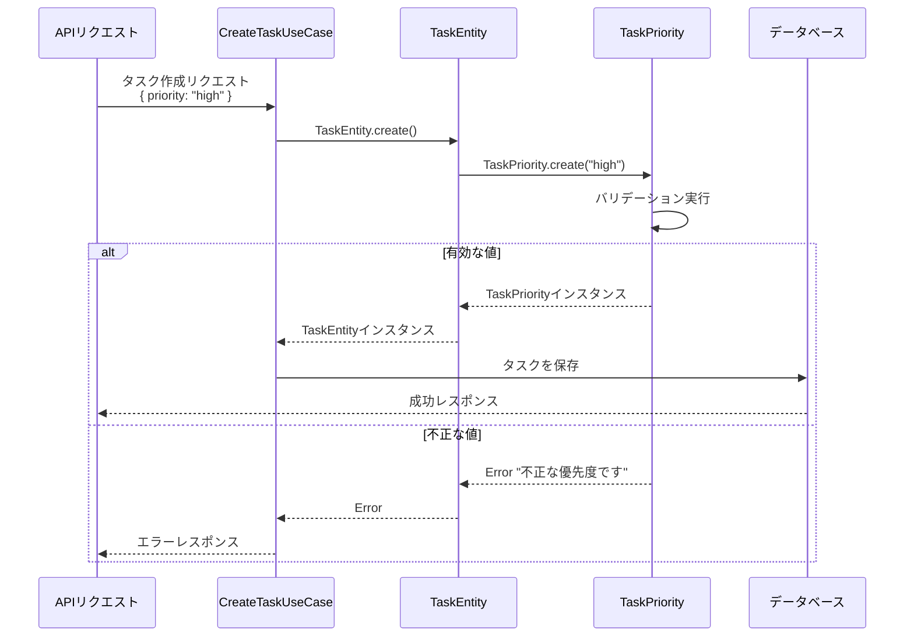
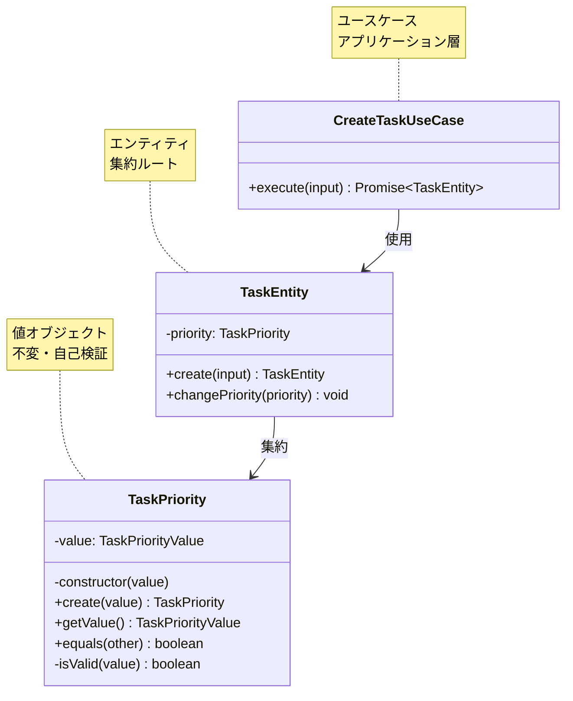

# TASK-1306: TaskPriority値オブジェクト コード解説

## 📄 ドキュメント情報

- **作成日**: 2025-11-20
- **タスクID**: TASK-1306
- **要件名**: TODO リストアプリ
- **フェーズ**: Phase 2 - バックエンドDomain層実装
- **対象読者**: 組織に加入したばかりの初学者エンジニア

## この機能が何を解決するのか

この機能は「タスクの優先度を型安全に扱いたい」という課題を解決します。

具体的には：
- 優先度の値（`'high'`, `'medium'`, `'low'`）を**値オブジェクト**として扱う
- 不正な値（`'invalid'`, `''`, `null`など）が入ってきたときに、エラーを出す
- 一度作った優先度は変更できない（**不変性**を保証）

これを「**値オブジェクト（Value Object）パターン**」と呼び、ドメイン駆動設計（DDD）で推奨されている設計手法です。

### なぜこれが必要なのか？

たとえば、優先度を普通の文字列として扱うと、こんな問題が起きます：

```typescript
// ❌ 悪い例：文字列をそのまま使う
let priority = 'high';
priority = 'VERY HIGH!!!'; // タイポや不正な値を防げない
priority = null;            // nullが混入する可能性がある
```

値オブジェクトを使うと、こういった不正な値を**実行時に検出**できます：

```typescript
// ✅ 良い例：値オブジェクトを使う
const priority = TaskPriority.create('high');     // OK
const invalid = TaskPriority.create('VERY HIGH'); // エラーがスローされる！
```

## 全体の処理の流れ

### 処理フローとファイル関係



この図から分かるように、`TaskPriority`は**最初の防衛ライン**として機能します。不正なデータがドメイン層に侵入する前に、エラーをスローしてデータの整合性を守ります。

## ファイルの役割と責任

### 今回解説するメインのファイル

#### `app/server/src/domain/task/valueobjects/TaskPriority.ts`

**役割**: タスクの優先度を表現する値オブジェクト

**責任**:
- 優先度の値（`'high'`, `'medium'`, `'low'`）を保持する
- 不正な値を検出してエラーをスローする
- 値の等価性を比較する機能を提供する
- **イミュータブル**（一度作ったら変更できない）を保証する

**実装された主な機能**:

1. **`create(value: unknown)`** - 静的ファクトリメソッド
   - 優先度の値を受け取って、TaskPriorityインスタンスを作成する
   - 不正な値の場合はエラーをスローする

2. **`getValue()`** - 値取得メソッド
   - 内部に保持している優先度の値を取得する

3. **`equals(other: TaskPriority)`** - 等価性比較メソッド
   - 他のTaskPriorityインスタンスと値が同じかどうかを判定する

### 呼び出しているファイル

#### `app/server/src/domain/task/TaskEntity.ts`（まだ未実装）

**このファイルの役割**: タスク全体を表現するエンティティ

**TaskPriorityとの関係**:
- `TaskEntity`は`TaskPriority`を**プロパティとして持つ**（集約）
- タスク作成時や優先度変更時に`TaskPriority.create()`を呼び出す

```typescript
// TaskEntity.ts での使用例（将来の実装）
export class TaskEntity {
  private priority: TaskPriority; // プロパティとして保持

  public static create(input: { priority?: string }): TaskEntity {
    // デフォルト値 'medium' を適用
    const priorityValue = input.priority ?? 'medium';
    const priority = TaskPriority.create(priorityValue); // ここで呼び出す

    return new TaskEntity({ priority });
  }

  public changePriority(newPriority: string): void {
    this.priority = TaskPriority.create(newPriority); // 変更時にも呼び出す
  }
}
```

#### `app/server/src/schemas/tasks.ts`

**このファイルの役割**: Zodスキーマによるバリデーション定義

**TaskPriorityとの関係**:
- `TaskPriority`はドメイン層でのバリデーション
- `taskPrioritySchema`はAPIリクエストの入口でのバリデーション
- **二重のバリデーション**で安全性を高めている

```typescript
// tasks.ts での定義
export const taskPrioritySchema = z.enum(['high', 'medium', 'low']);
export type TaskPriority = z.infer<typeof taskPrioritySchema>;
```

**注意**: `tasks.ts`の`TaskPriority`型と、今回実装した`TaskPriority`クラスは**別物**です：
- `tasks.ts`の`TaskPriority`型 → 単なる型（`'high' | 'medium' | 'low'`）
- 今回の`TaskPriority`クラス → バリデーションとビジネスロジックを持つオブジェクト

## テストファイルの役割

#### `app/server/src/domain/task/__tests__/TaskPriority.test.ts`

**役割**: TaskPriorityクラスの動作を検証するテスト

**テストの構造**:
- **正常系テスト**（5ケース）: 有効な値で正常に動作することを確認
- **異常系テスト**（4ケース）: 不正な値でエラーがスローされることを確認

```typescript
// テストの構造
describe('TaskPriority', () => {
  describe('create静的ファクトリメソッド', () => {
    describe('正常系: 有効な優先度での生成', () => {
      // TC-001: 'high' で作成できる
      // TC-002: 'medium' で作成できる
      // TC-003: 'low' で作成できる
    });

    describe('異常系: 不正な優先度でのエラー', () => {
      // TC-006: 不正な文字列でエラー
      // TC-007: 空文字列でエラー
      // TC-008: null でエラー
      // TC-009: undefined でエラー
    });
  });

  describe('getValueメソッド', () => {
    // TC-004: 値が取得できる
  });

  describe('equalsメソッド', () => {
    // TC-005: 等価性比較ができる
  });
});
```

## クラスと関数の呼び出し関係

### クラス構造と依存関係



**依存の方向**:
- `TaskEntity`は`TaskPriority`に依存する（呼び出す側）
- `TaskPriority`は他のクラスに依存しない（独立している）

これは**依存性逆転の原則（SOLID のD）**に従った設計です。ドメイン層の値オブジェクトは、他の層に依存せず、純粋なビジネスロジックのみを持ちます。

## 重要な処理の詳細解説

### 1. 定数配列による Single Source of Truth

```typescript
// app/server/src/domain/task/valueobjects/TaskPriority.ts
const TASK_PRIORITY_VALUES = ['high', 'medium', 'low'] as const;
export type TaskPriorityValue = (typeof TASK_PRIORITY_VALUES)[number];
```

**なぜこう書いているか**:
- 許容される優先度の値を**一箇所だけ**で管理する（Single Source of Truth）
- `as const`をつけることで、TypeScriptがこの配列を「変更できない定数」として扱う
- `(typeof TASK_PRIORITY_VALUES)[number]`で型を自動生成する

**初学者がつまずきやすいポイント**:
- `as const`がないと、TypeScriptは`string[]`型として推論してしまう
- `[number]`は「配列の要素の型」を取り出すTypeScriptの構文

**良い点**:
- 将来、優先度の選択肢を増やしたい場合、この配列を1箇所だけ変更すればよい
- バリデーションロジックと型定義が自動的に同期する

### 2. プライベートコンストラクタ + 静的ファクトリメソッド

```typescript
// app/server/src/domain/task/valueobjects/TaskPriority.ts
private constructor(value: TaskPriorityValue) {
  this.value = value;
}

public static create(value: unknown): TaskPriority {
  if (!TaskPriority.isValid(value)) {
    throw new Error(
      `不正な優先度です: ${value} (許容値: ${TASK_PRIORITY_VALUES.join(', ')})`,
    );
  }
  return new TaskPriority(value);
}
```

**なぜこう書いているか**:
- コンストラクタを`private`にして、外部から`new TaskPriority()`を呼べないようにする
- 代わりに`TaskPriority.create()`という静的メソッドを使って生成する
- 生成時に必ずバリデーションを通過させる設計

**初学者がつまずきやすいポイント**:
- 「なぜ普通に`new`で作らないの？」と疑問に思うかもしれません
- **理由**: `new`を許すと、バリデーションをスキップしてインスタンスを作れてしまうから

```typescript
// もしコンストラクタがpublicだったら...
// ❌ こういう不正な使い方ができてしまう
const invalid = new TaskPriority('INVALID_VALUE' as any);
```

**正しい理解**:
- `private constructor`は「必ずファクトリメソッドを通す」ことを強制する仕組み
- ファクトリメソッド = 「オブジェクトを作る専用の関数」のこと

### 3. 型ガード関数による実行時バリデーション

```typescript
// app/server/src/domain/task/valueobjects/TaskPriority.ts
private static isValid(value: unknown): value is TaskPriorityValue {
  return (
    typeof value === 'string' &&
    (TASK_PRIORITY_VALUES as readonly string[]).includes(value)
  );
}
```

**この関数が何をしているか**:
1. `typeof value === 'string'` → まず文字列かどうかをチェック
2. `TASK_PRIORITY_VALUES.includes(value)` → その文字列が許容値の配列に含まれるかチェック

**なぜ`value is TaskPriorityValue`という戻り値の型なのか**:
- これは「**型ガード関数**」と呼ばれる特殊な構文
- `isValid(value)`が`true`を返したとき、TypeScriptは「`value`は`TaskPriorityValue`型である」と推論する

**初学者がつまずきやすいポイント**:
- 「`value is TaskPriorityValue`って何？」と戸惑うかもしれません
- **比喩で説明**: これは「入場券の検査」のようなもの
  - 入場券を持っていない人（`unknown`型）が来る
  - 係員（型ガード関数）が「有効な入場券を持っている」と判定する
  - TypeScriptが「この人は正式な来場者（`TaskPriorityValue`型）です」と認識する

### 4. readonlyプロパティによる不変性の保証

```typescript
// app/server/src/domain/task/valueobjects/TaskPriority.ts
private readonly value: TaskPriorityValue;
```

**なぜ`readonly`がついているか**:
- 一度代入した値を**二度と変更できない**ようにする
- これが「**イミュータブル（不変）**」を実現する仕組み

```typescript
// もしreadonlyがなかったら...
// ❌ こういう不正な書き換えができてしまう
const priority = TaskPriority.create('high');
priority.value = 'invalid'; // コンパイルエラーにならない（本来は防ぎたい）
```

**正しい理解**:
- 値オブジェクトは「作ったら変更しない」ことが原則
- もし優先度を変更したい場合は、**新しいインスタンスを作り直す**

```typescript
// ✅ 正しい変更方法
let priority = TaskPriority.create('high');
priority = TaskPriority.create('medium'); // 新しいインスタンスに置き換える
```

### 5. テストでのGiven-When-Thenパターン

```typescript
// app/server/src/domain/task/__tests__/TaskPriority.test.ts
test('有効な優先度（high）で値オブジェクトが作成される', () => {
  // Given: 高優先度を表す有効な文字列 'high'
  const input = 'high';

  // When: TaskPriority.create()を呼び出してインスタンスを生成
  const priority = TaskPriority.create(input);

  // Then: TaskPriorityインスタンスが生成され、getValue()が'high'を返す
  expect(priority).toBeInstanceOf(TaskPriority);
  expect(priority.getValue()).toBe('high');
});
```

**このテストが何をしているか**:
- **Given（前提条件）**: テストに必要なデータを準備する
- **When（実際の処理）**: テスト対象の関数を実行する
- **Then（期待結果）**: 結果が正しいか検証する

**なぜこう書いているか**:
- テストの「何を確認しているか」が一目でわかる
- コメントで明示的に3つのステップを分けている
- これはテストの**可読性を高める**ための工夫

## 初学者がつまずきやすいポイント

### 1. 「値オブジェクト」と「エンティティ」の違い

**よくある勘違い**:
- 「なぜTaskPriorityはクラスなのに、IDを持たないの？」
- 「TaskEntityとTaskPriorityの違いは何？」

**正しい理解**:

| 比較項目 | 値オブジェクト（TaskPriority） | エンティティ（TaskEntity） |
|---------|------------------------------|-------------------------|
| 識別子（ID） | 持たない | 持つ（タスクID） |
| 等価性の判定 | 値で判定（`equals`メソッド） | IDで判定 |
| 不変性 | 変更不可（イミュータブル） | 状態を変更できる |
| 生存期間 | 短い（使い捨て） | 長い（永続化される） |

**比喩で説明**:
- **値オブジェクト** = 「お金」のようなもの
  - 1000円札は、どの1000円札も「1000円」という価値が同じなら等しい
  - 1000円札に「ID」はない
  - 1000円札を「1500円札」に変更することはできない（新しい1500円札を作る）

- **エンティティ** = 「人」のようなもの
  - 同じ名前の人がいても、別人として識別できる（IDがある）
  - 人は年齢や住所が変わっても、同一人物として扱える

### 2. 「なぜテストが9個もあるの？」

**よくある勘違い**:
- 「正常系だけテストすればいいんじゃないの？」
- 「異常系のテストは必要ない気がする」

**正しい理解**:
- **正常系**（3ケース）: 有効な値（`'high'`, `'medium'`, `'low'`）で正しく動く
- **異常系**（4ケース）: 不正な値で**正しくエラーを出す**

**なぜ異常系も大切なのか**:
- ユーザーが間違った入力をしたとき、システムが壊れないようにするため
- 「エラーが出ない = バグ」という場合もある（不正な値を受け入れてしまう）

**比喩で説明**:
- 家の**鍵**をテストするとき、こう考える：
  - ✅ 正しい鍵で開くか？（正常系）
  - ✅ 間違った鍵で開かないか？（異常系） ← これも重要！

### 3. 「`unknown`型と`any`型の違い」

**よくある勘違い**:
- 「`unknown`も`any`も『何でも入る』型だから、同じじゃないの？」

**正しい理解**:

```typescript
// any型の場合（危険）
function bad(value: any) {
  console.log(value.toUpperCase()); // チェックなしで実行できる
}

// unknown型の場合（安全）
function good(value: unknown) {
  // console.log(value.toUpperCase()); // ❌ コンパイルエラー

  if (typeof value === 'string') {    // ✅ 型チェック必須
    console.log(value.toUpperCase()); // OK
  }
}
```

**なぜTaskPriority.create()は`unknown`型を受け取るのか**:
- 呼び出し元が「何を渡してくるか分からない」状況を想定している
- `unknown`型を使うことで、TypeScriptが「型チェックをしないとコンパイルエラー」にする
- これは**実行時の安全性**を高めるための工夫

### 4. 「`as const`と`as readonly string[]`の違い」

```typescript
// パターン1: as const
const VALUES1 = ['high', 'medium', 'low'] as const;
// => 型は readonly ["high", "medium", "low"]（タプル型）

// パターン2: 型アサーションなし
const VALUES2 = ['high', 'medium', 'low'];
// => 型は string[]（普通の配列）
```

**なぜコードに2つの書き方が混在しているのか**:

```typescript
// 定数定義では as const を使う
const TASK_PRIORITY_VALUES = ['high', 'medium', 'low'] as const;

// バリデーションでは as readonly string[] にキャストする
private static isValid(value: unknown): value is TaskPriorityValue {
  return (
    typeof value === 'string' &&
    (TASK_PRIORITY_VALUES as readonly string[]).includes(value) // ← ここ
  );
}
```

**理由**:
- `includes()`メソッドは`string[]`型を期待している
- `as const`で作った型はタプル型なので、`includes()`が使えない
- `as readonly string[]`にキャストすることで、`includes()`を使えるようにする

**初学者向けのアドバイス**:
- この部分は「TypeScriptの型システムの都合」なので、深く悩まなくてOK
- 「`as const`で厳密な型を作る → 一部のメソッドが使えない → キャストする」というパターンとして覚えておく

## この設計のいい点

### 1. Single Responsibility Principle（単一責任の原則）を守っている

**何が素晴らしいか**:
- `TaskPriority`クラスは「優先度のバリデーション」だけに責任を持つ
- タスクの保存や、ユーザー認証などの責任は持たない
- 責任が明確なので、**テストしやすく、変更しやすい**

**比喩で説明**:
- レストランで「料理人」「ウェイター」「会計係」が役割分担しているようなもの
- それぞれが自分の仕事に集中できる

### 2. 型安全性とランタイム安全性の両立

**何が素晴らしいか**:
- **コンパイル時**: TypeScriptの型システムで不正な値を検出
- **実行時**: `isValid()`メソッドで不正な値を検出
- 二重のチェックで、より安全なコードになる

```typescript
// TypeScriptの型チェック（コンパイル時）
const priority1: TaskPriorityValue = 'high';    // OK
const priority2: TaskPriorityValue = 'INVALID'; // ❌ コンパイルエラー

// ランタイムチェック（実行時）
TaskPriority.create('high');    // OK
TaskPriority.create('INVALID'); // ❌ 実行時エラー
```

### 3. 不変性（Immutability）を保証している

**何が素晴らしいか**:
- 一度作った優先度は、誰も書き換えられない
- バグが起きにくく、デバッグもしやすい
- 複数のスレッド（並行処理）でも安全に使える

**悪い例（可変）**:
```typescript
// ❌ もし可変だったら...
const priority = createPriority('high');
doSomething(priority);  // この関数の中でpriorityが変更されるかも？
console.log(priority);  // 'high' のまま？それとも変わってる？
```

**良い例（不変）**:
```typescript
// ✅ 不変なので安心
const priority = TaskPriority.create('high');
doSomething(priority);  // この関数の中で変更できない
console.log(priority.getValue()); // 必ず 'high' のまま
```

### 4. エラーメッセージが親切

```typescript
// app/server/src/domain/task/valueobjects/TaskPriority.ts
throw new Error(
  `不正な優先度です: ${value} (許容値: ${TASK_PRIORITY_VALUES.join(', ')})`,
);

// 実際のエラーメッセージ例:
// "不正な優先度です: INVALID (許容値: high, medium, low)"
```

**何が素晴らしいか**:
- 「何が間違っているか」（不正な値）と「何が正しいか」（許容値）の両方を表示
- エラーメッセージだけで、すぐに問題が分かる
- デバッグの時間を短縮できる

## まとめ

この`TaskPriority`値オブジェクトは、以下の役割を果たしています：

1. **型安全性**: TypeScriptの型システムで不正な値を防ぐ
2. **ランタイム安全性**: 実行時のバリデーションで不正な値を検出
3. **不変性**: 一度作った値は変更できない
4. **明確なエラーメッセージ**: 何が間違っているか一目で分かる

これらの設計により、タスクの優先度という重要なビジネスルールを、安全かつ確実に扱えるようになっています。

**次のステップ**:
- `TaskEntity`の実装で、この`TaskPriority`がどう使われるかを学ぶ
- 他の値オブジェクト（`TaskStatus`, `TaskTitle`）の実装にも同じパターンが使われていることを確認する

## 参考資料

- [要件定義書](../../implements/todo-app/TASK-1306/TaskPriority-requirements.md)
- [テストケース仕様書](../../implements/todo-app/TASK-1306/TaskPriority-testcases.md)
- [タスクファイル](../../tasks/todo-app-phase2.md)
