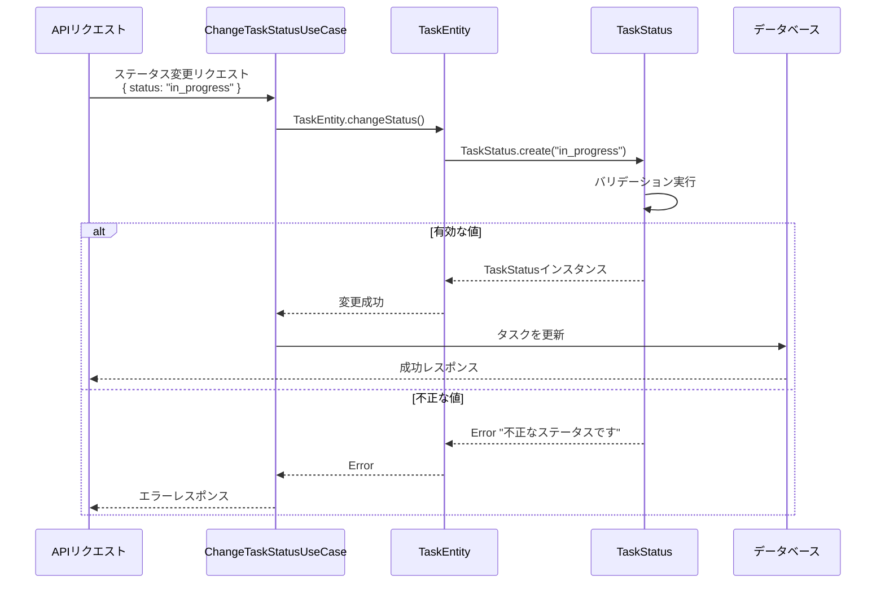
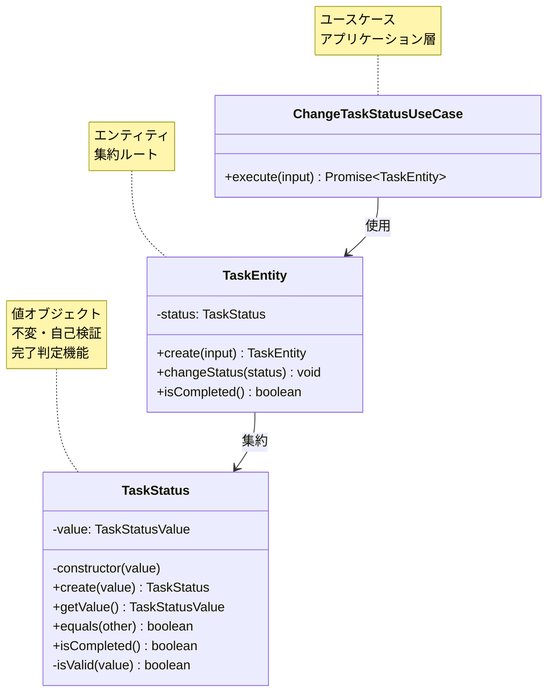

# TASK-1307: TaskStatus値オブジェクト コード解説

## 📄 ドキュメント情報

- **作成日**: 2025-11-21
- **タスクID**: TASK-1307
- **要件名**: todo-app
- **フェーズ**: Phase 2 - バックエンドDomain層実装
- **対象読者**: 組織に加入したばかりの初学者エンジニア

## この機能が何を解決するのか

この機能は「タスクのステータス（進捗状況）を型安全に扱いたい」という課題を解決します。

具体的には：
- ステータスの値（`'not_started'`, `'in_progress'`, `'in_review'`, `'completed'`）を**値オブジェクト**として扱う
- 不正な値（`'invalid'`, `''`, `null`など）が入ってきたときに、エラーを出す
- 一度作ったステータスは変更できない（**不変性**を保証）
- ステータスが「完了」状態かどうかを簡単に判定できる

これを「**値オブジェクト（Value Object）パターン**」と呼び、ドメイン駆動設計（DDD）で推奨されている設計手法です。

### なぜこれが必要なのか？

たとえば、ステータスを普通の文字列として扱うと、こんな問題が起きます：

```typescript
// ❌ 悪い例：文字列をそのまま使う
let status = 'in_progress';
status = 'doing';       // タイポや不正な値を防げない
status = null;          // nullが混入する可能性がある
status = 'finish';      // 'completed'と'finish'が混在する
```

値オブジェクトを使うと、こういった不正な値を**実行時に検出**できます：

```typescript
// ✅ 良い例：値オブジェクトを使う
const status = TaskStatus.create('in_progress');     // OK
const invalid = TaskStatus.create('doing');          // エラーがスローされる！
console.log(status.isCompleted());                   // false
```

### なぜTaskPriorityと別のクラスにするのか？

初学者の方は「優先度もステータスも文字列なのに、なぜ別々のクラスが必要なの？」と疑問に思うかもしれません。

**理由**:
- 優先度とステータスは**意味が違う概念**
- 優先度: `'high'`, `'medium'`, `'low'`（タスクの重要度）
- ステータス: `'not_started'`, `'in_progress'`, `'in_review'`, `'completed'`（タスクの進捗状況）
- それぞれに**異なるバリデーションルール**や**ビジネスロジック**が存在する

たとえば、ステータスには「完了状態かどうか」を判定する`isCompleted()`メソッドがありますが、優先度にはありません。これは、ステータスと優先度が異なるビジネスルールを持つ証拠です。

## 全体の処理の流れ

### 処理フローとファイル関係



この図から分かるように、`TaskStatus`は**最初の防衛ライン**として機能します。不正なデータがドメイン層に侵入する前に、エラーをスローしてデータの整合性を守ります。

## ファイルの役割と責任

### 今回解説するメインのファイル

#### `app/server/src/domain/task/valueobjects/TaskStatus.ts`

**役割**: タスクのステータス（進捗状況）を表現する値オブジェクト

**責任**:
- ステータスの値（`'not_started'`, `'in_progress'`, `'in_review'`, `'completed'`）を保持する
- 不正な値を検出してエラーをスローする
- 値の等価性を比較する機能を提供する
- ステータスが「完了」状態かどうかを判定する機能を提供する
- **イミュータブル**（一度作ったら変更できない）を保証する

**実装された主な機能**:

1. **`create(value: unknown)`** - 静的ファクトリメソッド
   - ステータスの値を受け取って、TaskStatusインスタンスを作成する
   - 不正な値の場合はエラーをスローする

2. **`getValue()`** - 値取得メソッド
   - 内部に保持しているステータスの値を取得する

3. **`equals(other: TaskStatus)`** - 等価性比較メソッド
   - 他のTaskStatusインスタンスと値が同じかどうかを判定する

4. **`isCompleted()`** - 完了判定メソッド
   - ステータスが`'completed'`（完了）かどうかを判定する
   - これはTaskStatusだけが持つ特別なビジネスロジック

### 呼び出しているファイル

#### `app/server/src/domain/task/TaskEntity.ts`（まだ未実装）

**このファイルの役割**: タスク全体を表現するエンティティ

**TaskStatusとの関係**:
- `TaskEntity`は`TaskStatus`を**プロパティとして持つ**（集約）
- タスク作成時やステータス変更時に`TaskStatus.create()`を呼び出す

```typescript
// TaskEntity.ts での使用例（将来の実装）
export class TaskEntity {
  private status: TaskStatus; // プロパティとして保持

  public static create(input: CreateTaskInput): TaskEntity {
    // デフォルト値 'not_started' を適用
    const status = TaskStatus.create('not_started');

    return new TaskEntity({ status });
  }

  public changeStatus(newStatus: string): void {
    this.status = TaskStatus.create(newStatus); // 変更時に呼び出す
    this.touch(); // 更新日時を更新
  }

  public isCompleted(): boolean {
    return this.status.isCompleted(); // TaskStatusの判定メソッドを利用
  }
}
```

### 呼び出されているファイル

#### `app/server/src/schemas/tasks.ts`

**このファイルの役割**: Zodスキーマによるバリデーション定義

**TaskStatusとの関係**:
- `TaskStatus`はドメイン層でのバリデーション
- `taskStatusSchema`はAPIリクエストの入口でのバリデーション
- **二重のバリデーション**で安全性を高めている

```typescript
// tasks.ts での定義
export const taskStatusSchema = z.enum([
  'not_started',
  'in_progress',
  'in_review',
  'completed',
]);
export type TaskStatus = z.infer<typeof taskStatusSchema>;
```

**注意**: `tasks.ts`の`TaskStatus`型と、今回実装した`TaskStatus`クラスは**別物**です：
- `tasks.ts`の`TaskStatus`型 → 単なる型（`'not_started' | 'in_progress' | 'in_review' | 'completed'`）
- 今回の`TaskStatus`クラス → バリデーションとビジネスロジックを持つオブジェクト

## テストファイルの役割

#### `app/server/src/domain/task/__tests__/TaskStatus.test.ts`

**役割**: TaskStatusクラスの動作を検証するテスト

**テストの構造**:
- **正常系テスト**（6ケース）: 有効な値で正常に動作することを確認
- **異常系テスト**（6ケース）: 不正な値でエラーがスローされることを確認

```typescript
// テストの構造
describe('TaskStatus', () => {
  describe('create静的ファクトリメソッド', () => {
    describe('正常系: 有効なステータスでの生成', () => {
      // TC-001: 'not_started' で作成できる
      // TC-002: 'in_progress' で作成できる
      // TC-003: 'in_review' で作成できる
      // TC-004: 'completed' で作成できる
    });

    describe('異常系: 不正なステータスでのエラー', () => {
      // TC-008: 不正な文字列でエラー
      // TC-009: 空文字列でエラー
      // TC-010: null でエラー
      // TC-011: undefined でエラー
      // TC-012: 数値でエラー
      // TC-013: オブジェクトでエラー
    });
  });

  describe('getValueメソッド', () => {
    // TC-005: 値が取得できる
  });

  describe('equalsメソッド', () => {
    // TC-006: 等価性比較ができる
  });

  describe('isCompletedメソッド', () => {
    // TC-007: 完了状態を判定できる
  });
});
```

## クラスと関数の呼び出し関係

### クラス構造と依存関係



**依存の方向**:
- `TaskEntity`は`TaskStatus`に依存する（呼び出す側）
- `TaskStatus`は他のクラスに依存しない（独立している）

これは**依存性逆転の原則（SOLID のD）**に従った設計です。ドメイン層の値オブジェクトは、他の層に依存せず、純粋なビジネスロジックのみを持ちます。

## 重要な処理の詳細解説

### 1. 定数配列による Single Source of Truth

```typescript
// app/server/src/domain/task/valueobjects/TaskStatus.ts
const TASK_STATUS_VALUES = [
  'not_started',
  'in_progress',
  'in_review',
  'completed',
] as const;

export type TaskStatusValue = (typeof TASK_STATUS_VALUES)[number];
```

**なぜこう書いているか**:
- 許容されるステータスの値を**一箇所だけ**で管理する（Single Source of Truth）
- `as const`をつけることで、TypeScriptがこの配列を「変更できない定数」として扱う
- `(typeof TASK_STATUS_VALUES)[number]`で型を自動生成する

**初学者がつまずきやすいポイント**:
- `as const`がないと、TypeScriptは`string[]`型として推論してしまう
- `[number]`は「配列の要素の型」を取り出すTypeScriptの構文

**良い点**:
- 将来、ステータスの選択肢を増やしたい場合、この配列を1箇所だけ変更すればよい
- バリデーションロジックと型定義が自動的に同期する
- エラーメッセージに表示される許容値も自動的に更新される

**TaskPriorityとの違い**:
- TaskPriorityは3つの値（`'high'`, `'medium'`, `'low'`）
- TaskStatusは4つの値（`'not_started'`, `'in_progress'`, `'in_review'`, `'completed'`）
- どちらも同じ実装パターンを使っているので、理解しやすい

### 2. プライベートコンストラクタ + 静的ファクトリメソッド

```typescript
// app/server/src/domain/task/valueobjects/TaskStatus.ts
private constructor(value: TaskStatusValue) {
  this.value = value;
}

public static create(value: unknown): TaskStatus {
  if (!TaskStatus.isValid(value)) {
    throw new Error(
      `不正なステータスです: ${value} (許容値: ${TASK_STATUS_VALUES.join(', ')})`,
    );
  }
  return new TaskStatus(value);
}
```

**なぜこう書いているか**:
- コンストラクタを`private`にして、外部から`new TaskStatus()`を呼べないようにする
- 代わりに`TaskStatus.create()`という静的メソッドを使って生成する
- 生成時に必ずバリデーションを通過させる設計

**初学者がつまずきやすいポイント**:
- 「なぜ普通に`new`で作らないの？」と疑問に思うかもしれません
- **理由**: `new`を許すと、バリデーションをスキップしてインスタンスを作れてしまうから

```typescript
// もしコンストラクタがpublicだったら...
// ❌ こういう不正な使い方ができてしまう
const invalid = new TaskStatus('doing' as any);
```

**正しい理解**:
- `private constructor`は「必ずファクトリメソッドを通す」ことを強制する仕組み
- ファクトリメソッド = 「オブジェクトを作る専用の関数」のこと

### 3. 型ガード関数による実行時バリデーション

```typescript
// app/server/src/domain/task/valueobjects/TaskStatus.ts
private static isValid(value: unknown): value is TaskStatusValue {
  return (
    typeof value === 'string' &&
    (TASK_STATUS_VALUES as readonly string[]).includes(value)
  );
}
```

**この関数が何をしているか**:
1. `typeof value === 'string'` → まず文字列かどうかをチェック
2. `TASK_STATUS_VALUES.includes(value)` → その文字列が許容値の配列に含まれるかチェック

**なぜ`value is TaskStatusValue`という戻り値の型なのか**:
- これは「**型ガード関数**」と呼ばれる特殊な構文
- `isValid(value)`が`true`を返したとき、TypeScriptは「`value`は`TaskStatusValue`型である」と推論する

**初学者がつまずきやすいポイント**:
- 「`value is TaskStatusValue`って何？」と戸惑うかもしれません
- **比喩で説明**: これは「入場券の検査」のようなもの
  - 入場券を持っていない人（`unknown`型）が来る
  - 係員（型ガード関数）が「有効な入場券を持っている」と判定する
  - TypeScriptが「この人は正式な来場者（`TaskStatusValue`型）です」と認識する

### 4. isCompleted()メソッド - TaskStatus固有のビジネスロジック

```typescript
// app/server/src/domain/task/valueobjects/TaskStatus.ts
public isCompleted(): boolean {
  return this.value === 'completed';
}
```

**この関数が何をしているか**:
- ステータスが`'completed'`（完了）かどうかを判定する
- `true`または`false`を返す

**なぜこのメソッドが必要なのか**:
- タスクが完了しているかどうかは、アプリケーション全体で頻繁に確認する必要がある
- 「完了」という概念は、ビジネスルールの一部
- このメソッドがあることで、呼び出し側は内部の値（`'completed'`という文字列）を知らなくてよい

**TaskPriorityとの違い**:
- `TaskPriority`には`isCompleted()`メソッドは**ない**
- なぜなら、優先度には「完了」という概念がないから
- これは、ステータスと優先度が異なるビジネスルールを持つ証拠

**良い点**:
- もし将来「完了」の定義が変わっても、このメソッドだけを変更すればよい
- たとえば、`'completed'`だけでなく`'archived'`も「完了」と見なす場合：

```typescript
// 将来の拡張例
public isCompleted(): boolean {
  return this.value === 'completed' || this.value === 'archived';
}
```

### 5. readonlyプロパティによる不変性の保証

```typescript
// app/server/src/domain/task/valueobjects/TaskStatus.ts
private readonly value: TaskStatusValue;
```

**なぜ`readonly`がついているか**:
- 一度代入した値を**二度と変更できない**ようにする
- これが「**イミュータブル（不変）**」を実現する仕組み

```typescript
// もしreadonlyがなかったら...
// ❌ こういう不正な書き換えができてしまう
const status = TaskStatus.create('in_progress');
status.value = 'invalid'; // コンパイルエラーにならない（本来は防ぎたい）
```

**正しい理解**:
- 値オブジェクトは「作ったら変更しない」ことが原則
- もしステータスを変更したい場合は、**新しいインスタンスを作り直す**

```typescript
// ✅ 正しい変更方法
let status = TaskStatus.create('not_started');
status = TaskStatus.create('in_progress'); // 新しいインスタンスに置き換える
```

### 6. テストでのGiven-When-Thenパターン

```typescript
// app/server/src/domain/task/__tests__/TaskStatus.test.ts
test('有効なステータス（in_progress）で値オブジェクトが作成される', () => {
  // Given: 進行中を表す有効な文字列 'in_progress'
  const input = 'in_progress';

  // When: TaskStatus.create()を呼び出してインスタンスを生成
  const taskStatus = TaskStatus.create(input);

  // Then: TaskStatusインスタンスが生成され、getValue()が'in_progress'を返す
  expect(taskStatus).toBeInstanceOf(TaskStatus);
  expect(taskStatus.getValue()).toBe('in_progress');
});
```

**このテストが何をしているか**:
- **Given（前提条件）**: テストに必要なデータを準備する
- **When（実際の処理）**: テスト対象の関数を実行する
- **Then（期待結果）**: 結果が正しいか検証する

**なぜこう書いているか**:
- テストの「何を確認しているか」が一目でわかる
- コメントで明示的に3つのステップを分けている
- これはテストの**可読性を高める**ための工夫

### 7. test.each()による効率的なテスト記述

```typescript
// app/server/src/domain/task/__tests__/TaskStatus.test.ts
describe('isCompletedメソッド', () => {
  test.each([
    { status: 'completed', expected: true },
    { status: 'not_started', expected: false },
    { status: 'in_progress', expected: false },
    { status: 'in_review', expected: false },
  ] as const)(
    'isCompleted()メソッドが$statusステータスで$expectedを返す',
    ({ status, expected }) => {
      // Given: 指定されたステータスのTaskStatusインスタンス
      const taskStatus = TaskStatus.create(status);

      // When: isCompleted()を呼び出す
      const result = taskStatus.isCompleted();

      // Then: 期待される結果が返される
      expect(result).toBe(expected);
    },
  );
});
```

**この書き方の良い点**:
- 4つのステータスすべてに対して、同じテストを実行できる
- テストケースを追加する場合、配列に1行追加するだけでよい
- テストコードが重複せず、保守しやすい

**初学者がつまずきやすいポイント**:
- `test.each()`は「データ駆動テスト」と呼ばれるパターン
- テストの構造は同じで、データだけが違う場合に使う
- `{ status: 'completed', expected: true }`という形で、入力と期待結果をセットで定義する

## 初学者がつまずきやすいポイント

### 1. 「値オブジェクト」と「エンティティ」の違い

**よくある勘違い**:
- 「なぜTaskStatusはクラスなのに、IDを持たないの？」
- 「TaskEntityとTaskStatusの違いは何？」

**正しい理解**:

| 比較項目 | 値オブジェクト（TaskStatus） | エンティティ（TaskEntity） |
|---------|------------------------------|-------------------------|
| 識別子（ID） | 持たない | 持つ（タスクID） |
| 等価性の判定 | 値で判定（`equals`メソッド） | IDで判定 |
| 不変性 | 変更不可（イミュータブル） | 状態を変更できる |
| 生存期間 | 短い（使い捨て） | 長い（永続化される） |

**比喩で説明**:
- **値オブジェクト** = 「信号機の色」のようなもの
  - 「赤」という色は、どの信号機の「赤」も同じ意味を持つ
  - 「赤」に「ID」はない
  - 「赤」を「黄色」に変更することはできない（新しい「黄色」を作る）

- **エンティティ** = 「人」のようなもの
  - 同じ名前の人がいても、別人として識別できる（IDがある）
  - 人は年齢や住所が変わっても、同一人物として扱える

### 2. 「なぜテストが12個もあるの？」

**よくある勘違い**:
- 「正常系だけテストすればいいんじゃないの？」
- 「異常系のテストは必要ない気がする」

**正しい理解**:
- **正常系**（6ケース）: 有効な値（4種類のステータス）で正しく動く + `getValue()` + `equals()`
- **異常系**（6ケース）: 不正な値で**正しくエラーを出す**

**なぜ異常系も大切なのか**:
- ユーザーが間違った入力をしたとき、システムが壊れないようにするため
- 「エラーが出ない = バグ」という場合もある（不正な値を受け入れてしまう）

**比喩で説明**:
- 自動改札機をテストするとき、こう考える：
  - ✅ 有効な切符で通れるか？（正常系）
  - ✅ 期限切れの切符で通れないか？（異常系） ← これも重要！

### 3. 「`unknown`型と`any`型の違い」

**よくある勘違い**:
- 「`unknown`も`any`も『何でも入る』型だから、同じじゃないの？」

**正しい理解**:

```typescript
// any型の場合（危険）
function bad(value: any) {
  console.log(value.toUpperCase()); // チェックなしで実行できる
}

// unknown型の場合（安全）
function good(value: unknown) {
  // console.log(value.toUpperCase()); // ❌ コンパイルエラー

  if (typeof value === 'string') {    // ✅ 型チェック必須
    console.log(value.toUpperCase()); // OK
  }
}
```

**なぜTaskStatus.create()は`unknown`型を受け取るのか**:
- 呼び出し元が「何を渡してくるか分からない」状況を想定している
- `unknown`型を使うことで、TypeScriptが「型チェックをしないとコンパイルエラー」にする
- これは**実行時の安全性**を高めるための工夫

### 4. 「なぜ`isCompleted()`だけあって、`isInProgress()`はないの？」

**よくある勘違い**:
- 「`isInProgress()`や`isNotStarted()`もあった方が便利じゃないの？」

**正しい理解**:
- 現時点では、「完了しているか」だけが重要なビジネスルール
- 他のステータスの判定が頻繁に必要になったら、そのときに追加すればよい
- **YAGNI原則**（You Aren't Gonna Need It = 必要になるまで作らない）に従っている

**どういう場合に追加するか**:
- たとえば、「進行中のタスクだけを一覧表示する」機能が必要になったとき
- その場合は`isInProgress()`メソッドを追加することを検討する

## この設計のいい点

### 1. Single Responsibility Principle（単一責任の原則）を守っている

**何が素晴らしいか**:
- `TaskStatus`クラスは「ステータスのバリデーション」だけに責任を持つ
- タスクの保存や、ユーザー認証などの責任は持たない
- 責任が明確なので、**テストしやすく、変更しやすい**

**比喩で説明**:
- レストランで「料理人」「ウェイター」「会計係」が役割分担しているようなもの
- それぞれが自分の仕事に集中できる

### 2. 型安全性とランタイム安全性の両立

**何が素晴らしいか**:
- **コンパイル時**: TypeScriptの型システムで不正な値を検出
- **実行時**: `isValid()`メソッドで不正な値を検出
- 二重のチェックで、より安全なコードになる

```typescript
// TypeScriptの型チェック（コンパイル時）
const status1: TaskStatusValue = 'in_progress';    // OK
const status2: TaskStatusValue = 'doing'; // ❌ コンパイルエラー

// ランタイムチェック（実行時）
TaskStatus.create('in_progress');    // OK
TaskStatus.create('doing'); // ❌ 実行時エラー
```

### 3. 不変性（Immutability）を保証している

**何が素晴らしいか**:
- 一度作ったステータスは、誰も書き換えられない
- バグが起きにくく、デバッグもしやすい
- 複数のスレッド（並行処理）でも安全に使える

**悪い例（可変）**:
```typescript
// ❌ もし可変だったら...
const status = createStatus('in_progress');
doSomething(status);  // この関数の中でstatusが変更されるかも？
console.log(status);  // 'in_progress' のまま？それとも変わってる？
```

**良い例（不変）**:
```typescript
// ✅ 不変なので安心
const status = TaskStatus.create('in_progress');
doSomething(status);  // この関数の中で変更できない
console.log(status.getValue()); // 必ず 'in_progress' のまま
```

### 4. ビジネスロジックのカプセル化（`isCompleted()`メソッド）

**何が素晴らしいか**:
- 「完了しているかどうか」の判定ロジックを、値オブジェクトに閉じ込めている
- 呼び出し側は、内部の値（`'completed'`という文字列）を知らなくてよい
- もし「完了」の定義が変わっても、このメソッドだけを変更すればよい

```typescript
// ✅ 良い例: ビジネスロジックをカプセル化
if (task.getStatus().isCompleted()) {
  // 完了処理
}

// ❌ 悪い例: 内部の値に直接依存
if (task.getStatus().getValue() === 'completed') {
  // 完了処理
}
```

**なぜ悪い例が悪いのか**:
- もし「完了」の定義が変わったとき（たとえば`'archived'`も完了と見なす）、すべての呼び出し箇所を修正しなければならない
- `isCompleted()`メソッドを使っていれば、メソッドの中身だけを変更すればよい

## まとめ

この`TaskStatus`値オブジェクトは、以下の役割を果たしています：

1. **型安全性**: TypeScriptの型システムで不正な値を防ぐ
2. **ランタイム安全性**: 実行時のバリデーションで不正な値を検出
3. **不変性**: 一度作った値は変更できない
4. **ビジネスロジックのカプセル化**: 「完了」状態の判定を内部に閉じ込める
5. **明確なエラーメッセージ**: 何が間違っているか一目で分かる

これらの設計により、タスクのステータスという重要なビジネスルールを、安全かつ確実に扱えるようになっています。

**次のステップ**:
- `TaskEntity`の実装で、この`TaskStatus`がどう使われるかを学ぶ
- 他の値オブジェクト（`TaskPriority`, `TaskTitle`）の実装にも同じパターンが使われていることを確認する
- 特に、`TaskTitle`は文字列の長さバリデーションを持つため、少し異なるパターンになっていることに注目する

## 参考資料

- [要件定義書](../../implements/todo-app/TASK-1307/TaskStatus-requirements.md)
- [タスクファイル](../../tasks/todo-app-phase2.md)
- [TaskPriority解説文書](./TASK-1306-code-explan.md)（類似パターン）
