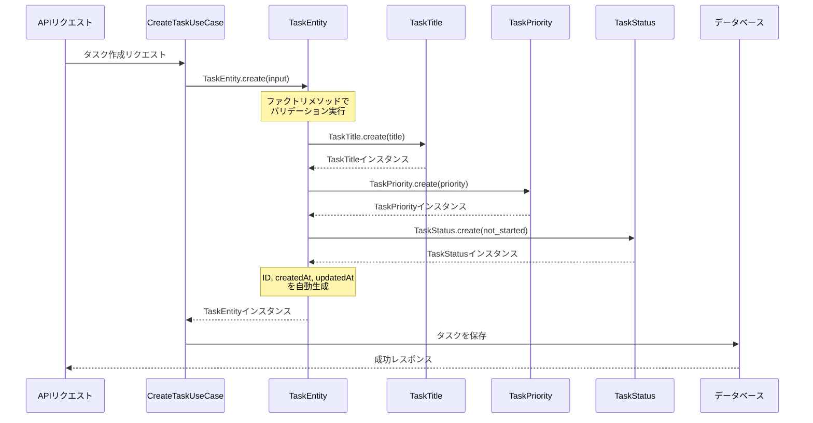
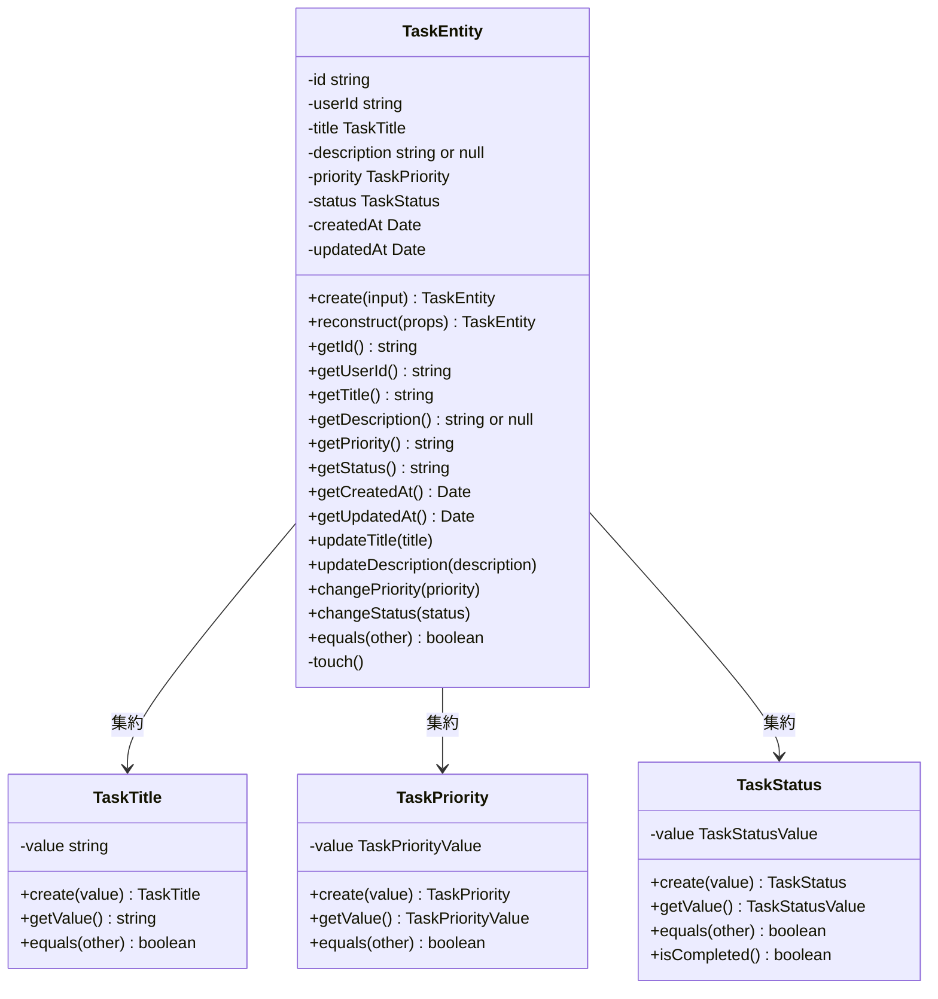

# TASK-1309: TaskEntity コード解説

## 📄 ドキュメント情報

- **作成日**: 2025-11-22
- **タスクID**: TASK-1309
- **要件名**: todo-app
- **フェーズ**: Phase 2 - バックエンドDomain層実装
- **対象読者**: 組織に加入したばかりの初学者エンジニア

## この機能が何を解決するのか

この機能は「タスクのデータと振る舞いを一つにまとめて管理したい」という課題を解決します。

具体的には：
- タスクに関するデータ（ID、タイトル、説明など）を**一つのオブジェクト**にまとめる
- タスクの操作（タイトル変更、ステータス変更など）を**メソッド**として提供する
- 不正なデータでのタスク作成を**防止**する
- 新規作成とDBからの復元で、**異なる生成方法**を提供する

これを「**エンティティ（Entity）パターン**」と呼び、ドメイン駆動設計（DDD）で推奨されている設計手法です。

### エンティティと値オブジェクトの違い

前回実装した`TaskPriority`や`TaskStatus`は「**値オブジェクト**」でした。今回の`TaskEntity`は「**エンティティ**」です。この違いは何でしょうか？

| 項目 | 値オブジェクト | エンティティ |
|------|--------------|-------------|
| **同一性** | 「値」が同じなら同じもの | 「ID」が同じなら同じもの |
| **例え** | お金（100円は100円） | 人（名前が同じでも別人） |
| **変更可能性** | 変更不可（新しいものを作る） | 状態は変わる（IDは変わらない） |

たとえば、「山田太郎」という人が名前を「山田花子」に変更しても、その人自身は同じ人です。これがエンティティの考え方です。一方で、100円玉は「100円」という値が重要で、どの100円玉かは気にしません。これが値オブジェクトです。

```typescript
// 値オブジェクトの例：値が同じなら等価
const priority1 = TaskPriority.create('high');
const priority2 = TaskPriority.create('high');
priority1.equals(priority2); // true（値が同じだから）

// エンティティの例：IDが同じなら等価
const task1 = TaskEntity.create({ userId: 'user-1', title: 'タスクA' });
const task2 = TaskEntity.create({ userId: 'user-1', title: 'タスクA' });
task1.equals(task2); // false（IDが違うから）
```

## 全体の処理の流れ

### 処理フローとファイル関係



この図から分かるように、`TaskEntity`は**値オブジェクト（TaskTitle, TaskPriority, TaskStatus）を集約**して、一つのタスクとしてまとめています。これを「**集約（Aggregate）**」と呼びます。

## ファイルの役割と責任

### 今回解説するメインのファイル

#### `app/server/src/domain/task/TaskEntity.ts`

**役割**: タスクのドメインエンティティを表現

**責任**:
- タスクのデータ（ID、ユーザーID、タイトル、説明、優先度、ステータス、タイムスタンプ）を保持
- 新規タスクの作成（`create`）と、DBからの復元（`reconstruct`）を提供
- タスクの更新操作（タイトル変更、ステータス変更など）をメソッドとして提供
- 値オブジェクト（TaskTitle, TaskPriority, TaskStatus）を内部で集約

**実装された主な機能**:

1. **`create(input)`** - 新規タスク作成用の静的ファクトリメソッド
   - ユーザーからの入力データを受け取り、新しいタスクを作成
   - ID、タイムスタンプを自動生成
   - 値オブジェクトを通じてバリデーションを実行

2. **`reconstruct(props)`** - DB復元用の静的ファクトリメソッド
   - DBから取得したデータをそのままタスクに復元
   - バリデーションは行わない（DBのデータは正しいと信頼）

3. **ゲッター群** - 各プロパティを取得するメソッド
   - `getId()`, `getUserId()`, `getTitle()`, `getDescription()` など

4. **ビジネスロジック** - タスクの振る舞いを表すメソッド
   - `updateTitle(title)`, `updateDescription(description)` など
   - `equals(other)` で同一性を判定

### 呼び出しているファイル（依存先）

#### `app/server/src/domain/task/valueobjects/TaskTitle.ts`

**役割**: タイトルの値オブジェクト

**TaskEntityから呼び出されるタイミング**:
- `create()`メソッド内でタイトルを作成するとき
- `updateTitle()`メソッドでタイトルを更新するとき

#### `app/server/src/domain/task/valueobjects/TaskPriority.ts`

**役割**: 優先度の値オブジェクト

**TaskEntityから呼び出されるタイミング**:
- `create()`メソッド内で優先度を作成するとき
- `changePriority()`メソッドで優先度を変更するとき

#### `app/server/src/domain/task/valueobjects/TaskStatus.ts`

**役割**: ステータスの値オブジェクト

**TaskEntityから呼び出されるタイミング**:
- `create()`メソッド内でステータスを作成するとき（デフォルトで`not_started`）
- `changeStatus()`メソッドでステータスを変更するとき

## クラスと関数の呼び出し関係

### クラス構造と依存関係



矢印の方向に注目してください。`TaskEntity`は値オブジェクトに「依存」していますが、値オブジェクトは`TaskEntity`を知りません。これにより、値オブジェクトを単独でテストできます。

## 重要な処理の詳細解説

### 1. 新規タスク作成（createメソッド）

```typescript
// app/server/src/domain/task/TaskEntity.ts
public static create(input: CreateTaskEntityInput): TaskEntity {
  const now = new Date();

  return new TaskEntity({
    id: randomUUID(),                              // IDを自動生成
    userId: input.userId,
    title: TaskTitle.create(input.title),          // 値オブジェクトでバリデーション
    description: input.description ?? null,        // undefinedならnullに変換
    priority: TaskPriority.create(input.priority ?? 'medium'),  // デフォルト値
    status: TaskStatus.create('not_started'),      // 新規タスクは必ず「未着手」
    createdAt: now,
    updatedAt: now,
  });
}
```

**ポイント**:
- `randomUUID()`でユニークなIDを生成（Node.jsの標準機能）
- `??`演算子で「nullまたはundefined」の場合にデフォルト値を使用
- 値オブジェクトの`create()`を通じてバリデーションが実行される

**よくある勘違い**: 「IDはユーザーが指定するもの」と思いがちですが、新規作成時はシステムが自動生成します。DBからの復元時のみ、既存のIDを使います。

### 2. DB復元（reconstructメソッド）

```typescript
// app/server/src/domain/task/TaskEntity.ts
public static reconstruct(props: TaskEntityProps): TaskEntity {
  return new TaskEntity(props);
}
```

**ポイント**:
- バリデーションを行わない（DBのデータは正しいと信頼）
- 引数の型が`TaskEntityProps`で、値オブジェクトが**すでに生成済み**であることを前提

**なぜバリデーションをしないのか？**

DBに保存されているデータは、保存時にすでにバリデーション済みです。毎回バリデーションを実行すると：
- パフォーマンスが悪化する
- DBの値が「正しくない」と判断されてエラーになる可能性がある

```typescript
// 呼び出し側（リポジトリ）での使用例
const task = TaskEntity.reconstruct({
  id: dbRecord.id,
  userId: dbRecord.userId,
  title: TaskTitle.create(dbRecord.title),  // リポジトリ側で値オブジェクトを作成
  // ...
});
```

### 3. タイトル更新（updateTitleメソッド）

```typescript
// app/server/src/domain/task/TaskEntity.ts
public updateTitle(title: string): void {
  this.title = TaskTitle.create(title);  // 値オブジェクトでバリデーション
  this.touch();                          // updatedAtを更新
}
```

**ポイント**:
- `TaskTitle.create()`を使うことで、更新時もバリデーションが実行される
- `touch()`で更新日時を現在時刻に更新

**touchメソッドとは？**

```typescript
// app/server/src/domain/task/TaskEntity.ts
private touch(): void {
  this.updatedAt = new Date();
}
```

「タスクに触れた」ことを記録するヘルパーメソッドです。タスクの内容が変わるたびに呼び出し、`updatedAt`を更新します。これにより、「最終更新日時」が自動的に管理されます。

### 4. 同一性判定（equalsメソッド）

```typescript
// app/server/src/domain/task/TaskEntity.ts
public equals(other: TaskEntity): boolean {
  return this.id === other.id;  // IDだけで判定
}
```

**ポイント**:
- エンティティの同一性は**IDのみ**で判定
- タイトルやステータスが違っても、IDが同じなら「同じタスク」

```typescript
// 使用例
const task1 = TaskEntity.reconstruct({ id: 'task-123', title: 'タスクA', ... });
const task2 = TaskEntity.reconstruct({ id: 'task-123', title: 'タスクB', ... });

task1.equals(task2); // true（IDが同じだから）
```

## 初学者がつまずきやすいポイント

### 1. なぜコンストラクタがprivateなのか？

```typescript
// ❌ これはできない
const task = new TaskEntity({ ... });

// ✅ これを使う
const task = TaskEntity.create({ ... });
```

**理由**: コンストラクタを`private`にすることで、**必ずファクトリメソッドを通じて作成させる**ことができます。これにより：
- 新規作成か復元かを明確に区別できる
- 必要な初期化処理（ID生成など）を確実に実行できる

### 2. createとreconstructの使い分け

| メソッド | 使うタイミング | IDはどうなる？ |
|---------|--------------|---------------|
| `create` | ユーザーがタスクを新規作成 | 自動生成される |
| `reconstruct` | DBからタスクを読み込む | DBの値をそのまま使用 |

**よくある間違い**: DBから読み込むときに`create`を使ってしまうと、新しいIDが生成されて別のタスクになってしまいます。

### 3. getTitle()の戻り値がstringな理由

```typescript
// TaskEntityのgetTitleメソッド
public getTitle(): string {
  return this.title.getValue();  // TaskTitleから文字列を取り出す
}
```

内部では`TaskTitle`（値オブジェクト）を持っていますが、外部に公開するときは**プリミティブな文字列**として返しています。これにより、呼び出し側は値オブジェクトの存在を意識せずに済みます。

```typescript
// 呼び出し側は単純な文字列として扱える
const title = task.getTitle();  // "タスクのタイトル" (string)
console.log(`タスク: ${title}`);
```

### 4. nullとundefinedの違い

```typescript
// createメソッド内
description: input.description ?? null,  // undefinedならnullに変換
```

- `undefined`: 「値が設定されていない」
- `null`: 「値が空であることが明示されている」

DBに保存する際は、`undefined`ではなく`null`を使うのが一般的です。この変換により、データの一貫性を保っています。

## この設計のいい点

### 1. 値オブジェクトによるバリデーションの自動化

タイトルや優先度の検証ロジックは、それぞれの値オブジェクトに閉じ込められています。`TaskEntity`は「タイトルが正しいかどうか」を気にする必要がありません。

```typescript
// TaskEntityはバリデーションの詳細を知らない
this.title = TaskTitle.create(input.title);  // TaskTitleに任せる
```

### 2. ファクトリメソッドによる明確な生成パターン

`create`と`reconstruct`という2つのファクトリメソッドにより、**なぜそのタスクが作られるのか**が明確になります。

```typescript
// コードを読むだけで意図が分かる
TaskEntity.create({ ... });      // ユーザーが新規作成した
TaskEntity.reconstruct({ ... }); // DBから復元した
```

### 3. ビジネスロジックのカプセル化

「タスクを更新したら更新日時も変わる」というビジネスルールが、`TaskEntity`内部で完結しています。呼び出し側は`updateTitle()`を呼ぶだけで、更新日時のことは考えなくて済みます。

```typescript
task.updateTitle('新しいタイトル');
// updatedAtが自動的に更新される（呼び出し側は意識しなくてOK）
```

### 4. readonlyによる不変性の保証

`id`、`userId`、`createdAt`は`readonly`で、一度設定されたら変更できません。これにより、「タスクのIDが途中で変わる」といったバグを防げます。

```typescript
private readonly id: string;      // 変更不可
private readonly userId: string;  // 変更不可
private title: TaskTitle;         // 変更可能（updateTitleで更新）
```
