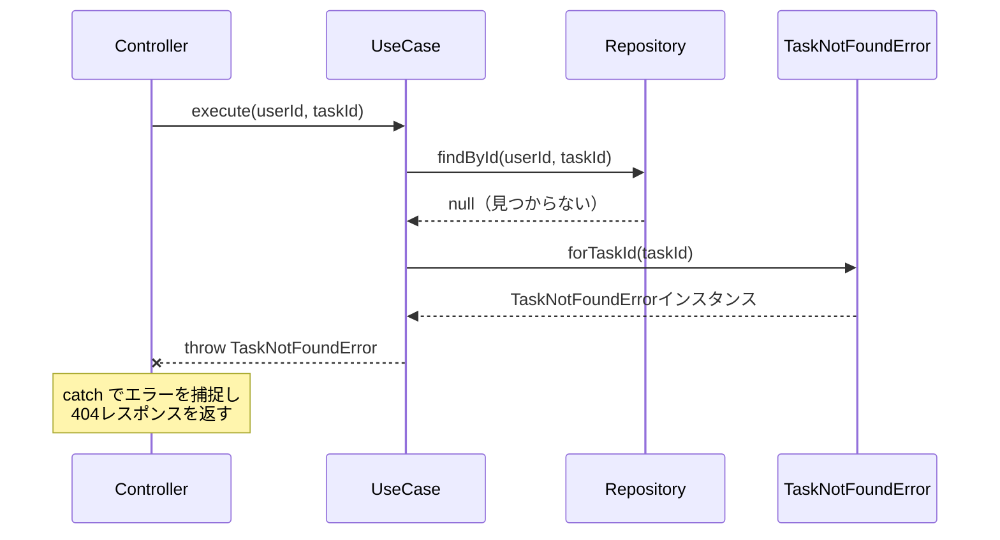
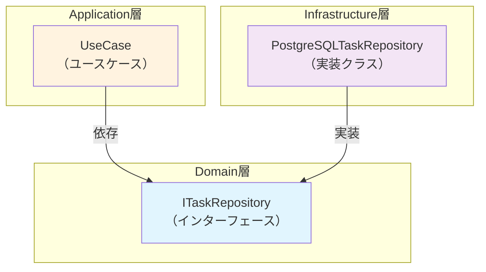
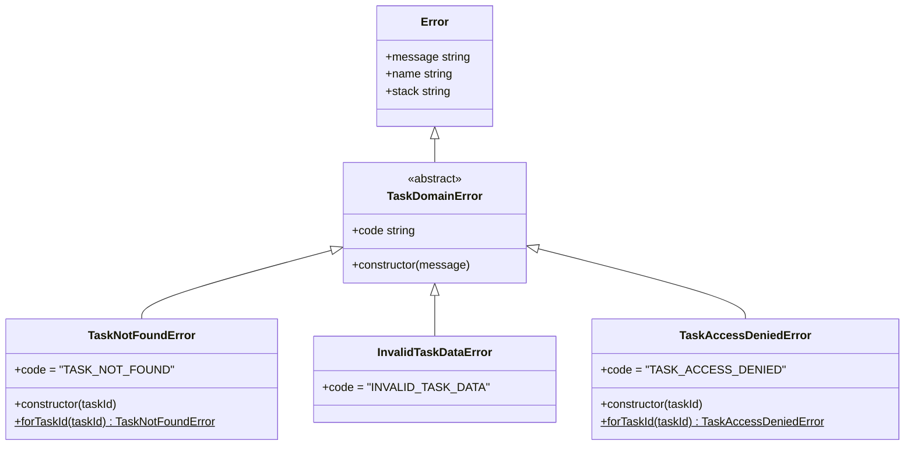
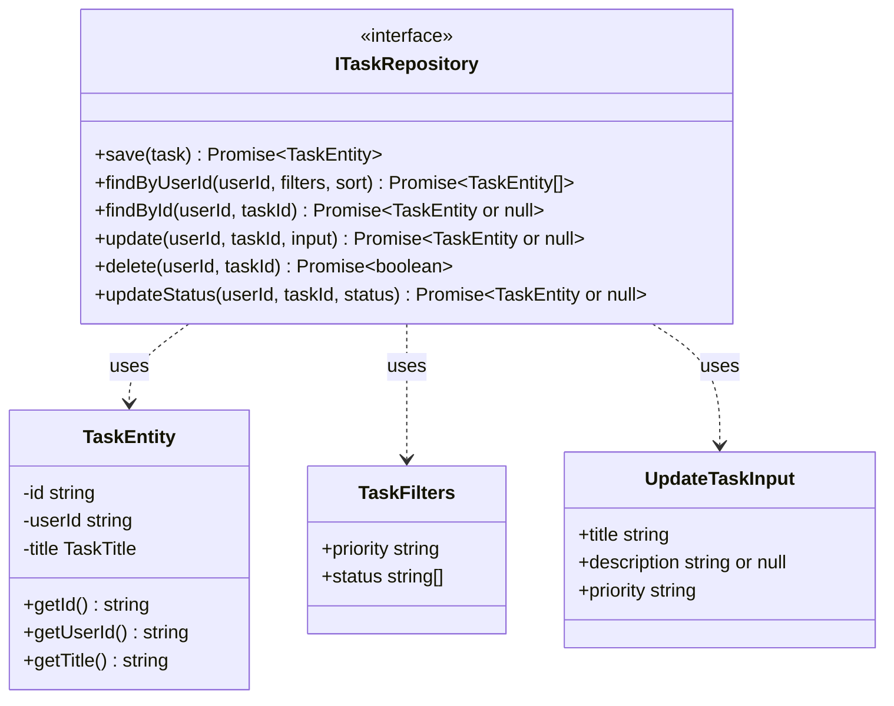

# TASK-1310 ドメインエラーとリポジトリインターフェース コード解説

## この機能が何を解決するのか

この機能は「タスク機能のエラー処理を標準化し、データアクセスの方法を抽象化する」ことを解決します。

具体的には：
- タスクが見つからない、データが不正、アクセス権限がないといった「例外的な状況」を、明確なエラークラスで表現する
- データベースへのアクセス方法を「インターフェース（契約）」として定義し、実装の詳細を隠す

これらを「ドメインエラー」と「リポジトリインターフェース」と呼び、アプリケーション全体で一貫したエラー処理と、柔軟なデータアクセスを実現できます。

### なぜこれが必要なのか

想像してみてください。タスクを取得しようとしたとき、タスクが存在しない場合と、アクセス権限がない場合で、同じ「エラー」として扱うのは困ります。フロントエンドでは「タスクが見つかりませんでした」と「アクセス権限がありません」を区別して表示したいはずです。

また、データベースに直接アクセスするコードがアプリケーションのあちこちに散らばっていると、データベースを変更したときに大規模な修正が必要になります。インターフェースを使うことで、「データベースとのやり取り方法」をひとつの場所に閉じ込められます。

## 全体の処理の流れ

### ドメインエラーの使用イメージ

将来的に、Application層のユースケースでこのように使われます：



### リポジトリインターフェースの役割



**ポイント**: UseCase（Application層）は `ITaskRepository`（Domain層）に依存し、`PostgreSQLTaskRepository`（Infrastructure層）は `ITaskRepository` を実装します。これにより依存の方向が「外側から内側」に向かいます。これを「依存性逆転の原則（DIP）」と呼びます。

## ファイルの役割と責任

### 今回実装したメインのファイル

#### ドメインエラー群（`app/server/src/domain/task/errors/`）

| ファイル | 役割 |
|----------|------|
| `TaskDomainError.ts` | すべてのタスクドメインエラーの親クラス（基底クラス） |
| `TaskNotFoundError.ts` | タスクが見つからない場合のエラー（HTTP 404に対応） |
| `InvalidTaskDataError.ts` | タスクデータが不正な場合のエラー（HTTP 400に対応） |
| `TaskAccessDeniedError.ts` | アクセス権限がない場合のエラー（HTTP 403に対応） |
| `index.ts` | エラークラスをまとめてエクスポートするファイル |

#### リポジトリインターフェース（`app/server/src/domain/task/`）

| ファイル | 役割 |
|----------|------|
| `ITaskRepository.ts` | タスクの永続化操作の契約を定義 |

#### User集約へのIUserRepository移動（関連リファクタリング）

| ファイル | 変更内容 |
|----------|----------|
| `app/server/src/domain/user/IUserRepository.ts` | 新規追加（User集約内に移動） |
| `app/server/src/domain/user/index.ts` | IUserRepositoryのエクスポートを追加 |

## クラスと関数の呼び出し関係

### エラークラスの継承関係



### ITaskRepositoryの依存関係



## 重要な処理の詳細解説

### 1. TaskDomainError - 基底エラークラス

```typescript
// app/server/src/domain/task/errors/TaskDomainError.ts
export abstract class TaskDomainError extends Error {
  // 抽象プロパティ：子クラスで必ず実装する
  abstract readonly code: string;

  constructor(message: string) {
    super(message);
    // クラス名を自動設定（"TaskNotFoundError" など）
    this.name = this.constructor.name;
    // スタックトレースを正確に設定（デバッグ時に役立つ）
    if (Error.captureStackTrace) {
      Error.captureStackTrace(this, this.constructor);
    }
  }
}
```

**`abstract` キーワードの意味**:
- `abstract class` は「直接インスタンス化できないクラス」です
- 必ず継承して使う必要があります
- `abstract readonly code` は「子クラスで必ず定義しなければならないプロパティ」です

**`this.name = this.constructor.name` の意味**:
- エラーを `console.log` したとき、「Error」ではなく「TaskNotFoundError」のように具体的な名前が表示されます
- デバッグがしやすくなります

### 2. TaskNotFoundError - ファクトリメソッドパターン

```typescript
// app/server/src/domain/task/errors/TaskNotFoundError.ts
export class TaskNotFoundError extends TaskDomainError {
  readonly code = 'TASK_NOT_FOUND';

  constructor(taskId: string) {
    super(`タスクが見つかりません: ${taskId}`);
  }

  // ファクトリメソッド：newを使わなくてもインスタンスを作れる
  static forTaskId(taskId: string): TaskNotFoundError {
    return new TaskNotFoundError(taskId);
  }
}
```

**ファクトリメソッドとは**:
- `new TaskNotFoundError(taskId)` の代わりに `TaskNotFoundError.forTaskId(taskId)` と書ける
- 「何のためにエラーを作るのか」が明確になる
- 将来的に内部実装を変えても、呼び出し側を変更しなくて済む

**使い分けの例**:
```typescript
// どちらも同じ結果になるが、forTaskIdの方が意図が明確
throw new TaskNotFoundError(taskId);
throw TaskNotFoundError.forTaskId(taskId);
```

### 3. InvalidTaskDataError - シンプルなエラー

```typescript
// app/server/src/domain/task/errors/InvalidTaskDataError.ts
export class InvalidTaskDataError extends TaskDomainError {
  readonly code = 'INVALID_TASK_DATA';
  // コンストラクタを定義していないので、親クラスのものをそのまま使う
}
```

**注目点**:
- コンストラクタを定義していません
- これは「親クラス（TaskDomainError）のコンストラクタをそのまま使う」という意味です
- 使用例: `new InvalidTaskDataError('タイトルを入力してください')`

**なぜファクトリメソッドがないのか**:
- TaskNotFoundErrorやTaskAccessDeniedErrorは「どのタスクが」という情報が必要
- InvalidTaskDataErrorは「何が不正か」を自由に記述するため、汎用的なメッセージで十分

### 4. ITaskRepository - リポジトリインターフェース

```typescript
// app/server/src/domain/task/ITaskRepository.ts
export interface ITaskRepository {
  /**
   * タスクを保存する（新規作成）
   */
  save(task: TaskEntity): Promise<TaskEntity>;

  /**
   * ユーザーIDでタスク一覧を取得する
   */
  findByUserId(
    userId: string,
    filters: TaskFilters,
    sort: TaskSortBy,
  ): Promise<TaskEntity[]>;

  /**
   * タスクIDとユーザーIDでタスクを取得する
   */
  findById(userId: string, taskId: string): Promise<TaskEntity | null>;

  // ... 他のメソッド省略
}
```

**`interface` と `class` の違い**:
- `interface` は「メソッドの名前と型」だけを定義する「設計図」
- 実際の処理コードは含まれません
- `class` は実際の処理コードを含む「実装」

**なぜインターフェースを使うのか**:
1. **テストが楽になる**: 本物のデータベースを使わず、モックで代用できる
2. **交換可能性**: PostgreSQLからMySQLに変えたくなっても、インターフェースを実装した新しいクラスを作るだけ
3. **依存関係の明確化**: 「何ができるか」と「どうやるか」を分離

**メソッドの返り値が `Promise` な理由**:
- データベースへのアクセスは非同期処理（時間がかかる）
- `async/await` で扱えるように `Promise` を返す

### 5. 型定義 - フィルタとソート

```typescript
// app/server/src/domain/task/ITaskRepository.ts
export interface TaskFilters {
  priority?: string;      // undefined可能（フィルタしない場合）
  status?: string[];      // 複数選択可能（例: ['not_started', 'in_progress']）
}

export type TaskSortBy =
  | 'created_at_desc'     // 作成日時（新しい順）
  | 'created_at_asc'      // 作成日時（古い順）
  | 'priority_desc';      // 優先度（高→低）
```

**`?` の意味**:
- `priority?: string` は「priorityがあってもなくてもよい」という意味
- フィルタを使わないときは `undefined` になる

**`type` と Union型（`|`）**:
- `TaskSortBy` は3つの文字列のうちどれか1つだけを受け入れる
- これにより「間違ったソート順を指定する」ことを型レベルで防げる

## 初学者がつまずきやすいポイント

### 1. `abstract` と `interface` の違い

| 概念 | 説明 | 使い分け |
|------|------|----------|
| `abstract class` | 一部実装を持てる、継承で使う | 共通処理があるとき |
| `interface` | 実装を持たない、契約のみ | 複数の実装が欲しいとき |

**TaskDomainError** は `abstract class` です。なぜなら：
- 共通処理（`name` の設定、スタックトレースの設定）がある
- すべての子クラスで同じ処理を書くのは無駄

**ITaskRepository** は `interface` です。なぜなら：
- 「何ができるか」だけを定義したい
- 実装（PostgreSQL、メモリ上のモックなど）は別の場所で書く

### 2. なぜ `readonly` を使うのか

```typescript
readonly code = 'TASK_NOT_FOUND';
```

- `readonly` は「一度設定したら変更できない」という意味
- エラーコードが途中で変わったら困りますよね？
- 安全性を型システムで保証できます

### 3. なぜ `userId` を毎回渡すのか

```typescript
findById(userId: string, taskId: string): Promise<TaskEntity | null>;
```

- セキュリティのため
- 「他人のタスクを見られない」ことをリポジトリ層でも保証
- RLS（Row-Level Security）と組み合わせて二重の防御

### 4. `Promise<TaskEntity | null>` の意味

- `|` は「または」の意味
- 「TaskEntityが返るか、nullが返るか」どちらかという型
- タスクが見つからない場合は `null` を返し、呼び出し側で `TaskNotFoundError` を投げる

## この設計のいい点

### 1. エラーの種類が型で区別できる

```typescript
try {
  // タスク取得
} catch (error) {
  if (error instanceof TaskNotFoundError) {
    // 404を返す
  } else if (error instanceof TaskAccessDeniedError) {
    // 403を返す
  }
}
```

`instanceof` で安全に判定できるので、間違った処理をしにくくなります。

### 2. HTTPステータスコードとの対応が明確

| エラークラス | HTTPステータス | 意味 |
|-------------|---------------|------|
| TaskNotFoundError | 404 | リソースが見つからない |
| InvalidTaskDataError | 400 | クライアントのリクエストが不正 |
| TaskAccessDeniedError | 403 | アクセス権限がない |

Presentation層（コントローラ）で「どのエラーをどのステータスにマッピングするか」が一目瞭然です。

### 3. 依存性逆転の原則（DIP）を実現

Domain層に `ITaskRepository` を置くことで：
- Application層はDomain層のインターフェースに依存
- Infrastructure層はDomain層のインターフェースを実装

→ **高レベルモジュール（ビジネスロジック）が低レベルモジュール（データベース）に依存しない**

これにより、データベースを変更してもビジネスロジックに影響しません。

### 4. 既存パターンとの一貫性

User集約にある `UserDomainError` や `IUserRepository` と同じパターンを踏襲しています：

```
domain/user/
├── errors/
│   ├── UserDomainError.ts
│   └── UserNotFoundError.ts
└── IUserRepository.ts

domain/task/
├── errors/
│   ├── TaskDomainError.ts
│   ├── TaskNotFoundError.ts
│   ├── InvalidTaskDataError.ts
│   └── TaskAccessDeniedError.ts
└── ITaskRepository.ts
```

この一貫性により、新しいドメイン（例: Project）を追加するときも同じパターンで実装できます。
