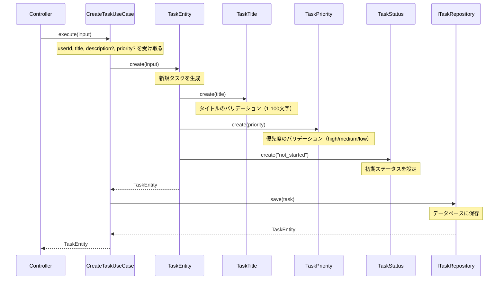
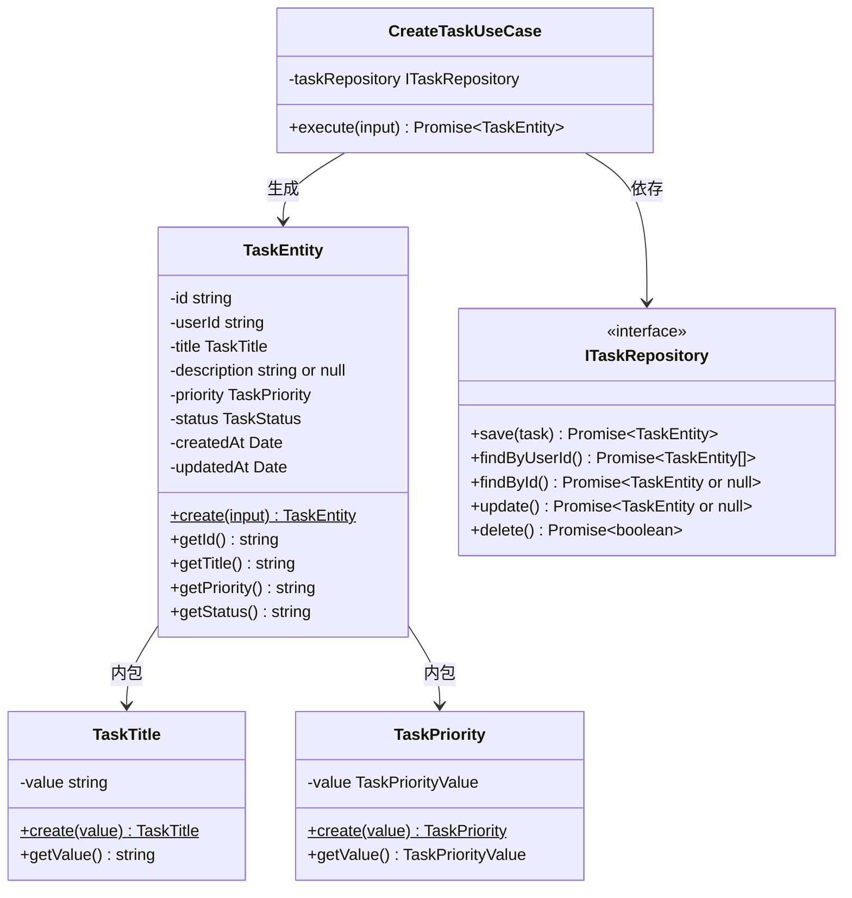

# TASK-1311 CreateTaskUseCase 実装解説

## ドキュメント情報

- **作成日**: 2025-11-23
- **TASK-ID**: TASK-1311
- **機能名**: CreateTaskUseCase（タスク作成ユースケース）
- **フェーズ**: Phase 3 - Application層実装

---

## この機能が何を解決するのか

この機能は「ログイン済みユーザーが新しいタスクを作成できるようにする」ことを解決します。

具体的には：
- ユーザーがタイトルを入力してタスクを作成する
- 入力データのバリデーション（タイトルの長さ、優先度の妥当性など）を行う
- 問題なければデータベースに保存する
- 保存されたタスクの情報を返却する

これを「ユースケース（Use Case）」と呼び、**アプリケーションの1つの機能的なシナリオ**を表現します。ユースケースは「何をしたいか」という業務上の目的を達成するために、ドメイン層のオブジェクトを組み合わせて処理を組み立てる役割を持ちます。

---

## 全体の処理の流れ

### 処理フローとファイル関係



上記の図は、タスク作成の処理がどのように流れるかを示しています。まずControllerがユースケースを呼び出し、ユースケースがTaskEntityを作成し、最終的にリポジトリを通じてデータベースに保存されます。

---

## ファイルの役割と責任

### 今回解説するメインのファイル

#### `CreateTaskUseCase.ts`
- **ディレクトリ**: `app/server/src/application/usecases/`
- **役割**: タスク作成というビジネスユースケースを実行する
- **責任**:
  - 入力データを受け取り、TaskEntityを生成する
  - リポジトリを通じてデータベースに保存する
  - 作成されたタスクを返却する

### 呼び出しているファイル

#### `TaskEntity.ts`
- **ディレクトリ**: `app/server/src/domain/task/`
- **役割**: タスクのドメインエンティティ（タスクの本体）
- **呼び出している関数**: `TaskEntity.create()` - 新規タスクを作成するファクトリメソッド

#### `ITaskRepository.ts`
- **ディレクトリ**: `app/server/src/domain/task/`
- **役割**: タスクの永続化契約を定義するインターフェース
- **呼び出しているメソッド**: `save()` - タスクをデータベースに保存する

#### `TaskTitle.ts`
- **ディレクトリ**: `app/server/src/domain/task/valueobjects/`
- **役割**: タイトルの値オブジェクト
- **間接的に呼び出される**: TaskEntity.create()の中でバリデーションされる

#### `TaskPriority.ts`
- **ディレクトリ**: `app/server/src/domain/task/valueobjects/`
- **役割**: 優先度の値オブジェクト
- **間接的に呼び出される**: TaskEntity.create()の中でバリデーションされる

---

## クラスと関数の呼び出し関係

### クラス構造と依存関係



この図のポイントは、**CreateTaskUseCaseがITaskRepository（インターフェース）に依存している**ことです。具体的なデータベース実装（PostgreSQLなど）には依存していません。これにより：
- テスト時にモックに差し替えられる
- 将来データベースを変更しても、このユースケースを変更する必要がない

---

## 重要な処理の詳細解説

### 1. ユースケースの入力データ定義

```typescript
// app/server/src/application/usecases/CreateTaskUseCase.ts
export interface CreateTaskInput {
  userId: string;
  title: string;
  description?: string;  // 省略可能
  priority?: string;     // 省略可能
}
```

この入力インターフェースは、タスク作成に必要なデータを定義しています。`?`がついているプロパティは省略可能で、省略された場合はデフォルト値が適用されます。

### 2. コンストラクタでの依存性注入（DI）

```typescript
// app/server/src/application/usecases/CreateTaskUseCase.ts
export class CreateTaskUseCase {
  constructor(private readonly taskRepository: ITaskRepository) {}
```

ここでは「依存性注入（Dependency Injection: DI）」というパターンを使っています。

**依存性注入とは？**
外部から必要なもの（依存）を渡してもらう仕組みです。コンストラクタの引数で`ITaskRepository`を受け取っています。

**なぜ大事なのか？**
- テスト時にモック（偽物）を渡せる
- 実際のデータベースを使わずにテストできる
- 実装を柔軟に切り替えられる

### 3. execute()メソッドの処理

```typescript
// app/server/src/application/usecases/CreateTaskUseCase.ts
async execute(input: CreateTaskInput): Promise<TaskEntity> {
  // TaskEntity.create()でバリデーションとエンティティ生成
  // undefinedのプロパティは渡さない（exactOptionalPropertyTypes対応）
  const task = TaskEntity.create({
    userId: input.userId,
    title: input.title,
    ...(input.description !== undefined && {
      description: input.description,
    }),
    ...(input.priority !== undefined && { priority: input.priority }),
  });

  // リポジトリで永続化
  return await this.taskRepository.save(task);
}
```

この処理のポイントを解説します。

#### ポイント1: 条件付きスプレッド構文

```typescript
...(input.description !== undefined && {
  description: input.description,
})
```

この書き方は少し複雑に見えますが、「descriptionがundefinedでない場合だけオブジェクトに含める」という意味です。

**なぜこうするのか？**
TypeScriptの`exactOptionalPropertyTypes`という設定が有効な場合、オプショナルプロパティに`undefined`を明示的に渡すとエラーになります。この書き方で「存在しない」と「undefinedを渡す」を区別しています。

#### ポイント2: バリデーションはTaskEntity内で行われる

`CreateTaskUseCase.execute()`の中では、バリデーションのコードが見当たりません。これは意図的な設計です。

バリデーションは`TaskEntity.create()`の中で行われます。TaskEntityは内部でTaskTitle、TaskPriorityなどの値オブジェクトを生成し、その際にバリデーションが実行されます。

### 4. TaskEntity.create()でのデフォルト値適用

```typescript
// app/server/src/domain/task/TaskEntity.ts
public static create(input: CreateTaskEntityInput): TaskEntity {
  const now = new Date();

  return new TaskEntity({
    id: randomUUID(),
    userId: input.userId,
    title: TaskTitle.create(input.title),
    description: input.description ?? null,      // 未指定ならnull
    priority: TaskPriority.create(input.priority ?? 'medium'),  // 未指定なら'medium'
    status: TaskStatus.create('not_started'),    // 常に'not_started'
    createdAt: now,
    updatedAt: now,
  });
}
```

ここで重要なのは「デフォルト値の適用場所」です。

- `priority ?? 'medium'` → priorityが未指定の場合は'medium'になる
- `status`は常に`'not_started'` → 新規作成時は必ず「未着手」から始まる

これは要件定義書の以下の要件を満たしています：
- REQ-103: デフォルトで優先度を「中」に設定
- REQ-104: デフォルトでステータスを「未着手」に設定

### 5. 値オブジェクトによるバリデーション

```typescript
// app/server/src/domain/task/valueobjects/TaskTitle.ts
public static create(value: unknown): TaskTitle {
  const trimmed = typeof value === 'string' ? value.trim() : '';

  if (trimmed.length < TASK_TITLE_CONSTRAINTS.MIN_LENGTH) {
    throw new Error('タイトルを入力してください');
  }

  if (trimmed.length > TASK_TITLE_CONSTRAINTS.MAX_LENGTH) {
    throw new Error(
      `タイトルは${TASK_TITLE_CONSTRAINTS.MAX_LENGTH}文字以内で入力してください`,
    );
  }

  return new TaskTitle(trimmed);
}
```

値オブジェクト（Value Object）の`create()`メソッドでバリデーションが行われます。不正な値が渡された場合はエラーをスローします。このエラーは呼び出し元（CreateTaskUseCase）まで伝播し、最終的にはAPI呼び出し元に返されます。

---

## 初学者がつまずきやすいポイント

### 1. 「なぜバリデーションをユースケースに書かないの？」

バリデーションロジックはドメイン層（TaskEntity、値オブジェクト）に配置されています。これには理由があります：

- **再利用性**: タスク作成以外のユースケース（更新など）でも同じバリデーションが必要
- **一貫性**: バリデーションルールが分散しない
- **単一責任**: ユースケースは「何をするか」を、ドメインは「ルール」を担当

### 2. 「ITaskRepositoryってなに？実装はどこ？」

`ITaskRepository`は**インターフェース（契約）**です。「こういうメソッドを持っている必要がある」という約束事を定義しています。

実際の実装（PostgreSQLTaskRepositoryなど）はInfrastructure層にあり、アプリケーション起動時に依存性注入されます。今回のTASK-1311では、テストでモックを注入しているため、実際のDB実装は不要です。

### 3. 「テストでのas unknown as ITaskRepositoryって何？」

```typescript
// app/server/src/application/usecases/__tests__/CreateTaskUseCase.test.ts
useCase = new CreateTaskUseCase(
  mockRepository as unknown as ITaskRepository,
);
```

モックオブジェクトはITaskRepositoryの型と完全には一致しないため、TypeScriptの型チェックを通すために`as unknown as ITaskRepository`というキャストを使っています。

本来は避けたい書き方ですが、テストでモックを使う場合の実用的な対処法として許容されています。

### 4. 「async/awaitってなに？」

`execute()`メソッドには`async`がついており、内部で`await`を使っています。

```typescript
async execute(input: CreateTaskInput): Promise<TaskEntity> {
  // ...
  return await this.taskRepository.save(task);
}
```

- `async`: この関数は非同期処理を含むことを示す
- `await`: 非同期処理の完了を待つ
- `Promise<TaskEntity>`: 将来的にTaskEntityを返す「約束」

データベースへの保存は時間がかかる処理なので、非同期で実行します。`await`を使うことで、保存が完了するまで待ってから結果を返します。

---

## この設計のいい点

### 1. 依存性逆転の原則（DIP）を遵守している

CreateTaskUseCaseは具体的なデータベース実装ではなく、`ITaskRepository`というインターフェースに依存しています。これにより：
- テスト時にモックを注入できる
- データベースを変更してもユースケースのコードは変更不要
- 関心の分離が明確

### 2. 単一責任の原則（SRP）を遵守している

CreateTaskUseCaseの責任は「タスク作成のフローを組み立てる」ことだけです。
- バリデーションはTaskEntity/値オブジェクトが担当
- データベース操作はITaskRepository実装が担当
- 各クラスが明確な単一の責任を持っている

### 3. ファクトリメソッドパターンの活用

`TaskEntity.create()`は静的ファクトリメソッドです。
- コンストラクタをprivateにして直接生成を禁止
- 生成時に必ずバリデーションを通す
- 不正な状態のオブジェクトが生まれない

### 4. テスタビリティが高い

ユースケースは以下の理由でテストしやすくなっています：
- 依存がインターフェース経由なのでモック化が容易
- 副作用（DB保存）が外部化されている
- 純粋なビジネスロジックとして検証できる

---

## 関連ファイル一覧

| ファイル | ディレクトリ | 役割 |
|---------|-------------|------|
| `CreateTaskUseCase.ts` | `app/server/src/application/usecases/` | ユースケース実装 |
| `CreateTaskUseCase.test.ts` | `app/server/src/application/usecases/__tests__/` | ユースケースのテスト |
| `TaskEntity.ts` | `app/server/src/domain/task/` | タスクエンティティ |
| `ITaskRepository.ts` | `app/server/src/domain/task/` | リポジトリインターフェース |
| `TaskTitle.ts` | `app/server/src/domain/task/valueobjects/` | タイトル値オブジェクト |
| `TaskPriority.ts` | `app/server/src/domain/task/valueobjects/` | 優先度値オブジェクト |
| `TaskStatus.ts` | `app/server/src/domain/task/valueobjects/` | ステータス値オブジェクト |
