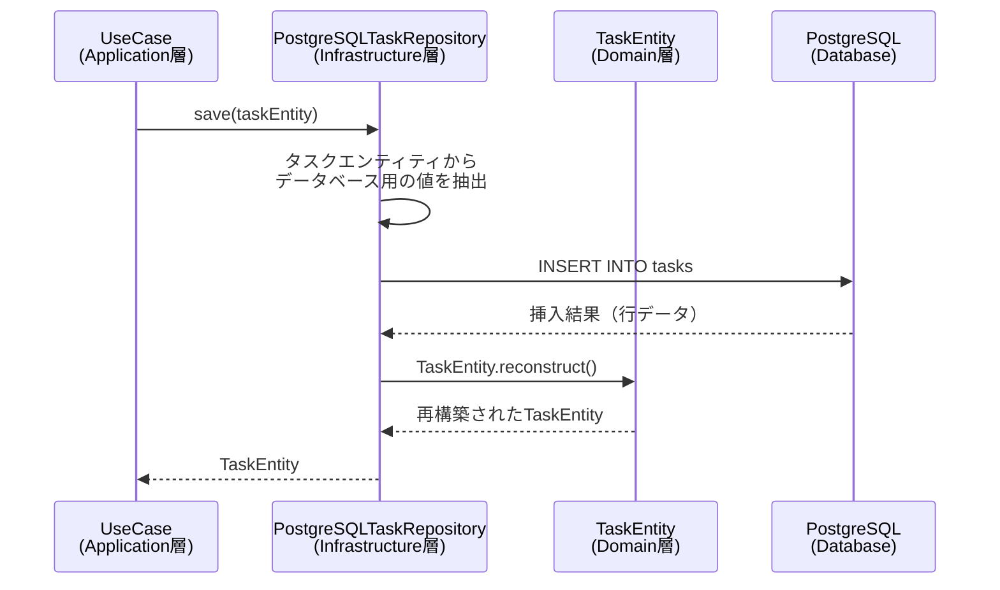
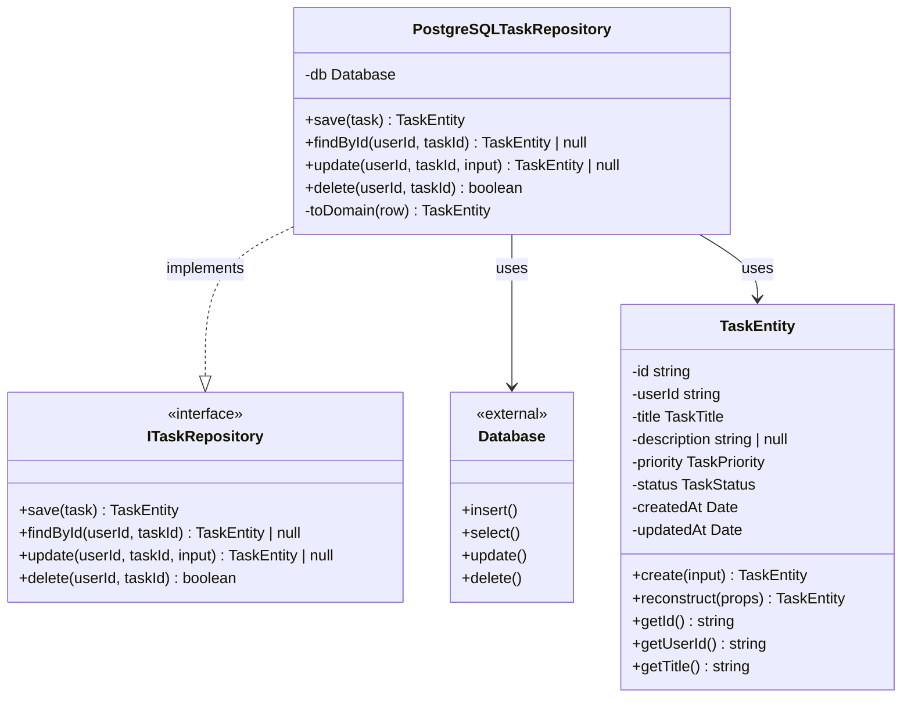

# TASK-1318: PostgreSQLTaskRepository（基本CRUD）実装解説

**作成日**: 2025-01-27
**要件名**: todo-app
**TASK-ID**: TASK-1318
**対象読者**: 新しく組織に加入したばかりの初学者エンジニア

---

## この機能が何を解決するのか

この機能は「タスクデータをPostgreSQLデータベースに保存・取得・更新・削除する」ことを解決します。

具体的には：
- タスクの新規作成（save）
- タスクIDでの取得（findById）
- タスクの更新（update）
- タスクの削除（delete）

これを「**リポジトリパターン**」と呼び、データベースへのアクセスをカプセル化できます。リポジトリパターンを使うことで、ビジネスロジック（UseCase）とデータアクセス処理を分離でき、テストもしやすくなります。

---

## 全体の処理の流れ

### 処理フローとファイル関係



この図から分かるように：
1. **UseCase**がリポジトリに「タスクを保存して」と依頼
2. **Repository**がドメインエンティティからデータを取り出し、データベースに挿入
3. **Database**が保存した結果を返却
4. **Repository**が行データをドメインエンティティに戻して返却

---

## ファイルの役割と責任

### 今回解説するメインのファイル

#### `app/server/src/infrastructure/repositories/PostgreSQLTaskRepository.ts`

このファイルは「タスクをデータベースに保存・取得・更新・削除する具体的な方法」を実装しています。

**実装されている関数**:
- `save(task: TaskEntity)`: タスクの新規作成
- `findById(userId, taskId)`: タスクIDでの取得
- `update(userId, taskId, input)`: タスクの更新
- `delete(userId, taskId)`: タスクの削除
- `toDomain(row)`: データベース行データをTaskEntityに変換（private）

**重要なポイント**:
- すべてのメソッドで`userId`を必ず確認します（セキュリティ対策）
- Drizzle ORMという安全なライブラリを使ってデータベース操作します
- データベースのデータとドメインエンティティを相互に変換します

#### `app/server/src/infrastructure/repositories/__tests__/PostgreSQLTaskRepository.test.ts`

このファイルは「PostgreSQLTaskRepositoryが正しく動作するか」を確認するテストです。

**テストケース（8件）**:
1. タスクを作成できる
2. タスクIDでタスクを取得できる
3. 存在しないタスクIDの場合nullを返す
4. 他のユーザーのタスクは取得できない（RLS検証）
5. タスクを更新できる
6. 存在しないタスクIDの場合nullを返す（更新）
7. タスクを削除できる
8. 存在しないタスクIDの場合falseを返す（削除）

### 呼び出しまたは呼び出されているファイル

#### `app/server/src/domain/task/ITaskRepository.ts`

このファイルは「リポジトリがどんな機能を提供すべきか」を定義したインターフェース（契約書）です。

**定義されているメソッド**:
- `save(task)`: タスク保存
- `findByUserId(userId, filters, sort)`: ユーザーのタスク一覧取得（※TASK-1319で実装予定）
- `findById(userId, taskId)`: タスクID検索
- `update(userId, taskId, input)`: タスク更新
- `delete(userId, taskId)`: タスク削除
- `updateStatus(userId, taskId, status)`: ステータス変更（※TASK-1319で実装予定）

`PostgreSQLTaskRepository`はこのインターフェースを実装しています。つまり、「契約書に書かれた機能を具体的に実現している」ということです。

#### `app/server/src/domain/task/TaskEntity.ts`

このファイルは「タスクとは何か？どんな情報を持つか？」を定義したドメインエンティティです。

**主要なメソッド**:
- `create(input)`: 新しいタスクエンティティを作成（ファクトリメソッド）
- `reconstruct(props)`: データベースから取得した情報でエンティティを再構築
- `getId()`, `getUserId()`, `getTitle()` など: ゲッターメソッド（値を取り出す）

**TaskEntity**は、タスクのビジネスルールを守る役割も持っています。例えば、タイトルが空文字列ではないか、優先度が正しい値かなどをチェックします。

#### `app/server/src/domain/task/valueobjects/`

このディレクトリには、タスクの一部の情報を表す「値オブジェクト」が入っています。

- `TaskTitle.ts`: タスクのタイトル（1〜100文字の制約など）
- `TaskPriority.ts`: 優先度（'high', 'medium', 'low'）
- `TaskStatus.ts`: ステータス（'not_started', 'in_progress', 'in_review', 'completed'）

値オブジェクトを使うことで、「この値は正しいルールに従っている」ということを保証できます。

#### `app/server/src/infrastructure/database/DatabaseConnection.ts`

このファイルは「データベースへの接続を管理する」ファイルです。

**提供する機能**:
- `db`: Drizzle ORMのインスタンス（データベース操作の窓口）
- `executeTransaction()`: トランザクション実行（複数の操作を一括で実行）
- `setCurrentUser()`: RLS設定（セキュリティ機能）

`PostgreSQLTaskRepository`は`db`を使ってデータベース操作を行います。

#### `app/server/src/infrastructure/database/schema.ts`

このファイルは「データベースのテーブル構造」を定義しています。

**tasksテーブルの構造**:
- `id`: タスクID（UUID）
- `userId`: 所有者のユーザーID（UUID）
- `title`: タイトル（最大100文字）
- `description`: 説明（任意、Markdown対応）
- `priority`: 優先度（'high', 'medium', 'low'）
- `status`: ステータス（'not_started', 'in_progress', 'in_review', 'completed'）
- `createdAt`: 作成日時
- `updatedAt`: 更新日時

---

## クラスと関数の呼び出し関係

### クラス構造と依存関係



**依存の方向**:
- `PostgreSQLTaskRepository` → `ITaskRepository`（インターフェースを実装）
- `PostgreSQLTaskRepository` → `Database`（データベースを使用）
- `PostgreSQLTaskRepository` → `TaskEntity`（ドメインエンティティを使用）

この構造により、「ビジネスロジック（TaskEntity）」と「データアクセス（PostgreSQLTaskRepository）」が分離されています。

---

## 重要な処理の詳細解説

### 1. タスク作成（save）

```typescript
// app/server/src/infrastructure/repositories/PostgreSQLTaskRepository.ts
async save(task: TaskEntity): Promise<TaskEntity> {
  // TaskEntityからデータベースに保存する値を抽出
  const result = await this.db
    .insert(tasks)
    .values({
      id: task.getId(),
      userId: task.getUserId(),
      title: task.getTitle(),
      description: task.getDescription(),
      priority: task.getPriority(),
      status: task.getStatus(),
      createdAt: task.getCreatedAt(),
      updatedAt: task.getUpdatedAt(),
    })
    .returning(); // 挿入した行データを返してもらう

  // 挿入結果がない場合はエラー
  if (!result[0]) {
    throw new Error('Failed to save task');
  }

  // データベースの行データをTaskEntityに変換して返す
  return this.toDomain(result[0]);
}
```

**この処理が必要である理由**:
- `TaskEntity`はドメインオブジェクトなので、そのままデータベースに保存できません
- ゲッターメソッドで値を取り出し、データベース用の形式に変換する必要があります
- 挿入後、`.returning()`で結果を受け取り、再度`TaskEntity`に戻します

**よくある勘違い**:
❌ 「TaskEntityをそのまま`insert()`に渡せばいいのでは？」
→ TaskEntityはビジネスロジックを持つクラスで、データベーステーブルとは構造が違います。値オブジェクト（TaskTitle等）もあるため、変換が必要です。

### 2. タスク取得（findById）

```typescript
// app/server/src/infrastructure/repositories/PostgreSQLTaskRepository.ts
async findById(userId: string, taskId: string): Promise<TaskEntity | null> {
  // ここがセキュリティ上重要！userIdとtaskIdの両方で検索
  const result = await this.db
    .select()
    .from(tasks)
    .where(and(eq(tasks.id, taskId), eq(tasks.userId, userId)))
    .limit(1);

  // 結果が存在すればTaskEntityに変換、なければnull
  return result[0] ? this.toDomain(result[0]) : null;
}
```

**この処理が必要である理由**:
- `userId`を条件に含めることで、他のユーザーのタスクを取得できないようにしています
- これは**多層防御**と呼ばれるセキュリティ対策です（RLSとアプリケーション層の両方で保護）

**よくある勘違い**:
❌ 「taskIdだけで検索すればいいのでは？」
→ それだと他のユーザーのタスクにもアクセスできてしまいます。必ず`userId`も条件に含めましょう。

### 3. タスク更新（update）

```typescript
// app/server/src/infrastructure/repositories/PostgreSQLTaskRepository.ts
async update(
  userId: string,
  taskId: string,
  input: UpdateTaskInput,
): Promise<TaskEntity | null> {
  const result = await this.db
    .update(tasks)
    .set({
      ...input, // 更新データをそのまま展開
      updatedAt: new Date(), // 更新日時は常に現在時刻にする
    })
    .where(and(eq(tasks.id, taskId), eq(tasks.userId, userId)))
    .returning();

  return result[0] ? this.toDomain(result[0]) : null;
}
```

**この処理が必要である理由**:
- `...input`でスプレッド構文を使い、更新したいフィールドだけを更新します
- `updatedAt`は常に現在時刻で上書きします（更新の追跡）
- `userId`と`taskId`の両方で対象を絞ることで、他人のタスクを誤って更新しないようにします

**よくある勘違い**:
❌ 「updateAtは勝手に更新されるのでは？」
→ データベースのデフォルト値は**INSERT時のみ**適用されます。UPDATE時は明示的に指定する必要があります。

### 4. タスク削除（delete）

```typescript
// app/server/src/infrastructure/repositories/PostgreSQLTaskRepository.ts
async delete(userId: string, taskId: string): Promise<boolean> {
  // postgresドライバは{ count: number }形式で結果を返す
  const { count = 0 } = await this.db
    .delete(tasks)
    .where(and(eq(tasks.id, taskId), eq(tasks.userId, userId)))
    .execute();

  // countが0より大きければ削除成功
  return count > 0;
}
```

**この処理が必要である理由**:
- Drizzle ORMのpostgresドライバは、削除結果を`{ count: number }`形式で返します
- `count`が0なら削除対象が見つからなかった、1以上なら削除成功です
- デフォルト値`= 0`を設定することで、undefinedを避けています

**よくある勘違い**:
❌ 「result.rowCountで取得できるのでは？」
→ それはpgドライバの場合です。postgresドライバでは`.execute()`が`{ count }`を返します。

### 5. データベース行からエンティティへの変換（toDomain）

```typescript
// app/server/src/infrastructure/repositories/PostgreSQLTaskRepository.ts
private toDomain(row: typeof tasks.$inferSelect): TaskEntity {
  // reconstruct()を使ってデータベースの情報からTaskEntityを再構築
  return TaskEntity.reconstruct({
    id: row.id,
    userId: row.userId,
    title: TaskTitle.create(row.title), // 値オブジェクトに変換
    description: row.description,
    priority: TaskPriority.create(row.priority), // 値オブジェクトに変換
    status: TaskStatus.create(row.status), // 値オブジェクトに変換
    createdAt: row.createdAt,
    updatedAt: row.updatedAt,
  });
}
```

**この処理が必要である理由**:
- データベースの行データ（プレーンなオブジェクト）をドメインエンティティに変換します
- 値オブジェクト（TaskTitle等）を使うことで、不正な値を防ぎます
- `reconstruct()`を使うことで、「既存データの復元」であることを明示します

**よくある勘違い**:
❌ 「rowをそのままreturnすればいいのでは？」
→ rowは単なるデータですが、TaskEntityはビジネスロジックを持つオブジェクトです。変換が必要です。

---

## 初学者がつまずきやすいポイント

### 1. 「なぜTaskEntityを直接データベースに保存できないの？」

**答え**: TaskEntityはビジネスロジックを持つクラスで、データベーステーブルとは別物です。

例えば、`TaskEntity`には：
- `title`が`TaskTitle`という値オブジェクト
- メソッド（`updateTitle()`など）

一方、データベーステーブルには：
- `title`が単なる文字列
- メソッドは存在しない

そのため、**相互に変換する処理**（`save()`で値を取り出す、`toDomain()`で再構築する）が必要です。

### 2. 「リポジトリパターンって何がいいの？」

**答え**: データベースアクセスの詳細を隠すことで、ビジネスロジックが影響を受けなくなります。

例えば：
- 将来的にPostgreSQLからMySQLに変えたい
- テスト時にモックリポジトリを使いたい

こういう時、リポジトリパターンなら**インターフェースはそのまま**で、実装だけ差し替えられます。UseCaseはリポジトリの実装が変わっても影響を受けません。

### 3. 「andとeqって何？」

**答え**: Drizzle ORMの関数で、SQL文を安全に組み立てるためのものです。

```typescript
and(eq(tasks.id, taskId), eq(tasks.userId, userId))
```

これは、以下のSQL文と同じ意味です：

```sql
WHERE tasks.id = 'taskId' AND tasks.userId = 'userId'
```

- `eq(A, B)`: AがBと等しい
- `and(条件1, 条件2)`: 条件1かつ条件2

直接SQL文を書くと**SQLインジェクション**という脆弱性が生まれる可能性がありますが、Drizzle ORMを使えば安全です。

### 4. 「userIdは誰が設定するの？」

**答え**: JWT認証で取得したユーザーIDが、UseCaseから渡されます。

フロー：
1. ユーザーがログイン → JWTトークンを受け取る
2. APIリクエストにJWTトークンを含める
3. バックエンドがJWTを検証 → `userId`を取り出す
4. UseCaseが`userId`をリポジトリに渡す

リポジトリは「渡された`userId`を信じて処理する」という責務です。

---

## この設計のいい点

### 1. **セキュリティが多層防御**

すべてのメソッドで`userId`を条件に含めることで、アプリケーション層でもセキュリティを担保しています。データベースのRLS（Row Level Security）と合わせて、二重にユーザー分離を実現しています。

### 2. **テストがしやすい**

リポジトリパターンにより、UseCaseとデータアクセスが分離されています。これにより：
- UseCaseのテストではモックリポジトリを使える
- リポジトリのテストでは実際のデータベースで動作確認できる

### 3. **ドメインモデルとデータベースの分離**

`toDomain()`メソッドで変換を一元管理することで、ドメインモデルの変更がデータベースに影響しにくく、逆もまた然りです。

### 4. **型安全性が高い**

Drizzle ORMとTypeScriptの組み合わせにより、データベーステーブルの型定義が自動で生成されます。これにより、コンパイル時に型エラーを検出できます。

```typescript
// 型推論が効いている
private toDomain(row: typeof tasks.$inferSelect): TaskEntity {
  // ...
}
```

---

以上が、TASK-1318で実装された`PostgreSQLTaskRepository`の解説です。このリポジトリは、タスクデータの永続化を担当する重要なコンポーネントです。次のTASK-1319では、フィルタ・ソート機能を追加する予定です。
