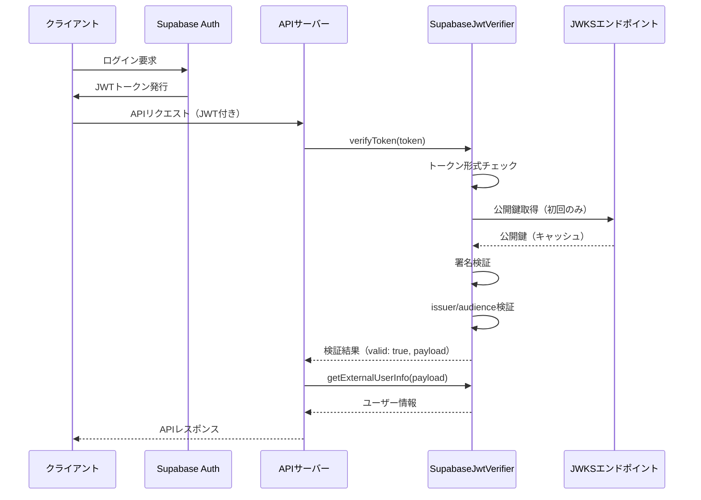
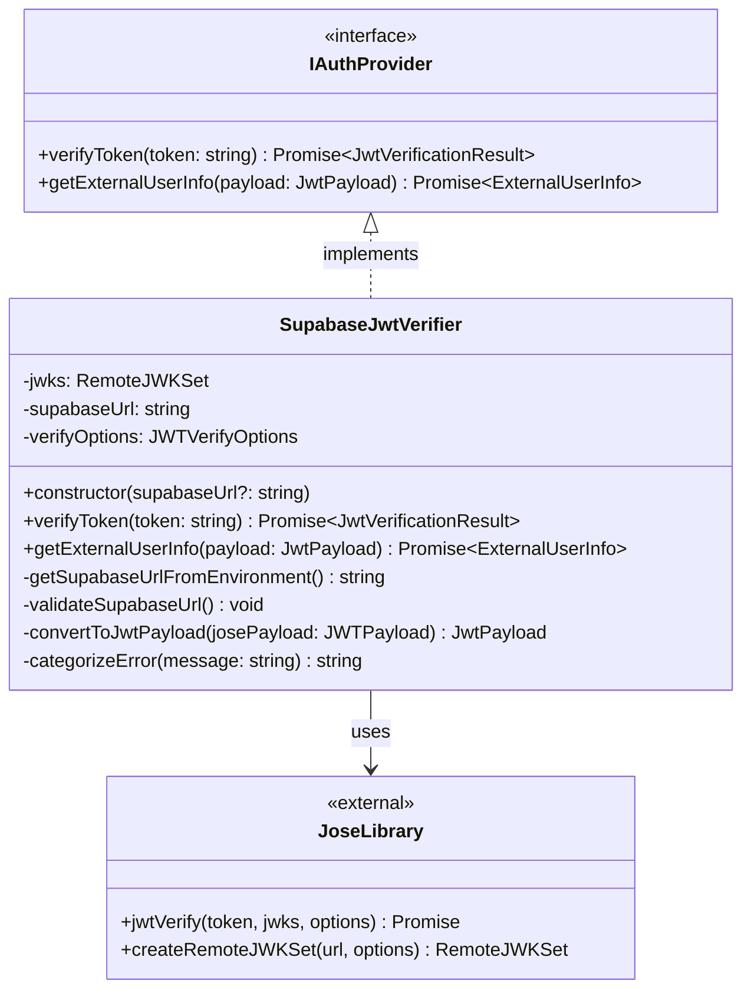

# TASK-1320: SupabaseJwtVerifier コード解説

## この機能が何を解決するのか

この機能は「ユーザーがログインして取得したJWTトークン（認証情報）が本当に正しいものか、改ざんされていないかを検証する」ことを解決します。

具体的には：
- フロントエンドから送られてきたJWTトークンの署名を検証する
- トークンの有効期限が切れていないかチェックする
- トークンに含まれるユーザー情報を安全に取り出す
- 偽造・改ざんされたトークンを確実に拒否する

これを「**JWT検証（JWT Verification）**」と呼び、なりすましやデータ改ざんを防ぐセキュリティの要となる機能です。

### なぜJWT検証が必要なのか？

たとえば、あなたがレストランで予約をする場面を想像してください。

- **予約確認書（JWT）** = お店から渡される予約番号が書かれた紙
- **サイン（署名）** = お店の店長のサイン
- **検証（Verification）** = 当日、そのサインが本物かどうか確認する作業

もし誰でも予約確認書を偽造できたら、他人の予約を勝手に使えてしまいますよね。だから「本物の店長のサインかどうか」をチェックすることが大切なんです。

JWTも同じで、**ユーザーが持っているトークンが本当にSupabase Auth（認証サービス）が発行したものか**を確認する必要があります。これを行うのが、今回解説する `SupabaseJwtVerifier` クラスです。

## 全体の処理の流れ

### 処理フローとファイル関係



### フローの各ステップ解説

1. **クライアント → Supabase Auth**: ユーザーがログインすると、Supabase Authが署名付きJWTを発行
2. **クライアント → APIサーバー**: JWTをAuthorizationヘッダーに付けてAPIリクエスト
3. **APIサーバー → SupabaseJwtVerifier**: トークンを検証するため `verifyToken()` を呼び出し
4. **SupabaseJwtVerifier → JWKSエンドポイント**: 署名検証に必要な公開鍵を取得（10分間キャッシュされる）
5. **SupabaseJwtVerifier 内部処理**: 署名検証、期限チェック、issuer/audience検証
6. **SupabaseJwtVerifier → APIサーバー**: 検証結果を返す（成功時はペイロード含む）
7. **APIサーバー → SupabaseJwtVerifier**: ペイロードからユーザー情報を抽出するため `getExternalUserInfo()` を呼び出し
8. **SupabaseJwtVerifier → APIサーバー**: 正規化されたユーザー情報を返す

## ファイルの役割と責任

### 今回解説するメインのファイル

#### `app/server/src/infrastructure/auth/SupabaseJwtVerifier.ts`

このファイルは、JWT検証の実装を担当するクラスです。Infrastructure層（インフラストラクチャ層）に配置されており、外部サービス（Supabase Auth）との連携を行います。

**主な責任**:
- JWTトークンの署名検証
- トークンの有効期限チェック
- issuer（発行者）とaudience（対象者）の検証
- JWTペイロードからユーザー情報を抽出
- エラー分類とログ出力

**実装されている主要な関数・メソッド**:

| メソッド名 | 役割 | 戻り値 |
|----------|------|--------|
| `constructor(supabaseUrl?)` | インスタンス初期化、JWKS設定 | - |
| `verifyToken(token)` | JWTトークンの検証 | `JwtVerificationResult` |
| `getExternalUserInfo(payload)` | ペイロードからユーザー情報抽出 | `ExternalUserInfo` |
| `convertToJwtPayload(josePayload)` | jose型からドメイン型への変換（private） | `JwtPayload` |
| `categorizeError(message)` | エラーメッセージの分類（private） | `string` |

### 呼び出しているファイル

#### `app/server/src/domain/services/IAuthProvider.ts`

このファイルは、認証プロバイダーの**インターフェース定義**です。Domain層（ドメイン層）に配置されており、「どんな機能が必要か」という契約を定義しています。

**重要な型定義**:
- `IAuthProvider`: 認証プロバイダーの契約（`verifyToken`と`getExternalUserInfo`メソッド）
- `JwtVerificationResult`: 検証結果の型（`valid`, `payload`, `error`）
- `JwtPayload`: JWTトークンに含まれる情報の型
- `ExternalUserInfo`: 抽出されたユーザー情報の型

**なぜインターフェースが必要なのか？**

インターフェースは「契約書」のようなものです。たとえば、将来的にSupabase以外の認証サービス（Auth0、Firebase Authなど）に切り替えたくなったとき、このインターフェースを実装した新しいクラスを作るだけで済みます。Domain層（ビジネスロジック）は、具体的な実装（Supabase）に依存せず、インターフェースにだけ依存するので、変更に強い設計になります。

これを「**依存性逆転の原則（Dependency Inversion Principle）**」と呼びます。

### 呼び出されているライブラリ

#### `jose` ライブラリ（外部ライブラリ）

`jose` は、JWT検証を行うための業界標準ライブラリです。以下の機能を提供します：

- `jwtVerify()`: JWT署名検証
- `createRemoteJWKSet()`: JWKSエンドポイントから公開鍵を取得してキャッシュ
- `JWTPayload`: jose独自のペイロード型定義

**なぜjoseを使うのか？**

JWT検証は複雑で、自分で実装するとセキュリティホール（脆弱性）が生まれやすいです。`jose`は業界で広く使われ、セキュリティ専門家によってレビューされているため、安全に使うことができます。

## クラスと関数の呼び出し関係

### クラス構造と依存関係



### 依存関係の説明

- `SupabaseJwtVerifier` は `IAuthProvider` インターフェースを実装（implements）している
- `SupabaseJwtVerifier` は内部で `jose` ライブラリを使用（uses）している
- Domain層の他のコード（UseCaseなど）は `IAuthProvider` インターフェースに依存し、`SupabaseJwtVerifier` の存在を直接知らない

## 重要な処理の詳細解説

### 1. JWTトークンの署名検証（verifyToken メソッド）

```typescript
// app/server/src/infrastructure/auth/SupabaseJwtVerifier.ts
async verifyToken(token: string): Promise<JwtVerificationResult> {
  // 入力値検証: トークンが空でないかチェック
  if (!token || token.trim() === '') {
    return {
      valid: false,
      error: ERROR_MESSAGES.TOKEN_REQUIRED,
    };
  }

  try {
    // JWT形式の基本チェック: 3部構成（header.payload.signature）か確認
    const parts = token.split('.');
    if (parts.length !== 3) {
      return {
        valid: false,
        error: ERROR_MESSAGES.INVALID_TOKEN_FORMAT,
      };
    }

    // JWKS + 非対称鍵による署名検証
    // this.jwks: JWKSエンドポイントから取得した公開鍵
    // this.verifyOptions: issuer, audience, clockToleranceの設定
    const { payload: verifiedPayload } = await jwtVerify(
      token,
      this.jwks,
      this.verifyOptions,
    );

    // ペイロードの型変換（jose JWTPayload → ドメイン JwtPayload）
    const domainPayload = this.convertToJwtPayload(verifiedPayload);

    return {
      valid: true,
      payload: domainPayload,
    };
  } catch (error) {
    // エラー発生時は詳細なエラーメッセージを返す
    // （省略: エラー分類処理）
  }
}
```

#### この処理のポイント

1. **入力値検証**: 空トークンを早期リターンで弾く（防御的プログラミング）
2. **形式チェック**: JWTは必ず3部構成なので、ピリオドで分割して確認
3. **署名検証**: `jwtVerify()` が公開鍵を使って署名を検証（改ざん検知）
4. **型変換**: `jose`独自の型をドメイン層の型に変換（層の分離）

#### なぜ署名検証が安全なのか？

JWTは「公開鍵暗号」という仕組みを使っています。

- **秘密鍵（Private Key）**: Supabase Authだけが持っている。トークンに署名するときに使う
- **公開鍵（Public Key）**: 誰でも取得できる。署名が正しいか検証するときに使う

秘密鍵がないと正しい署名を作れないので、たとえトークンの中身を書き換えても、署名が合わなくなって検証が失敗します。これが「偽造・改ざん防止」の仕組みです。

### 2. ユーザー情報の抽出（getExternalUserInfo メソッド）

```typescript
// app/server/src/infrastructure/auth/SupabaseJwtVerifier.ts
async getExternalUserInfo(payload: JwtPayload): Promise<ExternalUserInfo> {
  // 必須フィールド検証: subフィールドがあるか確認
  if (!payload.sub) {
    throw new Error(ERROR_MESSAGES.MISSING_FIELD('sub'));
  }

  // 他の必須フィールドも同様にチェック
  if (!payload.email) {
    throw new Error(ERROR_MESSAGES.MISSING_FIELD('email'));
  }

  if (!payload.user_metadata?.name) {
    throw new Error(ERROR_MESSAGES.MISSING_FIELD('user_metadata.name'));
  }

  if (!payload.app_metadata?.provider) {
    throw new Error(ERROR_MESSAGES.MISSING_FIELD('app_metadata.provider'));
  }

  // JWTペイロードからExternalUserInfoへのマッピング
  const userInfo: ExternalUserInfo = {
    id: payload.sub,                        // ユーザーID
    provider: payload.app_metadata.provider, // 認証プロバイダー（google等）
    email: payload.email,                   // メールアドレス
    name: payload.user_metadata.name,       // ユーザー名
    // アバターURLはオプションフィールド（ない場合もある）
    ...(payload.user_metadata.avatar_url && {
      avatarUrl: payload.user_metadata.avatar_url,
    }),
  };

  return userInfo;
}
```

#### この処理のポイント

1. **必須フィールドのガード**: データが欠けていたら即座にエラーを投げる
2. **オプショナルチェイニング（`?.`）**: `payload.user_metadata?.name` という書き方で、`user_metadata`が存在しないときにエラーにならない
3. **スプレッド構文とショートサーキット**: `...(条件 && { キー: 値 })` で、条件が真のときだけプロパティを追加

#### よくある勘違い

> 「`avatar_url`がないとエラーになるんじゃないの？」

**正しい理解**: `avatar_url`はオプショナルなので、なくてもOKです。`...(payload.user_metadata.avatar_url && { avatarUrl: ... })` という書き方は、「avatar_urlがある**ときだけ**プロパティを追加する」という意味です。ない場合は何も追加されず、エラーにもなりません。

### 3. JWKSエンドポイントとキャッシュ（constructor）

```typescript
// app/server/src/infrastructure/auth/SupabaseJwtVerifier.ts
constructor(supabaseUrl?: string) {
  this.supabaseUrl = supabaseUrl || this.getSupabaseUrlFromEnvironment();
  this.validateSupabaseUrl();

  // JWKSエンドポイントの設定
  const jwksUrl = new URL(
    `${this.supabaseUrl}/auth/v1/.well-known/jwks.json`,
  );

  // createRemoteJWKSetでJWKSエンドポイントから公開鍵を取得
  // cooldownDuration: 10分間は再取得しない（キャッシュ）
  this.jwks = createRemoteJWKSet(jwksUrl, {
    cooldownDuration: JWKS_CONFIG.CACHE_TTL, // 10分 = 600000ms
    cacheMaxAge: JWKS_CONFIG.CACHE_TTL,
  });

  // JWT検証オプションの設定
  this.verifyOptions = {
    issuer: `${this.supabaseUrl}/auth/v1`,   // 発行者チェック
    audience: 'authenticated',                // 対象者チェック
    clockTolerance: 30,                       // 30秒のズレ許容
  };
}
```

#### この処理のポイント

1. **環境変数フォールバック**: `supabaseUrl || this.getSupabaseUrlFromEnvironment()` で、引数が渡されなければ環境変数から取得
2. **JWKSキャッシュ**: 公開鍵は頻繁に変わらないので、10分間キャッシュして無駄なリクエストを減らす
3. **issuerとaudience検証**: トークンが「正しい発行元」から「正しい対象者」に向けて発行されたものかチェック
4. **clockTolerance**: サーバー間で時計がずれている場合を考慮し、30秒のズレを許容

#### なぜキャッシュが重要なのか？

JWKSエンドポイントへのリクエストは、ネットワーク通信が発生するため遅いです。毎回のJWT検証でリクエストすると、APIのレスポンスが遅くなってしまいます。公開鍵は滅多に変わらないので、10分間キャッシュすることでパフォーマンスを大幅に向上させています。

### 4. エラー分類とログ出力（エラーハンドリング）

```typescript
// app/server/src/infrastructure/auth/SupabaseJwtVerifier.ts
catch (error) {
  let errorMessage: string;

  if (error instanceof Error) {
    const message = error.message.toLowerCase();

    // エラーメッセージから分類
    if (message.includes('signature')) {
      errorMessage = ERROR_MESSAGES.INVALID_SIGNATURE;
    } else if (message.includes('expired') || message.includes('exp')) {
      errorMessage = ERROR_MESSAGES.TOKEN_EXPIRED;
    } else if (message.includes('jwks') || message.includes('fetch')) {
      errorMessage = ERROR_MESSAGES.JWKS_FETCH_FAILED;
    } else {
      errorMessage = error.message; // その他のエラー
    }

    // セキュリティ監査用ログ
    console.warn('[JWKS] JWT検証失敗:', {
      reason: this.categorizeError(message),
      issuer: this.verifyOptions.issuer,
      audience: this.verifyOptions.audience,
      errorMessage: error.message,
    });
  }

  return {
    valid: false,
    error: errorMessage,
  };
}
```

#### この処理のポイント

1. **エラー分類**: エラーメッセージに含まれるキーワードから、何が原因で失敗したか判定
2. **ユーザーフレンドリーなメッセージ**: 内部エラーを分かりやすいメッセージに変換
3. **セキュリティ監査ログ**: 不正なトークンの検証失敗をログに記録（攻撃の検知に役立つ）

#### よくある勘違い

> 「エラーの詳細情報を全部クライアントに返した方がデバッグしやすいのでは？」

**正しい理解**: セキュリティ上、エラーの詳細をクライアントに返しすぎるのは危険です。攻撃者がエラーメッセージから脆弱性を探る「情報漏洩攻撃」を防ぐため、**適度に抽象化されたメッセージ**を返します。詳細なエラー情報は**サーバー側のログ**に残し、開発者が後から確認できるようにします。

## 初学者がつまずきやすいポイント

### 1. 「JWTって何？トークンって何？」

**JWT（JSON Web Token）** は、「ユーザーが誰か」という情報を安全に持ち運ぶための**デジタルな証明書**です。

たとえば、映画館の入場券を想像してください。

- **チケット本体** = JWTのペイロード（ユーザー情報）
- **チケットのバーコード** = JWTの署名
- **券売機の印刷** = Supabase Authによる発行
- **入場ゲートでのチェック** = SupabaseJwtVerifierによる検証

偽造チケットを使おうとしても、バーコードが合わないので入場できませんよね。JWTも同じで、署名が合わないと検証が失敗します。

### 2. 「公開鍵と秘密鍵の違いがよく分からない」

**暗号化のペア**だと考えてください。

- **秘密鍵**: 家の鍵。持っている人だけがドアを開けられる（署名を作れる）
- **公開鍵**: ドアの鍵穴。誰でも確認できるけど、鍵がないと開けられない（署名を検証できる）

秘密鍵を持っているのはSupabase Authだけなので、他の誰も本物のJWTを作れません。でも、公開鍵はみんなが持てるので、誰でも「このJWTは本物か」を確認できます。

### 3. 「issuerとaudienceって何？」

**issuer（発行者）**: 「誰がこのトークンを発行したか」を示す情報
**audience（対象者）**: 「誰に向けて発行されたか」を示す情報

たとえば、手紙に例えると：

- **issuer** = 差出人の住所
- **audience** = 宛先の住所

手紙が「東京都の太郎さん」から「大阪府の花子さん」宛に送られたものなのに、「神奈川県の次郎さん」が受け取ろうとしたら変ですよね。JWTも同じで、issuerとaudienceをチェックすることで、「このトークンは本当にこのアプリ向けに発行されたものか」を確認しています。

### 4. 「async/awaitって何？」

**非同期処理**を扱うための書き方です。

たとえば、レストランで料理を注文したとき、料理が出来上がるまで待ちますよね。でも、待っている間にスマホを見たり、水を飲んだりできます。これが「非同期」です。

- `async` = 「この関数は時間がかかる処理をするよ」という宣言
- `await` = 「この処理が終わるまで待つよ」という命令

```typescript
// ❌ 同期的な書き方（使えない）
const result = verifyToken(token); // すぐ結果が返ってくると仮定

// ✅ 非同期な書き方
const result = await verifyToken(token); // 検証が終わるまで待つ
```

JWT検証はネットワーク通信を伴うので、時間がかかります。`await`を使うことで、「検証が終わるまで待って、結果を受け取る」という流れを実現しています。

### 5. 「インターフェースって何のためにあるの？」

インターフェースは「契約書」や「設計図」だと考えてください。

たとえば、「コンセントの形状」は規格（インターフェース）で決まっています。だから、どんなメーカーの電化製品でも、同じコンセントに挿せます。

```typescript
// インターフェース（契約）
interface IAuthProvider {
  verifyToken(token: string): Promise<JwtVerificationResult>;
}

// Supabase用の実装
class SupabaseJwtVerifier implements IAuthProvider {
  async verifyToken(token: string) { /* Supabase用の処理 */ }
}

// Firebase用の実装（将来）
class FirebaseJwtVerifier implements IAuthProvider {
  async verifyToken(token: string) { /* Firebase用の処理 */ }
}
```

こうすることで、**使う側は実装の詳細を知らなくていい**んです。「`verifyToken()`を呼べば検証してくれる」という契約さえ守られていれば、Supabase用でもFirebase用でも同じように使えます。

## この設計のいい点

### 1. **セキュリティが堅牢（JWT Secret非推奨、JWKS採用）**

古い方式（JWT Secret）は、秘密の文字列をアプリとサーバーで共有する方式でした。でもこれは、秘密が漏れたら全部アウトという問題がありました。

JWKS方式では、**公開鍵暗号**を使うので、公開鍵が漏れても大丈夫です。秘密鍵はSupabase Authだけが持っているので、トークンを偽造できません。これが今の業界標準で、Supabaseも公式に推奨しています。

### 2. **エラーハンドリングが丁寧**

すべてのエラーケースに対して、適切なメッセージを返すようになっています：

- トークンが空 → `Token is required`
- トークンの形式が不正 → `Invalid token format`
- 署名が不正 → `Invalid signature`
- 期限切れ → `Token expired`
- JWKS取得失敗 → `Failed to fetch JWKS`

これにより、開発者がデバッグしやすく、ユーザーにも分かりやすいエラーメッセージを提供できます。

### 3. **パフォーマンス最適化（JWKSキャッシュ）**

公開鍵を10分間キャッシュすることで、毎回JWKSエンドポイントにリクエストする必要がなくなります。これにより、JWT検証のレスポンス時間が大幅に短縮されます。

たとえば、1秒間に100リクエストが来たとき：

- **キャッシュなし**: 100回JWKSエンドポイントにリクエスト（ネットワーク負荷大）
- **キャッシュあり**: 最初の1回だけリクエスト、残り99回はキャッシュから取得（高速）

### 4. **依存性逆転の原則（DIP）に従った設計**

Domain層が `IAuthProvider` インターフェースに依存し、Infrastructure層が実装を提供する設計になっています。これにより：

- **テストしやすい**: モックを使ったテストが簡単
- **変更に強い**: 認証サービスを変更しても、Domain層は影響を受けない
- **再利用性が高い**: 他のプロジェクトでもインターフェースを再利用できる

---

## まとめ

`SupabaseJwtVerifier` は、JWTトークンの検証を安全に行うための重要なクラスです。公開鍵暗号を使った署名検証、キャッシュによるパフォーマンス最適化、丁寧なエラーハンドリングなど、初学者には複雑に見えるかもしれませんが、一つひとつの処理は「本物か確認する」「情報を取り出す」というシンプルな目的のために設計されています。

この解説を読んで、JWTの基本的な仕組みと、なぜこのような設計になっているかを理解していただけたら嬉しいです。実際にコードを動かしてみて、デバッガーでステップ実行してみると、さらに理解が深まると思います！
