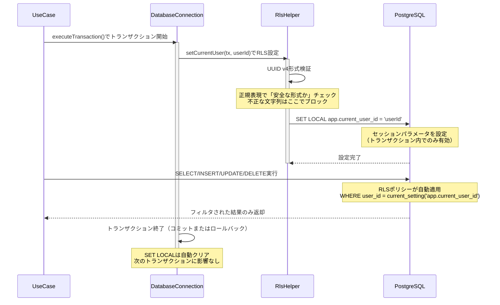
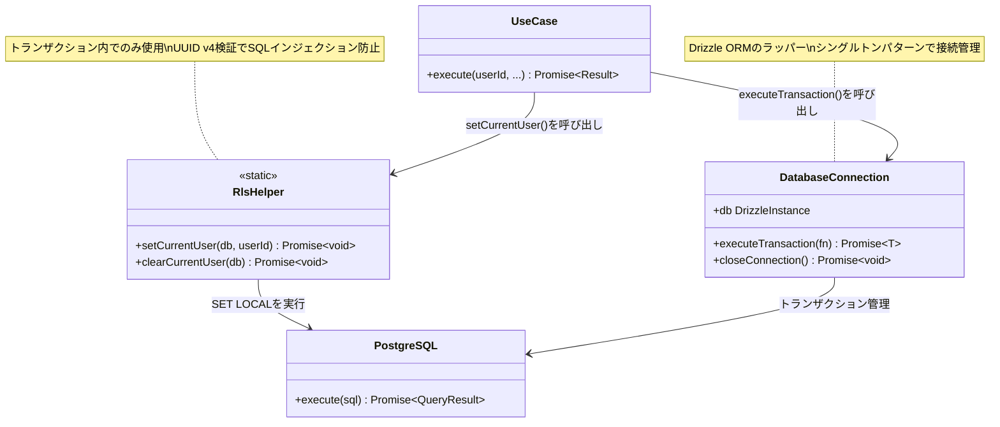

# TASK-1321: RlsHelper実装 - コード解説

**作成日**: 2025-11-29
**対象読者**: 新しく組織に加入したジュニアエンジニア

---

## この機能が何を解決するのか

この機能は「**ユーザーが自分のタスクだけを見られるようにする**」ことを解決します。

具体的には：
- ログイン中のユーザーAが、ユーザーBのタスクを勝手に見たり編集したりできないようにする
- データベースレベルで「このユーザーは自分のデータしか触れない」というルールを自動適用する
- 開発者がSQLを書くときに「WHERE user_id = ?」を毎回書かなくても、自動的にフィルタがかかる

これを「**Row-Level Security（RLS、行レベルセキュリティ）**」と呼び、データベース側で自動的にアクセス制御ができます。

### なぜこの仕組みが必要なのか

従来のやり方だと、開発者が毎回こう書く必要がありました：

```typescript
// 従来のやり方（RLSなし）
const tasks = await db
  .select()
  .from(tasksTable)
  .where(eq(tasksTable.userId, currentUserId)); // ← 毎回書く必要がある
```

**問題点**：
- 開発者が書き忘れると、全ユーザーのデータが見えてしまう（セキュリティ事故）
- すべてのクエリに同じコードを書くのは面倒で、ミスが起きやすい

**RLSを使った新しいやり方**：

```typescript
// RLSを使ったやり方
await RlsHelper.setCurrentUser(tx, currentUserId); // ← 一度設定するだけ

// あとは普通にクエリを書くだけでOK
const tasks = await tx.select().from(tasksTable); // ← WHERE不要！
// → データベースが自動的に「user_id = currentUserId」でフィルタしてくれる
```

**メリット**：
- データベース側が自動的にフィルタをかけるので、開発者が書き忘れることがない
- セキュリティが確実に守られる

---

## 全体の処理の流れ

### 処理フローとファイル関係



---

## ファイルの役割と責任

### 今回解説するメインのファイル

#### `app/server/src/infrastructure/database/RlsHelper.ts`

**役割**: RLS（Row-Level Security）を設定・解除するヘルパークラス

**実装された関数**：

##### 1. `setCurrentUser(db, userId)`

「このトランザクションでは、このユーザーIDとして動作します」と宣言する関数です。

```typescript
// app/server/src/infrastructure/database/RlsHelper.ts
public static async setCurrentUser(
  db: DrizzleExecutor,
  userId: string,
): Promise<void> {
  // ① UUID v4形式の検証（SQLインジェクション対策）
  const uuidRegex =
    /^[0-9a-f]{8}-[0-9a-f]{4}-4[0-9a-f]{3}-[89ab][0-9a-f]{3}-[0-9a-f]{12}$/i;
  if (!uuidRegex.test(userId)) {
    throw new Error('Invalid UUID format for user ID');
  }

  // ② PostgreSQLにセッションパラメータを設定
  await db.execute(sql.raw(`SET LOCAL app.current_user_id = '${userId}'`));
}
```

**処理の詳細**：

1. **UUID検証（33-38行目）**
   - `userId`が「550e8400-e29b-41d4-a716-446655440000」のような正しいUUID v4形式か確認
   - なぜ必要？ → 悪意あるユーザーが `"'; DROP TABLE tasks; --"` のような危険な文字列を送ってこないようにするため（SQLインジェクション対策）
   - UUID形式でなければエラーをスロー

2. **PostgreSQLへの設定（40-41行目）**
   - `SET LOCAL app.current_user_id = 'userId'` というSQLを実行
   - `SET LOCAL`は「このトランザクション内だけ有効」という意味
   - トランザクションが終われば自動的にクリアされる

##### 2. `clearCurrentUser(db)`

「RLS設定をクリアする」関数です（通常は自動クリアされるので、明示的に呼ぶ必要は少ない）。

```typescript
// app/server/src/infrastructure/database/RlsHelper.ts
public static async clearCurrentUser(db: DrizzleExecutor): Promise<void> {
  await db.execute(sql`SET LOCAL app.current_user_id = ''`);
}
```

**処理の詳細**：
- セッションパラメータを空文字列にリセット
- 主にfinallyブロックで「念のため確実にクリア」したいときに使う
- 実際にはトランザクション終了で自動的にクリアされるため、呼び出しは任意

---

### 呼び出し元・呼び出し先のファイル

#### `app/server/src/infrastructure/database/DatabaseConnection.ts`

**役割**: データベース接続とトランザクション管理

**関連する関数**：

##### `executeTransaction(fn)`

トランザクション内で処理を実行するヘルパー関数です。

```typescript
// app/server/src/infrastructure/database/DatabaseConnection.ts
export async function executeTransaction<T>(
  fn: Parameters<typeof db.transaction>[0],
): Promise<T> {
  return (await db.transaction(fn)) as T;
}
```

**RlsHelperとの関係**：
- `RlsHelper.setCurrentUser()`は必ずこの`executeTransaction()`の中で呼び出す
- なぜ？ → `SET LOCAL`はトランザクション内でのみ有効だから
- トランザクション外で呼び出すと、RLSが機能しない

**使用例**：

```typescript
await executeTransaction(async (tx) => {
  // ① RLS設定
  await RlsHelper.setCurrentUser(tx, userId);

  // ② 以降のクエリには自動的にRLSが適用される
  const tasks = await tx.select().from(tasksTable);
  // → WHERE user_id = userId が自動的に追加される
});
```

---

#### データベーススキーマ（`docs/design/todo-app/database-schema.sql`）

**RLSポリシーの定義**：

```sql
-- RLSを有効化
ALTER TABLE app_test.tasks ENABLE ROW LEVEL SECURITY;

-- ユーザーは自分のタスクのみアクセス可能
CREATE POLICY "Users can only access their own tasks"
    ON app_test.tasks
    FOR ALL
    USING (user_id = current_setting('app.current_user_id')::uuid);
```

**ポリシーの意味**：
- `FOR ALL` → すべての操作（SELECT/INSERT/UPDATE/DELETE）に適用
- `USING (user_id = current_setting('app.current_user_id')::uuid)` → 「`user_id`カラムの値と、`app.current_user_id`パラメータが一致する行だけアクセス可能」

**RlsHelperとの連携**：
1. `RlsHelper.setCurrentUser(tx, userId)`で`app.current_user_id`パラメータを設定
2. PostgreSQLが自動的に`WHERE user_id = current_setting('app.current_user_id')::uuid`を追加
3. 開発者はWHERE句を書かなくてもフィルタされる

---

## クラスと関数の呼び出し関係

### クラス構造と依存関係



**依存方向のポイント**：
- UseCaseがRlsHelperとDatabaseConnectionの両方に依存
- RlsHelperはPostgreSQLに直接SQLを送る（Drizzle ORMのexecute経由）
- DatabaseConnectionはRlsHelperに依存しない（切り離されている）

---

## 重要な処理の詳細解説

### 1. UUID v4検証によるSQLインジェクション対策

```typescript
// app/server/src/infrastructure/database/RlsHelper.ts:33-38
const uuidRegex =
  /^[0-9a-f]{8}-[0-9a-f]{4}-4[0-9a-f]{3}-[89ab][0-9a-f]{3}-[0-9a-f]{12}$/i;
if (!uuidRegex.test(userId)) {
  throw new Error('Invalid UUID format for user ID');
}
```

**なぜこの処理が必要か**：

`sql.raw()`を使うと、文字列をそのままSQLに埋め込みます。これは通常危険ですが、41行目でこう書く必要があります：

```typescript
await db.execute(sql.raw(`SET LOCAL app.current_user_id = '${userId}'`));
```

なぜ`sql.raw()`が必要？ → PostgreSQLの`SET LOCAL`コマンドはプリペアドステートメント（パラメータ化）に対応していないため。

しかし、`userId`に悪意ある文字列が入ると危険：

```typescript
// 悪意ある入力例
const userId = "'; DROP TABLE tasks; --";

// これがそのまま実行されると...
SET LOCAL app.current_user_id = ''; DROP TABLE tasks; --'
// → tasksテーブルが削除される！
```

**対策**：UUID v4形式でなければエラーにする
- UUID v4は「550e8400-e29b-41d4-a716-446655440000」のような固定形式
- 正規表現で厳密にチェック
- セミコロン（`;`）やシングルクォート（`'`）などの危険な文字は含まれない

**よくある勘違い**：
- ❌「UUIDならどんな形式でもOK」→ NO！ UUID v1やカスタム形式は拒否される
- ❌「検証をスキップして`sql.raw()`を使う」→ 絶対NG！セキュリティホール
- ✅「必ずUUID v4検証を通してから`sql.raw()`」→ 正しい

---

### 2. `SET LOCAL`とトランザクションスコープ

```typescript
// app/server/src/infrastructure/database/RlsHelper.ts:40-41
await db.execute(sql.raw(`SET LOCAL app.current_user_id = '${userId}'`));
```

**`SET LOCAL`の特徴**：

1. **トランザクション内でのみ有効**
   - `executeTransaction()`の中で設定する必要がある
   - トランザクション外で呼び出すと効果がない

2. **トランザクション終了で自動クリア**
   - コミットまたはロールバック時に自動的にリセット
   - 次のトランザクションに影響しない

3. **並列トランザクションで独立**
   - トランザクションAで設定した値は、トランザクションBに影響しない
   - 複数のユーザーが同時にアクセスしても安全

**具体例**：

```typescript
// トランザクション1（ユーザーA）
await executeTransaction(async (tx1) => {
  await RlsHelper.setCurrentUser(tx1, 'user-a-uuid');
  const tasks = await tx1.select().from(tasksTable);
  // → ユーザーAのタスクのみ取得
});

// トランザクション2（ユーザーB）- 並列実行
await executeTransaction(async (tx2) => {
  await RlsHelper.setCurrentUser(tx2, 'user-b-uuid');
  const tasks = await tx2.select().from(tasksTable);
  // → ユーザーBのタスクのみ取得（ユーザーAの設定は無関係）
});
```

**よくある勘違い**：
- ❌「`SET LOCAL`は全体に影響する」→ NO！トランザクション内のみ
- ❌「トランザクション外で呼び出しても動く」→ NO！効果なし
- ❌「手動で`clearCurrentUser()`しないと残る」→ NO！自動クリアされる
- ✅「トランザクション内で設定し、終了時に自動クリア」→ 正しい

---

### 3. `DrizzleExecutor`型による柔軟な設計

```typescript
// app/server/src/infrastructure/database/RlsHelper.ts:12-16
type DrizzleExecutor = Pick<ReturnType<typeof drizzle>, 'execute'>;
```

**この型定義の意味**：

`RlsHelper`のメソッドは、Drizzle ORMの`db`インスタンスだけでなく、トランザクション（`tx`）も受け取れます。

**なぜこの設計が必要か**：

```typescript
// パターン1: dbインスタンスを渡す（非推奨）
await RlsHelper.setCurrentUser(db, userId);

// パターン2: トランザクションを渡す（推奨）
await executeTransaction(async (tx) => {
  await RlsHelper.setCurrentUser(tx, userId); // ← txを渡す
});
```

**型定義の工夫**：
- `Pick<ReturnType<typeof drizzle>, 'execute'>`は「`execute`メソッドを持つオブジェクト」という意味
- `db`も`tx`もどちらも`execute`メソッドを持つ
- だから両方とも受け取れる

**よくある勘違い**：
- ❌「dbとtxは別の型だから受け取れない」→ NO！`Pick<>`で共通部分だけ抽出
- ❌「dbを渡せばトランザクション外でも動く」→ NO！`SET LOCAL`の仕様上、トランザクション内でのみ有効
- ✅「型としては両方OK、運用上はtxのみ推奨」→ 正しい

---

## 初学者がつまずきやすいポイント

### 1. 「UUID」とは何か？

**UUID（Universally Unique Identifier）** は「世界中で重複しない一意なID」です。

- 例：`550e8400-e29b-41d4-a716-446655440000`
- 32桁の16進数を、ハイフンで区切った形式
- バージョンがあり、今回は「UUID v4（ランダム生成）」を使用

**UUID v4の特徴**：
- 3番目のブロックが`4`で始まる（例：`41d4`）
- 4番目のブロックが`8`, `9`, `a`, `b`のいずれかで始まる（例：`a716`）

**他のUUIDバージョンとの違い**：
- UUID v1：タイムスタンプベース → セキュリティ的に推奨されない
- UUID v4：ランダム生成 → 予測不可能で安全

---

### 2. 「RLS（Row-Level Security）」とは？

**日本語訳**：行レベルセキュリティ

**簡単に言うと**：「テーブルの行（row）ごとにアクセス権限を設定できる仕組み」

**比喩で理解する**：

- テーブル全体を「マンション」に例えると
- 各行（row）は「各部屋」
- RLSは「自分の部屋の鍵しか持てない仕組み」

**従来のやり方（テーブルレベルセキュリティ）**：
- 「このテーブル全体にアクセスできる/できない」という設定
- マンションに入れるか入れないか、という粗いレベル

**RLS（行レベルセキュリティ）**：
- 「この行だけアクセスできる」という細かい設定
- 自分の部屋だけに入れる、という細かいレベル

---

### 3. 「`SET LOCAL`」と「`SET`」の違い

| コマンド | スコープ | 持続性 |
|---------|---------|-------|
| `SET` | セッション全体 | 接続が切れるまで有効 |
| `SET LOCAL` | トランザクション内のみ | トランザクション終了で自動クリア |

**具体例**：

```sql
-- パターン1: SET（推奨しない）
SET app.current_user_id = 'user-a';
-- → 接続が切れるまでずっとuser-aのまま
-- → 次のリクエストでも残ってしまう（危険！）

-- パターン2: SET LOCAL（推奨）
BEGIN; -- トランザクション開始
  SET LOCAL app.current_user_id = 'user-a';
  -- → このトランザクション内だけ有効
COMMIT; -- トランザクション終了
-- → 自動的にクリアされる
```

**なぜ`SET LOCAL`が安全か**：
- トランザクションごとに独立
- 自動クリアされるので、設定漏れがない
- 次のリクエストに影響しない

---

### 4. 「SQLインジェクション」とは？

**簡単に言うと**：悪意あるユーザーが、SQLの一部を勝手に書き換えて実行させる攻撃

**具体例**：

```typescript
// 危険なコード（脆弱性あり）
const userId = "'; DROP TABLE tasks; --"; // 悪意ある入力
await db.execute(sql.raw(`SET LOCAL app.current_user_id = '${userId}'`));

// 実際に実行されるSQL
SET LOCAL app.current_user_id = ''; DROP TABLE tasks; --'
// → tasksテーブルが削除される！
```

**RlsHelperの対策**：

```typescript
// UUID v4検証で拒否
const uuidRegex =
  /^[0-9a-f]{8}-[0-9a-f]{4}-4[0-9a-f]{3}-[89ab][0-9a-f]{3}-[0-9a-f]{12}$/i;
if (!uuidRegex.test(userId)) {
  throw new Error('Invalid UUID format for user ID'); // ← ここでブロック
}
```

**UUID形式でなければエラー** → 悪意ある文字列は通さない

---

## この設計のいい点

### 1. **セキュリティが確実に守られる**

- UUID v4検証により、SQLインジェクションを確実に防止
- データベースレベルでアクセス制御（開発者のミスに依存しない）
- トランザクションスコープで自動クリア（設定漏れがない）

### 2. **開発者の負担を減らす**

- 毎回`WHERE user_id = ?`を書く必要がない
- RLS設定を一度呼び出すだけで、以降は自動フィルタ
- テストも簡単（RLS設定の有無で動作が変わる）

### 3. **並列処理でも安全**

- `SET LOCAL`はトランザクションごとに独立
- 複数のユーザーが同時アクセスしても、互いに影響しない
- スケーラビリティが高い

### 4. **責任の分離が明確**

- `RlsHelper`：RLS設定のみに専念（Single Responsibility Principle）
- `DatabaseConnection`：接続とトランザクション管理のみ
- UseCase：ビジネスロジックのみ
- それぞれが独立してテスト・保守できる

---

## まとめ

**RlsHelper**は、データベースの行レベルセキュリティ（RLS）を簡単に設定できるヘルパークラスです。

**重要なポイント**：
1. 必ず`executeTransaction()`内で`setCurrentUser()`を呼び出す
2. UUID v4検証により、SQLインジェクションを防止
3. `SET LOCAL`はトランザクション内でのみ有効
4. トランザクション終了で自動的にクリアされる

**使い方の基本**：

```typescript
await executeTransaction(async (tx) => {
  // ① RLS設定
  await RlsHelper.setCurrentUser(tx, userId);

  // ② 以降のクエリには自動的にRLSが適用される
  const tasks = await tx.select().from(tasksTable);
});
```

この仕組みにより、「ユーザーは自分のタスクしか見られない」というセキュリティが確実に守られます。
