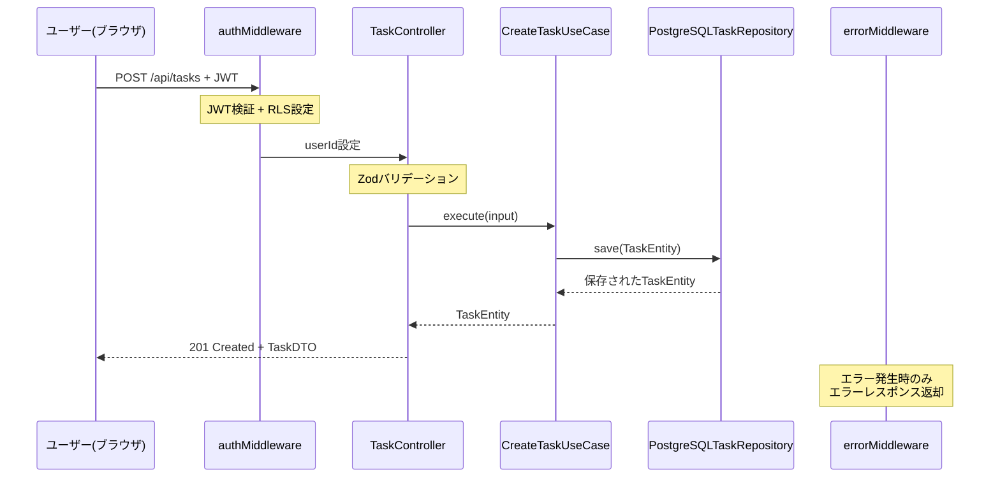
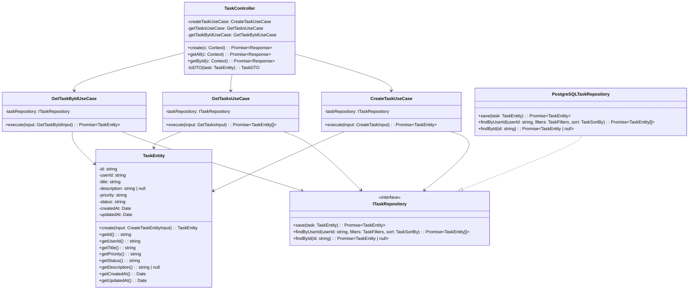

# TASK-1324: TaskController実装（作成・一覧・詳細）- コード解説

## 📄 ドキュメント情報

- **作成日**: 2025-12-01
- **要件名**: todo-app
- **タスクID**: TASK-1324
- **機能名**: TaskController実装（作成・一覧・詳細）
- **対象読者**: 新しく組織に加入したジュニアエンジニア

---

## この機能が何を解決するのか

この機能は「**ログイン済みユーザーが自分のタスクをHTTP API経由で管理できるようにする**」ことを解決します。

具体的には、次の3つのことができるようになります：

1. **タスクを新しく作る**（POST /api/tasks）
2. **自分のタスク一覧を見る**（GET /api/tasks）
3. **特定のタスクの詳細を見る**（GET /api/tasks/:id）

これを「**REST API**」と呼び、フロントエンド（ブラウザ上で動くアプリ）からHTTPリクエストを送ると、バックエンド（サーバー側）がJSONデータを返してくれます。

### なぜこの機能が必要なのか

タスク管理アプリなので、ユーザーは「タスクを追加したり、一覧で確認したり、詳細を見たい」というニーズがあります。そのために、フロントエンドとバックエンドが通信するための**入り口**が必要です。その入り口が今回実装した「**TaskController**」というコントローラです。

---

## 全体の処理の流れ

### 処理フローとファイル関係

以下の図は、ユーザーがブラウザでタスクを作成したときに、どのファイルがどの順番で呼び出されるかを示しています。



**処理の流れを文章で説明すると**：

1. ユーザーがブラウザでタスク作成ボタンを押す
2. フロントエンドが「POST /api/tasks」というリクエストを送る
3. **authMiddleware**がJWT（ログイン証明書のようなもの）を確認する
4. ログインが確認できたら**TaskController**にリクエストが渡る
5. **TaskController**が入力データをチェックして、**CreateTaskUseCase**を呼ぶ
6. **CreateTaskUseCase**が**PostgreSQLTaskRepository**を使ってデータベースに保存
7. 保存されたタスク情報が逆順にTaskController、フロントエンドへ返される
8. エラーが起きたら**errorMiddleware**がエラーメッセージを返す

---

## ファイルの役割と責任

### 今回解説するメインのファイル

#### TaskController.ts

**場所**: `app/server/src/presentation/http/controllers/TaskController.ts`

**役割**: HTTP APIの入り口（エンドポイント）を定義しているファイルです。

「**Presentation層**」と呼ばれる層にあり、HTTPリクエストを受け取って、適切な「UseCase（業務ロジック）」を呼び出し、最後にJSONレスポンスを返す役割を持っています。

**実装されている主な機能**：

1. **create()メソッド**: タスク作成（POST /api/tasks）
2. **getAll()メソッド**: タスク一覧取得（GET /api/tasks）
3. **getById()メソッド**: タスク詳細取得（GET /api/tasks/:id）
4. **toDTO()メソッド**: TaskEntity（内部データ）をTaskDTO（JSON用データ）に変換

**コンストラクタで依存性注入**：

```typescript
constructor(
  private readonly createTaskUseCase: CreateTaskUseCase,
  private readonly getTasksUseCase: GetTasksUseCase,
  private readonly getTaskByIdUseCase: GetTaskByIdUseCase,
) {}
```

この書き方を「**依存性注入（DI）**」と呼びます。`TaskController`は自分で`CreateTaskUseCase`を作らず、外から受け取ります。これにより、テスト時にモック（偽物）に差し替えやすくなります。

---

#### TaskController.test.ts

**場所**: `app/server/src/presentation/http/controllers/__tests__/TaskController.test.ts`

**役割**: TaskControllerが正しく動くかをテストするファイルです。

**テストの流れ（Given-When-Then パターン）**：

- **Given**: テストデータの準備（例: ユーザーID、リクエストボディ）
- **When**: 実際の処理を実行（例: `controller.create(mockContext)`）
- **Then**: 結果の検証（例: レスポンスが201で返ってくるか確認）

**モックの使い方**：

```typescript
mockCreateTaskUseCase = {
  execute: mock(),
};
```

`mock()`は「偽物の関数」を作る機能です。本物のデータベースにアクセスせずにテストできるようにしています。

---

### 呼び出されているファイル

#### CreateTaskUseCase.ts

**場所**: `app/server/src/application/usecases/CreateTaskUseCase.ts`

**役割**: タスク作成の業務ロジックを実装しています。

「**Application層**」にあり、Presentation層（TaskController）から呼び出されます。

**主な処理**：

1. **TaskEntity.create()** でタスクの作成とバリデーション
2. **taskRepository.save()** でデータベースに保存

#### GetTasksUseCase.ts

**場所**: `app/server/src/application/usecases/GetTasksUseCase.ts`

**役割**: タスク一覧取得の業務ロジックを実装しています。

**主な処理**：

1. フィルタ（優先度・ステータス）とソート順を受け取る
2. **taskRepository.findByUserId()** でデータベースから取得

#### GetTaskByIdUseCase.ts

**場所**: `app/server/src/application/usecases/GetTaskByIdUseCase.ts`

**役割**: タスク詳細取得の業務ロジックを実装しています。

**主な処理**：

1. タスクIDでデータベースから検索
2. 見つからなければ`TaskNotFoundError`をスロー

---

#### errorMiddleware.ts

**場所**: `app/server/src/presentation/http/middleware/errorMiddleware.ts`

**役割**: エラーが起きたときに適切なHTTPステータスコード（404, 400, 500など）とJSONエラーメッセージを返します。

**エラーマッピング**：

- `TaskNotFoundError` → 404 Not Found
- `InvalidTaskDataError` → 400 Bad Request
- その他のエラー → 500 Internal Server Error

**重要なポイント**：

TaskControllerの中では`try-catch`を書いていません。エラーが起きたら`throw`して、errorMiddlewareに任せます。これを「**エラーハンドリングの委譲**」と呼びます。

---

#### TaskEntity.ts

**場所**: `app/server/src/domain/task/TaskEntity.ts`

**役割**: タスクの**ドメインモデル**（ビジネスルールを持つデータ）を定義しています。

「**Domain層**」にあり、アプリケーションの中心的なビジネスロジックを持っています。

**主な機能**：

- **create()メソッド**: タスクを新規作成（バリデーション含む）
- **getXxx()メソッド**: タスクの各プロパティを取得（id, title, priorityなど）

---

#### ITaskRepository.ts / PostgreSQLTaskRepository.ts

**場所**:
- インターフェース: `app/server/src/domain/task/ITaskRepository.ts`
- 実装: `app/server/src/infrastructure/database/repositories/PostgreSQLTaskRepository.ts`

**役割**: データベースへのアクセス処理を抽象化しています。

**ITaskRepository**は「こういうメソッドがあるよ」という約束（インターフェース）で、**PostgreSQLTaskRepository**が実際のSQL実行を行います。

---

## クラスと関数の呼び出し関係

### クラス構造と依存関係

以下の図は、各クラスがどのように依存しているかを示しています。矢印の向きが「依存の方向」です。



**依存関係の読み方**：

- **実線の矢印（`-->`）**: クラスAがクラスBを使っている（依存している）
- **点線の矢印（`..|>`）**: クラスがインターフェースを実装している

**重要な設計ポイント**：

1. **TaskController**は**UseCaseのみ**に依存している（TaskEntityやRepositoryには直接依存していない）
2. **UseCase**は**ITaskRepository（インターフェース）**に依存している（PostgreSQLTaskRepositoryという具体的な実装には依存していない）
3. これを「**依存性逆転の原則（DIP）**」と呼び、テストしやすく、変更に強い設計になります

---

## 重要な処理の詳細解説

### 1. タスク作成（create()メソッド）

**処理の流れ**：

```typescript
// app/server/src/presentation/http/controllers/TaskController.ts
async create(c: Context): Promise<Response> {
  // ステップ1: authMiddlewareで設定されたuserIdを取得
  const userId = c.get('userId') as string;

  // ステップ2: HTTPリクエストのボディ（JSON）を取得
  const input = await c.req.json();

  // ステップ3: CreateTaskUseCaseを実行（業務ロジック）
  const task = await this.createTaskUseCase.execute({
    userId,
    title: input.title,
    ...(input.description !== undefined && {
      description: input.description,
    }),
    ...(input.priority !== undefined && { priority: input.priority }),
  });

  // ステップ4: TaskEntityをTaskDTO（JSON用）に変換して201レスポンス
  return c.json<SuccessResponseSingle>(
    {
      success: true,
      data: this.toDTO(task),
    },
    201,
  );
}
```

**各ステップの解説**：

#### ステップ1: userIdの取得

```typescript
const userId = c.get('userId') as string;
```

`c.get('userId')`は、**authMiddleware**で事前に設定された「ログイン中のユーザーID」を取得しています。

authMiddlewareは、JWTトークンを検証して、成功したら`c.set('userId', userId)`でHonoのコンテキストにユーザーIDを保存します。そのため、TaskControllerでは`c.get('userId')`で取り出すだけでOKです。

#### ステップ2: リクエストボディの取得

```typescript
const input = await c.req.json();
```

HTTPリクエストのボディ（JSON形式）を取得しています。例えば、フロントエンドから次のようなJSONが送られてきます：

```json
{
  "title": "会議資料の作成",
  "description": "## 内容\n- 概要説明",
  "priority": "high"
}
```

#### ステップ3: UseCaseの実行

```typescript
const task = await this.createTaskUseCase.execute({
  userId,
  title: input.title,
  ...(input.description !== undefined && {
    description: input.description,
  }),
  ...(input.priority !== undefined && { priority: input.priority }),
});
```

**ここで使われているテクニック**：

`...(input.description !== undefined && { description: input.description })`

これは「**undefinedを除外するスプレッド構文**」です。

なぜこうするかというと、TypeScriptの`exactOptionalPropertyTypes`という設定で、「オプションのプロパティに`undefined`を明示的に渡すことを禁止」しているからです。

**悪い例**:

```typescript
// descriptionがundefinedの場合、{ userId, title, description: undefined } となってエラー
const task = await this.createTaskUseCase.execute({
  userId,
  title: input.title,
  description: input.description, // ❌ undefinedが渡る可能性
});
```

**良い例**:

```typescript
// descriptionがundefinedの場合、{ userId, title } だけになる
const task = await this.createTaskUseCase.execute({
  userId,
  title: input.title,
  ...(input.description !== undefined && { description: input.description }), // ✅
});
```

**CreateTaskUseCase内部の処理**：

```typescript
// app/server/src/application/usecases/CreateTaskUseCase.ts
async execute(input: CreateTaskInput): Promise<TaskEntity> {
  // TaskEntity.create()でバリデーションとエンティティ生成
  const task = TaskEntity.create({
    userId: input.userId,
    title: input.title,
    ...(input.description !== undefined && { description: input.description }),
    ...(input.priority !== undefined && { priority: input.priority }),
  });

  // リポジトリで永続化（データベースに保存）
  return await this.taskRepository.save(task);
}
```

`TaskEntity.create()`の中でタイトルの長さチェック（1〜100文字）や優先度の値チェック（high/medium/low）が行われます。不正なデータだと`InvalidTaskDataError`がスローされます。

#### ステップ4: レスポンスの返却

```typescript
return c.json<SuccessResponseSingle>(
  {
    success: true,
    data: this.toDTO(task),
  },
  201,
);
```

**201 Created**というステータスコードで、作成されたタスクをJSONで返します。

**toDTO()メソッド**：

```typescript
private toDTO(task: TaskEntity): TaskDTO {
  return {
    id: task.getId(),
    userId: task.getUserId(),
    title: task.getTitle(),
    description: task.getDescription(),
    priority: task.getPriority(),
    status: task.getStatus(),
    createdAt: task.getCreatedAt().toISOString(),
    updatedAt: task.getUpdatedAt().toISOString(),
  };
}
```

**TaskEntity**（内部データ）を**TaskDTO**（JSON用データ）に変換しています。

**なぜこの変換が必要か**：

- TaskEntityは`getXxx()`メソッドでプロパティを取得する設計（カプセル化）
- JSONレスポンスはシンプルなオブジェクト`{ id: "...", title: "..." }`が望ましい
- `toDTO()`で変換することで、内部構造を隠し、外部に公開するデータ形式を制御できる

---

### 2. タスク一覧取得（getAll()メソッド）

**処理の流れ**：

```typescript
// app/server/src/presentation/http/controllers/TaskController.ts
async getAll(c: Context): Promise<Response> {
  const userId = c.get('userId') as string;
  const query = c.req.query();

  // TaskSortByのバリデーション
  const sort = (query.sort || 'created_at_desc') as
    | 'created_at_desc'
    | 'created_at_asc'
    | 'priority_desc';

  const tasks = await this.getTasksUseCase.execute({
    userId,
    filters: {
      ...(query.priority && { priority: query.priority }),
      ...(query.status && {
        status: query.status.split(',').map((s) => s.trim()),
      }),
    },
    sort,
  });

  return c.json<SuccessResponseArray>(
    {
      success: true,
      data: tasks.map((task) => this.toDTO(task)),
    },
    200,
  );
}
```

**重要なポイント**：

#### クエリパラメータの解析

```typescript
const query = c.req.query();
```

HTTPリクエストのクエリパラメータを取得しています。例えば：

```
GET /api/tasks?status=not_started,in_progress&sort=created_at_desc
```

というリクエストの場合、`query`は次のようになります：

```typescript
{
  status: 'not_started,in_progress',
  sort: 'created_at_desc'
}
```

#### statusの配列変換

```typescript
status: query.status.split(',').map((s) => s.trim())
```

`status=not_started,in_progress`というカンマ区切り文字列を配列`['not_started', 'in_progress']`に変換しています。

`.trim()`は、スペースを削除する処理です。`'not_started, in_progress'`のようにスペースが入っていても正しく処理できます。

#### 配列のマッピング

```typescript
data: tasks.map((task) => this.toDTO(task))
```

`tasks`は`TaskEntity[]`（TaskEntityの配列）です。

`.map()`で1つ1つのTaskEntityを`toDTO()`でTaskDTOに変換し、`TaskDTO[]`の配列にしています。

---

### 3. タスク詳細取得（getById()メソッド）

**処理の流れ**：

```typescript
// app/server/src/presentation/http/controllers/TaskController.ts
async getById(c: Context): Promise<Response> {
  const userId = c.get('userId') as string;
  const taskId = c.req.param('id');

  const task = await this.getTaskByIdUseCase.execute({ userId, taskId });

  return c.json<SuccessResponseSingle>(
    {
      success: true,
      data: this.toDTO(task),
    },
    200,
  );
}
```

**重要なポイント**：

#### パスパラメータの取得

```typescript
const taskId = c.req.param('id');
```

`GET /api/tasks/:id`の`:id`部分（パスパラメータ）を取得しています。

例えば`GET /api/tasks/550e8400-e29b-41d4-a716-446655440000`というリクエストの場合、`taskId`は`'550e8400-e29b-41d4-a716-446655440000'`になります。

#### エラーハンドリング

```typescript
const task = await this.getTaskByIdUseCase.execute({ userId, taskId });
```

もしタスクが見つからなかった場合、`GetTaskByIdUseCase`内で`TaskNotFoundError`がスローされます。

**TaskControllerではtry-catchを書いていない**ことに注目してください。エラーは**errorMiddleware**が自動的にキャッチして、404レスポンスを返してくれます。

---

## 初学者がつまずきやすいポイント

### 1. 「依存性注入（DI）」とは？

**簡単に言うと**：

「自分で作らず、外から受け取る」ということです。

**悪い例（依存性注入なし）**：

```typescript
class TaskController {
  constructor() {
    // 自分でnewして作る → テストで差し替えられない
    this.createTaskUseCase = new CreateTaskUseCase();
  }
}
```

**良い例（依存性注入あり）**：

```typescript
class TaskController {
  constructor(
    // 外から受け取る → テストでモックに差し替えられる
    private readonly createTaskUseCase: CreateTaskUseCase
  ) {}
}
```

**なぜこれが良いのか**：

テスト時に本物のデータベースではなく、偽物（モック）を渡せるので、高速でテストできます。

---

### 2. 「undefinedを除外するスプレッド構文」とは？

```typescript
...(input.description !== undefined && { description: input.description })
```

**これは何をしているのか**：

- `input.description !== undefined`が`true`の場合 → `{ description: input.description }`が展開される
- `input.description !== undefined`が`false`の場合 → 何も展開されない（プロパティが存在しない）

**具体例**：

```typescript
const input = { title: 'テスト', description: undefined };

// 悪い例
const bad = { title: input.title, description: input.description };
// 結果: { title: 'テスト', description: undefined } ← エラー

// 良い例
const good = {
  title: input.title,
  ...(input.description !== undefined && { description: input.description })
};
// 結果: { title: 'テスト' } ← descriptionプロパティが存在しない
```

---

### 3. 「エラーハンドリングの委譲」とは？

**TaskControllerではtry-catchを書かない**ことに気づいたと思います。

なぜかというと、**errorMiddleware**が自動的にエラーをキャッチしてくれるからです。

**処理の流れ**：

1. TaskControllerで`await this.createTaskUseCase.execute()`を実行
2. CreateTaskUseCaseで`TaskEntity.create()`を実行
3. もし不正なデータだったら`InvalidTaskDataError`をスロー
4. エラーがTaskControllerを通り抜けて、**errorMiddleware**に到達
5. **errorMiddleware**が`InvalidTaskDataError`を検出して、400エラーレスポンスを返す

**これの何が良いのか**：

- TaskControllerがシンプルになる（エラー処理のコードを書かなくていい）
- エラーハンドリングのロジックが1箇所（errorMiddleware）に集約される
- 新しいエラータイプを追加するときも、errorMiddlewareだけ修正すればいい

---

### 4. 「なぜインターフェース（ITaskRepository）を使うのか？」

**ITaskRepository**は「こういうメソッドがあるよ」という約束（インターフェース）です。

**具体的な実装**は**PostgreSQLTaskRepository**が行います。

**なぜこうするのか**：

- テスト時に`MockTaskRepository`に差し替えられる
- 将来「PostgreSQLじゃなくてMySQLを使いたい」となっても、`MySQLTaskRepository`を作るだけでOK
- UseCaseのコードを変更する必要がない（インターフェースが同じだから）

**図で表すと**：

```
CreateTaskUseCase → ITaskRepository (インターフェース)
                           ↑
                           | 実装
                PostgreSQLTaskRepository
```

CreateTaskUseCaseは「ITaskRepositoryというインターフェース」にだけ依存していて、PostgreSQLTaskRepositoryという具体的な実装には依存していません。これを「**依存性逆転の原則（DIP）**」と呼びます。

---

## この設計のいい点

### 1. レイヤーが明確に分離されている

**TaskController（Presentation層）**は**UseCase（Application層）**だけに依存していて、**Domain層**や**Infrastructure層**には直接依存していません。

これにより：

- 各層を独立してテストできる
- 1つの層を変更しても、他の層に影響しない
- 将来的な拡張が容易

---

### 2. エラーハンドリングが統一されている

**errorMiddleware**が全てのエラーを統一的に処理しているため：

- エラーレスポンスの形式が統一される（`{ success: false, error: { code, message } }`）
- 新しいエラータイプを追加しても、errorMiddlewareだけ修正すればいい
- TaskControllerがシンプルになる

---

### 3. テスタビリティが高い

**依存性注入（DI）**を使っているため：

- テスト時にモックに差し替えられる
- データベースにアクセスせずに高速テストができる
- テストカバレッジ100%を達成しやすい

**TaskController.test.ts**を見ると、全てのUseCaseをモックに差し替えて、レスポンスが正しいかだけをテストしています。

---

### 4. 型安全性が保たれている

**TypeScript**の厳格な設定（`exactOptionalPropertyTypes`）により：

- `undefined`を誤って渡すことを防げる
- コンパイル時にエラーを検出できる
- 実行時エラーが減る

**Zodバリデーション**も使っているため：

- 実行時に入力データの型チェックができる
- 不正なデータを早期に検出できる

---

以上が、TASK-1324で実装されたTaskController（作成・一覧・詳細）の解説です。

**次のステップ**：

- TASK-1325: TaskController（更新・削除・ステータス変更）の実装
- TASK-1326: taskRoutes統合・テスト

この解説が、コードの理解と他者への説明の助けになれば幸いです！
