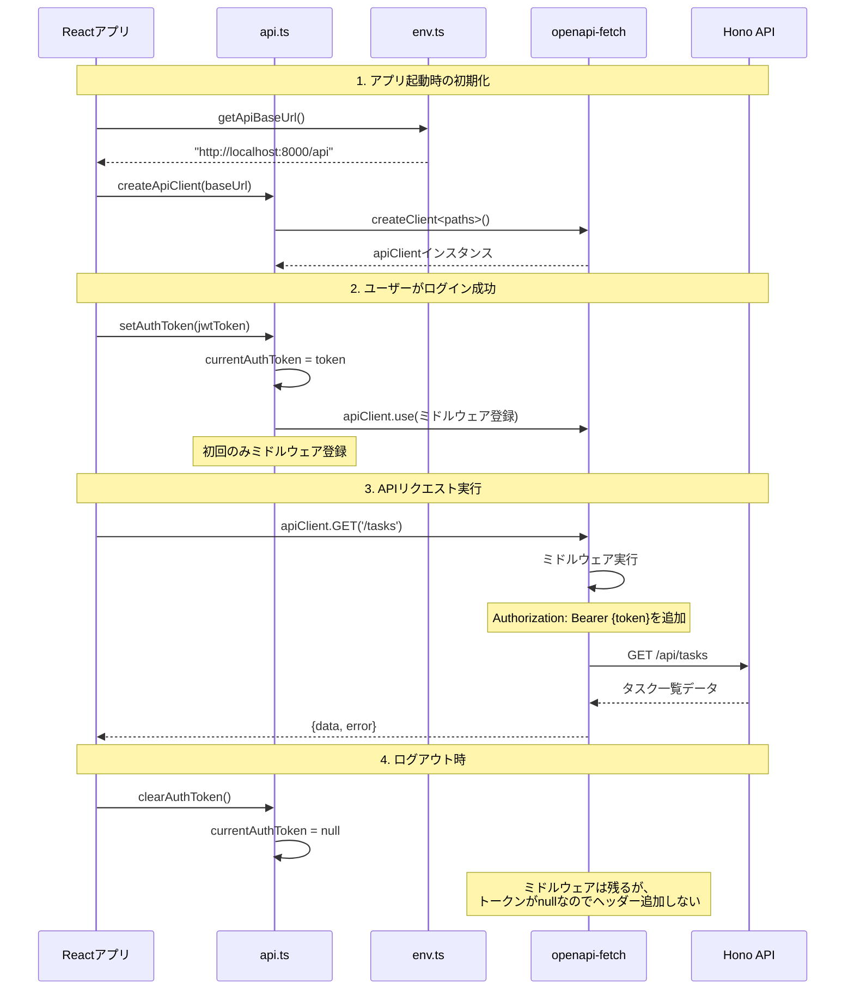
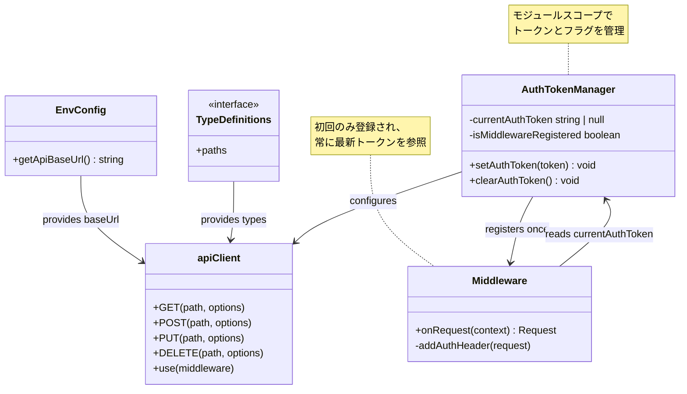

# TASK-1329: API Client設定 - コード解説

## この機能が何を解決するのか

この機能は「フロントエンド（Next.js）とバックエンド（Hono API）の間で、**型安全に**API通信を行う」ことを解決します。

具体的には：
- OpenAPI仕様書から自動生成された型定義を使って、間違ったAPIリクエストを**コンパイル時に防ぐ**
- JWT認証トークンを**一箇所で管理**し、すべてのAPIリクエストに自動的に付与する
- 環境変数からAPIのベースURLを読み込み、**開発・本番環境を切り替えやすく**する

これを「**型安全なAPIクライアント**」と呼び、以下のことができます：
- バックエンドのAPIが変更されたとき、フロントエンドのコードでエラーが出るので、すぐに気づける
- ログイン成功後、一度だけトークンを設定すれば、以降のすべてのAPIリクエストで認証が通る

## 全体の処理の流れ

### 処理フローとファイル関係



## ファイルの役割と責任

### 今回解説するメインのファイル

**`app/client/src/lib/api.ts`** - APIクライアントの核となるファイル

このファイルには3つの主要な機能があります：

#### 1. `createApiClient()` 関数
```typescript
// app/client/src/lib/api.ts
export function createApiClient(
  baseUrl: string,
  headers?: HeadersInit,
  options?: { fetch?: typeof fetch },
) {
  return createClient<paths>({ baseUrl, headers, ...options });
}
```

**役割**: 型安全なAPIクライアントを作成する「工場」のような関数

**何をしているか**:
- `openapi-fetch`というライブラリを使って、APIクライアントを作る
- `<paths>`という部分がポイントで、これはバックエンドのAPIエンドポイント情報を型として持っている
- `baseUrl`（APIサーバーのURL）、`headers`（追加のヘッダー）、`options`（その他設定）を受け取る

**よくある勘違い**:
- ❌ 「この関数が実際にAPIリクエストを送る」→ 違います。この関数は「リクエストを送るための道具を作る」だけです。
- ✅ 正しい理解: 「この関数は、型安全にAPIリクエストを送れる道具（クライアント）を作って返す」

#### 2. `apiClient` 定数（シングルトンインスタンス）
```typescript
// app/client/src/lib/api.ts
export const apiClient = createApiClient(getApiBaseUrl());
```

**役割**: アプリ全体で共有する「唯一のAPIクライアント」

**何をしているか**:
- `createApiClient()`を使って、デフォルトのAPIクライアントを1つ作る
- `getApiBaseUrl()`で環境変数からAPIのURLを取得（開発環境なら`http://localhost:8000/api`）
- この`apiClient`をアプリの色々な場所でインポートして使い回す

**専門用語解説**: **シングルトンパターン** = 「アプリ全体で1つだけ存在するインスタンス」のこと。
例えば「データベース接続」や「ログ出力機能」など、複数作る必要がないものに使われます。

#### 3. `setAuthToken()` 関数（今回の主要実装）
```typescript
// app/client/src/lib/api.ts
let currentAuthToken: string | null = null;
let isMiddlewareRegistered = false;

export function setAuthToken(token: string): void {
  if (token.trim() === '') {
    throw new Error('Token must not be empty');
  }

  currentAuthToken = token;

  if (!isMiddlewareRegistered) {
    apiClient.use({
      onRequest: async ({ request }) => {
        if (currentAuthToken) {
          request.headers.set('Authorization', `Bearer ${currentAuthToken}`);
        }
        return request;
      },
    });
    isMiddlewareRegistered = true;
  }
}
```

**役割**: JWT認証トークンを設定し、以降のすべてのAPIリクエストに自動的に認証ヘッダーを付ける

**何をしているか**:
1. **空文字列チェック**: トークンが空でないか確認（空なら例外を投げる）
2. **トークン保存**: `currentAuthToken`という変数にトークンを保存
3. **ミドルウェア登録（初回のみ）**:
   - `isMiddlewareRegistered`が`false`のとき（＝初回呼び出し）だけミドルウェアを登録
   - ミドルウェアは「リクエスト送信前に実行される処理」のこと
   - `onRequest`で、リクエストに`Authorization: Bearer {token}`ヘッダーを追加

**重要なポイント**: なぜ「初回のみ」ミドルウェア登録するのか？

- ❌ **悪い設計**: `setAuthToken()`を呼ぶたびにミドルウェアを登録する
  - 問題点: ログイン→ログアウト→再ログインすると、ミドルウェアが3個登録されてしまう
  - 結果: 無駄な処理が増え、古いトークンがメモリに残り続ける

- ✅ **良い設計（今回の実装）**: ミドルウェアは1回だけ登録し、トークンだけ更新する
  - ミドルウェア内で`currentAuthToken`を参照するため、常に最新のトークンが使われる
  - トークンを更新するときは`currentAuthToken`を書き換えるだけでOK

#### 4. `clearAuthToken()` 関数
```typescript
// app/client/src/lib/api.ts
export function clearAuthToken(): void {
  currentAuthToken = null;
}
```

**役割**: ログアウト時に認証トークンをクリアする

**何をしているか**:
- `currentAuthToken`を`null`に戻す
- ミドルウェア自体は登録されたまま残るが、トークンが`null`なので、ヘッダーは追加されなくなる

### 呼び出しているファイル

**`app/client/src/lib/env.ts`** - 環境変数管理ファイル

```typescript
// app/client/src/lib/env.ts（推測）
export function getApiBaseUrl(): string {
  return process.env.NEXT_PUBLIC_API_URL || 'http://localhost:8000/api';
}
```

**役割**: 環境変数からAPIのベースURLを取得する

**なぜ分離しているか**:
- テスト時にモックしやすくするため
- 環境変数の取得ロジックを1箇所にまとめるため

**`@/types/api/generated.ts`** - OpenAPI型定義ファイル（自動生成）

```typescript
// @/types/api/generated.ts（自動生成）
export interface paths {
  '/tasks': {
    get: { ... },
    post: { ... },
  },
  '/tasks/{id}': {
    get: { ... },
    put: { ... },
    delete: { ... },
  },
  // ... その他のエンドポイント
}
```

**役割**: バックエンドのAPIエンドポイント情報を型として提供

**どう生成されるか**:
1. バックエンドがOpenAPI仕様書（YAML/JSON）を出力
2. `openapi-typescript`というツールで、仕様書から型定義ファイルを自動生成
3. フロントエンドでこの型定義をインポートして使う

### 呼び出されているファイル（将来的に使われる想定）

**`app/client/src/features/user/hooks/useUser.ts`** - ユーザー情報取得フック（例）

```typescript
// app/client/src/features/user/hooks/useUser.ts（例）
import { apiClient } from '@/lib/api';

export function useUser(userId: string) {
  const { data, error } = await apiClient.GET('/users/{id}', {
    params: { path: { id: userId } },
  });

  return { user: data?.data, error };
}
```

**役割**: ユーザー情報をAPIから取得するカスタムフック

**どう使われるか**:
- Reactコンポーネントから`useUser(userId)`を呼び出す
- 内部で`apiClient.GET()`を使ってAPIリクエストを送る
- `setAuthToken()`で設定したトークンが自動的にリクエストヘッダーに付与される

## クラスと関数の呼び出し関係

### クラス構造と依存関係



**依存方向の解説**:
1. `apiClient`は`EnvConfig`に依存（環境変数から設定を取得）
2. `apiClient`は`TypeDefinitions`に依存（型安全性を提供）
3. `AuthTokenManager`は`apiClient`を設定（ミドルウェア登録）
4. `Middleware`は`AuthTokenManager`を参照（最新トークンを取得）

## 重要な処理の詳細解説

### 1. ミドルウェアパターンによる認証ヘッダー追加

```typescript
// app/client/src/lib/api.ts
apiClient.use({
  onRequest: async ({ request }) => {
    if (currentAuthToken) {
      request.headers.set('Authorization', `Bearer ${currentAuthToken}`);
    }
    return request;
  },
});
```

**この処理が必要である理由**:
- すべてのAPIリクエストで、毎回手動で`Authorization`ヘッダーを設定するのは大変
- トークンを一箇所で管理し、自動的に全リクエストに付与する仕組みが必要

**ミドルウェアとは**:
リクエストが実際に送信される**前**に実行される処理のこと。
例えるなら「手紙を郵便局に出す前に、自動的に切手を貼ってくれる機械」のようなもの。

**よくある勘違い**:
- ❌ 「`onRequest`は毎回新しいミドルウェアを作る」→ 違います。
- ✅ 正しい理解: 「`onRequest`は一度だけ登録され、その後すべてのリクエストで実行される」

**押さえるべきポイント**:
- `currentAuthToken`を直接参照しているため、トークンが更新されると自動的に新しいトークンが使われる
- `if (currentAuthToken)`でトークンの有無をチェックしているため、ログアウト後はヘッダーが追加されない

### 2. 型安全なAPIリクエスト

```typescript
// app/client/src/lib/api.ts
const { data, error } = await apiClient.GET('/tasks/{id}', {
  params: { path: { id: userId } },
});
```

**型安全の恩恵**:
1. **存在しないエンドポイントはコンパイルエラー**
   ```typescript
   // ❌ エラー: '/non-existent'は存在しないエンドポイント
   await apiClient.GET('/non-existent');
   ```

2. **必須パラメータの漏れを防ぐ**
   ```typescript
   // ❌ エラー: 'id'パラメータが必須
   await apiClient.GET('/tasks/{id}');

   // ✅ OK: 'id'パラメータを指定
   await apiClient.GET('/tasks/{id}', {
     params: { path: { id: 'task-123' } },
   });
   ```

3. **レスポンスの型が自動で推論される**
   ```typescript
   const { data, error } = await apiClient.GET('/tasks/{id}', {
     params: { path: { id: 'task-123' } },
   });

   // dataの型は自動的にTaskDTOになる
   console.log(data.data.title); // ✅ 型安全
   console.log(data.data.unknownField); // ❌ コンパイルエラー
   ```

### 3. モジュールスコープでの状態管理

```typescript
// app/client/src/lib/api.ts
let currentAuthToken: string | null = null;
let isMiddlewareRegistered = false;
```

**モジュールスコープとは**:
ファイルのトップレベルで宣言された変数のこと。
このファイルをインポートしたすべての場所で**同じ変数**を共有します。

**例えで説明**:
- モジュールスコープの変数 = 「学校の黒板」（クラス全員が同じ黒板を見る）
- 関数内のローカル変数 = 「個人のノート」（人それぞれ違うノートを持つ）

**よくある勘違い**:
- ❌ 「`setAuthToken()`を別のファイルから呼ぶと、別々のトークンが保存される」
- ✅ 正しい理解: 「どこから`setAuthToken()`を呼んでも、同じ`currentAuthToken`が更新される」

**この設計のメリット**:
- アプリ全体で1つのトークンを共有できる
- トークンの状態を一元管理できる
- ミドルウェアの多重登録を防げる

## 実際に使われるシーン

### シーン1: アプリ起動時（初期化）

```typescript
// app/client/src/app/layout.tsx（例）
import { apiClient } from '@/lib/api';

export default function RootLayout({ children }) {
  // アプリ起動時、apiClientは自動的に初期化される
  // この時点ではまだ認証トークンは設定されていない

  return (
    <html>
      <body>{children}</body>
    </html>
  );
}
```

**何が起きているか**:
- `apiClient`をインポートした瞬間、`createApiClient(getApiBaseUrl())`が実行される
- 環境変数から`http://localhost:8000/api`を取得してクライアントを初期化
- この時点では認証トークンは設定されていない

### シーン2: ユーザーがログイン成功

```typescript
// app/client/src/features/auth/hooks/useOAuthCallback.ts（例）
import { setAuthToken } from '@/lib/api';

export function useOAuthCallback() {
  const handleLoginSuccess = async (session) => {
    // Supabaseから取得したJWTトークン
    const jwtToken = session.access_token;

    // トークンを設定（以降のすべてのリクエストで使われる）
    setAuthToken(jwtToken);

    // ホーム画面にリダイレクト
    router.push('/');
  };

  return { handleLoginSuccess };
}
```

**何が起きているか**:
1. ユーザーがGoogleログインに成功
2. Supabaseから`access_token`（JWT）を取得
3. `setAuthToken(jwtToken)`を呼び出す
4. ミドルウェアが登録され（初回のみ）、`currentAuthToken`にトークンが保存される
5. 以降のすべてのAPIリクエストに自動的に`Authorization: Bearer {token}`が付く

### シーン3: タスク一覧取得（認証済み）

```typescript
// app/client/src/features/todo/hooks/useTasks.ts（例）
import { apiClient } from '@/lib/api';

export function useTasks() {
  const fetchTasks = async () => {
    // トークンは自動的に付与される（手動設定不要）
    const { data, error } = await apiClient.GET('/tasks', {
      params: {
        query: {
          status: 'not_started,in_progress',
          sort: 'created_at_desc',
        },
      },
    });

    if (error) {
      console.error('タスク取得エラー:', error);
      return [];
    }

    return data.data;
  };

  return { fetchTasks };
}
```

**何が起きているか**:
1. Reactコンポーネントが`useTasks()`を呼び出す
2. `apiClient.GET('/tasks', ...)`でAPIリクエストを送る
3. **ミドルウェアが自動実行**され、`Authorization: Bearer {token}`ヘッダーが追加される
4. バックエンドがトークンを検証し、ユーザーのタスク一覧を返す
5. フロントエンドが`{data, error}`を受け取る

**重要**: 開発者は`Authorization`ヘッダーを意識する必要がない！

### シーン4: ログアウト

```typescript
// app/client/src/features/auth/components/LogoutButton.tsx（例）
import { clearAuthToken } from '@/lib/api';

export function LogoutButton() {
  const handleLogout = async () => {
    // Supabaseセッションをクリア
    await supabase.auth.signOut();

    // APIクライアントのトークンもクリア
    clearAuthToken();

    // ログイン画面にリダイレクト
    router.push('/login');
  };

  return <button onClick={handleLogout}>ログアウト</button>;
}
```

**何が起きているか**:
1. ユーザーがログアウトボタンをクリック
2. `clearAuthToken()`を呼び出す
3. `currentAuthToken`が`null`になる
4. ミドルウェアは登録されたまま残るが、トークンが`null`なので`Authorization`ヘッダーは追加されなくなる
5. 以降のAPIリクエストは認証なしで送信される（バックエンドが401エラーを返す）

### シーン5: トークン更新（リフレッシュトークン使用時）

```typescript
// app/client/src/features/auth/services/tokenRefreshService.ts（例）
import { setAuthToken } from '@/lib/api';

export async function refreshAccessToken() {
  // リフレッシュトークンで新しいアクセストークンを取得
  const { data, error } = await supabase.auth.refreshSession();

  if (error) {
    console.error('トークンリフレッシュ失敗:', error);
    return;
  }

  // 新しいトークンを設定（ミドルウェアは再登録しない）
  setAuthToken(data.session.access_token);
}
```

**何が起きているか**:
1. アクセストークンの有効期限が切れそうになる
2. リフレッシュトークンで新しいアクセストークンを取得
3. `setAuthToken(newToken)`を呼び出す
4. `currentAuthToken`が新しいトークンで上書きされる
5. ミドルウェアは既に登録済みなので、**再登録は行われない**
6. 以降のリクエストでは新しいトークンが使われる

## 初学者がつまずきやすいポイント

### 1. 「型安全」とは何か？

**噛み砕いた説明**:
「型安全」とは、**間違ったデータを入れようとすると、コンパイル時にエラーが出る**こと。

**日常の例え**:
- 型安全あり = 「USB Type-Cのコネクタは、Type-C端子にしか挿さらない」
- 型安全なし = 「どんなコネクタでも無理やり挿せるけど、壊れるかも」

**プログラミングでの例**:
```typescript
// ❌ 型安全なし（普通のfetch）
const response = await fetch('/tasks/123');
const data = await response.json();
console.log(data.titel); // タイポしてるけど、実行するまでエラーにならない

// ✅ 型安全あり（openapi-fetch）
const { data } = await apiClient.GET('/tasks/{id}', {
  params: { path: { id: '123' } },
});
console.log(data.data.titel); // コンパイル時にエラー！（'title'の間違い）
```

### 2. 「ミドルウェア」とは何か？

**噛み砕いた説明**:
「ミドルウェア」とは、**本来の処理の前後に自動で実行される処理**のこと。

**日常の例え**:
- コンビニのレジ = 本来の処理（商品をスキャンして会計）
- レシート印刷 = ミドルウェア（会計後に自動で実行される）

**プログラミングでの例**:
```typescript
// ミドルウェアなし（毎回手動でヘッダー設定）
const response1 = await fetch('/tasks', {
  headers: { 'Authorization': 'Bearer token123' },
});
const response2 = await fetch('/users', {
  headers: { 'Authorization': 'Bearer token123' }, // 同じコードを繰り返す
});

// ミドルウェアあり（自動でヘッダー設定）
setAuthToken('token123'); // 一度だけ設定
const { data: tasks } = await apiClient.GET('/tasks'); // 自動でヘッダー追加
const { data: users } = await apiClient.GET('/users'); // 自動でヘッダー追加
```

### 3. 「モジュールスコープ」vs「関数内のローカル変数」

**噛み砕いた説明**:
- **モジュールスコープ** = ファイル全体で共有される変数（クラスの黒板）
- **ローカル変数** = 関数内だけで使える変数（個人のノート）

**コード例**:
```typescript
// モジュールスコープ（ファイルのトップレベル）
let sharedToken = null; // すべての関数で共有

export function setToken(token) {
  sharedToken = token; // ファイル全体の変数を更新
}

export function getToken() {
  return sharedToken; // ファイル全体の変数を取得
}

// ローカル変数（関数内）
export function calculateSum(a, b) {
  const result = a + b; // この変数は関数内だけで使える
  return result;
}

// 別のファイルから
setToken('abc123');
console.log(getToken()); // 'abc123'（同じ変数を参照）
```

### 4. なぜ「初回のみ」ミドルウェア登録するのか？

**問題のシナリオ**:
1. ユーザーがログイン → `setAuthToken('token1')`
2. ミドルウェア1が登録される
3. ユーザーがログアウト → `clearAuthToken()`
4. ユーザーが再ログイン → `setAuthToken('token2')`
5. ミドルウェア2が登録される（**問題！**）

**何が問題か**:
- ミドルウェア1とミドルウェア2が**両方**実行される
- 古いトークン`token1`がメモリに残り続ける
- リクエストごとに2回ヘッダー設定処理が走る（無駄）

**今回の実装による解決**:
```typescript
if (!isMiddlewareRegistered) {
  apiClient.use({ ... }); // 初回のみ実行
  isMiddlewareRegistered = true;
}
```

- `isMiddlewareRegistered`フラグで「もう登録済みか？」をチェック
- 2回目以降の`setAuthToken()`では、トークンだけ更新してミドルウェアは登録しない
- ミドルウェアは常に最新の`currentAuthToken`を参照するため、自動的に新しいトークンが使われる

## この設計のいい点

### 1. DRY原則の実践（Don't Repeat Yourself）

**悪い設計**:
```typescript
// すべてのAPIリクエストで毎回認証ヘッダーを設定
const tasks = await fetch('/tasks', {
  headers: { 'Authorization': `Bearer ${token}` },
});
const users = await fetch('/users', {
  headers: { 'Authorization': `Bearer ${token}` },
});
const profile = await fetch('/profile', {
  headers: { 'Authorization': `Bearer ${token}` },
});
```

**良い設計（今回の実装）**:
```typescript
// 一度だけトークンを設定
setAuthToken(token);

// 以降はヘッダー設定を意識しなくてOK
const tasks = await apiClient.GET('/tasks');
const users = await apiClient.GET('/users');
const profile = await apiClient.GET('/profile');
```

**メリット**:
- コードの重複がなくなる
- トークンの設定を忘れるミスが防げる
- 変更が1箇所で済む（例: ヘッダー名を変更する場合）

### 2. 型安全性による早期エラー検出

**悪い設計（普通のfetch）**:
```typescript
const response = await fetch('/tasks/123');
const data = await response.json();

// 実行するまでエラーに気づけない
console.log(data.data.titel); // タイポ！実行時にundefinedが返る
```

**良い設計（今回の実装）**:
```typescript
const { data } = await apiClient.GET('/tasks/{id}', {
  params: { path: { id: '123' } },
});

// コンパイル時にエラー検出
console.log(data.data.titel); // ❌ コンパイルエラー！'title'の間違い
```

**メリット**:
- バグを実行前に発見できる
- IDEの補完機能が使える（どんなフィールドがあるかすぐわかる）
- リファクタリングが安全（型が変わると自動的にエラーが出る）

### 3. 関心の分離（Separation of Concerns）

**悪い設計**:
```typescript
// Reactコンポーネント内で認証ロジックが混在
function TaskList() {
  const [tasks, setTasks] = useState([]);

  useEffect(() => {
    const token = localStorage.getItem('token'); // 認証ロジック
    fetch('/tasks', {
      headers: { 'Authorization': `Bearer ${token}` }, // 認証ロジック
    })
      .then(res => res.json())
      .then(data => setTasks(data));
  }, []);

  return <div>{/* タスク一覧を表示 */}</div>;
}
```

**良い設計（今回の実装）**:
```typescript
// 認証ロジックはapi.tsに集約
function TaskList() {
  const { data: tasks } = useQuery({
    queryKey: ['tasks'],
    queryFn: () => apiClient.GET('/tasks'), // 認証は透過的
  });

  return <div>{/* タスク一覧を表示 */}</div>;
}
```

**メリット**:
- Reactコンポーネントは「表示」に集中できる
- 認証ロジックは`api.ts`に集約される
- テストが簡単（認証ロジックとUI表示を別々にテストできる）

### 4. テスタビリティの向上

**良い設計のポイント**:
```typescript
// テスト用にカスタムクライアントを作成できる
const testClient = createApiClient('http://test-api', undefined, {
  fetch: mockFetch, // モックfetchを注入
});

// 本番用のapiClientとは独立してテストできる
const { data } = await testClient.GET('/tasks');
```

**メリット**:
- 実際のAPIサーバーがなくてもテストできる
- テストが高速（ネットワーク通信なし）
- テストが安定（外部依存がない）

---

**この解説を読んだあなたへ**:

この`api.ts`ファイルは、フロントエンドとバックエンドをつなぐ「橋」のような存在です。
最初は「ミドルウェア」や「型安全」といった概念が難しく感じるかもしれませんが、実際に使ってみると「なるほど、便利だ！」と実感できるはずです。

特に、ログイン機能を実装するときに`setAuthToken()`を一度呼ぶだけで、以降のすべてのAPIリクエストが認証されることに驚くでしょう。
これが「良い設計」の力です。

頑張ってください！
