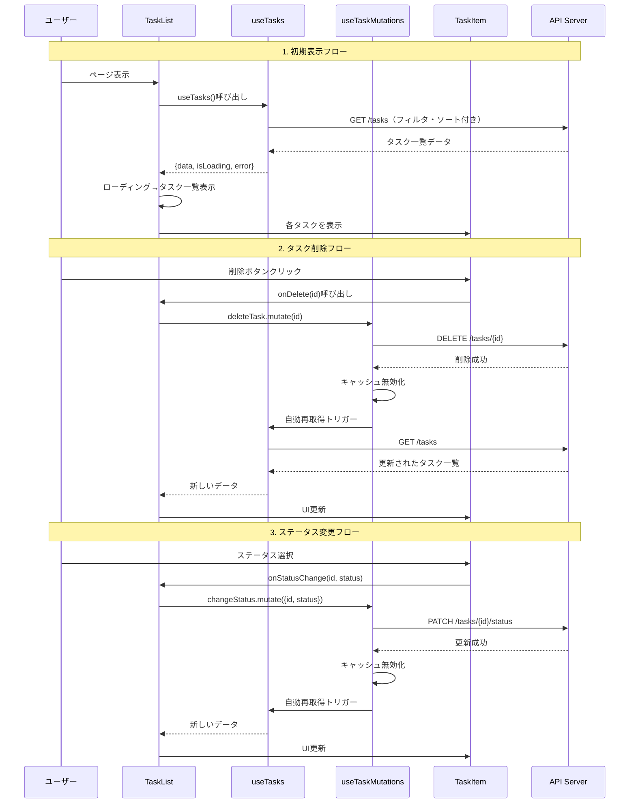
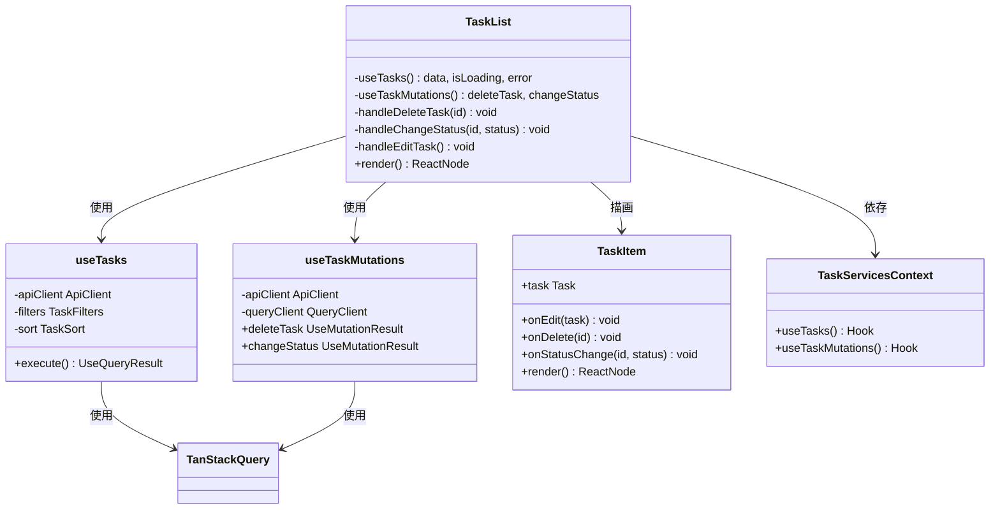

# TASK-1332: TaskListコンポーネント - コード解説

## この機能が何を解決するのか

この機能は「複数のタスクを一覧表示し、各タスクに対する操作（削除・ステータス変更）を提供する」ことを解決します。

具体的には：
- サーバーから取得したタスクデータを画面に表示する
- ローディング中やエラー時、タスクが0件の場合の状態を適切に表示する
- 各タスクの削除ボタンやステータス変更操作を実行できるようにする
- TanStack Queryでサーバー状態を管理し、キャッシュ戦略で不要なAPI呼び出しを削減する

これを「**コンテナコンポーネント**」と呼び、以下のことができます：
- データ取得とミューテーション（作成・更新・削除）を管理する
- 子コンポーネント（TaskItem）にデータと操作を渡す
- UI状態（ローディング、エラー、空状態）を管理する

## 全体の処理の流れ

### 処理フローとファイル関係



## ファイルの役割と責任

### 今回解説するメインのファイル

**`app/client/src/features/todo/components/TaskList.tsx`** - タスク一覧表示のコンテナコンポーネント

このファイルには4つの主要な機能があります：

#### 1. カスタムフックの取得（Context-based DI）

```typescript
// app/client/src/features/todo/components/TaskList.tsx
const { useTasks, useTaskMutations } = useTaskServices();
```

**役割**: テスト時にモックを注入できるようにする依存性注入パターン

**何をしているか**:
- `TaskServicesContext`というContextから、必要なカスタムフックを取得
- 通常の実装では実際の`useTasks`と`useTaskMutations`が返される
- テスト時はモック版のフックを注入できる

**専門用語解説**: **依存性注入（Dependency Injection）** = 「コンポーネントが必要とする機能を、外部から受け取る仕組み」のこと。
例えば、レストランで考えると、料理人が「魚を自分で釣りに行く」のではなく、「市場から届けられた魚を使う」ようなイメージです。

**よくある勘違い**:
- ❌ 「Contextを使うと複雑になる」→ 確かに最初は難しいですが、テスト時にモックを差し替えられるメリットが大きい
- ✅ 正しい理解: 「Contextは、アプリ全体で共有したい機能を配るための仕組み。テストでモックを使いやすくする」

#### 2. データ取得とミューテーションの実行

```typescript
// app/client/src/features/todo/components/TaskList.tsx
const { data: tasks, isLoading, error } = useTasks();
const { deleteTask, changeStatus } = useTaskMutations();
```

**役割**: サーバーからタスク一覧を取得し、削除・ステータス変更操作を提供

**何をしているか**:
- `useTasks()`: Redux状態（フィルタ・ソート）に基づいてタスク一覧を取得
  - `data`: タスク配列（`Task[] | undefined`）
  - `isLoading`: ローディング状態（`boolean`）
  - `error`: エラー情報（`Error | null`）
- `useTaskMutations()`: タスク操作（削除・ステータス変更）のミューテーションを取得
  - `deleteTask`: タスク削除ミューテーション
  - `changeStatus`: ステータス変更ミューテーション

**重要なポイント**: TanStack Queryの「キャッシュ戦略」

TanStack Queryは、API呼び出し結果を30秒間キャッシュします。つまり：
1. 初回アクセス時: `GET /tasks`を実行してデータ取得
2. 30秒以内の再アクセス: キャッシュから即座にデータ表示（API呼び出しなし）
3. ミューテーション成功時: キャッシュを無効化し、自動的に再取得

これにより、無駄なAPI呼び出しを減らし、ユーザー体験を向上させます。

#### 3. イベントハンドラのメモ化

```typescript
// app/client/src/features/todo/components/TaskList.tsx
const handleDeleteTask = useCallback(
  (id: string) => {
    deleteTask.mutate(id);
  },
  [deleteTask.mutate],
);

const handleChangeStatus = useCallback(
  (id: string, status: TaskStatus) => {
    changeStatus.mutate({ id, status });
  },
  [changeStatus.mutate],
);

const handleEditTask = useCallback(() => {
  /* 将来TaskEditModalを表示 */
}, []);
```

**役割**: TaskItemコンポーネントの不要な再レンダリングを防ぐ

**何をしているか**:
- `useCallback`を使って、関数を「メモ化」（= 同じ参照を保つ）
- 依存配列（`[deleteTask.mutate]`など）が変わらない限り、同じ関数オブジェクトを返す
- TaskItemは`React.memo`で最適化されているため、Propsが変わらなければ再レンダリングされない

**専門用語解説**: **メモ化（Memoization）** = 「計算結果を覚えておいて、次回同じ計算が必要なとき、保存した結果を使う」こと。
例えば、カフェで常連客の注文を覚えていて、「いつもの」と言われたらすぐ作れる状態です。

**よくある勘違い**:
- ❌ 「すべての関数に`useCallback`を使えば速くなる」→ 違います。不要な場面では逆にメモリを消費します。
- ✅ 正しい理解: 「子コンポーネントが`React.memo`で最適化されているときに、親の再レンダリングで子が無駄に再レンダリングされるのを防ぐ」

#### 4. Early Returnパターンによる状態分岐

```typescript
// app/client/src/features/todo/components/TaskList.tsx
if (isLoading) {
  return <div className="text-center py-8">読み込み中...</div>;
}

if (error) {
  return <div className="text-center py-8 text-red-600">エラーが発生しました</div>;
}

if (!tasks || tasks.length === 0) {
  return <div className="text-center py-8 text-gray-500">タスクがありません</div>;
}

return (
  <div className="space-y-0">
    {tasks.map((task) => (
      <TaskItem key={task.id} task={task} ... />
    ))}
  </div>
);
```

**役割**: 状態ごとに適切なUIを表示する

**何をしているか**:
1. **ローディング状態**: `isLoading`が`true`なら「読み込み中...」を表示して終了
2. **エラー状態**: `error`が存在するなら「エラーが発生しました」を赤文字で表示して終了
3. **空状態**: `tasks`が`undefined`または空配列なら「タスクがありません」を表示して終了
4. **正常状態**: 上記すべてに該当しない場合、タスク一覧を表示

**専門用語解説**: **Early Return（早期リターン）** = 「条件を満たしたらその場で処理を終了する」パターン。
複雑な`if-else`の入れ子を避け、コードの可読性を向上させます。

**この設計のいい点**:
- ✅ **見通しが良い**: 各状態が独立して記述されているため、どの状態でどんなUIが表示されるか一目で分かる
- ✅ **バグを防ぐ**: `tasks`が`undefined`のときに`tasks.map()`を実行しようとするエラーを防ぐ
- ✅ **拡張しやすい**: 新しい状態（例: 「再試行ボタン付きエラー表示」）を追加するときも、該当箇所だけ修正すればOK

### 呼び出されているファイル: useTasks

**`app/client/src/features/todo/hooks/useTasks.ts`** - タスク一覧取得フック

このファイルの主要な役割は、Redux状態（フィルタ・ソート）に基づいてタスク一覧をAPIから取得することです。

```typescript
// app/client/src/features/todo/hooks/useTasks.ts
export function useTasks() {
  const apiClient = useApiClient();
  const filters = useAppSelector((state) => state.task.filters);
  const sort = useAppSelector((state) => state.task.sort);

  return useQuery({
    queryKey: ['tasks', filters, sort],
    queryFn: async () => {
      // クエリパラメータを構築してAPI呼び出し
      const { data, error } = await apiClient.GET('/tasks', {
        params: { query: { priority, status, sort } },
      });

      if (error) {
        throw new Error(error.error?.message || 'タスク一覧の取得に失敗しました');
      }

      return data.data;
    },
  });
}
```

**重要なポイント**: `queryKey`の役割

```typescript
queryKey: ['tasks', filters, sort],
```

この`queryKey`は、キャッシュの「識別子」として機能します。つまり：
- フィルタやソートが変わると`queryKey`も変わる
- `queryKey`が変わると、TanStack Queryは「新しいデータが必要」と判断してAPI呼び出しを実行
- 同じ`queryKey`なら、キャッシュからデータを返す

**よくある勘違い**:
- ❌ 「`queryKey`は単なる名前」→ 違います。`queryKey`はキャッシュの管理に使われる重要な識別子です。
- ✅ 正しい理解: 「`queryKey`が変わると、新しいデータとして扱われ、API呼び出しが実行される」

### 呼び出されているファイル: useTaskMutations

**`app/client/src/features/todo/hooks/useTaskMutations.ts`** - タスク操作ミューテーションフック

このファイルは、タスクの作成・更新・削除・ステータス変更の操作を提供します。

```typescript
// app/client/src/features/todo/hooks/useTaskMutations.ts
export function useTaskMutations() {
  const apiClient = useApiClient();
  const queryClient = useQueryClient();

  const deleteTask = useMutation({
    mutationFn: async (id: string) => {
      const { error } = await apiClient.DELETE('/tasks/{id}', {
        params: { path: { id } },
      });

      if (error) {
        throw new Error(error.error?.message || 'タスク削除に失敗しました');
      }
    },
    onSuccess: () => {
      // キャッシュ無効化（全フィルタ・ソート組み合わせが対象）
      queryClient.invalidateQueries({
        queryKey: ['tasks'],
        exact: false,
      });
    },
  });

  const changeStatus = useMutation({
    mutationFn: async ({ id, status }: { id: string, status: TaskStatus }) => {
      const { data, error } = await apiClient.PATCH('/tasks/{id}/status', {
        params: { path: { id } },
        body: { status },
      });

      if (error) {
        throw new Error(error.error?.message || 'ステータス更新に失敗しました');
      }

      return data.data;
    },
    onSuccess: () => {
      queryClient.invalidateQueries({
        queryKey: ['tasks'],
        exact: false,
      });
    },
  });

  return { deleteTask, changeStatus };
}
```

**重要なポイント**: `invalidateQueries`の仕組み

```typescript
queryClient.invalidateQueries({
  queryKey: ['tasks'],
  exact: false,
});
```

このコードは、「`['tasks']`で始まるすべてのキャッシュを無効化する」という意味です。つまり：
- `['tasks', {priority: 'high'}, {sortBy: 'created_at'}]` → 無効化される
- `['tasks', {priority: 'low'}, {sortBy: 'priority'}]` → 無効化される
- `exact: false`なので、「部分一致」で無効化される

無効化されたキャッシュは、次回アクセス時に自動的に再取得されます。

**よくある勘違い**:
- ❌ 「キャッシュを無効化すると、すぐにAPI呼び出しが実行される」→ 違います。無効化後、該当する`useQuery`が存在するときに再取得されます。
- ✅ 正しい理解: 「無効化はキャッシュに『古いデータ』のマークをつけるだけ。実際の再取得は、そのキャッシュを使うコンポーネントがマウントされているときに実行される」

### 呼び出されているコンポーネント: TaskItem

**`app/client/src/features/todo/components/TaskItem.tsx`** - 個別タスク表示コンポーネント（TASK-1331で実装済み）

このコンポーネントは、1つのタスクの情報を表示し、編集・削除・ステータス変更のボタンを提供します。

TaskListコンポーネントから以下のPropsを受け取ります：
- `task`: タスク情報（タイトル、説明、優先度、ステータスなど）
- `onEdit`: 編集ボタンクリック時のコールバック
- `onDelete`: 削除ボタンクリック時のコールバック
- `onStatusChange`: ステータス変更時のコールバック

TaskItemの詳細は `TASK-1331-code-explan.md` を参照してください。

## クラスと関数の呼び出し関係

### コンポーネントと依存関係



## 重要な処理の詳細解説

### 1. Context-based DIによるフック取得

```typescript
// app/client/src/features/todo/components/TaskList.tsx
const { useTasks, useTaskMutations } = useTaskServices();
```

この処理が必要である理由は、**テスト時にモックを注入できるようにするため**です。

従来の直接インポート方式：
```typescript
// ❌ テストしにくい実装
import { useTasks } from '../hooks/useTasks';
import { useTaskMutations } from '../hooks/useTaskMutations';

function TaskList() {
  const { data: tasks, isLoading, error } = useTasks();
  // ...
}
```

この方式の問題点：
- テスト時に`useTasks`の振る舞いを変更できない
- APIサーバーを立ち上げないとテストできない
- ローディング状態やエラー状態をテストするのが困難

Context-based DI方式（今回の実装）：
```typescript
// ✅ テストしやすい実装
const { useTasks, useTaskMutations } = useTaskServices();
```

この方式のメリット：
- テスト時に`TaskServicesProvider`でモック版のフックを注入できる
- APIサーバーなしでテストできる
- ローディング状態、エラー状態、正常状態を簡単にテストできる

テストコード例：
```typescript
// テストファイルでモックを注入
const mockUseTasks = () => ({
  data: [{ id: '1', title: 'テストタスク', ... }],
  isLoading: false,
  error: null,
});

const mockUseTaskMutations = () => ({
  deleteTask: { mutate: vi.fn() },
  changeStatus: { mutate: vi.fn() },
});

render(
  <TaskServicesProvider value={{ useTasks: mockUseTasks, useTaskMutations: mockUseTaskMutations }}>
    <TaskList />
  </TaskServicesProvider>
);
```

### 2. `useCallback`によるイベントハンドラのメモ化

```typescript
// app/client/src/features/todo/components/TaskList.tsx
const handleDeleteTask = useCallback(
  (id: string) => {
    deleteTask.mutate(id);
  },
  [deleteTask.mutate],
);
```

この処理が必要である理由は、**TaskItemの不要な再レンダリングを防ぐため**です。

TaskItemは`React.memo`で最適化されています：
```typescript
// app/client/src/features/todo/components/TaskItem.tsx
export default React.memo(TaskItem);
```

`React.memo`は、Propsが変わらない限り再レンダリングをスキップします。しかし、関数をメモ化しないと：
1. TaskListが再レンダリング
2. `handleDeleteTask`が新しい関数として作成される（= 参照が変わる）
3. TaskItemのPropsが変わったと判断される
4. TaskItemが不要に再レンダリングされる

`useCallback`でメモ化すると：
1. TaskListが再レンダリング
2. `deleteTask.mutate`が変わっていなければ、`handleDeleteTask`は同じ関数オブジェクトを返す
3. TaskItemのPropsは変わらない
4. TaskItemは再レンダリングされない

**重要な注意点**: `useMemo`と`useCallback`の違い

- `useMemo(() => 計算結果, [deps])`: 「計算結果をメモ化」
- `useCallback((引数) => 処理, [deps])`: 「関数自体をメモ化」

実は`useCallback`は`useMemo`のショートカットです：
```typescript
useCallback(fn, deps) === useMemo(() => fn, deps)
```

### 3. Early Returnパターンによる状態分岐

```typescript
// app/client/src/features/todo/components/TaskList.tsx
if (isLoading) {
  return <div className="text-center py-8">読み込み中...</div>;
}

if (error) {
  return <div className="text-center py-8 text-red-600">エラーが発生しました</div>;
}

if (!tasks || tasks.length === 0) {
  return <div className="text-center py-8 text-gray-500">タスクがありません</div>;
}

return (
  <div className="space-y-0">
    {tasks.map((task) => (
      <TaskItem key={task.id} task={task} ... />
    ))}
  </div>
);
```

この処理が必要である理由は、**各状態で適切なUIを表示し、バグを防ぐため**です。

もし`if`文を使わずに三項演算子で書くと：
```typescript
// ❌ 読みにくい実装
return (
  <div>
    {isLoading ? (
      <div>読み込み中...</div>
    ) : error ? (
      <div>エラーが発生しました</div>
    ) : !tasks || tasks.length === 0 ? (
      <div>タスクがありません</div>
    ) : (
      <div>
        {tasks.map((task) => (
          <TaskItem key={task.id} task={task} />
        ))}
      </div>
    )}
  </div>
);
```

この方式の問題点：
- ❌ 入れ子が深く、どの条件でどのUIが表示されるか分かりにくい
- ❌ 新しい状態を追加するとき、どこに挿入すればいいか迷う
- ❌ インデントが深くなり、コードが横に長くなる

Early Returnパターンのメリット：
- ✅ 各状態が独立して記述されているため、見通しが良い
- ✅ 新しい状態を追加するとき、該当箇所だけ修正すればOK
- ✅ `tasks.map()`を実行する前に`tasks`の存在を確認するため、エラーが起きない

### 4. `aria-live`によるアクセシビリティ対応

```typescript
// app/client/src/features/todo/components/TaskList.tsx
if (isLoading) {
  return (
    <div className="text-center py-8" aria-live="polite">
      読み込み中...
    </div>
  );
}

if (error) {
  return (
    <div className="text-center py-8 text-red-600" aria-live="assertive">
      エラーが発生しました
    </div>
  );
}
```

この処理が必要である理由は、**スクリーンリーダーを使うユーザーに状態変化を伝えるため**です。

`aria-live`属性の役割：
- `aria-live="polite"`: 「落ち着いたタイミングで読み上げる」（ローディング、空状態など）
- `aria-live="assertive"`: 「すぐに読み上げる」（エラーなど重要な情報）

スクリーンリーダーを使うユーザーの体験：
1. ローディング中: 「読み込み中」と読み上げられる
2. データ取得完了: 「タスク一覧」が読み上げられる
3. エラー発生: 「エラーが発生しました」がすぐに読み上げられる

アクセシビリティ対応は、視覚障害のあるユーザーだけでなく、すべてのユーザーにとってメリットがあります：
- スクリーンリーダーユーザーが情報を得られる
- キーボード操作のみで使えるUIになる
- 音声入力で操作できる

## 初学者がつまずきやすいポイント

### ポイント1: `useCallback`の依存配列

```typescript
const handleDeleteTask = useCallback(
  (id: string) => {
    deleteTask.mutate(id);
  },
  [deleteTask.mutate],
);
```

**よくある勘違い**: 「依存配列に`deleteTask`を書くべきでは？」

**正解**: `deleteTask.mutate`を書くのが正しいです。

理由：
- `deleteTask`は、`useMutation`の返り値全体（`{mutate, isLoading, error, ...}`というオブジェクト）
- `deleteTask`全体を依存配列に入れると、`isLoading`や`error`が変わるたびに`handleDeleteTask`も再作成される
- 実際に使うのは`deleteTask.mutate`だけなので、これだけを依存配列に入れる

### ポイント2: `tasks.map()`で`key`を指定する理由

```typescript
{tasks.map((task) => (
  <TaskItem key={task.id} task={task} ... />
))}
```

**よくある勘違い**: 「`key`はなくても動くから、なくてもいいのでは？」

**正解**: `key`は必須です。Reactが効率的にUIを更新するために必要です。

理由：
- Reactは、リスト内の要素が変わったとき、`key`を使って「どの要素が追加・削除・移動されたか」を判断する
- `key`がないと、Reactは全要素を再レンダリングしてしまう
- `key`に配列のインデックス（`map((task, index) => ... key={index}`）を使うと、要素の順序が変わったときにバグが起きる

**良い`key`の選び方**:
- ✅ `task.id`のような、一意で変わらない値
- ❌ 配列のインデックス（`index`）
- ❌ ランダム値（`Math.random()`など）

### ポイント3: `undefined`と`null`の違い

```typescript
if (!tasks || tasks.length === 0) {
  return <div>タスクがありません</div>;
}
```

**よくある勘違い**: 「`!tasks`だけでいいのでは？」

**正解**: `!tasks || tasks.length === 0`と書くのが正しいです。

理由：
- `useTasks()`の返り値`data`は、初回レンダリング時に`undefined`
- API呼び出し成功後、`data`は`Task[]`（配列）になる
- 配列が空の場合（`[]`）は、`!tasks`では`false`になってしまう（空配列は真値）

状態の遷移：
1. 初回レンダリング: `tasks === undefined` → `!tasks`が`true` → 空状態表示
2. API呼び出し成功（タスク0件）: `tasks === []` → `!tasks`が`false`、`tasks.length === 0`が`true` → 空状態表示
3. API呼び出し成功（タスクあり）: `tasks === [...]` → `!tasks`が`false`、`tasks.length > 0` → タスク一覧表示

### ポイント4: TanStack Queryの「自動再取得」のタイミング

**よくある勘違い**: 「ミューテーション成功時、`useTasks()`が自動的に再実行される」

**正解**: 正確には「キャッシュが無効化され、該当する`useQuery`が存在するときに再取得される」

詳細：
1. `deleteTask.mutate(id)`を実行
2. API呼び出し成功
3. `onSuccess`で`queryClient.invalidateQueries({ queryKey: ['tasks'] })`を実行
4. `['tasks']`で始まるキャッシュに「古いデータ」のマークをつける
5. `useTasks()`が実行されているコンポーネント（TaskList）がマウントされている場合、自動的に再取得
6. 新しいデータで`data`が更新される
7. TaskListが再レンダリングされ、UIが更新される

**注意**: TaskListがアンマウントされている場合、再取得は実行されません。次回TaskListがマウントされたときに再取得されます。

## この設計のいい点

### 1. 関心の分離が明確

TaskListコンポーネントは、以下の責務のみを持ちます：
- データ取得とミューテーション実行の管理
- UI状態（ローディング、エラー、空状態）の管理
- TaskItemへのデータと操作の委譲

個別タスクの表示はTaskItemに任せ、データ取得はカスタムフックに任せることで、コンポーネントの責務が明確になっています。

**SOLID原則のSRP（単一責任の原則）** に従った設計です。

### 2. テスタビリティの高さ

Context-based DIパターンにより、テスト時にモックを簡単に注入できます：

```typescript
// テストで簡単にモックを注入できる
const mockUseTasks = () => ({
  data: [{ id: '1', title: 'テストタスク', ... }],
  isLoading: false,
  error: null,
});

render(
  <TaskServicesProvider value={{ useTasks: mockUseTasks, ... }}>
    <TaskList />
  </TaskServicesProvider>
);
```

これにより、以下のテストが簡単に書けます：
- ローディング状態のテスト
- エラー状態のテスト
- 空状態のテスト
- タスク一覧表示のテスト
- 削除・ステータス変更のテスト

### 3. パフォーマンス最適化

`useCallback`によるメモ化と、TaskItemの`React.memo`により、不要な再レンダリングを防いでいます。

例えば、100件のタスクが表示されている場合：
- ❌ メモ化なし: TaskListが再レンダリングされると、100個のTaskItemすべてが再レンダリング
- ✅ メモ化あり: Propsが変わったTaskItemのみ再レンダリング

これにより、ユーザー体験が向上します。

### 4. 拡張性の高さ

将来的な機能追加（削除確認ダイアログ、編集モーダルなど）を見据えた設計になっています：

```typescript
// 将来実装予定の削除確認ダイアログ
const handleDelete = (id: string) => {
  setDeletingTaskId(id);
  if (window.confirm('本当に削除しますか？')) {
    deleteTask.mutate(id);
  }
  setDeletingTaskId(null);
};

// 将来実装予定の編集モーダル
const handleEdit = (task: Task) => {
  setEditingTask(task);
  // TaskEditModalを表示
};
```

現時点では空のコールバックですが、将来の実装を考慮した設計になっています。
