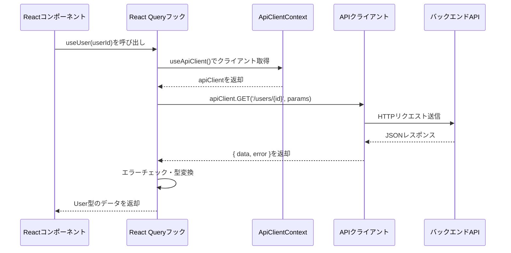
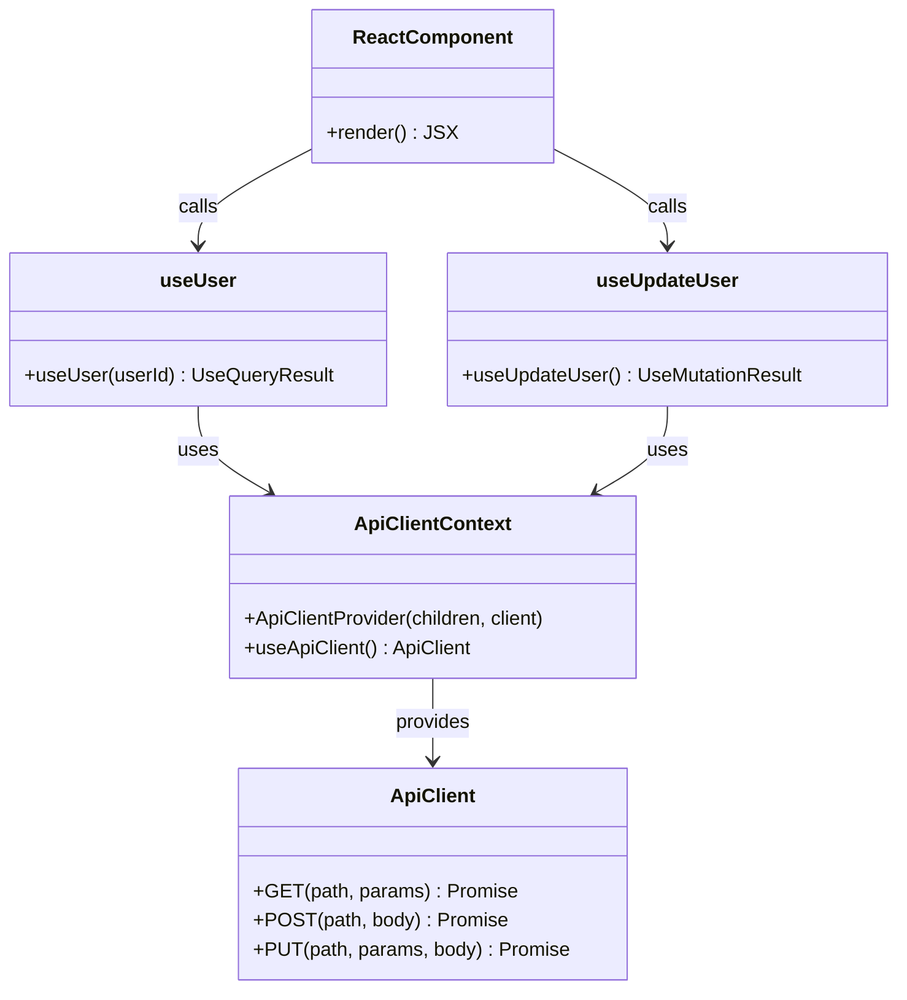

# TASK-1002 型安全なAPIクライアント実装 コード解説

**作成日**: 2025-10-26
**対象タスク**: TASK-1002
**要件**: 型安全性強化・API契約強化（型安全なAPIクライアント実装）

---

## この機能が何を解決するのか

この機能は **「フロントエンドとバックエンド間の型の不一致によるランタイムエラー」** を解決します。

具体的には:
- OpenAPI仕様から自動生成されたTypeScript型を使用して、**コンパイル時に型エラーを検出**できる
- APIリクエスト・レスポンスの型が**完全に一致**し、誤ったパラメータやレスポンス処理を防げる
- React Queryと統合することで、**キャッシュ管理やエラーハンドリングが型安全**になる

これを **「型安全なAPIクライアント」** と呼び、開発時の型チェックでバグを未然に防ぎ、開発効率を大幅に向上させることができます。

---

## 全体の処理の流れ

### フロントエンドでのAPI呼び出しフロー



---

## ファイルの役割と責任

このセクションでは、TASK-1002で実装されたファイルとその関連ファイルの役割を説明します。

### 今回実装したメインのファイル

#### 1. app/client/src/lib/api.ts

**役割**: 型安全なAPIクライアントの作成とエクスポート

このファイルは、openapi-fetchライブラリを使用してAPIクライアントを作成します。「openapi-fetch」とは、OpenAPI仕様から自動生成された型定義を使って、型安全にHTTPリクエストを送信できるライブラリのことです。

主な機能:
- `createApiClient`関数: APIクライアントを作成する汎用関数
  - `baseUrl`: APIサーバーのアドレス（例: `http://localhost:3001/api`）
  - `headers`: 認証トークンなどのHTTPヘッダー
  - `options`: テスト時にモックの`fetch`関数を注入するためのオプション
- `apiClient`: デフォルトのAPIクライアント（本番環境で使用）

**コード解説**:

```typescript
// app/client/src/lib/api.ts
export function createApiClient(
  baseUrl: string,
  headers?: HeadersInit,
  options?: { fetch?: typeof fetch },
) {
  return createClient<paths>({ baseUrl, headers, ...options });
}
```

- `createClient<paths>`: openapi-fetchの関数で、`paths`型を指定することで型安全なクライアントを作成
- `paths`型: OpenAPI仕様から自動生成された型で、すべてのエンドポイントの型情報を含む
- `HeadersInit`: HTTPヘッダーを表すTypeScriptの標準型で、オブジェクト・配列・Headersオブジェクトに対応
- `options.fetch`: テスト時にモックの`fetch`を注入するためのオプション（依存性注入パターン）

---

#### 2. app/client/src/lib/apiClientContext.tsx

**役割**: APIクライアントをReactコンポーネント全体で共有するためのContext Provider

Reactの「Context」とは、コンポーネントツリー全体でデータを共有する仕組みのことです。これを使うことで、各コンポーネントで直接APIクライアントをインポートせず、**テスト時にモックのクライアントを簡単に注入**できます。

主な機能:
- `ApiClientProvider`: APIクライアントを提供するコンポーネント
- `useApiClient`: APIクライアントを取得するフック（Context経由）

**なぜContextを使うのか**:

通常、`api.ts`から直接`apiClient`をインポートすると、テスト時にモックに差し替えることが困難です。しかし、Contextパターンを使うことで:

1. **本番環境**: `ApiClientProvider`が自動的にデフォルトの`apiClient`を使用
2. **テスト環境**: `ApiClientProvider`に`client`プロパティでモッククライアントを渡す

このように、環境に応じてAPIクライアントを柔軟に切り替えられます。

**コード解説**:

```typescript
// app/client/src/lib/apiClientContext.tsx
export function ApiClientProvider({ children, client }: ApiClientProviderProps) {
  // clientが未指定の場合はデフォルトのapiClientを使用
  const defaultClient = useMemo(() => client || apiClient, [client]);

  return (
    <ApiClientContext.Provider value={defaultClient}>
      {children}
    </ApiClientContext.Provider>
  );
}

export function useApiClient(): ApiClient {
  const client = useContext(ApiClientContext);
  if (!client) {
    throw new Error('useApiClient must be used within ApiClientProvider.');
  }
  return client;
}
```

- `useMemo`: Reactのフックで、`client`が変更されない限り同じインスタンスを返す（パフォーマンス最適化）
- `useContext`: Reactのフックで、Contextから値を取得
- エラーチェック: `ApiClientProvider`の外で`useApiClient`を使うとエラーを投げる（誤った使い方を防ぐ）

---

#### 3. app/client/src/features/user/hooks/useUser.ts

**役割**: ユーザー情報を取得するReact Queryフック

「React Query」とは、サーバーからのデータ取得・キャッシュ・再取得を簡単に管理できるライブラリのことです。このフックを使うことで、ユーザー情報を**型安全に取得**し、自動的に**キャッシュ**されます。

主な機能:
- `useQuery`でAPIからユーザー情報を取得
- エラー時は`throw`してReact Queryの`error`状態にする
- 取得したデータは自動的にキャッシュされ、同じユーザーIDで再度呼び出すとキャッシュから返却

**コード解説**:

```typescript
// app/client/src/features/user/hooks/useUser.ts
export function useUser(userId: string) {
  const apiClient = useApiClient();

  return useQuery({
    queryKey: ['users', userId],
    queryFn: async () => {
      const { data, error } = await apiClient.GET('/users/{id}', {
        params: { path: { id: userId } },
      });

      // エラーレスポンスの場合はthrow（React Queryがerror状態にする）
      if (error) {
        throw new Error(error.error.message);
      }

      // dataが存在しない場合もthrow
      if (!data) {
        throw new Error('ユーザー情報を取得できませんでした');
      }

      // data.dataはUser型として推論される
      return data.data;
    },
  });
}
```

- `queryKey`: キャッシュのキーで、`['users', userId]`形式で保存（他のユーザーと混ざらない）
- `queryFn`: 実際にAPIを呼び出す関数
- `apiClient.GET('/users/{id}', ...)`: 型安全なGETリクエスト（パスやレスポンスの型が自動推論される）
- `error`チェック: APIがエラーレスポンスを返した場合は例外を投げる
- `!data`チェック: レスポンスが空の場合も例外を投げる

**よくある勘違い**: `return data`ではなく`return data.data`を返す理由

APIのレスポンス構造は次のようになっています:

```json
{
  "success": true,
  "data": {
    "id": "user-id",
    "name": "User Name",
    ...
  }
}
```

つまり、`data`（openapi-fetchの返却値）の中に`data`プロパティ（実際のユーザー情報）があるため、`data.data`と2回アクセスする必要があります。

---

#### 4. app/client/src/features/user/hooks/useUpdateUser.ts

**役割**: ユーザー情報を更新するReact Queryフック

「useMutation」とは、React Queryでデータを変更（作成・更新・削除）する際に使用するフックのことです。このフックを使うことで、更新処理とキャッシュの無効化を**自動的に連携**できます。

主な機能:
- `useMutation`でAPIにユーザー情報の更新リクエストを送信
- 更新成功時に`invalidateQueries`でキャッシュを無効化
- 無効化されたキャッシュは自動的に再取得される（`useUser`フックが再実行される）

**コード解説**:

```typescript
// app/client/src/features/user/hooks/useUpdateUser.ts
export function useUpdateUser() {
  const apiClient = useApiClient();
  const queryClient = useQueryClient();

  return useMutation({
    mutationFn: async ({ userId, data }: UpdateUserVariables) => {
      const { data: response, error } = await apiClient.PUT('/users/{id}', {
        params: { path: { id: userId } },
        body: data,
      });

      if (error) {
        throw new Error(error.error.message);
      }

      if (!response) {
        throw new Error('ユーザー情報を更新できませんでした');
      }

      return response.data;
    },
    onSuccess: (data) => {
      // 更新成功時はuseUserのキャッシュを無効化し、再取得をトリガー
      queryClient.invalidateQueries({ queryKey: ['users', data.id] });
    },
  });
}
```

- `mutationFn`: 更新処理を実行する関数
- `apiClient.PUT('/users/{id}', ...)`: 型安全なPUTリクエスト
- `onSuccess`: 更新成功時のコールバック関数
- `invalidateQueries`: 指定したキャッシュキーを無効化（次回取得時に再フェッチする）

**キャッシュ無効化の流れ**:

1. ユーザーが`useUpdateUser`の`mutate`関数を呼び出す
2. APIにPUTリクエストを送信し、ユーザー情報を更新
3. `onSuccess`が実行され、`['users', userId]`のキャッシュを無効化
4. `useUser`フックが無効化を検知し、自動的にAPIから最新データを再取得
5. 画面に最新のユーザー情報が表示される

---

### 呼び出されている関連ファイル

#### 1. app/client/src/types/api/generated.ts

**役割**: OpenAPI仕様から自動生成された型定義

このファイルは**手動で編集してはいけません**。OpenAPI仕様（`docs/api/openapi.yaml`）から`openapi-typescript`コマンドで自動生成されます。

主な内容:
- `paths`型: すべてのAPIエンドポイントの型情報
- `components`型: 共通スキーマの型情報

**自動生成される理由**:

バックエンドのAPI仕様が変更されるたびに、このファイルを自動生成することで:
- フロントエンドとバックエンドの型定義が**常に一致**する
- 手動で型を書く手間がなくなり、**開発効率が向上**する
- 型の不一致によるバグを**コンパイル時に検出**できる

---

## クラスと関数の呼び出し関係

### クラス構造と依存関係



**依存方向の解説**:

- `ReactComponent`（Reactコンポーネント）は`useUser`と`useUpdateUser`を呼び出す
- `useUser`と`useUpdateUser`は`useApiClient`を通じて`ApiClient`を取得
- `ApiClientContext`はテスト時にモッククライアントを注入可能にする
- すべての依存関係が**一方向**（上から下）になっており、循環依存がない

---

## 重要な処理の詳細解説

### 1. 型安全なAPIリクエストの仕組み

```typescript
// app/client/src/features/user/hooks/useUser.ts
const { data, error } = await apiClient.GET('/users/{id}', {
  params: { path: { id: userId } },
});
```

この1行のコードで、次のような型安全性が保証されています:

- **エンドポイントの存在チェック**: `/users/{id}`というパスが存在しない場合、コンパイルエラーになる
- **パラメータの型チェック**: `id`が`string`型でないとコンパイルエラーになる
- **レスポンスの型推論**: `data`は自動的に`{ success: boolean; data: User }`型として推論される

これは、`paths`型がOpenAPI仕様から自動生成されているため、**バックエンドのAPI仕様とフロントエンドの型が完全に一致**しているからです。

**よくある間違い**: パスを間違えると即座にエラーになる

```typescript
// ❌ 存在しないエンドポイント
const { data } = await apiClient.GET('/user/{id}', ...); // コンパイルエラー

// ❌ パラメータの型が間違っている
const { data } = await apiClient.GET('/users/{id}', {
  params: { path: { id: 123 } }, // number型はNG、string型が必要
});
```

---

### 2. エラーハンドリングの仕組み

```typescript
// app/client/src/features/user/hooks/useUser.ts
if (error) {
  throw new Error(error.error.message);
}

if (!data) {
  throw new Error('ユーザー情報を取得できませんでした');
}

return data.data;
```

このエラーハンドリングは次のような処理をしています:

1. **APIエラーレスポンスのチェック**: `error`が存在する場合、バックエンドが`{ success: false, error: { code, message } }`形式のエラーを返している
2. **例外を投げる**: `throw new Error()`することで、React Queryが`error`状態を認識し、コンポーネントで`isError`や`error.message`が使える
3. **空データのチェック**: APIが`204 No Content`を返した場合など、`data`が`undefined`になるケースに対応

**エラー時のフロー**:

```
APIエラー発生
  ↓
error.error.messageを取得
  ↓
throw new Error()で例外を投げる
  ↓
React Queryがerror状態にする
  ↓
コンポーネントでisErrorやerror.messageを表示
```

---

### 3. Context Providerによる依存性注入

```typescript
// app/client/src/lib/apiClientContext.tsx
export function ApiClientProvider({ children, client }: ApiClientProviderProps) {
  const defaultClient = useMemo(() => client || apiClient, [client]);

  return (
    <ApiClientContext.Provider value={defaultClient}>
      {children}
    </ApiClientContext.Provider>
  );
}
```

この実装により、次のような柔軟な使い分けが可能になります:

**本番環境での使用例**:

```tsx
// app/client/src/app/layout.tsx
<ApiClientProvider>
  <App />
</ApiClientProvider>
```

この場合、`client`プロパティが省略されているため、自動的にデフォルトの`apiClient`が使用されます。

**テスト環境での使用例**:

```tsx
// app/client/src/features/user/hooks/useUser.test.tsx
const mockFetch = mock(() => Promise.resolve(...));
const mockClient = createApiClient('http://test', undefined, { fetch: mockFetch });

<ApiClientProvider client={mockClient}>
  <TestComponent />
</ApiClientProvider>
```

この場合、`client`プロパティでモッククライアントを渡しているため、テスト用の`mockFetch`が使用されます。

**この仕組みが必要な理由**:

もし`api.ts`から直接`apiClient`をインポートすると、テスト時に次のような問題が発生します:

```typescript
// ❌ 悪い例
import { apiClient } from '@/lib/api';

export function useUser(userId: string) {
  // テスト時にapiClientをモックに差し替えることが困難
  const { data } = await apiClient.GET('/users/{id}', ...);
}
```

しかし、Context Providerを使うことで:

```typescript
// ✅ 良い例
export function useUser(userId: string) {
  const apiClient = useApiClient(); // Contextから取得
  // テスト時はApiClientProviderにモッククライアントを渡すだけ
  const { data } = await apiClient.GET('/users/{id}', ...);
}
```

このように、テストコードを変更せずに本番環境とテスト環境を切り替えられます。

---

## 初学者がつまずきやすいポイント

### 1. 「型安全」とは何か?

「型安全」とは、**コンパイル時に型の不一致を検出できる**ことを指します。

**型安全でない例**:

```typescript
// any型を使うと、どんな値でも代入できてしまう
const user: any = { name: 'Alice' };
console.log(user.age); // undefinedだが、コンパイルエラーにならない
```

**型安全な例**:

```typescript
// User型を使うと、存在しないプロパティにアクセスできない
const user: User = { id: '1', name: 'Alice', ... };
console.log(user.age); // コンパイルエラー: Userにageプロパティは存在しない
```

TASK-1002で実装した型安全なAPIクライアントは、**APIのエンドポイント・パラメータ・レスポンスがすべて型チェックされる**ため、間違ったAPIコールをコンパイル時に防げます。

---

### 2. 「依存性注入（DI）」とは何か?

「依存性注入（Dependency Injection）」とは、**コンポーネントが使用するオブジェクトを外部から渡す**設計パターンのことです。

**DIを使わない例**:

```typescript
// ❌ 内部でapiClientを直接インポート
import { apiClient } from '@/lib/api';

function useUser(userId: string) {
  // テスト時にapiClientを差し替えることが困難
  const { data } = await apiClient.GET('/users/{id}', ...);
}
```

**DIを使う例**:

```typescript
// ✅ 外部からapiClientを受け取る
function useUser(userId: string) {
  const apiClient = useApiClient(); // Contextから取得
  const { data } = await apiClient.GET('/users/{id}', ...);
}
```

この設計により、テスト時に`ApiClientProvider`にモッククライアントを渡すだけで、すべてのフックが自動的にモックを使用するようになります。

---

### 3. React Queryの「キャッシュ」とは何か?

React Queryは、一度取得したデータを**メモリ上に保存（キャッシュ）**し、次回同じデータを取得する際に**APIを呼び出さずにキャッシュから返す**ことができます。

**キャッシュの動作例**:

```typescript
// 1回目: APIを呼び出してデータを取得し、キャッシュに保存
const { data: user1 } = useUser('user-id');

// 2回目: キャッシュから即座に返却（APIを呼び出さない）
const { data: user2 } = useUser('user-id');
```

**キャッシュ無効化の動作例**:

```typescript
// ユーザー情報を更新
const { mutate } = useUpdateUser();
mutate({ userId: 'user-id', data: { name: 'New Name' } });

// onSuccessでinvalidateQueriesを実行
// → ['users', 'user-id']のキャッシュが無効化される

// 次回useUserを呼び出すと、キャッシュが無効化されているため再度APIを呼び出す
const { data: user } = useUser('user-id'); // 最新データが取得される
```

この仕組みにより、データを更新した後に**画面を自動的に最新状態に更新**できます。

---

### 4. なぜ`data.data`と2回アクセスするのか?

これは、APIのレスポンス構造が次のようになっているためです:

```json
{
  "success": true,
  "data": {
    "id": "user-id",
    "name": "User Name",
    ...
  }
}
```

- 1つ目の`data`: openapi-fetchの返却値（`{ data, error }`タプル）
- 2つ目の`data`: APIレスポンスの`data`プロパティ（実際のユーザー情報）

つまり:

```typescript
const { data, error } = await apiClient.GET('/users/{id}', ...);
//     ^^^^
//     openapi-fetchの返却値

return data.data;
//          ^^^^
//          APIレスポンスのdataプロパティ
```

この構造により、**成功レスポンスとエラーレスポンスを統一的に扱える**ようになっています。

---

## この設計のいい点

### 1. 型安全性による開発効率の向上

OpenAPI仕様から自動生成された型定義を使用することで:
- **コンパイル時に型エラーを検出**できるため、ランタイムエラーが大幅に減少
- エンドポイントやパラメータの変更を**IDEが自動補完**してくれる
- リファクタリング時に**影響範囲を正確に把握**できる

### 2. テスタビリティの向上

Context Providerパターンを採用することで:
- テスト時に**モッククライアントを簡単に注入**できる
- 各テストが**独立したAPIクライアント**を使用できる
- グローバルなモックによる**テスト間の干渉を回避**できる

### 3. キャッシュ管理の自動化

React Queryを使用することで:
- データ取得・更新時の**キャッシュ管理が自動化**される
- 更新後の**画面更新が自動的に行われる**
- **重複したAPIリクエストを防ぐ**ことができる

### 4. スキーマ駆動開発の実現

Drizzle ORM → Drizzle Zod → OpenAPI → TypeScriptという**一貫した型定義フロー**により:
- **Single Source of Truth**（データベーススキーマ）から全型定義が自動生成される
- バックエンドとフロントエンドの型定義が**常に一致**する
- 手動での型定義の重複を排除し、**保守性が向上**する
