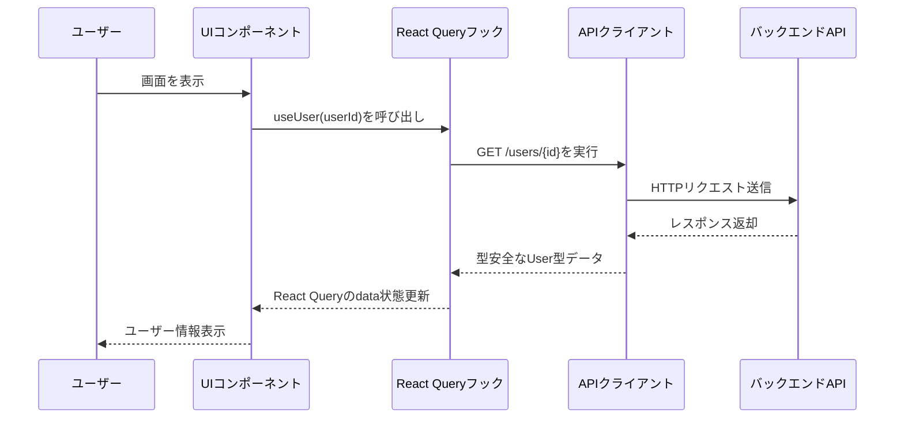
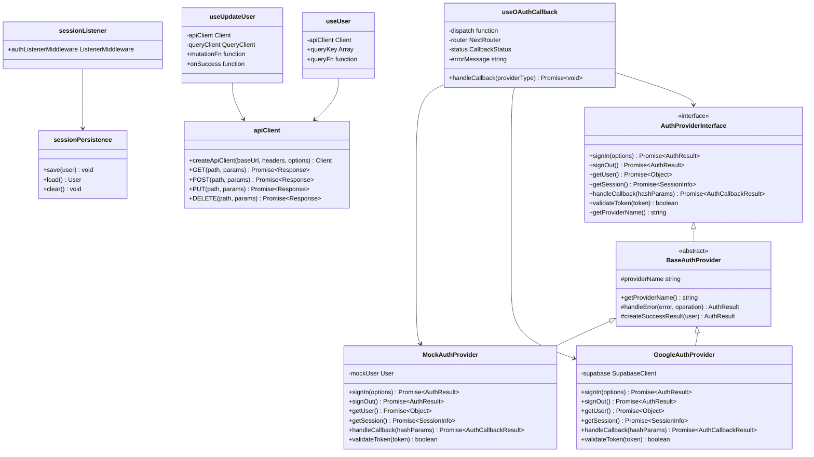

# TASK-1003 コード解説: 型安全なAPI呼び出しへの段階的移行

**作成日**: 2025-10-29
**対象ブランチ**: HOXBL-44-api-step-by-step
**対象読者**: 新しく組織に加入したばかりの初学者エンジニア

---

## この機能が何を解決するのか

この機能は「**フロントエンドのAPI呼び出しを、型安全な方法に移行する**」ことを解決します。

具体的には：
- 従来のfetchベースのAPI呼び出しを、OpenAPI仕様から自動生成された型定義を使う方法に置き換えます
- これにより、TypeScriptコンパイラがAPI呼び出しの型エラーを事前に検出できるようになります
- 認証機能も統合され、複数の認証プロバイダー（Google、Apple等）を統一的に扱えるようになります

これを「**型安全なAPI通信**」と呼び、バックエンドとフロントエンドの契約を明確化し、開発時の安全性を大幅に向上させることができます。

---

## 全体の処理の流れ

### 処理フローとファイル関係



### 主要なファイルの役割分担

1. **型定義層** (`app/client/src/types/api/generated.ts`)
   - OpenAPI仕様から自動生成された型定義を提供
   - バックエンドとフロントエンドの契約を型レベルで保証

2. **APIクライアント層** (`app/client/src/lib/api.ts`)
   - openapi-fetchを使った型安全なAPIクライアント
   - 環境変数から設定を読み込み、認証トークンを統合

3. **React Queryフック層** (`app/client/src/features/user/hooks/`)
   - useUser: ユーザー情報取得
   - useUpdateUser: ユーザー情報更新
   - キャッシュ管理とエラーハンドリングを抽象化

4. **認証層** (`app/client/src/features/auth/`)
   - AuthProviderInterface: 認証プロバイダーの統一インターフェース
   - GoogleAuthProvider: Google OAuth実装
   - MockAuthProvider: テスト用モック実装
   - sessionListener: Redux副作用の分離

---

## ファイルの役割と責任

### 今回解説するメインのファイル

#### 1. `app/client/src/lib/api.ts` - 型安全なAPIクライアント

このファイルは、OpenAPI仕様から自動生成された型定義を使って、バックエンドAPIと型安全に通信するクライアントを提供します。

**主要な関数**:

- `createApiClient(baseUrl, headers, options)`: APIクライアントインスタンスを作成
  - `baseUrl`: APIのベースURL（環境変数から取得）
  - `headers`: カスタムヘッダー（認証トークン等）
  - `options`: その他のopenapi-fetchオプション

**使用例**:
```typescript
const apiClient = createApiClient(getApiBaseUrl());
const { data, error } = await apiClient.GET('/users/{id}', {
  params: { path: { id: 'user-id' } },
});
```

**ポイント**:
- `createClient<paths>`の`paths`型は、OpenAPI仕様から自動生成された型定義です
- これにより、存在しないエンドポイントやパラメータの不備をTypeScriptが検出します

#### 2. `app/client/src/features/user/hooks/useUser.ts` - ユーザー情報取得フック

このファイルは、React Queryを使用して型安全にユーザー情報を取得するカスタムフックです。

**主要な関数**:

- `useUser(userId)`: ユーザー情報を取得するReact Queryフック
  - `userId`: 取得対象のユーザーID（UUID v4形式）
  - 戻り値: `{ data, isLoading, error, isSuccess }`

**処理の流れ**:
```typescript
// 1. APIクライアントをコンテキストから取得
const apiClient = useApiClient();

// 2. React QueryのuseQueryでキャッシュ管理
return useQuery({
  queryKey: ['users', userId],
  queryFn: async () => {
    // 3. 型安全なAPIクライアントでGETリクエスト
    const { data, error } = await apiClient.GET('/users/{id}', {
      params: { path: { id: userId } },
    });

    // 4. エラーハンドリング
    if (error) {
      throw new Error(error.error.message);
    }

    // 5. 型安全なUser型として返却
    return data.data;
  },
});
```

**ポイント**:
- `apiClient.GET()`の戻り値は、OpenAPI型定義により`data.data`が`User`型として推論されます
- React Queryが自動的にキャッシュ管理とリトライ処理を行います

#### 3. `app/client/src/features/user/hooks/useUpdateUser.ts` - ユーザー情報更新フック

このファイルは、React QueryのuseMutationを使用して型安全にユーザー情報を更新するカスタムフックです。

**主要な型定義**:

- `UpdateUserBody`: OpenAPIスキーマから自動推論されたリクエストボディの型
  ```typescript
  type UpdateUserBody =
    paths['/users/{id}']['put']['requestBody']['content']['application/json'];
  ```

**主要な関数**:

- `useUpdateUser()`: ユーザー情報を更新するReact Queryフック
  - 戻り値: `{ mutate, data, isLoading, error, isSuccess }`

**処理の流れ**:
```typescript
// 1. useMutationで更新処理を定義
return useMutation({
  mutationFn: async ({ userId, data }: UpdateUserVariables) => {
    // 2. 型安全なAPIクライアントでPUTリクエスト
    const { data: response, error } = await apiClient.PUT('/users/{id}', {
      params: { path: { id: userId } },
      body: data,
    });

    // 3. エラーハンドリング
    if (error) {
      throw new Error(error.error.message);
    }

    // 4. 型安全なUser型として返却
    return response.data;
  },
  onSuccess: (data) => {
    // 5. 更新成功時はキャッシュを無効化
    queryClient.invalidateQueries({ queryKey: ['users', data.id] });
  },
});
```

**ポイント**:
- `onSuccess`でキャッシュを無効化すると、`useUser`フックが自動的に再取得します
- これにより、更新後のデータが即座に画面に反映されます

### 呼び出しまたは呼び出されているファイル

#### 4. `app/client/src/features/auth/services/providers/authProviderInterface.ts` - 認証プロバイダーの統一インターフェース

このファイルは、複数の認証プロバイダー（Google、Apple等）を統一的に扱うためのインターフェースを定義しています。

**主要なインターフェース**:

- `AuthProviderInterface`: 認証プロバイダーの統一インターフェース
  - `signIn(options)`: 認証フローを開始
  - `signOut()`: セッションを終了
  - `getUser()`: 認証済みユーザー情報を取得
  - `getSession()`: セッション情報を取得
  - `handleCallback(hashParams)`: OAuthコールバック処理を実行
  - `validateToken(token)`: トークンの妥当性を検証

**設計パターン**:

この設計には、**依存性逆転の原則（DIP）**が適用されています。
- 上位モジュール（useOAuthCallback）は、具体的な実装（GoogleAuthProvider）に依存せず、抽象（AuthProviderInterface）に依存します
- これにより、新しい認証プロバイダー（Apple、GitHub等）を追加する際、既存コードの変更が最小限になります

#### 5. `app/client/src/features/auth/hooks/useOAuthCallback.ts` - OAuthコールバック処理フック

このファイルは、OAuthコールバック処理を抽象化するカスタムフックです。

**主要な関数**:

- `useOAuthCallback()`: OAuthコールバック処理を実行
  - 戻り値: `{ status, errorMessage, handleCallback }`

**処理の流れ**:
```typescript
// 1. URLフラグメントからトークンを取得
const hashParams = new URLSearchParams(window.location.hash.substring(1));
const accessToken = hashParams.get('access_token');

// 2. トークンに応じてプロバイダーを選択
const authProvider =
  accessToken === 'mock_access_token'
    ? new MockAuthProvider()
    : new GoogleAuthProvider();

// 3. プロバイダーにコールバック処理を委譲
const result = await authProvider.handleCallback(hashParams);

// 4. 成功時はReduxに認証成功を通知
if (result.success) {
  dispatch(
    authSlice.actions.authSuccess({
      user: result.user,
      isNewUser: result.isNewUser,
    }),
  );
  router.push('/dashboard');
}
```

**ポイント**:
- プロバイダーの選択ロジックをフック内に隠蔽し、UIコンポーネントをシンプルに保ちます
- エラー種別に応じた詳細なエラーメッセージをユーザーに提供します

#### 6. `app/client/src/features/auth/store/sessionListener.ts` - セッション永続化Listener

このファイルは、Redux Toolkitの**Listener Middleware**を使って、Reducerの純粋関数性を保ちながらLocalStorageへの副作用を管理します。

**主要な処理**:

- **認証成功時**: LocalStorageにユーザー情報を保存
  ```typescript
  authListenerMiddleware.startListening({
    matcher: isAnyOf(authSuccess),
    effect: (action) => {
      const user = action.payload.user as User;
      sessionPersistence.save(user);
    },
  });
  ```

- **ログアウト時**: LocalStorageをクリア
  ```typescript
  authListenerMiddleware.startListening({
    matcher: isAnyOf(logout, handleExpiredToken),
    effect: () => {
      sessionPersistence.clear();
    },
  });
  ```

**設計上の重要ポイント**:
- Reducerは純粋関数として保ち、副作用（LocalStorage操作）をListenerに分離します
- これにより、Redux DevToolsでの状態追跡やテストが容易になります

---

## クラスと関数の呼び出し関係

### クラス構造と依存関係



---

## 重要な処理の詳細解説

### 1. 型安全なAPIクライアントの初期化

```typescript
// app/client/src/lib/api.ts
export function createApiClient(
  baseUrl: string,
  headers?: HeadersInit,
  options?: { fetch?: typeof fetch },
) {
  return createClient<paths>({ baseUrl, headers, ...options });
}
```

**この処理が必要である理由**:
- `createClient<paths>`の`paths`型は、OpenAPI仕様から自動生成された型定義です
- これにより、TypeScriptコンパイラがエンドポイントやパラメータの型を検証します
- 存在しないエンドポイントを呼び出そうとすると、コンパイル時にエラーが発生します

**よくある勘違い**:
- ❌ 「fetchやaxiosでも型を書けば同じでは？」
- ✅ 「手動で型を書くと、バックエンドとの型の不一致に気づけません。OpenAPIから自動生成することで、契約が常に最新に保たれます」

### 2. React Queryによるキャッシュとエラーハンドリングの統合

```typescript
// app/client/src/features/user/hooks/useUser.ts
return useQuery({
  queryKey: ['users', userId],
  queryFn: async () => {
    const { data, error } = await apiClient.GET('/users/{id}', {
      params: { path: { id: userId } },
    });

    if (error) {
      // この関数の中では「エラーを検出してthrowする」をしており、
      // React Queryがerror状態に遷移する
      throw new Error(error.error.message);
    }

    // data.dataはUser型として推論される
    return data.data;
  },
});
```

**この処理が必要である理由**:
- React Queryは、エラーをthrowすると自動的に`error`状態に遷移します
- これにより、UIコンポーネントは`if (error)`で統一的にエラー表示できます
- リトライやキャッシュの無効化も自動的に行われます

**よくある勘違い**:
- ❌ 「エラーをthrowせずに、エラーオブジェクトを返すべきでは？」
- ✅ 「React Queryはthrowされたエラーを自動的に`error`状態として管理します。throwすることで、React Queryのエコシステムに統合できます」

### 3. Listener Middlewareによる副作用の分離

```typescript
// app/client/src/features/auth/store/sessionListener.ts
authListenerMiddleware.startListening({
  matcher: isAnyOf(authSuccess),
  effect: (action) => {
    const user = action.payload.user as User;
    sessionPersistence.save(user);

    if (process.env.NODE_ENV === 'development') {
      console.log('Auth session saved via listener:', user.id);
    }
  },
});
```

**この処理が必要である理由**:
- Reducerは純粋関数であるべきで、副作用（LocalStorage操作）を含んではいけません
- Listener Middlewareを使うことで、Reducerの純粋性を保ちながら副作用を管理できます
- これにより、Redux DevToolsでの状態追跡やテストが容易になります

**よくある勘違い**:
- ❌ 「Reducer内でLocalStorageに保存すれば簡単では？」
- ✅ 「Reducerは純粋関数であるべきです。副作用をReducerに含めると、テストが困難になり、Redux DevToolsでの状態再現ができなくなります」

### 4. 依存性逆転の原則（DIP）による抽象化

```typescript
// app/client/src/features/auth/hooks/useOAuthCallback.ts
const authProvider =
  accessToken === 'mock_access_token'
    ? new MockAuthProvider()
    : new GoogleAuthProvider();

const result = await authProvider.handleCallback(hashParams);
```

**この処理が必要である理由**:
- 具体的な実装（GoogleAuthProvider）ではなく、抽象（AuthProviderInterface）に依存します
- これにより、新しい認証プロバイダー（Apple、GitHub等）を追加する際、既存コードの変更が最小限になります
- テスト時には`MockAuthProvider`を使用することで、外部サービスに依存せずテストできます

**よくある勘違い**:
- ❌ 「if文でプロバイダーを分岐するのは冗長では？」
- ✅ 「プロバイダーを抽象化することで、新しいプロバイダーの追加が容易になります。また、テスト時にモックを注入できるため、テストが安定します」

---

## 初学者がつまずきやすいポイント

### 1. 「型定義はどこから来るのか？」

**疑問**: `paths`型はどこで定義されているのか？

**答え**: `app/client/src/types/api/generated.ts`に、OpenAPI仕様から自動生成された型定義があります。

**詳細**:
- バックエンドのZodスキーマから、OpenAPI仕様が自動生成されます
- その後、`openapi-typescript`によりTypeScript型定義が生成されます
- この流れを「スキーマ駆動開発」と呼びます

### 2. 「React Queryのキャッシュはいつ更新されるのか？」

**疑問**: `useUser`で取得したデータは、いつ再取得されるのか？

**答え**: 以下のタイミングで自動的に再取得されます：
- コンポーネントがマウントされたとき（初回のみ）
- ウィンドウがフォーカスされたとき（オプション）
- `queryClient.invalidateQueries()`が呼ばれたとき（例: `useUpdateUser`の`onSuccess`）

### 3. 「Listener Middlewareの`matcher`とは？」

**疑問**: `matcher: isAnyOf(authSuccess)`は何をしているのか？

**答え**: `isAnyOf()`は、指定したアクションのいずれかが発行されたときにListenerを起動します。

**詳細**:
- `matcher`は、特定のアクションをリッスンするための条件です
- `isAnyOf(authSuccess, logout)`とすると、両方のアクションをリッスンします
- これにより、複数のアクションに対して同じ副作用を実行できます

### 4. 「なぜ`data.data`のように2回`data`を書くのか？」

**疑問**: `return data.data;`はなぜ`data`が2回出てくるのか？

**答え**: OpenAPIのレスポンス構造が`{ data: { data: User } }`となっているためです。

**詳細**:
- 1つ目の`data`は、openapi-fetchの成功レスポンス（`{ data, error }`の`data`）
- 2つ目の`data`は、バックエンドAPIのレスポンスボディの`data`フィールド
- バックエンドのAPI仕様で、`{ data: User, error?: ErrorInfo }`という構造を採用しているためです

---

## この設計のいい点

### 1. コンパイル時の型安全性

OpenAPI仕様から自動生成された型定義により、存在しないエンドポイントやパラメータの不備をTypeScriptが検出します。これにより、ランタイムエラーを大幅に削減できます。

### 2. バックエンドとの契約の明確化

OpenAPI仕様をSingle Source of Truthとすることで、バックエンドとフロントエンドの契約が常に最新に保たれます。バックエンドのAPI変更が、TypeScriptコンパイラによって即座に検出されます。

### 3. React Queryによる宣言的なデータフェッチ

`useUser`や`useUpdateUser`のような宣言的なフックにより、UIコンポーネントは「データを取得する方法」ではなく「どのデータが必要か」に集中できます。キャッシュやリトライの複雑さはReact Queryが隠蔽します。

### 4. 依存性逆転の原則（DIP）による拡張性

`AuthProviderInterface`により、複数の認証プロバイダーを統一的に扱えます。新しいプロバイダーの追加が容易で、既存コードへの影響が最小限になります。

### 5. Listener Middlewareによる純粋関数性の維持

Reducerの純粋関数性を保ちながら、LocalStorageなどの副作用を管理できます。これにより、Redux DevToolsでの状態追跡やテストが容易になります。
