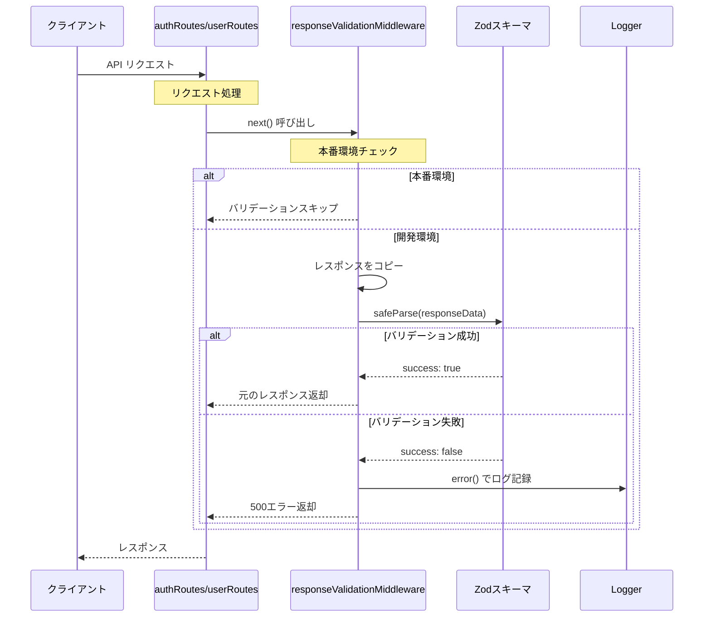
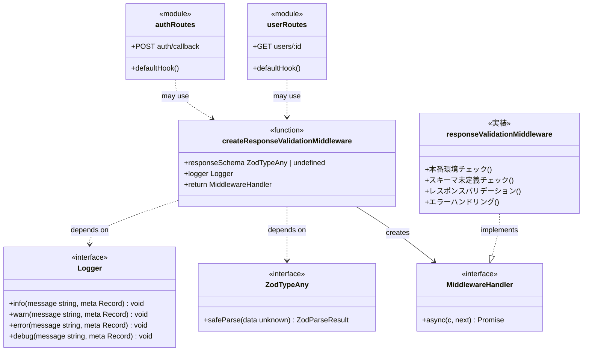

# TASK-1102: レスポンスバリデーション実装（開発環境）解説文書

**作成日**: 2025-11-02
**要件**: type-safety-enhancement
**TASK-ID**: TASK-1102
**対象読者**: 新しく組織に加入したばかりの初学者エンジニア

---

## この機能が何を解決するのか

この機能は「**開発中に API が間違ったデータを返していないかを自動チェックする**」ことを解決します。

具体的には：
- サーバーが返すレスポンスデータが正しい形式（型）かどうかを**実行時に自動検証**する
- 間違った形式のデータが返されたら、開発者にすぐエラーを通知する
- 本番環境ではチェックをスキップして、パフォーマンスを優先する

これを「**レスポンスバリデーション**」と呼び、開発中のバグ発見を早め、コードの品質を高めることができます。

---

## 全体の処理の流れ

### 処理フローとファイル関係



このフローから分かるように、**開発環境でのみバリデーションが動く**設計になっています。

---

## ファイルの役割と責任

### 今回解説するメインのファイル

#### `app/server/src/presentation/http/middleware/responseValidationMiddleware.ts`

このファイルは、レスポンスバリデーションミドルウェアを提供します。

**主要な機能**:
- **環境判定**: `process.env.NODE_ENV` を見て、本番環境ではバリデーションをスキップ
- **レスポンスコピー**: `c.res.clone()` を使って、レスポンスを読み取り可能な状態にコピー
- **Zodバリデーション**: `responseSchema.safeParse()` でレスポンスデータを検証
- **エラーハンドリング**: バリデーション失敗時は詳細をログに記録し、クライアントには安全なエラーのみ返却

**重要な関数**:

```typescript
// app/server/src/presentation/http/middleware/responseValidationMiddleware.ts
export const createResponseValidationMiddleware = (
  responseSchema: z.ZodTypeAny | undefined,
  logger: Logger,
): MiddlewareHandler => {
  return async (c, next) => {
    // 本番環境ではバリデーションをスキップ
    if (process.env.NODE_ENV === 'production') {
      await next();
      return;
    }

    // スキーマ未定義の場合はバリデーションをスキップ
    if (!responseSchema) {
      logger.warn('Response schema not defined', {
        endpoint: c.req.path,
        method: c.req.method,
      });
      await next();
      return;
    }

    // 次のミドルウェア/ハンドラーを実行
    await next();

    // レスポンスデータを検証
    try {
      const responseClone = c.res.clone();
      const responseData = await responseClone.json();

      const result = responseSchema.safeParse(responseData);

      // バリデーション失敗時は詳細をログ記録
      if (!result.success) {
        logger.error('Response validation failed', {
          error: {
            issues: result.error.issues,
            name: result.error.name,
          },
          endpoint: c.req.path,
          method: c.req.method,
          timestamp: new Date().toISOString(),
        });

        // クライアントには安全なエラーのみ返却
        c.res = c.json(
          {
            success: false,
            error: {
              code: 'INTERNAL_SERVER_ERROR',
              message: '一時的にサービスが利用できません',
            },
          },
          500,
        );
      }
    } catch (_error) {
      // レスポンスがJSON形式でない場合の対応
      // ...
    }
  };
};
```

**この関数のポイント**:
- **ファクトリーパターン**: `responseSchema` と `logger` を引数で受け取り、テストしやすい設計
- **早期リターン**: 本番環境やスキーマ未定義の場合はすぐに処理を終える
- **`c.res.clone()`**: レスポンスストリームは一度しか読めないため、コピーして読み取る
- **セキュリティ**: バリデーション失敗の詳細はログのみに記録し、クライアントには安全なエラーメッセージを返す

---

#### `app/server/src/presentation/http/middleware/__tests__/responseValidationMiddleware.test.ts`

このファイルは、レスポンスバリデーションミドルウェアのテストコードです。

**テストケースの構成**:
- **正常系**: 正しいレスポンスがバリデーションを通過する（TC001）
- **環境分離**: 本番環境ではバリデーションがスキップされる（TC002）
- **異常系**: UUID形式エラー（TC101）、必須フィールド欠落（TC102）、型の不一致（TC103）
- **境界値**: null値（TC203）、スキーマ未定義（TC201）、環境変数未設定（TC202）
- **パフォーマンス**: バリデーション時間測定（TC301）、本番環境最適化（TC302）

**テスト例（TC001）**:

```typescript
// app/server/src/presentation/http/middleware/__tests__/responseValidationMiddleware.test.ts
test('開発環境で正しいレスポンスデータがバリデーションに成功する', async () => {
  // Given: 開発環境を設定
  process.env.NODE_ENV = 'development';

  // Given: ユーザーレスポンス用のZodスキーマを定義
  const responseSchema = z.object({
    success: z.boolean(),
    data: z.object({
      id: z.uuid(),
      email: z.email(),
      name: z.string(),
    }),
  });

  // Given: モックLoggerを準備
  const mockLogger: Logger = {
    info: mock(() => {}),
    warn: mock(() => {}),
    error: mock(() => {}),
    debug: mock(() => {}),
  };

  // Given: バリデーションミドルウェアを適用したエンドポイントを準備
  const app = new Hono();
  app.use(
    '*',
    createResponseValidationMiddleware(responseSchema, mockLogger),
  );
  app.get('/test', (c) =>
    c.json({
      success: true,
      data: {
        id: '550e8400-e29b-41d4-a716-446655440000',
        email: 'test@example.com',
        name: 'Test User',
      },
    }),
  );

  // When: エンドポイントにリクエストを送信
  const response = await app.request('http://localhost/test', {
    method: 'GET',
  });

  // Then: 200 OKが返る
  expect(response.status).toBe(200);

  // Then: エラーログが出力されない
  expect(mockLogger.error).not.toHaveBeenCalled();
});
```

このテストは「**正しいレスポンスならバリデーションが成功する**」という最も基本的な動作を確認しています。

---

### 呼び出し元のファイル

#### `app/server/src/presentation/http/routes/authRoutes.ts`

認証APIルートの定義ファイルです。

**このファイルでの関連処理**:
- `defaultHook` で**リクエストバリデーション**のエラーハンドリングを実装
- レスポンスバリデーションミドルウェアの呼び出しは、現在このファイルでは実装されていませんが、今後の拡張で追加される可能性があります

**リクエストバリデーションの仕組み**:

```typescript
// app/server/src/presentation/http/routes/authRoutes.ts
const auth = new OpenAPIHono({
  defaultHook: (result, c) => {
    if (result.success) {
      return;
    }

    // Zodエラーをフィールド単位のエラーマップに変換
    return c.json(
      {
        success: false,
        error: {
          code: 'VALIDATION_ERROR',
          message: 'バリデーションエラー',
          details: result.error.issues.reduce(
            (acc: Record<string, string>, issue) => {
              const field = issue.path.join('.');
              acc[field] = issue.message;
              return acc;
            },
            {},
          ),
        },
      },
      400,
    );
  },
});
```

この `defaultHook` は、`@hono/zod-openapi` が自動的に実行する**リクエストバリデーション**の結果を受け取り、エラーレスポンスをカスタマイズします。

---

#### `app/server/src/presentation/http/routes/userRoutes.ts`

ユーザー管理APIルートの定義ファイルです。

**このファイルでの関連処理**:
- 認証ルートと同じく、`defaultHook` でリクエストバリデーションのエラーハンドリングを実装
- レスポンスバリデーションミドルウェアの呼び出しは、今後の拡張で追加される可能性があります

---

#### `app/server/src/shared/logging/Logger.ts`

ログ出力のインターフェース定義ファイルです。

**このインターフェースの役割**:
- アプリケーション全体で使用するログ出力の抽象化
- `info`, `warn`, `error`, `debug` の4つのログレベルを提供
- テスト時にモックLoggerを差し替えることで、テスタビリティを確保

```typescript
// app/server/src/shared/logging/Logger.ts
export interface Logger {
  info(message: string, meta?: Record<string, unknown>): void;
  warn(message: string, meta?: Record<string, unknown>): void;
  error(message: string, meta?: Record<string, unknown>): void;
  debug(message: string, meta?: Record<string, unknown>): void;
}
```

**このインターフェースの重要性**:
- **依存性の逆転**: ミドルウェアは具体的なログ実装に依存せず、Loggerインターフェースに依存
- **テスト容易性**: テスト時にモックを注入できる
- **拡張性**: 将来、ログ出力先を変更する際も、インターフェースを実装するだけで対応可能

---

## クラスと関数の呼び出し関係

### クラス構造と依存関係



**依存関係の重要なポイント**:
- `createResponseValidationMiddleware` は **Logger** と **ZodTypeAny** に依存
- 作成されたミドルウェアは **MiddlewareHandler** インターフェースを実装
- 認証ルートとユーザールートは、将来的にこのミドルウェアを使用する可能性がある

---

## 重要な処理の詳細解説

### 1. 本番環境でのバリデーションスキップ

```typescript
// app/server/src/presentation/http/middleware/responseValidationMiddleware.ts
if (process.env.NODE_ENV === 'production') {
  await next();
  return;
}
```

**この処理が必要である理由**:
- 本番環境では**パフォーマンス優先**であり、バリデーションのオーバーヘッドを避けたい
- 開発環境では**品質優先**であり、バリデーションエラーを早期に検出したい
- `process.env.NODE_ENV` の値によって、動作を切り替えることで、環境ごとの最適化を実現

**よくある勘違い**:
❌ 本番環境でもバリデーションすべきでは？
✅ 本番環境では**リクエストバリデーション**は実行するが、**レスポンスバリデーション**はスキップする。これは、レスポンスは自分たちが作成するデータなので、開発環境で十分検証すれば本番では不要と判断するため。

---

### 2. レスポンスストリームのコピー

```typescript
// app/server/src/presentation/http/middleware/responseValidationMiddleware.ts
const responseClone = c.res.clone();
const responseData = await responseClone.json();
```

**この処理が必要である理由**:
- HTTP レスポンスは**ストリーム**であり、一度読み取ると再度読めなくなる
- ミドルウェアでバリデーションするために読み取った後、クライアントにもレスポンスを返す必要がある
- `c.res.clone()` で**ストリームをコピー**し、コピーした方を読み取ることで、元のストリームを維持

**よくある勘違い**:
❌ `c.res` をそのまま読んでも問題ないのでは？
✅ `c.res` をそのまま読むと、ストリームが消費されてクライアントに返せなくなる。必ず `clone()` してからコピーを読む必要がある。

---

### 3. Zodバリデーションの実行

```typescript
// app/server/src/presentation/http/middleware/responseValidationMiddleware.ts
const result = responseSchema.safeParse(responseData);

if (!result.success) {
  logger.error('Response validation failed', {
    error: {
      issues: result.error.issues,
      name: result.error.name,
    },
    endpoint: c.req.path,
    method: c.req.method,
    timestamp: new Date().toISOString(),
  });

  c.res = c.json(
    {
      success: false,
      error: {
        code: 'INTERNAL_SERVER_ERROR',
        message: '一時的にサービスが利用できません',
      },
    },
    500,
  );
}
```

**この処理のポイント**:
- `safeParse()` は例外をスローせず、結果オブジェクトを返す（エラーハンドリングが簡単）
- バリデーション失敗時は**詳細をログに記録**し、**クライアントには安全なエラーのみ返却**
- これにより、内部エラー詳細を露出せず、セキュリティを確保

**よくある勘違い**:
❌ バリデーションエラーの詳細をクライアントに返すべきでは？
✅ レスポンスバリデーション失敗は**サーバー側のバグ**なので、クライアントに詳細を返すとセキュリティリスクになる。ログに記録して開発者が確認すれば十分。

---

### 4. ファクトリーパターンによる依存性注入

```typescript
// app/server/src/presentation/http/middleware/responseValidationMiddleware.ts
export const createResponseValidationMiddleware = (
  responseSchema: z.ZodTypeAny | undefined,
  logger: Logger,
): MiddlewareHandler => {
  return async (c, next) => {
    // ...
  };
};
```

**この設計のポイント**:
- **ファクトリーパターン**: ミドルウェアを生成する関数を提供
- **依存性注入**: `responseSchema` と `logger` を外部から注入
- **テスタビリティ**: テスト時にモックLoggerを注入できる

**よくある勘違い**:
❌ ミドルウェア内で直接 `console.log` を使えばよいのでは？
✅ テスト時にログ出力を検証できないため、Loggerインターフェースを注入する設計にする。これにより、テストでモックLoggerを注入してログ出力を検証できる。

---

## 初学者がつまずきやすいポイント

### 1. 「ストリーム」という概念

**ストリーム**とは、データを一度に全部読み込まず、少しずつ読み取る仕組みです。

**なぜストリームを使うのか**:
- 大きなデータを一度に読むと、メモリを大量に消費する
- 少しずつ読むことで、メモリ効率が良くなる

**注意点**:
- ストリームは**一度しか読めない**（水道の蛇口から流れる水のようなイメージ）
- レスポンスを読み取る必要がある場合は、必ず `clone()` してコピーを読む

---

### 2. 「ミドルウェア」とは何か

**ミドルウェア**とは、リクエストとレスポンスの間に挟まる処理のことです。

**イメージ**:
- リクエスト → ミドルウェア1 → ミドルウェア2 → ハンドラー → ミドルウェア2 → ミドルウェア1 → レスポンス

**`await next()` の意味**:
- 次のミドルウェア（またはハンドラー）を実行する
- `next()` の前に書いた処理は**リクエスト処理**、`next()` の後に書いた処理は**レスポンス処理**になる

---

### 3. 「safeParse」と「parse」の違い

| メソッド | 動作 | 使用場面 |
|---------|------|---------|
| `parse()` | バリデーション失敗時に例外をスロー | エラーを例外として処理したい場合 |
| `safeParse()` | バリデーション失敗時に結果オブジェクトを返す | エラーハンドリングを自分で制御したい場合 |

**推奨**:
- 基本的には `safeParse()` を使う方がエラーハンドリングが簡単

---

### 4. 環境変数 `NODE_ENV` の役割

**環境変数**とは、プログラムの実行環境に応じて変わる設定値のことです。

**NODE_ENV の値**:
- `development`: 開発環境
- `test`: テスト環境
- `production`: 本番環境
- 未設定: デフォルトで開発環境として扱われる

**使い分け**:
- 開発環境では**詳細なログ出力**や**バリデーション**を有効にする
- 本番環境では**パフォーマンス優先**でバリデーションをスキップする

---

## この設計のいい点

### 1. 環境ごとの最適化が実現されている

開発環境では品質を優先し、本番環境ではパフォーマンスを優先する設計になっています。これにより、開発中にバグを早期発見しつつ、本番環境でのパフォーマンスを損なわない仕組みが実現されています。

---

### 2. セキュリティが考慮されている

バリデーション失敗時の詳細はログにのみ記録し、クライアントには安全なエラーメッセージを返す設計になっています。これにより、内部実装の詳細を露出せず、セキュリティリスクを低減しています。

---

### 3. テストしやすい設計になっている

ファクトリーパターンと依存性注入により、テスト時にモックLoggerを注入できる設計になっています。これにより、ログ出力を検証するテストが簡単に書けます。

---

### 4. パフォーマンステストが実装されている

TC301とTC302で、バリデーションのパフォーマンスへの影響を測定するテストが実装されています。これにより、バリデーションのオーバーヘッドが許容範囲内（150ms以内）であることを継続的に確認できます。

---

## まとめ

TASK-1102で実装された「レスポンスバリデーション」は、開発環境でのみAPIレスポンスを自動検証し、品質向上とパフォーマンスの両立を実現する仕組みです。

**キーワード**:
- **レスポンスバリデーション**: APIレスポンスが正しい形式かを実行時に検証
- **環境分離**: 開発環境では品質優先、本番環境ではパフォーマンス優先
- **Zodバリデーション**: TypeScriptの型安全性を実行時まで保証
- **セキュリティ**: 内部エラー詳細を露出せず、安全なエラーのみ返却

この実装により、開発中にバグを早期発見しつつ、本番環境でのパフォーマンスを損なわない高品質なAPIが実現されています。
