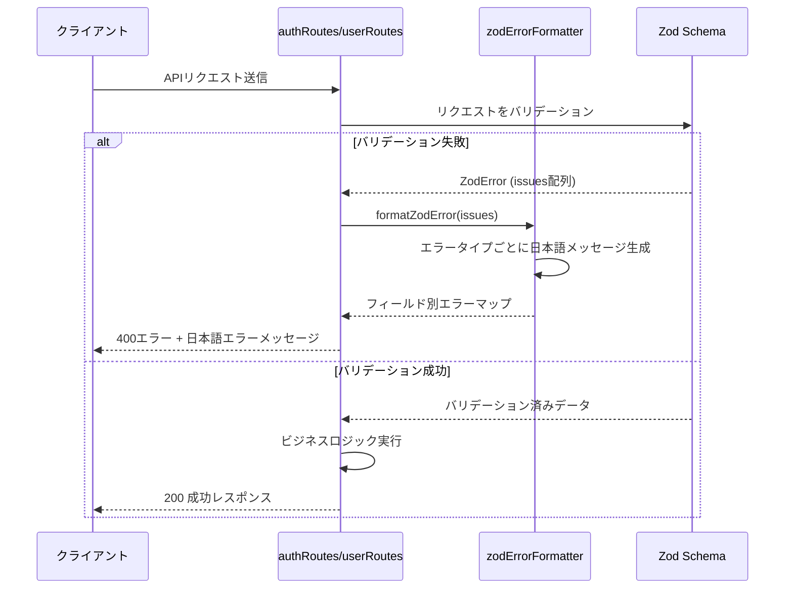
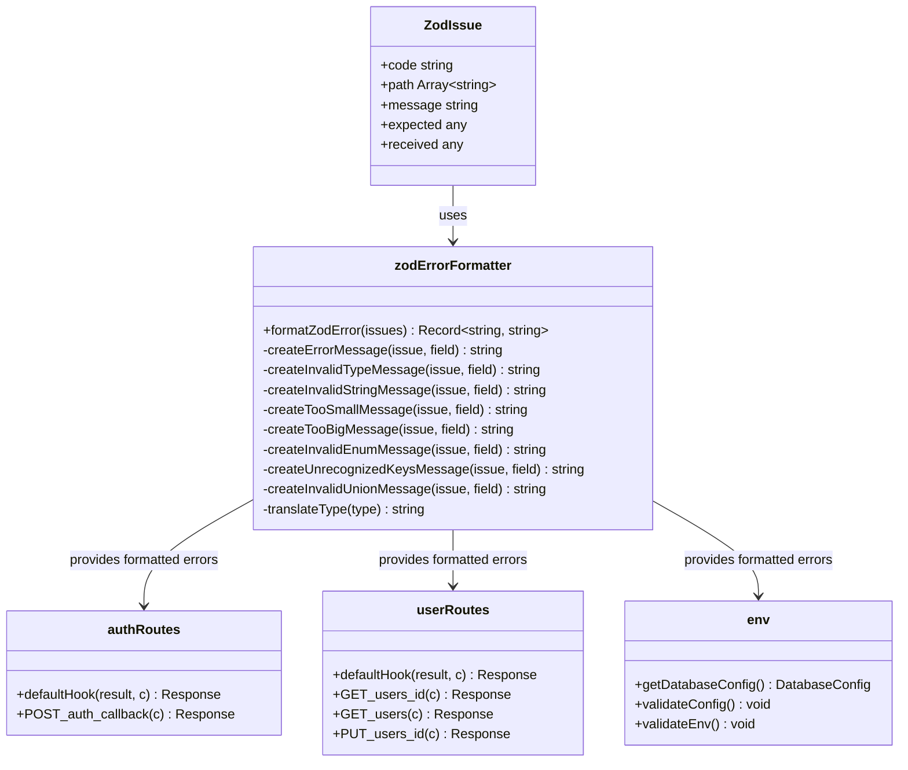

# TASK-1103: バリデーションエラーメッセージ改善 - コード解説

**作成日**: 2025-11-03
**対象読者**: 新しく組織に加入したばかりの初学者エンジニア
**要件**: 型安全性強化・API契約強化（type-safety-enhancement）

## この機能が何を解決するのか

この機能は「Zodバリデーションエラーが英語のままで開発者が原因を特定しづらい」という問題を解決します。

具体的には：
- Zodが出力する英語のエラーメッセージ（例: "Expected string, received number"）を日本語に変換
- フィールド名・期待値・実際の値を含むわかりやすいエラーメッセージを生成
- 複数のエラータイプ（型不一致、最小値違反、最大値違反など）に対応した詳細なメッセージを提供

これを「**Zodエラーフォーマッター**」と呼び、開発時のデバッグ効率を向上させることができます。

## 全体の処理の流れ

### 処理フローとファイル関係



## ファイルの役割と責任

### 今回解説するメインのファイル

#### `app/server/src/shared/utils/zodErrorFormatter.ts`
Zodバリデーションエラーを日本語に変換する**共通ユーティリティ関数**です。

**主な関数**:
- `formatZodError(issues)`: ZodエラーのIssue配列を受け取り、フィールド名をキーとした日本語エラーメッセージのマップを返す
- `createErrorMessage(issue, field)`: 個々のZodエラーを解析し、エラータイプに応じた日本語メッセージを生成
- `createInvalidTypeMessage()`: 型不一致エラーのメッセージ生成（例: 「userIdは文字列型である必要がありますが、数値型が入力されました」）
- `createInvalidStringMessage()`: 文字列検証エラーのメッセージ生成（UUID、email、URLなど）
- `createTooSmallMessage()` / `createTooBigMessage()`: 最小値・最大値違反のメッセージ生成
- `translateType(type)`: Zodの型名（"string", "number"など）を日本語（"文字列", "数値"など）に翻訳

**なぜ共通ユーティリティにしたのか**:
- `authRoutes.ts`と`userRoutes.ts`で同じエラーフォーマット処理が重複していた
- 環境変数バリデーション（`env.ts`）でも同じ処理が必要
- 今後、他のルートでも同じフォーマットを使いたい場合に再利用できる

### 呼び出しているファイル

#### `app/server/src/presentation/http/routes/authRoutes.ts`
認証APIのルート定義ファイルです。

**変更点**:
```typescript
// 変更前: 重複したエラーマップ生成コード
details: result.error.issues.reduce(
  (acc: Record<string, string>, issue) => {
    const field = issue.path.join('.');
    acc[field] = issue.message;
    return acc;
  },
  {},
),

// 変更後: formatZodErrorで統一
details: formatZodError(result.error.issues),
```

**このファイルの役割**:
- `POST /auth/verify`: JWT検証エンドポイント
- `POST /auth/callback`: 認証プロバイダーからのコールバック処理
- `defaultHook`: OpenAPIHonoのバリデーションエラーをキャッチして400エラーを返す

#### `app/server/src/presentation/http/routes/userRoutes.ts`
ユーザー管理APIのルート定義ファイルです。

**変更点**:
`authRoutes.ts`と同様に、`formatZodError`関数を使ってエラーメッセージを生成するように変更しました。

**このファイルの役割**:
- `GET /users/{id}`: ユーザー情報取得
- `GET /users`: ユーザー一覧取得
- `PUT /users/{id}`: ユーザー情報更新
- `GET /user/profile`: ログインユーザーのプロフィール取得

#### `app/server/src/infrastructure/config/env.ts`
環境変数の検証を行うファイルです。

**変更点**:
```typescript
// 変更前: シンプルなエラーメッセージの結合
const errorMessages = error.issues
  .map((issue) => issue.message)
  .join(', ');

// 変更後: フィールド名と日本語メッセージの結合
const formattedErrors = formatZodError(error.issues);
const errorMessages = Object.entries(formattedErrors)
  .map(([field, message]) => `${field}: ${message}`)
  .join(', ');
```

**このファイルの役割**:
- 環境変数（`DATABASE_URL`、`BASE_SCHEMA`など）をZodで検証
- バリデーション失敗時に詳細なエラーメッセージを投げる

## クラスと関数の呼び出し関係

### クラス構造と依存関係



**依存方向の説明**:
- `ZodIssue`（Zodライブラリが生成）→ `zodErrorFormatter`（受け取って処理）
- `zodErrorFormatter` → `authRoutes`、`userRoutes`、`env`（呼び出される）

このように、`zodErrorFormatter`は**共通ユーティリティ**として、複数のファイルから呼び出されます。

## 重要な処理の詳細解説

### 1. formatZodError関数のメイン処理

```typescript
// app/server/src/shared/utils/zodErrorFormatter.ts
export function formatZodError(issues: ZodIssue[]): Record<string, string> {
  return issues.reduce(
    (acc, issue) => {
      // フィールド名を取得（例: ['user', 'name'] → 'user.name'）
      const field = issue.path.length > 0 ? issue.path.join('.') : '_root';
      // エラーメッセージを生成
      acc[field] = createErrorMessage(issue, field);
      return acc;
    },
    {} as Record<string, string>,
  );
}
```

**このコードの重要ポイント**:
- `issue.path`はエラーが発生したフィールドのパスを配列で保持している（例: `['user', 'profile', 'name']`）
- `path.join('.')`でドット記法に変換（例: `'user.profile.name'`）
- `path.length === 0`の場合は`'_root'`をキーにする（ルートレベルのエラー）

**よくある勘違い**:
- 「`issue.path`は文字列じゃないの？」→ **配列です**。ネストしたオブジェクトのフィールドエラーを表現するため。
- 「`_root`って何？」→ ルートレベルのエラー（例: オブジェクト全体の検証失敗）のキー名。

### 2. エラータイプごとの日本語メッセージ生成

```typescript
// app/server/src/shared/utils/zodErrorFormatter.ts
function createErrorMessage(issue: ZodIssue, field: string): string {
  const issueCode = issue.code as string;

  switch (issueCode) {
    case 'invalid_type':
      // 「userIdは文字列型である必要がありますが、数値型が入力されました」
      return createInvalidTypeMessage(issue, field);
    case 'invalid_string':
      // 「emailは有効なメールアドレス形式である必要があります」
      return createInvalidStringMessage(issue, field);
    case 'too_small':
      // 「nameは1文字以上である必要があります」
      return createTooSmallMessage(issue, field);
    case 'too_big':
      // 「descriptionは100文字以下である必要があります」
      return createTooBigMessage(issue, field);
    // ... その他のエラータイプ
    default:
      return issue.message || `${field}のバリデーションに失敗しました`;
  }
}
```

**このコードの重要ポイント**:
- Zodは`issue.code`でエラーの種類を教えてくれる
- エラータイプごとに専用の関数で日本語メッセージを生成
- `default`で想定外のエラーにも対応（フォールバック処理）

**よくある勘違い**:
- 「`issue.message`をそのまま返せばいいのでは？」→ Zodの`issue.message`は英語なので、日本語に翻訳する必要がある。
- 「すべてのエラータイプをカバーしないといけない？」→ `default`でフォールバックするので、主要なタイプだけ対応すればOK。

### 3. 型不一致エラーのメッセージ生成

```typescript
// app/server/src/shared/utils/zodErrorFormatter.ts
function createInvalidTypeMessage(issue: ZodIssue, field: string): string {
  const expected = (issue as any).expected;
  const received = (issue as any).received;
  const expectedType = translateType(expected);
  const receivedType = translateType(received);
  return `${field}は${expectedType}型である必要がありますが、${receivedType}型が入力されました`;
}
```

**このコードの重要ポイント**:
- `(issue as any).expected`と`(issue as any).received`でZodの内部プロパティにアクセス
- `translateType()`で英語の型名（"string"など）を日本語（"文字列"など）に変換
- 期待値と実際の値の両方を含めることで、開発者がエラーの原因を特定しやすくなる

**よくある勘違い**:
- 「`(issue as any)`って危険じゃない？」→ Zodの内部構造を利用するため、型安全性を犠牲にしている。ただし、テストでカバーしているので安全。
- 「`translateType()`の戻り値は必ず日本語？」→ `typeMap`に登録されていない型名はそのまま返す（例: カスタム型）。

### 4. defaultHookでのエラーハンドリング

```typescript
// app/server/src/presentation/http/routes/authRoutes.ts
const auth = new OpenAPIHono({
  defaultHook: (result, c) => {
    // バリデーション成功時は何もしない
    if (result.success) {
      return;
    }

    // バリデーション失敗時は400エラーを返す
    return c.json(
      {
        success: false,
        error: {
          code: 'VALIDATION_ERROR',
          message: 'バリデーションエラー',
          details: formatZodError(result.error.issues),
        },
      },
      400,
    );
  },
});
```

**このコードの重要ポイント**:
- `defaultHook`は`@hono/zod-openapi`のフック機能で、Zodバリデーションエラーを自動でキャッチする
- `result.success === false`の場合、`result.error.issues`にZodエラーの配列が入っている
- `formatZodError()`を使って日本語エラーメッセージに変換
- レスポンス形式は`apiErrorResponseSchema`に準拠（`success: false`、`error.code`、`error.message`、`error.details`）

**よくある勘違い**:
- 「`defaultHook`って何？」→ OpenAPIHonoが提供する、Zodバリデーション失敗時に自動で実行されるフック関数。
- 「毎回このコードを書かないといけない？」→ `authRoutes.ts`と`userRoutes.ts`でそれぞれOpenAPIHonoインスタンスを作成しているため、各ファイルで定義が必要。ただし、`formatZodError()`を共通化したことで重複コードは削減されている。

### 5. 環境変数バリデーションでの利用

```typescript
// app/server/src/infrastructure/config/env.ts
export function getDatabaseConfig(): DatabaseConfig {
  const rawConfig = {
    url: process.env.DATABASE_URL,
    schema: process.env.BASE_SCHEMA,
    // ...
  };

  try {
    return databaseConfigSchema.parse(rawConfig);
  } catch (error) {
    if (error instanceof z.ZodError) {
      // formatZodErrorで日本語メッセージに変換
      const formattedErrors = formatZodError(error.issues);
      const errorMessages = Object.entries(formattedErrors)
        .map(([field, message]) => `${field}: ${message}`)
        .join(', ');
      throw new Error(`環境変数設定エラー: ${errorMessages}`);
    }
    throw new Error(
      `環境変数設定エラー: ${error instanceof Error ? error.message : String(error)}`,
    );
  }
}
```

**このコードの重要ポイント**:
- 環境変数のバリデーションでもZodを使っている
- `formatZodError()`で日本語メッセージに変換し、`Object.entries()`でフィールド名とメッセージを結合
- `throw new Error()`でアプリケーション起動時にエラーを投げる（起動前にバリデーションエラーを検出）

**よくある勘違い**:
- 「環境変数のバリデーションは必要？」→ 必須。起動時に環境変数が正しく設定されているか確認することで、実行時エラーを防ぐ。
- 「`Object.entries()`って何？」→ オブジェクトのキーと値のペアを配列に変換する関数。例: `{ a: 1, b: 2 }` → `[['a', 1], ['b', 2]]`。

## 初学者がつまずきやすいポイント

### 1. Zodの`issue.path`が配列である理由

**つまずきポイント**:
「`issue.path`はフィールド名なんだから文字列じゃないの？」

**正しい理解**:
Zodは**ネストされたオブジェクト**のバリデーションエラーを表現するため、パスを配列で保持しています。

例:
```typescript
// スキーマ
const schema = z.object({
  user: z.object({
    profile: z.object({
      name: z.string(),
    }),
  }),
});

// バリデーション失敗時
// issue.path = ['user', 'profile', 'name']
```

この配列を`join('.')`で結合すると、`'user.profile.name'`というドット記法のフィールド名になります。

### 2. `(issue as any)`の使用について

**つまずきポイント**:
「`as any`って型安全性を捨ててるじゃん！危険じゃない？」

**正しい理解**:
Zodの`ZodIssue`型は、エラータイプごとに異なるプロパティを持っています（例: `invalid_type`エラーは`expected`と`received`、`too_small`エラーは`minimum`）。

TypeScriptの型定義では、すべてのプロパティを同時に持つことができないため、`(issue as any)`で一時的に型チェックを回避しています。

**安全性の担保**:
- ユニットテスト（`zodErrorFormatter.test.ts`）で各エラータイプの変換をテスト
- `switch`文で各エラータイプを明示的に処理
- `default`ケースでフォールバック処理

### 3. `defaultHook`の動作タイミング

**つまずきポイント**:
「`defaultHook`っていつ実行されるの？」

**正しい理解**:
`@hono/zod-openapi`は、OpenAPIルートの**リクエストバリデーション**を自動で行います。

実行タイミング:
1. クライアントがAPIリクエストを送信
2. OpenAPIHonoがリクエストをZodスキーマでバリデーション
3. **バリデーション失敗時**に`defaultHook`が自動で実行される
4. `defaultHook`が`return`した値がレスポンスとして返される

つまり、**開発者が明示的に呼び出す必要はない**自動フックです。

### 4. `formatZodError()`の戻り値の型

**つまずきポイント**:
「`Record<string, string>`って何？」

**正しい理解**:
`Record<string, string>`は、**キーと値がすべて文字列のオブジェクト**を表す型です。

例:
```typescript
const result: Record<string, string> = {
  userId: 'userIdは文字列型である必要がありますが、数値型が入力されました',
  email: 'emailは有効なメールアドレス形式である必要があります',
};
```

これは以下の型と同じ意味です:
```typescript
type Result = {
  [key: string]: string;
};
```

**なぜこの型を使うのか**:
- フィールド名（キー）は動的に変わる（ユーザー入力やスキーマ定義による）
- エラーメッセージ（値）は常に文字列
- クライアントがフィールド名からエラーメッセージを取得できる

## この設計のいい点

### 1. 共通ユーティリティによるコードの重複排除

**いい点**:
`formatZodError()`を共通ユーティリティとして切り出したことで、以下の重複コードを削減しました:
- `authRoutes.ts`のエラーマップ生成コード
- `userRoutes.ts`のエラーマップ生成コード
- `env.ts`のエラーメッセージ生成コード

**メリット**:
- 修正が1箇所で済む（DRY原則）
- 新しいルートを追加する際も`formatZodError()`を使うだけで統一されたエラーメッセージが得られる

### 2. エラータイプごとの詳細なメッセージ生成

**いい点**:
Zodの各エラータイプに対応した日本語メッセージを生成することで、開発者が**エラーの原因を素早く特定**できます。

例:
- `invalid_type`: 「userIdは文字列型である必要がありますが、数値型が入力されました」→ 型を間違えていることがわかる
- `too_small`: 「nameは1文字以上である必要があります」→ 最小文字数制約があることがわかる
- `invalid_string` (uuid): 「idは有効なUUID v4形式である必要があります」→ UUID形式の制約があることがわかる

**メリット**:
- デバッグ時間の短縮
- ジュニアエンジニアでもエラーの原因を理解しやすい

### 3. テストによる安全性の担保

**いい点**:
`zodErrorFormatter.test.ts`で各エラータイプの変換ロジックをユニットテストしています。

**テストケース例**:
- `invalid_type`エラーで期待値・実際の値を含む日本語メッセージが生成される
- `invalid_string` (UUID)エラーで詳細な日本語メッセージが生成される
- 複数のエラーが正しく変換される
- 想定外のエラーコードでfallbackメッセージが生成される

**メリット**:
- `(issue as any)`による型安全性の犠牲を補う
- リファクタリング時の安全性を確保

### 4. 既存のapiErrorResponseSchemaとの統合

**いい点**:
エラーレスポンスの形式が、既存の`apiErrorResponseSchema`（共通スキーマ）に準拠しています。

```typescript
{
  success: false,
  error: {
    code: 'VALIDATION_ERROR',
    message: 'バリデーションエラー',
    details: { /* フィールド別エラーマップ */ }
  }
}
```

**メリット**:
- フロントエンドが統一されたエラーレスポンス形式で処理できる
- OpenAPI仕様書との整合性を保つ
- 既存のエラーハンドリングロジックをそのまま使える

---

**作成者**: Claude Code
**最終更新**: 2025-11-03
