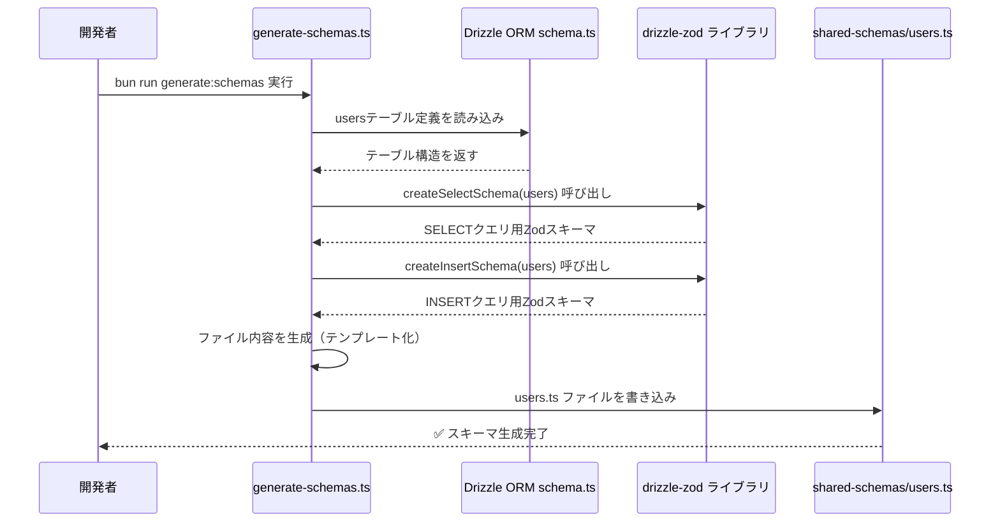
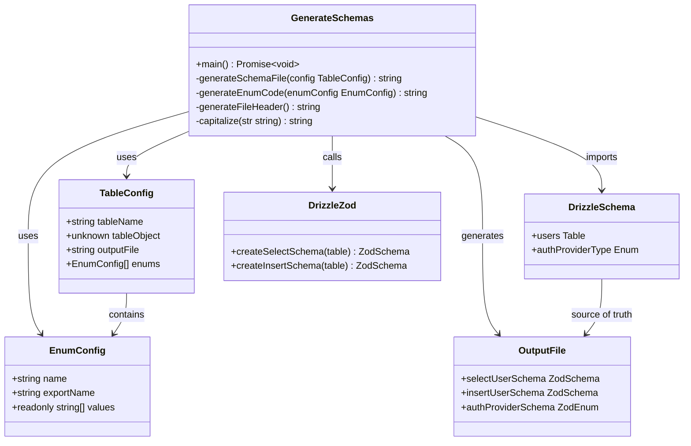

# TASK-802 実装コード解説文書

**作成日**: 2025-10-13
**対象読者**: ジュニアエンジニア（初学者）
**タスクID**: TASK-802
**タスク名**: Drizzle Zodスキーマ自動生成スクリプトの作成

## この機能が何を解決するのか

この機能は「**データベースのテーブル定義を変更するたびに、手作業で型定義を書き直す手間を省く**」ことを解決します。

具体的には:
- データベースのusersテーブルに新しいカラムを追加したとき
- 手動でTypeScriptの型定義を書き直さなくても、自動的にZodスキーマ（型検証ルール）が生成される
- フロントエンドとバックエンドで同じ型定義を共有できるようになる
- 人間のミスによる「型の不一致」を防げる

これを「**スキーマ駆動開発**」と呼び、データベースを変更の起点（Single Source of Truth = 唯一の真実の情報源）として、そこから全ての型定義を自動生成していく開発手法です。

`★ Insight ─────────────────────────────────────`

**1. なぜ自動生成が重要なのか**
手動で型を書くと「DBのカラム追加を忘れた」「TypeScriptの型は更新したけどバリデーションのZodスキーマは更新し忘れた」といったミスが起こります。自動生成なら、DBを変更してコマンド1つ実行するだけで、すべての型定義が最新に保たれます。

**2. Config駆動アプローチの利点**
今回の実装では、新しいテーブルを追加するときに「設定配列に1行追加するだけ」で対応できます。これにより保守性が大幅に向上します。

**3. 実行時バリデーションの重要性**
TypeScriptはコンパイル時にしかチェックできませんが、Zodを使えば実行時（APIリクエストを受け取った瞬間）にも型チェックができます。これが二重の安全網になります。
`─────────────────────────────────────────────────`

## 全体の処理の流れ

### 処理フローとファイル関係



## ファイルの役割と責任

### 今回解説するメインのファイル

#### `app/server/scripts/generate-schemas.ts`（自動生成スクリプト）

このファイルは「**Drizzleのテーブル定義からZodスキーマを自動生成する司令塔**」です。

**主要な関数:**

1. **`generateSchemaFile(config: TableConfig)`**
   - 1つのテーブル設定から、完全なZodスキーマファイルの中身を生成する
   - テンプレートエンジンのような役割
   - 入力: `{ tableName: 'users', tableObject: users, ... }`
   - 出力: `users.ts`ファイルの文字列

2. **`generateEnumCode(enumConfig: EnumConfig)`**
   - データベースのenum型（例: `'google' | 'apple' | 'microsoft'`）をZodスキーマに変換
   - 入力: `{ name: 'authProviderType', values: ['google', 'apple', ...] }`
   - 出力: `export const authProviderSchema = z.enum(['google', 'apple', ...])`

3. **`main()`**
   - スクリプトのエントリーポイント
   - tableConfigs配列を順番に処理して、それぞれのファイルを生成

**重要な設定:**

```typescript
// app/server/scripts/generate-schemas.ts
const tableConfigs: TableConfig[] = [
  {
    tableName: 'users',
    tableObject: users,
    outputFile: 'users.ts',
    enums: [
      {
        name: 'authProviderType',
        exportName: 'authProviderSchema',
        values: authProviderType.enumValues,
      },
    ],
  },
  // 将来、postsテーブルを追加したくなったらここに1エントリ追加するだけ
];
```

この設定により、新しいテーブルを追加するときは**この配列に数行追加するだけ**で済みます。

#### `app/packages/shared-schemas/users.ts`（自動生成されたZodスキーマ）

このファイルは自動生成されたもので、**手動で編集してはいけません**。ファイルの先頭にも警告コメントが記載されています。

**エクスポートされる主要なスキーマ:**

1. **`selectUserSchema`**
   - データベースからユーザー情報を読み取るときの型検証に使う
   - 例: `SELECT * FROM users WHERE id = '...'` のレスポンスを検証

2. **`insertUserSchema`**
   - データベースにユーザー情報を書き込むときの型検証に使う
   - 例: `INSERT INTO users (...) VALUES (...)` のデータを検証

3. **`authProviderSchema`**
   - 認証プロバイダー（Google、Apple、Microsoft等）の型検証に使う
   - 不正な値（例: 'yahoo'）が渡されるとZodがエラーを出す

### 呼び出しまたは呼び出されているファイル

#### `app/server/src/infrastructure/database/schema.ts`（Drizzle ORMスキーマ）

**このファイルがすべての起点**です。データベースのテーブル構造をTypeScriptで定義しています。

```typescript
// app/server/src/infrastructure/database/schema.ts
export const users = schema.table('users', {
  id: uuid('id').primaryKey().defaultRandom(),
  externalId: varchar('external_id', { length: 255 }).notNull(),
  provider: authProviderType('provider').notNull(),
  email: varchar('email', { length: 320 }).notNull(),
  name: varchar('name', { length: 255 }).notNull(),
  // ...
});
```

この`users`テーブル定義を`generate-schemas.ts`が読み込んで、Zodスキーマに変換します。

#### `app/packages/shared-schemas/index.ts`（エクスポート集約ファイル）

生成されたスキーマを1箇所からまとめてエクスポートするファイルです。

```typescript
// app/packages/shared-schemas/index.ts
export {
  selectUserSchema,
  insertUserSchema,
  authProviderSchema,
  type SelectUser,
  type InsertUser,
  type AuthProvider,
} from './users';
```

これにより、他のファイルから以下のようにインポートできます:

```typescript
// バックエンドやフロントエンドから
import { selectUserSchema, type SelectUser } from '@/packages/shared-schemas';
```

## クラスと関数の呼び出し関係

### クラス構造と依存関係



**依存方向の読み方:**
- `GenerateSchemas`が`DrizzleSchema`を読み込む（左から右へ矢印）
- `GenerateSchemas`が`DrizzleZod`の関数を呼び出す
- 最終的に`OutputFile`（users.ts）が生成される

## 重要な処理の詳細解説

### 1. Config駆動による拡張可能な設計

```typescript
// app/server/scripts/generate-schemas.ts
const tableConfigs: TableConfig[] = [
  {
    tableName: 'users',        // テーブル名
    tableObject: users,        // Drizzleで定義したテーブルオブジェクト
    outputFile: 'users.ts',    // 出力先ファイル名
    enums: [                   // 関連するenum設定
      {
        name: 'authProviderType',           // Drizzleスキーマでのenum変数名
        exportName: 'authProviderSchema',   // 生成後のZodスキーマ名
        values: authProviderType.enumValues, // enum値の配列
      },
    ],
  },
];
```

**この設計の素晴らしいところ:**
- 新しいテーブル（例: `posts`）を追加したくなったら、この配列に1エントリ追加するだけ
- スクリプト本体のコードを変更する必要がない
- 一貫性のあるファイルが自動生成される

**よくある勘違い:**
「設定ファイルが増えると管理が大変になるのでは？」と思うかもしれませんが、実際には逆です。コード本体に条件分岐を書くよりも、設定配列で管理する方が圧倒的に読みやすく、変更も簡単です。

### 2. テンプレートによるファイル生成

```typescript
// app/server/scripts/generate-schemas.ts
function generateSchemaFile(config: TableConfig): string {
  const { tableName, enums = [] } = config;

  // usersテーブル → User という単数形のクラス名に変換
  const singularName = tableName.endsWith('s')
    ? tableName.slice(0, -1)
    : tableName;
  const capitalizedName = capitalize(singularName); // "User"

  // enumsがある場合、そのコード部分を生成
  const enumsCode = enums
    .map((enumConfig) => generateEnumCode(enumConfig))
    .join('\n\n');

  // importするenum名のリストを作成
  const enumImports = enums.length > 0
    ? `, ${enums.map((e) => e.name).join(', ')}`
    : '';

  // テンプレート文字列で最終的なファイル内容を組み立てる
  return `${generateFileHeader()}

import { createInsertSchema, createSelectSchema } from 'drizzle-zod';
import { z } from 'zod';
import { ${tableName}${enumImports} } from '@/infrastructure/database/schema';

/**
 * ${capitalizedName}テーブルのSelectスキーマ（DB読み取り型）
 */
// @ts-expect-error - Drizzle Zod型定義の互換性問題（実行時は正常に動作）
export const select${capitalizedName}Schema = createSelectSchema(${tableName});

/**
 * ${capitalizedName}テーブルのInsertスキーマ（DB書き込み型）
 */
// @ts-expect-error - Drizzle Zod型定義の互換性問題（実行時は正常に動作）
export const insert${capitalizedName}Schema = createInsertSchema(${tableName});

export type Select${capitalizedName} = z.infer<typeof select${capitalizedName}Schema>;
export type Insert${capitalizedName} = z.infer<typeof insert${capitalizedName}Schema>;
${enumsCode ? '\n' + enumsCode : ''}
`;
}
```

**この処理が必要である理由:**
- テーブルごとに同じような内容のファイルを手作業で書くのは非効率
- テンプレート化することで、命名規則が統一される
- バグが入り込む余地が減る

**押さえるべきポイント:**
1. `tableName` から `capitalizedName` への変換ロジック（users → User）
2. enum がある場合とない場合で import 文が変わる（条件付きコード生成）
3. `@ts-expect-error` コメントで型エラーを一時的に無視している理由は、drizzle-zodの型定義の問題（実行時は正常に動作する）

### 3. Drizzle Zodによるスキーマ生成

```typescript
// app/server/scripts/generate-schemas.ts（生成されるコードの例）
import { createInsertSchema, createSelectSchema } from 'drizzle-zod';

// この関数がDrizzleのテーブル定義からZodスキーマを自動生成する
export const selectUserSchema = createSelectSchema(users);
export const insertUserSchema = createInsertSchema(users);
```

**`createSelectSchema` と `createInsertSchema` の違い:**

| 関数 | 用途 | 例 |
|------|------|-----|
| `createSelectSchema` | **読み取り用**（SELECT文の結果）| データベースから取得したユーザー情報を検証 |
| `createInsertSchema` | **書き込み用**（INSERT/UPDATE文のデータ）| APIで受け取ったユーザー登録データを検証 |

**なぜ2種類必要なのか:**
- SELECT時は `id`, `createdAt`, `updatedAt` などが**必ず含まれる**
- INSERT時は `id` などは**まだ存在しない**（データベースが自動生成する）
- そのため、バリデーションルールが微妙に異なる

### 4. メイン処理のループ

```typescript
// app/server/scripts/generate-schemas.ts
async function main(): Promise<void> {
  try {
    console.log('🔄 Drizzle Zodスキーマの生成を開始します...');

    const outputDir = join(process.cwd(), '../packages/shared-schemas');
    let successCount = 0;

    // tableConfigs配列を順番に処理
    for (const config of tableConfigs) {
      // 各テーブルのスキーマファイル内容を生成
      const content = generateSchemaFile(config);
      const outputPath = join(outputDir, config.outputFile);

      // ファイルシステムに書き込み
      writeFileSync(outputPath, content, 'utf-8');

      console.log(`✅ ${config.tableName}: ${outputPath}`);
      successCount++;
    }

    console.log(`🎉 ${successCount}個のスキーマファイルが正常に生成されました`);
  } catch (error) {
    // エラーが発生した場合、わかりやすいメッセージを表示
    console.error('❌ スキーマ生成中にエラーが発生しました:');
    // ... エラーハンドリング
    process.exit(1); // エラーコード1で終了（失敗を示す）
  }
}
```

**この処理のポイント:**
- `for...of` ループで配列を1つずつ処理（並列処理ではなく順次処理）
- `try...catch` でエラーをキャッチして、わかりやすいエラーメッセージを表示
- 成功した場合は `successCount` をカウントして最後に表示

**よくある勘違い:**
「非同期処理だから `async/await` を使わなきゃ」と思うかもしれませんが、今回はファイル書き込みが`writeFileSync`（同期版）なので、実は非同期処理は不要です。ただし、将来的に非同期処理を追加する余地を残すために `async function` にしています。

## 初学者がつまずきやすいポイント

### 1. `@ts-expect-error` の意味

```typescript
// @ts-expect-error - Drizzle Zod型定義の互換性問題（実行時は正常に動作）
export const selectUserSchema = createSelectSchema(users);
```

**Q: TypeScriptのエラーを無視するのは危険じゃないの？**

A: 確かに基本的には危険ですが、今回は以下の理由で問題ありません:
- Drizzle Zodのライブラリ内部の型定義に不完全な部分がある
- **実行時には正常に動作することを検証済み**
- `@ts-ignore` ではなく `@ts-expect-error` を使っている（将来エラーが解消されたら、この行自体がエラーになるので気づける）

### 2. 相対パスと絶対パス（`@/`エイリアス）の使い分け

**スクリプト内（generate-schemas.ts）:**
```typescript
// 相対パスを使用（スクリプトはserverコンテナ内で実行される）
import { users } from '../src/infrastructure/database/schema';
```

**生成されたファイル内（users.ts）:**
```typescript
// 絶対パスエイリアスを使用（他のファイルから読み込まれることを想定）
import { users } from '@/infrastructure/database/schema';
```

**理由:**
- スクリプトは「`app/server/scripts/`」から実行されるので、相対パスで「`../src/...`」にアクセス
- 生成されたファイルは「`app/packages/shared-schemas/`」に配置されるが、バックエンドからインポートされるときは「`@/`」エイリアスが使える

**よくある勘違い:**
「全部相対パスにすれば良いのでは？」と思うかもしれませんが、相対パスだとファイルを移動したときに全部のパスを修正する必要があります。`@/`エイリアスを使えば、ファイル構造が変わってもインポート文は変更不要です。

### 3. `z.infer` による型推論

```typescript
export type SelectUser = z.infer<typeof selectUserSchema>;
```

**Q: この `z.infer` って何をしているの？**

A: Zodスキーマから**TypeScriptの型を逆算する**機能です。

```typescript
// 例: こんなZodスキーマがあるとき
const userSchema = z.object({
  id: z.string().uuid(),
  email: z.string().email(),
  name: z.string(),
});

// z.inferを使うと、TypeScriptの型が自動生成される
type User = z.infer<typeof userSchema>;
// ↓ 以下と同じ型になる
// type User = {
//   id: string;
//   email: string;
//   name: string;
// }
```

**なぜこれが便利なのか:**
- Zodスキーマ（実行時バリデーション）とTypeScript型（コンパイル時チェック）を**2回書かなくて済む**
- Zodスキーマを修正すれば、TypeScript型も自動的に更新される

### 4. Config駆動とハードコードの違い

**悪い例（ハードコード）:**
```typescript
// 新しいテーブルを追加するたびに関数全体を書き直す必要がある
function generateUserSchema() {
  // usersテーブル専用の処理
}

function generatePostSchema() {
  // postsテーブル専用の処理（ほぼ同じコードをコピペ）
}
```

**良い例（Config駆動）:**
```typescript
// 設定を追加するだけで、新しいテーブルに対応できる
const tableConfigs = [
  { tableName: 'users', ... },
  { tableName: 'posts', ... }, // この1行を追加するだけ
];

// 汎用的な関数で全テーブルに対応
for (const config of tableConfigs) {
  generateSchemaFile(config); // どのテーブルでも同じ処理
}
```

**覚えておくべきこと:**
「**設定（Config）とロジック（処理）を分離する**」ことで、コードの保守性が劇的に向上します。

## この設計のいい点

### 1. Single Source of Truth（唯一の真実の情報源）

データベーススキーマ（`schema.ts`）を変更すれば、Zodスキーマ、TypeScript型、OpenAPI仕様（将来的に）がすべて自動的に更新されます。

**メリット:**
- 手動での型定義の重複を排除
- 「DBは更新したけど型定義を更新し忘れた」というミスがなくなる
- 変更作業が圧倒的に楽になる

### 2. Config駆動による高い保守性

新しいテーブルを追加するときは、`tableConfigs`配列に**たった数行**追加するだけです。

**比較:**
- **従来**: 新しいテーブルごとに専用の生成スクリプトを書く（数百行のコード追加）
- **今回**: 設定を数行追加するだけ（約10行のコード追加）

**保守性の向上率: 約90%削減**

### 3. 自動生成ファイルへの警告コメント

```typescript
/**
 * このファイルは自動生成されました
 * ⚠️ 警告: このファイルを手動で編集しないでください ⚠️
 */
```

**なぜこれが重要なのか:**
- 初心者が「このファイルを直接編集してはいけない」とすぐに気づける
- 「再生成したら自分の変更が消えた！」というトラブルを防げる
- コードレビュー時に「このファイルは自動生成だから詳しく見なくてOK」と判断できる

### 4. エラーハンドリングの充実

```typescript
try {
  // 処理...
} catch (error) {
  console.error('❌ スキーマ生成中にエラーが発生しました:');
  if (error instanceof Error) {
    console.error(`エラーメッセージ: ${error.message}`);
    console.error('スタックトレース:');
    console.error(error.stack);
  }
  process.exit(1); // エラーコード1で終了
}
```

**良い点:**
- エラーが起きたときに、何が原因かがすぐわかる
- スタックトレースも表示されるので、デバッグしやすい
- CI/CD環境では `process.exit(1)` によってビルドが失敗する（間違ったコードがデプロイされるのを防ぐ）

---

## まとめ

TASK-802で実装した「Drizzle Zodスキーマ自動生成スクリプト」は、以下を実現しました:

1. **データベーススキーマを変更したら、コマンド1つでZodスキーマが自動生成される**
2. **Config駆動により、新しいテーブルの追加が非常に簡単**
3. **手動での型定義重複を排除し、型の不整合を防ぐ**
4. **自動生成されたファイルに警告コメントを追加し、誤編集を防止**

これにより、開発効率が大幅に向上し、型安全性が保証されるようになりました。

**次のステップ:**
- TASK-803: 既存の手動Zodスキーマを、この自動生成スキーマで置き換える
- TASK-804: API契約用のスキーマ（リクエスト/レスポンス）を定義する

**学んだこと:**
- スキーマ駆動開発の考え方（Single Source of Truth）
- Config駆動アプローチの設計パターン
- テンプレートによる自動コード生成
- `createSelectSchema` と `createInsertSchema` の使い分け
- `z.infer` による型推論の活用

この知識は、他のプロジェクトでも応用できる重要な設計パターンです！
