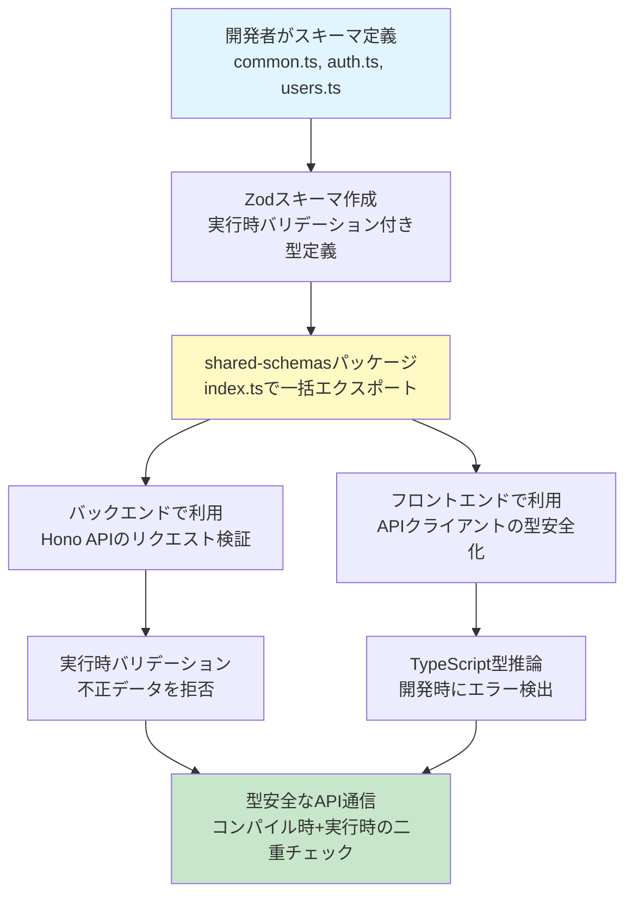
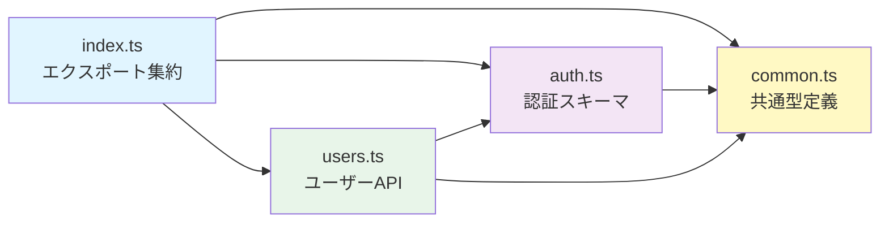
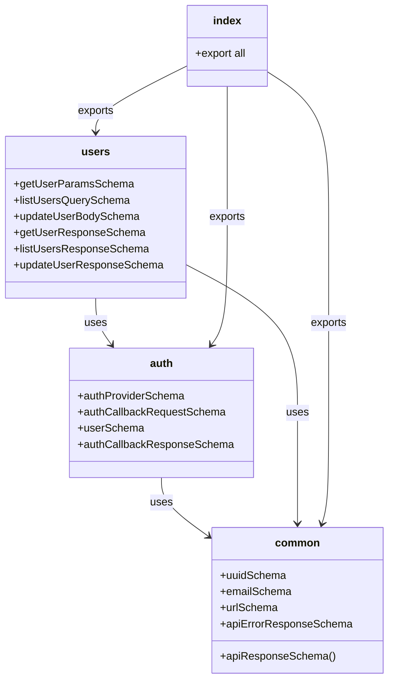

# TASK-804: API契約スキーマ定義（認証・ユーザー）コード解説

**作成日**: 2025-10-13
**対象読者**: 新規加入のジュニアエンジニア
**前提知識**: TypeScript基礎、REST API基礎

---

## この機能が何を解決するのか

この機能は「**フロントエンドとバックエンドでAPI契約（どんなデータをやり取りするか）を共有し、型安全にする**」ことを解決します。

具体的には：
- フロントエンドとバックエンドで同じZodスキーマ（型定義+バリデーション）を共有
- APIリクエスト・レスポンスの型を実行時（プログラムが動いている時）にも検証
- TypeScriptのコンパイル時だけでなく、実際に動く時も「このデータ、本当に正しい形かな？」をチェック

これを「**スキーマ駆動開発**」と呼び、手作業での型定義の重複を避け、フロント・バック間の型の不整合を防ぐことができます。

### なぜ重要なのか？

従来の問題：
```typescript
// ❌ 従来：フロントとバックで別々に型定義
// バックエンド側
interface User {
  id: string;
  name: string;
  email: string;
}

// フロントエンド側（別ファイル）
interface User {
  id: string;
  name: string;
  // あれ？emailフィールドを追加し忘れた！
}
```

今回の解決策：
```typescript
// ✅ 今回：shared-schemasで一元管理
import { userSchema } from '@/packages/shared-schemas';
// フロント・バック両方で同じ定義を使用
```

---

## 全体の処理の流れ

### スキーマ駆動開発フロー



### ファイル間の依存関係



---

## ファイルの役割と責任

### 今回解説するメインのファイル（TASK-804で作成）

#### 1. `app/packages/shared-schemas/package.json`
**役割**: shared-schemasパッケージの設定ファイル

```json
{
  "name": "@hoxt-backlog/shared-schemas",
  "version": "1.0.0",
  "type": "module",
  "dependencies": {
    "zod": "^4.0.17"
  }
}
```

**重要ポイント**:
- `type: "module"`: ESモジュール形式（`import/export`）を使用
- `zod`: バリデーション+型定義の両方を提供するライブラリ

#### 2. `app/packages/shared-schemas/tsconfig.json`
**役割**: TypeScriptコンパイラの設定

```json
{
  "compilerOptions": {
    "target": "ES2022",
    "module": "ESNext",
    "strict": true,
    "composite": true
  }
}
```

**重要ポイント**:
- `strict: true`: 厳格な型チェック（型安全性を最大化）
- `composite: true`: 他のプロジェクト（client/server）から参照可能

#### 3. `app/packages/shared-schemas/src/common.ts`
**役割**: 全APIで共通して使う基本的な型定義

**主要な関数とスキーマ**:

```typescript
// app/packages/shared-schemas/src/common.ts

// UUID型（ユニークなID）
export const uuidSchema = z.string().uuid('有効なUUID v4形式である必要があります');
// → "550e8400-e29b-41d4-a716-446655440000" のような形式をチェック

// メールアドレス型
export const emailSchema = z.string().email('有効なメールアドレス形式である必要があります');
// → "user@example.com" の形式をチェック

// URL型
export const urlSchema = z.string().url('有効なURL形式である必要があります');
// → "https://example.com/avatar.jpg" の形式をチェック
```

**成功レスポンスの構造**:
```typescript
export const apiResponseSchema = <T extends z.ZodTypeAny>(dataSchema: T) =>
  z.object({
    success: z.literal(true),  // 必ず true
    data: dataSchema,           // 任意の型（ジェネリック）
  });

// 使用例
const getUserResponse = apiResponseSchema(userSchema);
// → { success: true, data: { id: '...', name: '...', ... } }
```

**エラーレスポンスの構造**:
```typescript
export const apiErrorResponseSchema = z.object({
  success: z.literal(false),  // 必ず false
  error: z.object({
    code: z.string(),          // エラーコード（例: "VALIDATION_ERROR"）
    message: z.string(),       // ユーザー向けメッセージ
    details: z.union([z.record(z.any(), z.string()), z.string()]).optional(),
  }),
});

// 実際のエラーレスポンス例
// {
//   success: false,
//   error: {
//     code: 'VALIDATION_ERROR',
//     message: 'バリデーションエラー',
//     details: { email: '有効なメールアドレスではありません' }
//   }
// }
```

#### 4. `app/packages/shared-schemas/src/auth.ts`
**役割**: 認証関連のAPI契約スキーマ（POST /auth/callback）

**認証プロバイダー定義**:
```typescript
// app/packages/shared-schemas/src/auth.ts

export const authProviderSchema = z.enum([
  'google',
  'apple',
  'microsoft',
  'github',
  'facebook',
  'line',
]);
// → 'google' などの文字列のみ許可（他は拒否）
```

**認証コールバックリクエスト**:
```typescript
export const authCallbackRequestSchema = z.object({
  externalId: z.string().min(1, 'externalIdは1文字以上である必要があります'),
  provider: authProviderSchema,  // 上で定義した6種類のみ
  email: emailSchema,            // common.tsから import
  name: z.string().min(1, 'ユーザー名は1文字以上である必要があります'),
  avatarUrl: urlSchema.optional(),  // オプション（なくてもOK）
});

// リクエスト例
// {
//   externalId: 'google_123456789',
//   provider: 'google',
//   email: 'user@example.com',
//   name: '山田太郎',
//   avatarUrl: 'https://lh3.googleusercontent.com/a/avatar.jpg'
// }
```

**ユーザー情報スキーマ**:
```typescript
export const userSchema = z.object({
  id: z.string().uuid(),             // UUID形式
  externalId: z.string(),            // 外部プロバイダーのID
  provider: authProviderSchema,      // 認証プロバイダー
  email: emailSchema,                // メールアドレス
  name: z.string(),                  // ユーザー名
  avatarUrl: z.string().url().nullable().optional(),  // null または undefined OK
  createdAt: z.string().datetime(),  // ISO 8601形式（例: "2025-10-12T10:00:00Z"）
  updatedAt: z.string().datetime(),
  lastLoginAt: z.string().datetime().nullable().optional(),
});

// レスポンス例
// {
//   id: '550e8400-e29b-41d4-a716-446655440000',
//   externalId: 'google_123456789',
//   provider: 'google',
//   email: 'user@example.com',
//   name: '山田太郎',
//   avatarUrl: 'https://example.com/avatar.jpg',
//   createdAt: '2025-10-12T10:00:00Z',
//   updatedAt: '2025-10-12T10:00:00Z',
//   lastLoginAt: '2025-10-12T13:45:00Z'
// }
```

#### 5. `app/packages/shared-schemas/src/users.ts`
**役割**: ユーザー管理API契約スキーマ（GET/PUT /users）

**ユーザー取得（GET /users/{id}）**:
```typescript
// app/packages/shared-schemas/src/users.ts

export const getUserParamsSchema = z.object({
  id: uuidSchema,  // common.tsから import
});
// → パスパラメータ { id: '550e8400-...' } をチェック
```

**ユーザー一覧取得（GET /users）**:
```typescript
export const listUsersQuerySchema = z.object({
  provider: authProviderSchema.optional(),  // オプション
  limit: z.coerce.number().int().min(1).max(100).default(20),
  offset: z.coerce.number().int().min(0).default(0),
});
// z.coerce.number(): 文字列を数値に自動変換
// → クエリパラメータ "limit=20" を数値 20 に変換
```

**重要な機能 `z.coerce`**:
```typescript
// HTTPクエリパラメータは常に文字列
// GET /users?limit=20&offset=0
// → { limit: "20", offset: "0" } ← 文字列！

// z.coerce.number() を使うと...
const query = listUsersQuerySchema.parse({ limit: "20", offset: "0" });
// → { limit: 20, offset: 0 } ← 数値に自動変換！
```

**ユーザー更新（PUT /users/{id}）**:
```typescript
export const updateUserBodySchema = z.object({
  name: z.string().min(1, 'ユーザー名は1文字以上である必要があります').optional(),
  avatarUrl: urlSchema.optional(),
});
// → 両方オプション（どちらか一方だけ更新も可能）

// リクエストボディ例
// { name: '田中花子' }  ← avatarUrlなしでもOK
// { avatarUrl: 'https://example.com/new-avatar.jpg' }  ← nameなしでもOK
// { name: '田中花子', avatarUrl: 'https://...' }  ← 両方もOK
```

#### 6. `app/packages/shared-schemas/index.ts`
**役割**: 全スキーマを一箇所でエクスポート（エントリーポイント）

```typescript
// app/packages/shared-schemas/index.ts

// 共通型定義
export * from './src/common';

// 認証API型定義
export * from './src/auth';

// ユーザーAPI型定義
export * from './src/users';
```

**利用側のコード（バックエンド・フロントエンド共通）**:
```typescript
// どこから import してもOK
import { userSchema, getUserParamsSchema } from '@/packages/shared-schemas';

// または個別ファイルから
import { userSchema } from '@/packages/shared-schemas/src/auth';
```

---

## クラスと関数の呼び出し関係

### スキーマの依存関係図



**依存の方向**:
1. **common** ← 最も基本的な型（依存なし）
2. **auth** ← common を使用
3. **users** ← common と auth を使用
4. **index** ← 全てをエクスポート

---

## 重要な処理の詳細解説

### 1. Zodスキーマによる実行時バリデーション

```typescript
// app/packages/shared-schemas/src/common.ts

const emailSchema = z.string().email('有効なメールアドレス形式である必要があります');

// ✅ 正しいデータ
const validEmail = emailSchema.parse('user@example.com');
// → 'user@example.com' が返される

// ❌ 不正なデータ
try {
  const invalidEmail = emailSchema.parse('invalid-email');
} catch (error) {
  // ZodErrorがthrowされる
  // error.issues[0].message === '有効なメールアドレス形式である必要があります'
}
```

**この処理が必要な理由**:
- TypeScriptはコンパイル時（ビルド時）しかチェックしない
- 実行時（ユーザーが送ってきたデータ）は型が保証されない
- Zodは実行時にも「本当にこの型か？」を確認する

**よくある勘違い**:
```typescript
// ❌ TypeScriptの型定義だけではダメ
interface User {
  email: string;
}

const user: User = JSON.parse(responseText);
// → ビルドは通るが、実際にemailがstring型かは不明！

// ✅ Zodなら実行時も安全
const user = userSchema.parse(JSON.parse(responseText));
// → emailが正しいメールアドレス形式か実行時にチェック
```

### 2. ジェネリック関数 `apiResponseSchema`

```typescript
// app/packages/shared-schemas/src/common.ts

export const apiResponseSchema = <T extends z.ZodTypeAny>(dataSchema: T) =>
  z.object({
    success: z.literal(true),
    data: dataSchema,
  });

// 使用例1: ユーザー取得レスポンス
const getUserResponseSchema = apiResponseSchema(userSchema);
// → { success: true, data: User }

// 使用例2: ユーザー一覧レスポンス
const listUsersResponseSchema = apiResponseSchema(listUsersDataSchema);
// → { success: true, data: { users: User[], total: number, ... } }
```

**この処理が必要な理由**:
- 全APIで統一したレスポンス形式（`{ success: true, data: ... }`）を使いたい
- でも `data` の中身は各エンドポイントで異なる
- ジェネリック（`<T>`）を使うことで、どんなデータ型でも対応可能

**押さえるべきポイント**:
- `<T extends z.ZodTypeAny>`: `T` はZodスキーマ型である必要がある
- 返り値は `z.object({...})`: 新しいZodスキーマが作られる
- 関数を呼ぶたびに異なるスキーマが生成される（テンプレート的な使い方）

### 3. クエリパラメータの型変換 `z.coerce`

```typescript
// app/packages/shared-schemas/src/users.ts

export const listUsersQuerySchema = z.object({
  limit: z.coerce.number().int().min(1).max(100).default(20),
  offset: z.coerce.number().int().min(0).default(0),
});

// 実際の使用例
const query = listUsersQuerySchema.parse({ limit: "20", offset: "0" });
// → { limit: 20, offset: 0 } ← 文字列→数値に自動変換

// デフォルト値の動作
const query2 = listUsersQuerySchema.parse({});
// → { limit: 20, offset: 0 } ← limitとoffsetが自動設定
```

**この処理が必要な理由**:
- HTTPクエリパラメータは常に文字列（`?limit=20` → `"20"`）
- でもアプリケーション内では数値として扱いたい
- `z.coerce` を使うと自動で型変換してくれる

**よくある勘違い**:
```typescript
// ❌ z.coerce なしだとエラー
const schema = z.object({ limit: z.number() });
schema.parse({ limit: "20" });  // ❌ エラー！文字列は受け付けない

// ✅ z.coerce ありなら成功
const schema = z.object({ limit: z.coerce.number() });
schema.parse({ limit: "20" });  // ✅ 20 に変換される
```

### 4. 既存コードとの互換性維持

```typescript
// app/packages/shared-schemas/src/common.ts

// 新しいZodベースの型
export type ApiErrorResponse = z.infer<typeof apiErrorResponseSchema>;

// 既存コードとの互換性のためのエクスポート
export type ErrorResponse = ApiErrorResponse;

// 既存のinterfaceも残す
export interface ApiError {
  code: string;
  message: string;
  details?: string | Record<string, string>;
}
```

**この処理が必要な理由**:
- 既存のテストコードが `ErrorResponse` 型を使っている
- いきなり削除すると既存コードが壊れる
- 段階的に移行するため、一時的に両方をサポート

**押さえるべきポイント**:
- `type ErrorResponse = ApiErrorResponse`: 型エイリアス（別名）
- 既存コードは `ErrorResponse` を使い続けられる
- 新しいコードは `ApiErrorResponse` を使う
- 将来的には `ErrorResponse` を削除予定（TASK-902で移行）

---

## 初学者がつまずきやすいポイント

### 1. ZodスキーマとTypeScript型の違い

```typescript
// Zodスキーマ（実行時バリデーション機能あり）
export const userSchema = z.object({ name: z.string() });

// TypeScript型（コンパイル時のみ）
export type User = z.infer<typeof userSchema>;
// → { name: string }
```

**覚え方**:
- **Zodスキーマ**: 実行時に `schema.parse(data)` でチェックできる
- **TypeScript型**: ビルド時の型チェックのみ（実行時には消える）

### 2. `z.infer` の役割

```typescript
const userSchema = z.object({
  name: z.string(),
  age: z.number(),
});

// z.inferで型を抽出
type User = z.infer<typeof userSchema>;
// ↓ これと同じ
type User = {
  name: string;
  age: number;
};
```

**覚え方**:
- Zodスキーマから自動でTypeScript型を生成
- 手動で `interface User` を書く必要がない
- スキーマを変更すれば型も自動で更新される

### 3. `.optional()` と `.nullable()` の違い

```typescript
// .optional(): フィールド自体がなくてもOK
z.object({
  avatarUrl: z.string().optional()
});
// ✅ { }  ← avatarUrlフィールドがない
// ✅ { avatarUrl: "https://..." }
// ❌ { avatarUrl: null }  ← nullはダメ

// .nullable(): null値OK
z.object({
  avatarUrl: z.string().nullable()
});
// ❌ { }  ← フィールドは必須
// ✅ { avatarUrl: "https://..." }
// ✅ { avatarUrl: null }

// .nullable().optional(): 両方OK
z.object({
  avatarUrl: z.string().nullable().optional()
});
// ✅ { }
// ✅ { avatarUrl: "https://..." }
// ✅ { avatarUrl: null }
```

### 4. エクスポートの `export * from './src/common'`

```typescript
// index.ts
export * from './src/common';
export * from './src/auth';

// これは以下と同じ
export { uuidSchema, emailSchema, urlSchema, ... } from './src/common';
export { authProviderSchema, userSchema, ... } from './src/auth';
```

**覚え方**:
- `export *`: そのファイルの全エクスポートを再エクスポート
- 利用側は `from '@/packages/shared-schemas'` だけでOK
- 個別ファイルを意識しなくてよい

---

## この設計のいい点

### 1. **Single Source of Truth（単一の情報源）**

```typescript
// ✅ 良い点：1つのスキーマ定義をフロント・バック共有
import { userSchema } from '@/packages/shared-schemas';

// バックエンド（Hono API）
app.post('/users', async (c) => {
  const body = userSchema.parse(await c.req.json());
  // ↑ 実行時バリデーション
});

// フロントエンド（Next.js）
import type { User } from '@/packages/shared-schemas';
const user: User = await fetchUser();
// ↑ TypeScript型チェック
```

**メリット**:
- 型定義を2箇所に書かなくていい
- フロント・バック間で型の不整合が起きない
- スキーマ変更が両方に即座に反映

### 2. **二重の型安全性（コンパイル時+実行時）**

```typescript
// コンパイル時（TypeScript）
const user: User = data;  // ← ビルド時にエラー検出

// 実行時（Zod）
const user = userSchema.parse(data);  // ← 実行時にエラー検出
```

**メリット**:
- 開発時：TypeScriptがエラーを即座に教えてくれる
- 実行時：ユーザーが送ってきた不正データも拒否できる

### 3. **日本語エラーメッセージ**

```typescript
export const emailSchema = z.string().email('有効なメールアドレス形式である必要があります');

// バリデーション失敗時
// {
//   success: false,
//   error: {
//     code: 'VALIDATION_ERROR',
//     message: 'バリデーションエラー',
//     details: { email: '有効なメールアドレス形式である必要があります' }
//   }
// }
```

**メリット**:
- エンドユーザーにも分かりやすい
- 開発者がエラー原因を特定しやすい
- 英語エラーを翻訳する手間が不要

### 4. **拡張性の高い設計**

```typescript
// 新しいAPIエンドポイントを追加する場合
// 1. スキーマを定義
export const createPostRequestSchema = z.object({
  title: z.string().min(1),
  content: z.string(),
});

// 2. レスポンススキーマも簡単
export const createPostResponseSchema = apiResponseSchema(postSchema);
// ← apiResponseSchema を再利用

// 3. index.tsでエクスポート
export * from './src/posts';  // ← 1行追加するだけ
```

**メリット**:
- 新しいエンドポイント追加が簡単
- 共通パターン（`apiResponseSchema`）を再利用
- 一貫性のあるAPI設計

---

## まとめ

このTASK-804で作成したコードは、フロントエンドとバックエンド間の**型安全なAPI通信**を実現する基盤です。

**重要な3つのポイント**:
1. **Zodスキーマ**: 実行時バリデーション + TypeScript型定義の両方を提供
2. **shared-schemasパッケージ**: フロント・バック共通で使える型定義
3. **スキーマ駆動開発**: 1つのスキーマから全てが自動生成される

**次のステップ（TASK-901以降）**:
- TASK-901: これらのZodスキーマから**OpenAPI仕様を自動生成**
- TASK-902: バックエンドのAPIルートを**OpenAPI対応**に移行
- TASK-1001: OpenAPI仕様から**フロントエンドの型定義を自動生成**

このように、「Drizzle ORM → Drizzle Zod → shared-schemas → OpenAPI → フロントエンド型定義」という一連のフローが完成し、手動での型定義の重複が完全になくなります！
