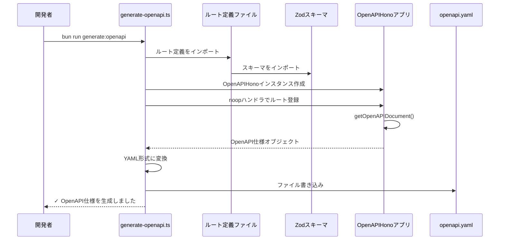
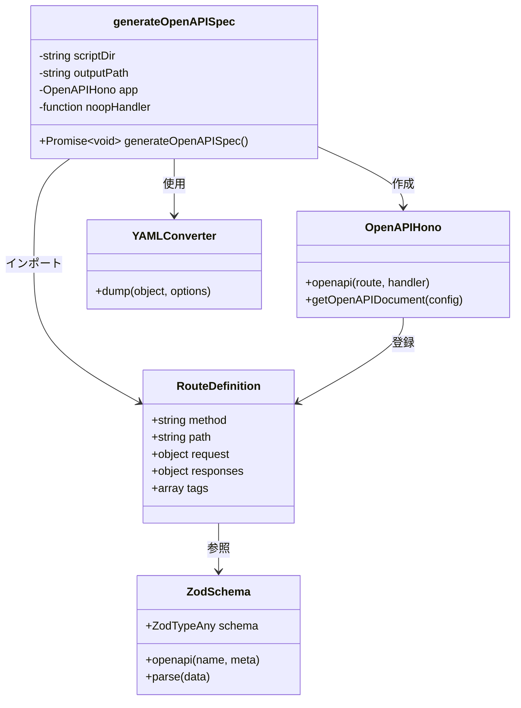

# TASK-901: OpenAPI仕様自動生成機能 コード解説

## この機能が何を解決するのか

この機能は「**API仕様書の作成・更新を自動化し、常に最新のAPI契約をドキュメント化する**」ことを解決します。

具体的には：
- バックエンド開発者が `createRoute` でルート定義を書くだけで、自動的にOpenAPI 3.1仕様書が生成される
- Zodスキーマから型情報・バリデーションルール・説明文が自動的に抽出される
- データベース接続なしでOpenAPI仕様を生成できるため、開発環境で素早く実行可能
- フロントエンド開発者が生成されたOpenAPI仕様からTypeScript型定義を自動生成できる

これを「**スキーマ駆動開発（Schema-Driven Development）**」と呼び、**API仕様とコードの乖離を防ぎ、型安全なフロントエンド・バックエンド連携**ができます。

## 全体の処理の流れ

### 処理フローとファイル関係



## ファイルの役割と責任

### 今回解説するメインのファイル

#### app/server/scripts/generate-openapi.ts

OpenAPI仕様を自動生成するスクリプトです。

**主な役割:**
- ルート定義（スキーマ）をインポート
- OpenAPIHonoアプリを作成し、ルートを登録
- OpenAPI仕様を取得し、YAML形式で出力

**重要な関数:**
- `generateOpenAPISpec()`: OpenAPI仕様生成のメイン関数
  - `noopHandler`: ダミーハンドラ（DB接続不要にするための工夫）
  - `app.getOpenAPIDocument()`: OpenAPI仕様オブジェクトを取得
  - `yaml.dump()`: オブジェクトをYAML文字列に変換

#### app/server/src/presentation/http/routes/taskRoutes.schema.ts

タスク管理APIのOpenAPIルート定義（スキーマのみ）です。

**主な役割:**
- `createRoute`でエンドポイント定義
- リクエスト・レスポンススキーマを設定
- エラーレスポンスを定義

**重要なポイント:**
- **ハンドラ実装を含まない**（DB接続が不要）
- Zodスキーマを使ってバリデーションルールを定義
- OpenAPI仕様に変換される情報（tags、summary、description）を記述

#### app/packages/shared-schemas/src/tasks.ts

タスク管理のAPI契約スキーマ（フロントエンド・バックエンド共有）です。

**主な役割:**
- リクエスト・レスポンスのZodスキーマ定義
- TypeScript型定義のエクスポート
- `.openapi()`メソッドでOpenAPI用のメタデータを追加

**重要なポイント:**
- `.openapi()`: Zodスキーマに名前や説明を付与してOpenAPI仕様に反映
- `apiResponseSchema`: 共通レスポンス構造（`{ success: true, data: ... }`）を生成
- バリデーションエラーメッセージを日本語で定義

### 呼び出しているファイル

#### app/server/src/presentation/http/routes/userRoutes.schema.ts

ユーザー管理APIのOpenAPIルート定義です。

**役割:**
- タスク管理と同様に、ユーザー関連のエンドポイント定義
- `generate-openapi.ts`からインポートされる

#### app/server/src/presentation/http/routes/authRoutes.schema.ts

認証APIのOpenAPIルート定義です。

**役割:**
- 認証コールバック（`POST /auth/callback`）のルート定義
- `generate-openapi.ts`からインポートされる

#### app/packages/shared-schemas/src/common.ts

共通のZodスキーマとヘルパー関数を定義しています。

**重要な関数:**
- `apiResponseSchema`: 成功レスポンス構造を生成（`{ success: true, data: T }`）
- `apiErrorResponseSchema`: エラーレスポンス構造を定義
- `uuidSchema`: UUID検証用スキーマ

## クラスと関数の呼び出し関係

### クラス構造と依存関係



## 重要な処理の詳細解説

### 1. なぜ「noopハンドラ」が必要なのか

```typescript
// app/server/scripts/generate-openapi.ts
const noopHandler = (c: any) => c.json({ success: true, data: {} });

app.openapi(authCallbackRoute, noopHandler as any);
app.openapi(getUserRoute, noopHandler as any);
```

この処理は、**OpenAPI仕様を生成する際にデータベース接続を避ける**ために必要です。

**なぜ必要か:**
- 実際のハンドラ（`taskRoutes.ts`など）はDIコンテナを使ってデータベース接続を行う
- データベース接続が必要だと、開発環境でスキーマ生成が遅くなる
- `createRoute`の定義にはスキーマ情報しか含まれないため、ダミーのハンドラで十分

**よくある勘違い:**
- 「ダミーレスポンスを返すから、実際のAPIレスポンスと型が合わないのでは？」
  - → OpenAPI仕様には`createRoute`で定義したスキーマ情報しか使われないため、ハンドラの返り値は関係ない

### 2. ルート定義の分離設計

```typescript
// app/server/src/presentation/http/routes/taskRoutes.schema.ts
export const createTaskRoute = createRoute({
  method: 'post',
  path: '/tasks',
  request: {
    body: {
      content: {
        'application/json': {
          schema: createTaskBodySchema,
        },
      },
    },
  },
  responses: {
    201: {
      content: {
        'application/json': {
          schema: createTaskResponseSchema,
        },
      },
    },
  },
});
```

この設計の重要なポイントは、**ルート定義とハンドラ実装を分離している**ことです。

**分離のメリット:**
- OpenAPI仕様生成時にDB接続が不要
- ルート定義だけを読み込めば、スキーマ情報が全て取得できる
- ハンドラ実装（ビジネスロジック）と分離することで、変更の影響範囲を最小化

**設計上の注意点:**
- `*.schema.ts`ファイルにはハンドラ実装を含めない
- 実際のハンドラは`taskRoutes.ts`などの別ファイルで実装

### 3. Zodスキーマの`.openapi()`メソッド

```typescript
// app/packages/shared-schemas/src/tasks.ts
export const taskStatusSchema = z.enum([
  'not_started',
  'in_progress',
  'in_review',
  'completed',
]).openapi('TaskStatus', {
  description: 'タスクのステータス',
});
```

`.openapi()`メソッドは、**ZodスキーマにOpenAPI用のメタデータを付与**します。

**このメソッドの役割:**
- 第1引数: OpenAPI仕様での名前（`components.schemas`に登録される）
- 第2引数: 説明やサンプル値などのメタデータ

**OpenAPI仕様への反映:**
```yaml
components:
  schemas:
    TaskStatus:
      type: string
      enum:
        - not_started
        - in_progress
        - in_review
        - completed
      description: タスクのステータス
```

### 4. YAML出力とプロジェクトルート基準のパス解決

```typescript
// app/server/scripts/generate-openapi.ts
const scriptDir = dirname(fileURLToPath(import.meta.url));
const outputPath = join(scriptDir, "../../../docs/api/openapi.yaml");
await mkdir(dirname(outputPath), { recursive: true });

const yamlContent = warningComment + yaml.dump(openAPISpec, {
  indent: 2,
  lineWidth: 120,
  noRefs: true,
});
await writeFile(outputPath, yamlContent, "utf-8");
```

この処理では、**実行コンテキストに依存せず、正しいパスで出力**します。

**パス解決の工夫:**
- `import.meta.url`: 現在のファイルの絶対パス（例: `file:///home/bun/app/server/scripts/generate-openapi.ts`）
- `fileURLToPath()`: `file://`を通常のファイルパスに変換
- `dirname()`: ディレクトリパスを取得
- `join(scriptDir, "../../../docs/api/openapi.yaml")`: 相対パスで出力先を指定

**YAML出力のオプション:**
- `indent: 2`: インデント幅を2スペースに
- `lineWidth: 120`: 1行の最大文字数を120に
- `noRefs: true`: `$ref`を展開してインライン展開（可読性向上）

## 初学者がつまずきやすいポイント

### 1. 「noopハンドラ」の`as any`キャスト

```typescript
const noopHandler = (c: any) => c.json({ success: true, data: {} });
app.openapi(authCallbackRoute, noopHandler as any);
```

**疑問:** なぜ`as any`を使っているの？型安全性が損なわれるのでは？

**理由:**
- 実際のハンドラは各ルート定義に応じた正確な型を持つ必要がある
- しかし、OpenAPI仕様生成では**ハンドラの返り値は無視**される
- `noopHandler`は「形式上必要だけど内容は使われない」ダミーなので、型チェックをスキップして簡潔にしている

**覚えておくこと:**
- 本番環境で動くハンドラ（`taskRoutes.ts`など）は型安全に実装されている
- スクリプト内のダミーハンドラは例外的に`as any`を許容している

### 2. Zodスキーマの`.openapi()`と通常の`.describe()`の違い

```typescript
// 通常のZod
z.string().describe('ユーザー名');

// @hono/zod-openapi用
z.string().openapi({
  description: 'ユーザー名',
  example: '太郎',
});
```

**違い:**
- `.describe()`: Zodの標準機能で、スキーマに説明を追加
- `.openapi()`: `@hono/zod-openapi`拡張機能で、OpenAPI仕様に詳細情報を反映

**使い分け:**
- OpenAPI仕様を生成する場合は`.openapi()`を使う
- 単なるバリデーションだけなら`.describe()`で十分

### 3. ルート定義の`request`と`responses`の構造

```typescript
createRoute({
  request: {
    params: z.object({ id: z.string().uuid() }),
    body: {
      content: {
        'application/json': {
          schema: createTaskBodySchema,
        },
      },
    },
  },
  responses: {
    201: {
      content: {
        'application/json': {
          schema: createTaskResponseSchema,
        },
      },
      description: 'タスクを作成しました',
    },
  },
});
```

**よくある誤解:**
- 「`content`や`'application/json'`はなぜ必要？直接スキーマを書けないの？」

**理由:**
- OpenAPI仕様では、複数のコンテンツタイプ（JSON、XML、Form Dataなど）に対応できる
- `'application/json'`を明示することで、「このエンドポイントはJSON形式でやり取りする」ことを宣言
- 将来的に`'multipart/form-data'`などを追加する拡張性も考慮

### 4. スクリプト実行時のコンテナ内パス

```bash
docker compose exec server bun run generate:openapi
```

**つまずきポイント:**
- ホストマシンの`/home/user/projects/hoxt-backlog`ではなく、コンテナ内の`/home/bun/app/server`がワーキングディレクトリ
- スクリプト内で`import.meta.url`を使うことで、コンテナ内のパスで正しく動作する

**覚えておくこと:**
- コンテナ内では`/home/bun/app/server/scripts/generate-openapi.ts`が実行される
- 出力先は`/home/bun/docs/api/openapi.yaml`（ホストからは`docs/api/openapi.yaml`）

## この設計のいい点

### 1. データベース接続なしでOpenAPI仕様を生成できる

通常、HonoアプリケーションはDIコンテナを介してデータベースに接続しますが、OpenAPI仕様生成時にはDB接続が不要です。

**メリット:**
- スクリプト実行が高速
- データベースが起動していなくても実行可能
- CI/CD環境でも軽量に実行できる

### 2. ルート定義とハンドラ実装の分離

`taskRoutes.schema.ts`と`taskRoutes.ts`を分離することで、以下のメリットがあります。

**メリット:**
- スキーマ定義の変更がビジネスロジックに影響しない
- OpenAPI仕様生成時にハンドラのテストコードが実行されない
- 責任の分離（SRP: Single Responsibility Principle）に従った設計

### 3. Zodスキーマを単一の真実の情報源（Single Source of Truth）として活用

Zodスキーマから以下が自動生成されます。

**自動生成されるもの:**
- OpenAPI仕様書（`openapi.yaml`）
- TypeScript型定義（フロントエンド用）
- 実行時バリデーション（リクエスト・レスポンス検証）

**メリット:**
- 手動で型定義を重複して書く必要がない
- スキーマを変更すれば、全ての関連ファイルが自動更新される
- 型の不整合が起きない

### 4. YAML形式での出力による可読性

OpenAPI仕様をYAML形式で出力することで、以下のメリットがあります。

**メリット:**
- JSONよりも人間が読みやすい
- Git差分が見やすく、レビューしやすい
- コメントを追加できる（警告コメントなど）

**具体例:**
```yaml
# ⚠️ 警告: このファイルは自動生成されています
# このファイルを直接編集しないでください。
openapi: 3.1.0
info:
  title: API Spec
  version: 1.0.0
paths:
  /tasks:
    get:
      summary: タスク一覧取得
```

これにより、開発者がファイルを開いたときに「このファイルは自動生成されている」ことが一目で分かります。
