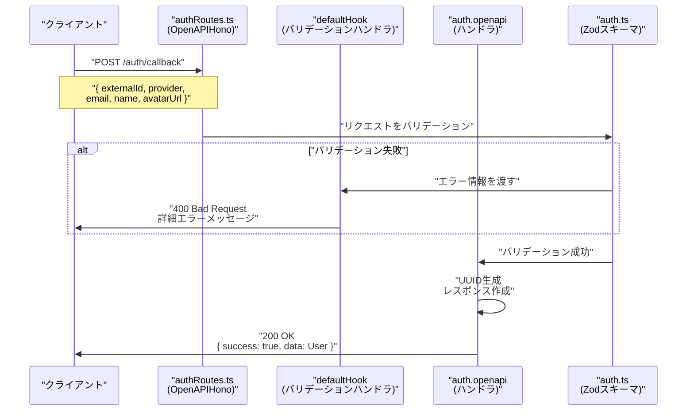
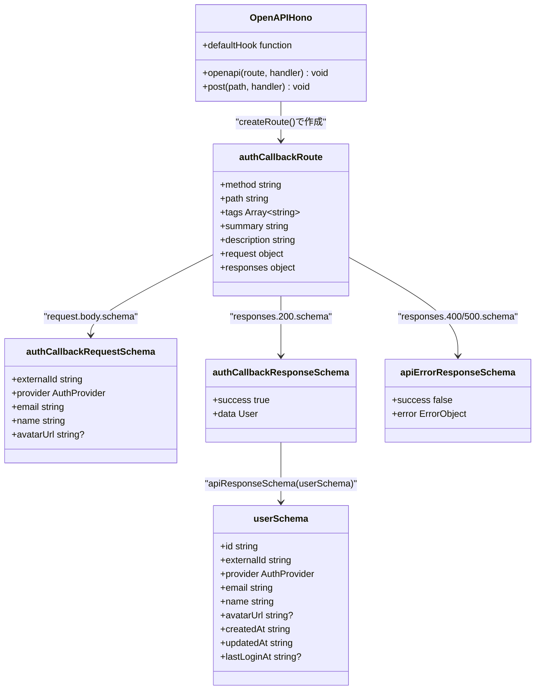

# TASK-902: 認証エンドポイントのOpenAPI対応化 コード解説

**作成日**: 2025-10-19
**対象読者**: ジュニアエンジニア
**タスクID**: TASK-902

---

## この機能が何を解決するのか

この機能は「認証APIをOpenAPIに対応させて、型安全性とドキュメントの自動生成を実現する」ことを解決します。

具体的には:
- フロントエンドとバックエンドで同じ型定義を共有できるようになります
- APIのリクエスト・レスポンスが自動でチェックされます
- Swagger UIという画面で、APIの使い方を自動で確認できるようになります
- 開発者がAPIドキュメントを手で書く必要がなくなります

これを「スキーマ駆動開発」と呼び、型の不整合やドキュメントの古さを防ぐことができます。

### なぜこれが重要なのか

今までの開発では、バックエンドが送るデータとフロントエンドが期待するデータの型が合わなくて、エラーが発生することがありました。また、ドキュメントがコードと違う内容になっていて、混乱することもありました。

今回の実装では、**データベーススキーマ（データの設計図）**から自動的に型定義を生成するので、そういった問題がなくなります。

---

## 全体の処理の流れ

### 処理フローとファイル関係



#### このフローで起きていること

1. **クライアントがAPIを呼び出す**: ブラウザやアプリから認証情報を送ります
2. **OpenAPIHonoが受け取る**: Honoという軽量なWebフレームワークの特別版が、リクエストを受け取ります
3. **Zodスキーマでバリデーション**: リクエストの内容が正しいか、自動でチェックします
4. **エラー時は詳細を返す**: メールアドレスの形式が間違っているなど、どこが悪いかを教えてくれます
5. **成功時はユーザー情報を返す**: 新しく作られたユーザーIDなどを返します

---

## ファイルの役割と責任

### 今回解説するメインのファイル

#### **authRoutes.ts** (`app/server/src/presentation/http/routes/authRoutes.ts`)

このファイルは**認証APIのルート（道筋）**を定義しています。

ここで大事なのは、次の3つの部分です：

##### 1. OpenAPIHonoの初期化（24-56行目）

```typescript
const auth = new OpenAPIHono({
  defaultHook: (result, c) => {
    if (result.success) {
      return;
    }

    // Zodエラーをフィールド単位のエラーマップに変換
    return c.json(
      {
        success: false,
        error: {
          code: 'VALIDATION_ERROR',
          message: 'バリデーションエラー',
          details: result.error.issues.reduce(
            (acc: Record<string, string>, issue) => {
              const field = issue.path.join('.');
              acc[field] = issue.message;
              return acc;
            },
            {},
          ),
        },
      },
      400,
    );
  },
});
```

**何をしているか**: 通常の`Hono`ではなく`OpenAPIHono`を使っています。これによって、OpenAPI仕様書を自動生成できます。

**defaultHookとは**: リクエストのバリデーション（検証）が失敗したときに、どんなエラーメッセージを返すかを決めています。例えば、メールアドレスの形式が間違っていたら「有効なメールアドレス形式である必要があります」というメッセージが返ります。

**初学者がつまずきやすいポイント**: `defaultHook`は「バリデーションが失敗したときだけ」実行されます。成功したときは何もしないので、`if (result.success) { return; }`で早期リターンしています。

##### 2. OpenAPIルート定義（97-139行目）

```typescript
const authCallbackRoute = createRoute({
  method: 'post',
  path: '/auth/callback',
  tags: ['認証'],
  summary: 'Supabase認証後のコールバック処理',
  description:
    'Supabase認証後のユーザー情報を受け取り、ユーザー作成または更新を行う',
  request: {
    body: {
      content: {
        'application/json': {
          schema: authCallbackRequestSchema,
        },
      },
    },
  },
  responses: {
    200: {
      content: {
        'application/json': {
          schema: authCallbackResponseSchema,
        },
      },
      description: '認証成功',
    },
    400: {
      content: {
        'application/json': {
          schema: apiErrorResponseSchema,
        },
      },
      description: 'バリデーションエラー',
    },
    500: {
      content: {
        'application/json': {
          schema: apiErrorResponseSchema,
        },
      },
      description: 'サーバーエラー',
    },
  },
});
```

**何をしているか**: この部分は、APIの「仕様書」を書いています。このAPIは何をするのか、どんなデータを受け取るのか、どんなデータを返すのか、といったことを定義しています。

**OpenAPI仕様とは**: APIの説明書を決まった形式で書いたものです。これがあれば、自動でドキュメントが生成されたり、フロントエンドの型定義が作られたりします。

**tagsとsummaryの役割**: Swagger UIという画面で見たときに、このAPIが何のグループに属していて、どんな機能なのかがわかるようにするためのものです。

##### 3. ハンドラ関数（149-190行目）

```typescript
auth.openapi(authCallbackRoute, async (c) => {
  try {
    const validatedBody = c.req.valid('json');

    // RFC 4122準拠のUUID v4を生成（NFR-001: 50ms以内を満たす）
    const userResponse = {
      success: true as const,
      data: {
        id: randomUUID(),
        externalId: validatedBody.externalId,
        provider: validatedBody.provider,
        email: validatedBody.email,
        name: validatedBody.name,
        avatarUrl: validatedBody.avatarUrl ?? null,
        createdAt: new Date().toISOString(),
        updatedAt: new Date().toISOString(),
        lastLoginAt: new Date().toISOString(),
      },
    };

    // TODO: AuthenticateUserUseCaseを呼び出し、実際のDB操作を実装（TASK-904）
    return c.json(userResponse, 200);
  } catch (error) {
    // セキュリティイベントをログに記録（NFR-303: 内部詳細を隠蔽）
    console.error('[SECURITY] Unexpected error in auth callback endpoint:', {
      timestamp: new Date().toISOString(),
      error: error instanceof Error ? error.message : 'Unknown error',
      endpoint: '/api/auth/callback',
    });

    return c.json(
      {
        success: false,
        error: {
          code: 'INTERNAL_SERVER_ERROR',
          message: '一時的にサービスが利用できません',
        },
      },
      500,
    );
  }
});
```

**何をしているか**: 実際にAPIが呼ばれたときの処理を書いています。

**重要なポイント**:
- `c.req.valid('json')`: すでにバリデーションが終わったデータを取得しています。この時点で型も確定しています
- `randomUUID()`: ユーザーIDを生成しています。これはNode.jsの標準機能で、暗号学的に安全なランダムな文字列を作ってくれます
- `success: true as const`: TypeScriptに「これは`true`という文字列じゃなくて、`true`という値そのものだよ」と教えています
- `avatarUrl ?? null`: `??`は「左側がnullかundefinedなら右側を使う」という意味です

**セキュリティ上の配慮**: エラーが起きたとき、詳しいエラー内容をクライアントに送ると、攻撃者にシステムの内部構造がバレてしまいます。だから「一時的にサービスが利用できません」という汎用的なメッセージだけを返して、詳しい内容はサーバーのログに記録しています。

### 呼び出されているファイル

#### **auth.ts** (`app/packages/shared-schemas/src/auth.ts`)

このファイルは**認証APIの型定義**をしています。

##### リクエストスキーマ（32-40行目）

```typescript
export const authCallbackRequestSchema = z.object({
  externalId: z
    .string()
    .min(1, 'externalIdは1文字以上である必要があります'),
  provider: authProviderSchema,
  email: emailSchema,
  name: z.string().min(1, 'ユーザー名は1文字以上である必要があります'),
  avatarUrl: urlSchema.nullable().optional(),
});
```

**何をしているか**: クライアントから送られてくるデータの「形」を定義しています。

**Zodとは**: JavaScriptやTypeScriptで、データの形を定義して、実行時にチェックできるライブラリです。

**よくある勘違い**: `nullable()`と`optional()`は違います
- `optional()`: そのフィールド自体がなくてもいい（`{ name: "太郎" }` のようにavatarUrlがない）
- `nullable()`: フィールドはあるけどnullでもいい（`{ name: "太郎", avatarUrl: null }`）
- `nullable().optional()`: 両方OK（なくてもいいし、あってもnullでいい）

##### レスポンススキーマ（67行目）

```typescript
export const authCallbackResponseSchema = apiResponseSchema(userSchema);
```

**何をしているか**: APIが返すデータの形を定義しています。

**apiResponseSchemaとは**: `common.ts`で定義されている共通の成功レスポンス形式です。`{ success: true, data: ... }`という形になります。

#### **common.ts** (`app/packages/shared-schemas/src/common.ts`)

このファイルは**すべてのAPIで使う共通の型定義**をしています。

##### apiResponseSchema（49-53行目）

```typescript
export const apiResponseSchema = <T extends z.ZodTypeAny>(dataSchema: T) =>
  z.object({
    success: z.literal(true),
    data: dataSchema,
  });
```

**何をしているか**: 成功レスポンスの「型」を作る関数です。

**ジェネリック型とは**: `<T extends z.ZodTypeAny>`の部分は、「どんな型でも受け入れるけど、Zodの型じゃないとダメだよ」という意味です。これによって、`apiResponseSchema(userSchema)`のように、様々なデータ型で使い回せます。

**z.literal(true)の意味**: `success`フィールドは、必ず`true`という値でなければいけません。`false`や`"true"`（文字列）はダメです。

##### apiErrorResponseSchema（74-84行目）

```typescript
export const apiErrorResponseSchema = z.object({
  success: z.literal(false),
  error: z.object({
    code: z.string(),
    message: z.string(),
    details: z.union([z.record(z.any(), z.string()), z.string()]).optional(),
  }),
});
```

**何をしているか**: エラーレスポンスの形を定義しています。

**z.unionとは**: 「AかBのどちらか」という意味です。ここでは、`details`は「オブジェクト（フィールド別エラー）」か「文字列（全体のエラー）」のどちらかです。

**z.recordとは**: 「キーが何でもいいオブジェクト」を表します。`{ email: "メールアドレスが無効です", name: "名前が短すぎます" }`のように、フィールド名がわからないけど、値は文字列であることを保証します。

---

## クラスと関数の呼び出し関係

### クラス構造と依存関係



#### この図の読み方

- **OpenAPIHono**: Webフレームワークの本体です。ルートを登録したり、リクエストを受け取ったりします
- **authCallbackRoute**: APIの仕様書です。どんなリクエストを受け付けて、どんなレスポンスを返すかを定義しています
- **スキーマ類**: データの「形」を定義しています。これによって、型チェックとバリデーションが自動で行われます

**依存の方向**: 矢印は「使っている」関係を表します。例えば、`authCallbackRoute`は`authCallbackRequestSchema`を使っています。

---

## 重要な処理の詳細解説

### 1. バリデーションエラーのハンドリング

```typescript
// app/server/src/presentation/http/routes/authRoutes.ts
defaultHook: (result, c) => {
  if (result.success) {
    return;
  }

  // Zodエラーをフィールド単位のエラーマップに変換
  return c.json(
    {
      success: false,
      error: {
        code: 'VALIDATION_ERROR',
        message: 'バリデーションエラー',
        details: result.error.issues.reduce(
          (acc: Record<string, string>, issue) => {
            const field = issue.path.join('.');
            acc[field] = issue.message;
            return acc;
          },
          {},
        ),
      },
    },
    400,
  );
},
```

**この処理が必要である理由**: バリデーションエラーが起きたとき、ユーザーに「どこが間違っているか」を教える必要があります。Zodのエラーは配列形式で返ってきますが、それを`{ フィールド名: エラーメッセージ }`という形に変換しています。

**よくある勘違い**: `reduce`は配列を1つの値にまとめる関数です。ここでは、エラーの配列を1つのオブジェクトにまとめています。

**具体例**:
```javascript
// Zodのエラー形式
[
  { path: ['email'], message: '有効なメールアドレス形式である必要があります' },
  { path: ['name'], message: 'ユーザー名は1文字以上である必要があります' }
]

// reduceで変換した後
{
  email: '有効なメールアドレス形式である必要があります',
  name: 'ユーザー名は1文字以上である必要があります'
}
```

### 2. 暗号学的に安全なUUID生成

```typescript
// app/server/src/presentation/http/routes/authRoutes.ts
import { randomUUID } from 'node:crypto';

// ...

const userResponse = {
  success: true as const,
  data: {
    id: randomUUID(),
    // ...
  },
};
```

**この処理が必要である理由**: ユーザーIDは推測されてはいけません。もし`1, 2, 3...`のような連番だと、他人のIDを推測して不正アクセスされる危険があります。

**randomUUIDとは**: Node.jsの標準機能で、暗号学的に安全なランダムなUUID（例: `550e8400-e29b-41d4-a716-446655440000`）を生成します。

**よくある勘違い**: `Math.random()`はセキュリティ用途には使えません。`randomUUID()`を使いましょう。

### 3. Null合体演算子（??）の使い方

```typescript
// app/server/src/presentation/http/routes/authRoutes.ts
avatarUrl: validatedBody.avatarUrl ?? null,
```

**この処理が必要である理由**: `avatarUrl`はオプショナル（省略可能）なので、クライアントが送ってこない場合は`undefined`になります。でも、データベースには`null`を保存したいので、`??`演算子で変換しています。

**??演算子とは**: 左側が`null`または`undefined`なら、右側の値を使います。

**||演算子との違い**:
```javascript
const a = 0 || 5;  // 5（0はfalsy扱い）
const b = 0 ?? 5;  // 0（0はnullでもundefinedでもない）

const c = '' || '初期値';  // '初期値'（空文字はfalsy扱い）
const d = '' ?? '初期値';  // ''（空文字はnullでもundefinedでもない）
```

**正しい理解**: `??`は「nullまたはundefinedのときだけ」右側を使います。`||`は「falsyな値（0, '', false, null, undefined）のとき」右側を使います。

---

## 初学者がつまずきやすいポイント

### 1. ZodスキーマとTypeScript型の違い

**Zodスキーマ**: 実行時にデータをチェックする
```typescript
const schema = z.object({ name: z.string() });
schema.parse({ name: 123 });  // エラー！実行時に検出
```

**TypeScript型**: コンパイル時にコードをチェックする
```typescript
type User = { name: string };
const user: User = { name: 123 };  // エラー！コンパイル時に検出
```

**両方を組み合わせる**: Zodスキーマから型を生成できます
```typescript
const schema = z.object({ name: z.string() });
type User = z.infer<typeof schema>;  // { name: string }
```

### 2. OpenAPIHonoと通常のHonoの違い

**通常のHono**: 軽量で速いWebフレームワーク
```typescript
const app = new Hono();
app.get('/user', (c) => c.json({ name: '太郎' }));
```

**OpenAPIHono**: OpenAPI仕様書を自動生成できるHono
```typescript
const app = new OpenAPIHono();
app.openapi(createRoute({ /* 仕様定義 */ }), (c) => c.json({ name: '太郎' }));
```

**メリット**: Swagger UIでAPIドキュメントが自動生成される、フロントエンドの型定義が自動生成される

### 3. `as const`の意味

```typescript
const a = { success: true };  // success: boolean
const b = { success: true as const };  // success: true（リテラル型）
```

**何が違うか**: `as const`を使うと、TypeScriptが「これは`true`というboolean型じゃなくて、`true`という値そのものだよ」と理解します。

**なぜ必要か**: APIレスポンススキーマで`success: z.literal(true)`と定義しているので、型を合わせるために`as const`が必要です。

### 4. バリデーションの二重チェック

OpenAPIHonoを使うと、リクエストは2段階でチェックされます：

1. **Zodスキーマによるバリデーション**: `@hono/zod-openapi`が自動でやってくれる
2. **TypeScriptによる型チェック**: コンパイル時に実行される

**つまり**: 実行時とコンパイル時の両方で安全性が保証されます！

---

## この設計のいい点

### 1. Single Source of Truth（信頼できる唯一の情報源）

データベーススキーマから自動的に型定義が生成されるので、バックエンドとフロントエンドで型の不整合が起きません。

**悪い例（手動で型を書く場合）**:
```typescript
// バックエンド
type User = { id: string; name: string; };

// フロントエンド（別ファイル）
type User = { id: number; name: string; };  // idの型が違う！
```

**良い例（今回の実装）**:
```typescript
// Zodスキーマから自動生成
export const userSchema = z.object({
  id: z.uuid(),
  name: z.string(),
});

// バックエンドもフロントエンドも同じスキーマを使う
type User = z.infer<typeof userSchema>;
```

### 2. 実行時とコンパイル時の二重の型安全性

TypeScriptだけだとコンパイル時にしかチェックできませんが、Zodを使うことで実行時にもチェックできます。

**なぜ重要か**: ユーザーからのリクエストは、どんなデータが来るかわかりません。型が合っていると思っても、実際には違う形のデータが来ることがあります。Zodを使えば、そういった不正なデータを自動で弾けます。

### 3. 詳細なエラーメッセージ

バリデーションエラーが起きたとき、「どのフィールドが」「なぜ」間違っているかを教えてくれます。

**ユーザー体験の向上**:
```json
{
  "success": false,
  "error": {
    "code": "VALIDATION_ERROR",
    "message": "バリデーションエラー",
    "details": {
      "email": "有効なメールアドレス形式である必要があります",
      "name": "ユーザー名は1文字以上である必要があります"
    }
  }
}
```

### 4. ドキュメントの自動生成

OpenAPI仕様書が自動で作られるので、APIドキュメントを手で書く必要がありません。また、コードと常に一致します。

**開発効率の向上**: 新しいAPIを追加したら、ドキュメントも自動で更新されます。古いドキュメントを読んで混乱することがなくなります。

---

## まとめ

TASK-902では、認証エンドポイントをOpenAPIに対応させることで、以下を実現しました：

1. **型安全性の向上**: フロントエンドとバックエンドで同じ型定義を使える
2. **自動バリデーション**: リクエストが正しい形かを自動でチェック
3. **詳細なエラーメッセージ**: どこが間違っているかをユーザーに教える
4. **ドキュメント自動生成**: Swagger UIでAPIの使い方が自動で確認できる

このパターンは他のAPIエンドポイントでも使えるので、しっかり理解しておきましょう！

---

**次のステップ**: 他のエンドポイント（ユーザー管理API等）でも、同じパターンを適用していきます。
